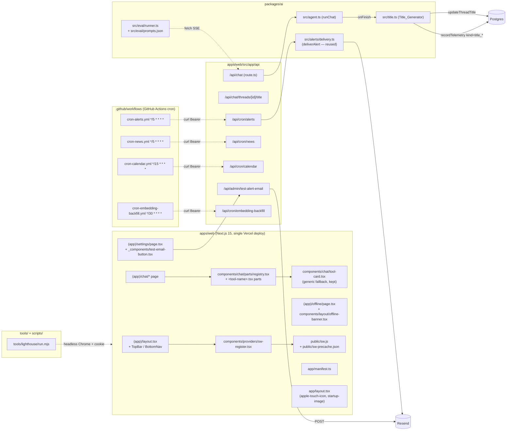

# Design Document — Phase 1 Completion

## Overview

This design closes the seven remaining Phase 1 deliverables — auto-titled chat threads, per-tool bespoke chat parts, an eval harness for the 10 acceptance prompts, a mobile Lighthouse runner, a PWA install + offline shell, a chosen cron triggering strategy, and a Resend integration tester — without breaking any of the project's hard rules (personal-mode, single Vercel deploy, schemas-before-code, no `any`/`enum`, alias-only cross-package imports, supported symbols `XAUUSD | EURUSD | GBPUSD`). Most pieces drop into existing modules: title generation is a new helper in `packages/ai/src/title.ts` wired into `runChat`'s `onFinish`; tool parts are a typed registry under `apps/web/src/components/chat/parts/`; the eval harness lives in `packages/ai/src/eval/runner.ts`; Lighthouse is a Node script under `tools/lighthouse/`; the service worker is vanilla JS at `apps/web/public/sw.js` with a small client component to register it; cron uses GitHub Actions external scheduler (chosen over Vercel Pro); and the Resend tester is a new admin route plus a Settings button. Two small additive migrations are needed (`chat_telemetry.kind`, `chat_threads.title_source`); everything else is purely additive.

## Architecture

### Where each piece lives



### Key facts pinned by this architecture

- Single Vercel deploy: no `apps/worker/`. Cron is fired externally.
- `Title_Generator` runs server-side inside `onFinish` of `runChat` (no second LLM round-trip for the user; it overlaps with the assistant message persisting).
- `Tool_Part_Registry` is keyed by the `ToolName` union from `@shared/ai/tool-names`, so adding a new tool fails the type check until a part is registered (or routed to `Tool_Card_Generic`).
- The service worker bypasses `/api/auth/*`, `/api/cron/*`, `/api/chat`, `/api/admin/*`, and (per the user's decision) **all** of `/api/market/*`. SW only handles app shell + static assets + navigation fallback.

---

## Data Models

### `chat_threads` — pre-existing column + one new optional column

`chat_threads.title text` already exists (verified in `packages/db/src/schema/chat.ts`). No migration needed for the title itself.

The auto-title flow needs to distinguish LLM titles from deterministic fallbacks so the sidebar can keep showing the existing "untitled" placeholder when the title is a fallback. Two options were on the table:

1. Sentinel prefix (zero-width space) embedded in `title`.
2. New `title_source text` column ('llm' | 'fallback', nullable).

**Decision: option 2 (new column).** Sentinel prefixes silently break copy/paste, full-text search, and future export. A nullable text column matches the existing pattern (`pinned_symbol`, `model_override`) and costs almost nothing.

```sql
-- packages/db/drizzle/0001_phase_1_completion.sql
ALTER TABLE chat_threads
  ADD COLUMN title_source text;        -- 'llm' | 'fallback' | null
```

```ts
// packages/db/src/schema/chat.ts (additive)
title_source: text('title_source'),    // null | 'llm' | 'fallback'
```

### `chat_telemetry` — new optional `kind` column

Today every telemetry row is an assistant turn. The auto-title path needs a separate row marker so the usage page can attribute title costs and so we can count `title_generated`, `title_failed`, `title_skipped_budget` events without polluting per-turn aggregates.

```sql
-- same migration: 0001_phase_1_completion.sql
ALTER TABLE chat_telemetry
  ADD COLUMN kind text;                 -- null = assistant turn (legacy);
                                        -- 'title_generated' | 'title_failed' | 'title_skipped_budget'
```

```ts
// packages/db/src/schema/telemetry.ts (additive)
kind: text('kind'),                     // see migration comment above
```

`recordTelemetry` gets an optional `kind?: string` arg with default `null` for back-compat.

---

## Components and Interfaces

All signatures below live in the file paths shown. Cross-package imports use aliases only.

### 1. `Title_Generator` — `packages/ai/src/title.ts`

```ts
// packages/ai/src/title.ts
import type { ServerEnv } from '@hamafx/shared';

export interface GenerateTitleArgs {
  threadId: string;
  firstUser: string; // plain text of first user UIMessage
  firstAssistant: string; // plain text of first assistant UIMessage
  env: Pick<ServerEnv, 'AI_TITLE_MODEL' | 'MAX_DAILY_USD' | 'LOG_PROMPTS'>;
  signal?: AbortSignal;
}

export interface GenerateTitleResult {
  title: string; // ≤ 60 codepoints, trimmed
  source: 'llm' | 'fallback';
  reason?: 'budget' | 'empty' | 'error'; // populated only when source='fallback'
}

export function generateTitle(args: GenerateTitleArgs): Promise<GenerateTitleResult>;

// Internal helper exported for testing.
export function deterministicFallbackTitle(firstUser: string): string;
```

**Behavior:**

- If `dailySpendUsd() >= env.MAX_DAILY_USD` → return `{ source: 'fallback', reason: 'budget', title: deterministicFallbackTitle(firstUser) }`. Caller records telemetry with `kind='title_skipped_budget'`.
- Otherwise call `generateText` (non-streaming, AI SDK v5) against `env.AI_TITLE_MODEL` via the existing AI Gateway plumbing (no provider SDK).
- System prompt: `"Reply with a 3–7 word title for this conversation. No quotes. No trailing punctuation."`
- User prompt: concatenation of first user message and first assistant message (truncated each to 1KB).
- Trim the response, strip surrounding quotes, take Unicode-codepoint slice [0,60), append `…` only when source string is longer than 60 codepoints.
- On empty response or thrown error → fallback (`reason: 'empty' | 'error'`).

**`deterministicFallbackTitle`** uses `Array.from(str).slice(0, 60)` for codepoint-safe truncation, trims, appends `…` only when truncated.

### 2. `runChat` wiring — `packages/ai/src/agent.ts`

In the existing `onFinish` callback, after `appendAssistantMessage`, add:

```ts
// pseudo (stays in agent.ts)
if (thread && thread.title === null) {
  const result = await generateTitle({
    threadId, firstUser, firstAssistant, env, ...(signal ? { signal } : {}),
  });
  await updateThreadTitle(threadId, result.title, result.source);  // signature extended
  await recordTelemetry({
    threadId,
    messageId,
    model: env.AI_TITLE_MODEL,
    inputTokens: ...,
    outputTokens: ...,
    toolCalls: 0,
    ms: ...,
    kind:
      result.source === 'llm'
        ? 'title_generated'
        : result.reason === 'budget'
        ? 'title_skipped_budget'
        : 'title_failed',
  });
}
```

`agent.ts` reads `thread` (and detects `title === null`) by calling `getThread(threadId)` once before/after streaming. The `onFinish` body already has access to history and the latest assistant message text.

`updateThreadTitle` in `persistence.ts` extends to:

```ts
export async function updateThreadTitle(
  id: string,
  title: string,
  source: 'llm' | 'fallback',
): Promise<void>;
```

### 3. `Tool_Part_Registry` — `apps/web/src/components/chat/parts/`

```
apps/web/src/components/chat/parts/
├── registry.tsx               // dispatch component
├── get-price.tsx              // bespoke part
├── get-candles.tsx
├── get-indicators.tsx
├── get-market-structure.tsx
├── get-news.tsx
├── get-calendar.tsx
├── set-alert.tsx
└── log-journal.tsx
```

```tsx
// registry.tsx
import type { ToolName } from '@hamafx/shared';
import type { ToolOutput } from '@hamafx/shared/ai/tool-io';
import type { ComponentType } from 'react';

import { ToolCard } from '@/components/chat/tool-card'; // existing fallback

import { GetCandlesPart } from './get-candles';
import { GetPricePart } from './get-price';

// ... etc.

export type ToolPartName = ToolName;
export type ToolPartState = 'loading' | 'done' | 'error';

export interface ToolPartProps<T extends ToolName> {
  output: ToolOutput<T> | null; // null while loading or on error
  state: ToolPartState;
  errorMessage?: string;
}

// One typed entry per tool. The compiler enforces `Record<ToolName, ...>`,
// so adding a new tool name without a part is a TS error.
export const partRegistry: { [K in ToolName]: ComponentType<ToolPartProps<K>> } = {
  get_price: GetPricePart,
  get_candles: GetCandlesPart,
  get_indicators: GetIndicatorsPart,
  get_market_structure: GetMarketStructurePart,
  get_news: GetNewsPart,
  get_calendar: GetCalendarPart,
  set_alert: SetAlertPart,
  log_journal: LogJournalPart,
};

export function ChatToolPart<T extends ToolName>(props: {
  name: string; // raw name from stream — could be unknown
  output: unknown;
  state: ToolPartState;
  errorMessage?: string;
}): JSX.Element {
  const part = (partRegistry as Record<string, ComponentType<ToolPartProps<ToolName>> | undefined>)[
    props.name
  ];
  if (!part) {
    return <ToolCard name={props.name} output={props.output} state={props.state} />;
  }
  // Per-tool zod parse before render — keeps the part type-safe.
  // Schemas already live in @hamafx/shared/schemas/*.
  // ...
}
```

**Per-part rules** (mobile-first, server components by default):

- `get_price` / `get_candles` / `get_indicators` / `get_market_structure`: `.tabular-nums` + `text-bull` / `text-bear` for sign. Pure server components.
- `get_news`: server component. List of `<NewsItemRow>` with title, source, ISO timestamp via `<time dateTime>`, sentiment dot, deep-link to `/news?id=...`.
- `get_calendar`: server component. Country, time, impact pill, deep-link to `/calendar?id=...`.
- `set_alert`: client component (it shows a "view in /alerts" link with prefetch). Renders rule, symbol, threshold, link to `/alerts?id=...`.
- `log_journal`: server component. Side, symbol, entry, stop, take-profit, computed R-multiple via `computeRMultiple` from `@hamafx/ai`, link to `/journal?id=...`.
- All parts ≥ 44×44 tap targets, visible focus rings, semantic Tailwind tokens only.

### 4. `Eval_Harness` — `packages/ai/src/eval/runner.ts`

```ts
// packages/ai/src/eval/runner.ts
export interface EvalRunArgs {
  baseUrl: string; // default http://localhost:3000
  cookie: string; // hfx_auth=... full cookie string
  outDir: string; // default docs/eval/<UTC-timestamp>
  promptsPath?: string; // default ./prompts.json
  timeoutMs?: number; // default 120_000
}

export interface PromptResult {
  id: string;
  prompt: string;
  ttftMs: number | null;
  totalMs: number;
  text: string;
  toolCalls: { name: string; args: unknown; resultSummary: string | null }[];
  ok: boolean;
  error?: string;
}

export function runEvals(
  args: EvalRunArgs,
): Promise<{ results: PromptResult[]; reportPath: string }>;
```

CLI entry (registered as `"eval": "tsx src/eval/runner.ts"` in `packages/ai/package.json`):

```bash
pnpm --filter @hamafx/ai eval --base-url http://localhost:3000 --cookie "hfx_auth=..." --out docs/eval
```

Runner POSTs `{ threadId: <new uuid>, messages: [{ id, role: 'user', parts: [{ type: 'text', text }] }] }` to `/api/chat`. See "Eval harness streaming protocol" below for the parsing strategy.

### 5. `Lighthouse_Runner` — `tools/lighthouse/run.mjs`

```js
// tools/lighthouse/run.mjs (Node ESM, no TS — runs without the workspace toolchain)
//
// CLI: node tools/lighthouse/run.mjs --base-url http://localhost:3000 --cookie "hfx_auth=..." --out docs/lighthouse
//
// Per route in LIGHTHOUSE_TARGETS:
//   1. launch chrome via chrome-launcher (headless, mobile emulation)
//   2. run lighthouse twice with config { extraHeaders: { Cookie } }
//   3. take the better of the two perf scores (industry-standard noise reduction)
//   4. write <route>.json and append a row to summary.md
//   5. enforce perf >= 90, a11y >= 95; collect failures
//
// Exit code: 0 if all routes pass and writes succeed; 1 if any route fails or
// summary.md cannot be written (per-route JSON write failure is logged but
// non-fatal so a single broken route does not lose the whole run).

const LIGHTHOUSE_TARGETS = [
  '/chat',
  '/chart/XAUUSD',
  '/news',
  '/calendar',
  '/alerts',
  '/journal',
  '/settings',
  '/settings/usage',
];
```

Deps (added to root `package.json` devDependencies, node only):

- `lighthouse` (programmatic API)
- `chrome-launcher`

### 6. `Service_Worker` — `apps/web/public/sw.js` + companions

#### File layout

```
apps/web/public/
├── sw.js                       // vanilla JS, no bundling
└── sw-precache.json            // generated at build time

apps/web/src/
├── app/(app)/offline/
│   └── page.tsx                // tiny offline fallback (server component)
├── components/providers/
│   └── sw-register.tsx         // 'use client' — registers /sw.js after first paint
└── components/layout/
    └── offline-banner.tsx      // 'use client' — listens to online/offline events
```

#### Cache versioning

```js
// public/sw.js  (top of file, hand-written; CACHE_NAME baked at build time)
const CACHE_NAME = 'hamafx-shell-v__BUILD_ID__';
```

`apps/web/scripts/generate-sw.mjs` (run as a `next build` postbuild step in `package.json`):

1. Read `process.env.NEXT_PUBLIC_BUILD_ID` (set by `apps/web/scripts/set-build-id.mjs` before build, or fall back to git sha + epoch).
2. Compute the precache list (URLs only, since hashed asset names are inside `.next/static/...` and we cache them on demand):
   - `/chat`
   - `/offline`
   - `/icons/icon-192.png`, `/icons/icon-512.png`, `/icons/icon-maskable-512.png`
   - `/favicon.ico`
   - `/manifest.webmanifest`
3. Replace `__BUILD_ID__` in `public/sw.js` template with the actual build id, write to `public/sw.js`.
4. Write `public/sw-precache.json` listing the URLs above.

`/` (root) is **not** in the precache because it redirects to `/chat`; we precache `/chat` directly.

#### Strategies (declarative table)

| URL pattern                                               | Strategy                         | Fallback                           |
| --------------------------------------------------------- | -------------------------------- | ---------------------------------- |
| `/_next/static/*`                                         | cache-first                      | network (no fallback)              |
| `/icons/*`, `/favicon.ico`, `/manifest.webmanifest`       | cache-first                      | network                            |
| navigation requests (`request.mode === 'navigate'`)       | network-first w/ 3s timeout      | cached `/chat` → cached `/offline` |
| `/api/auth/*`, `/api/cron/*`, `/api/chat`, `/api/admin/*` | bypass (no SW handling)          | n/a                                |
| `/api/market/*`                                           | **bypass** (per user's decision) | n/a                                |
| everything else                                           | network-only                     | n/a                                |

#### Lifecycle

```js
self.addEventListener('install', (event) => {
  event.waitUntil(
    fetch('/sw-precache.json')
      .then((r) => r.json())
      .then((urls) => caches.open(CACHE_NAME).then((c) => c.addAll(urls)))
      .then(() => self.skipWaiting()),
  );
});

self.addEventListener('activate', (event) => {
  event.waitUntil(
    caches
      .keys()
      .then((keys) =>
        Promise.all(keys.filter((k) => k !== CACHE_NAME).map((k) => caches.delete(k))),
      )
      .then(() => self.clients.claim()),
  );
});

self.addEventListener('fetch', (event) => {
  /* strategies above */
});
```

#### SW registration component — `apps/web/src/components/providers/sw-register.tsx`

```tsx
'use client';

import { useEffect } from 'react';

export function SwRegister(): null {
  useEffect(() => {
    if (!('serviceWorker' in navigator)) return;
    if (!window.isSecureContext) return;
    // Defer until idle so we don't fight first paint.
    const id = (
      'requestIdleCallback' in window
        ? requestIdleCallback
        : (cb: () => void) => setTimeout(cb, 200)
    )(() => {
      navigator.serviceWorker.register('/sw.js', { scope: '/' }).catch((err) => {
        console.warn('[sw] register failed', err);
      });
    });
    return () => {
      if ('cancelIdleCallback' in window && typeof id === 'number') cancelIdleCallback(id);
    };
  }, []);
  return null;
}
```

Mounted once in `apps/web/src/app/(app)/layout.tsx` (inside the existing shell — outside `<main>` so it has no visual effect).

#### Offline banner — `apps/web/src/components/layout/offline-banner.tsx`

```tsx
'use client';
// Renders nothing while online. When navigator.onLine === false it shows a
// sticky pill above the BottomNav with a "Retry" button that calls
// location.reload(). Listens to 'online' / 'offline' events to flip state.
```

Mounted in `(app)/layout.tsx` between `<main>` and `<BottomNav>`.

#### iOS extras — `apps/web/src/app/layout.tsx`

Add inside the document head (Next 15 supports `<head>`-side links via `metadata.icons` and explicit `<link>` in `app/layout.tsx`):

- `<link rel="apple-touch-icon" sizes="180x180" href="/icons/apple-touch-icon-180.png" />`
- `<link rel="apple-touch-startup-image" media="(device-width: 393px) and (device-height: 852px) and (-webkit-device-pixel-ratio: 3)" href="/icons/apple-splash-1179x2556.png" />`

#### `manifest.ts` updates

- `name`, `short_name`, `start_url='/chat'`, `display='standalone'` (already correct).
- Add maskable icon: `{ src: '/icons/icon-maskable-512.png', sizes: '512x512', type: 'image/png', purpose: 'maskable' }`.
- `background_color` and `theme_color` already set; keep.

### 7. `Email_Tester` — `apps/web/src/app/api/admin/test-alert-email/route.ts`

```ts
// route.ts
export const runtime = 'nodejs';
export const dynamic = 'force-dynamic';

const BodySchema = z.object({ to: z.string().email().optional() });

export async function POST(req: Request): Promise<Response> {
  // 1. Defense-in-depth: explicit recheck of the password cookie (middleware already gates).
  const session = await requireSession();
  if (!session) return Response.json({ error: 'unauthorized' }, { status: 401 });

  // 2. Parse body
  const body = await parseJsonBody(req, BodySchema);
  const env = getServerEnv();

  // 3. Missing-env contract (503 with explicit list)
  const missing: string[] = [];
  if (!env.RESEND_API_KEY) missing.push('RESEND_API_KEY');
  if (!env.ALERT_FROM_EMAIL) missing.push('ALERT_FROM_EMAIL');
  if (!env.ALERT_TO_EMAIL && !body.to) missing.push('ALERT_TO_EMAIL');
  if (missing.length) return Response.json({ missing }, { status: 503 });

  // 4. Send via Resend
  const to = body.to ?? env.ALERT_TO_EMAIL!;
  const res = await fetch('https://api.resend.com/emails', {
    method: 'POST',
    headers: {
      'content-type': 'application/json',
      authorization: `Bearer ${env.RESEND_API_KEY}`,
    },
    body: JSON.stringify({
      from: env.ALERT_FROM_EMAIL,
      to: [to],
      subject: '[HamaFX-Ai] Test alert email',
      text: `If you received this, the alerts pipeline is wired up correctly.\n\n— HamaFX-Ai`,
    }),
  });
  if (!res.ok) {
    const text = await res.text().catch(() => '');
    return Response.json(
      { error: `resend HTTP ${res.status}: ${text.slice(0, 200)}` },
      { status: 502 },
    );
  }
  const json = (await res.json()) as { id: string };
  return Response.json({ id: json.id }, { status: 200 });
}
```

We do **not** call `deliverAlert` here because the existing helper requires a real `Alert` row + `RuleReading` and is wired to side-effects (`markFired`). A thin wrapper would add coupling for no benefit. Keep `deliverAlert` for the cron path; this route is a small standalone POST.

### Settings UI button — `apps/web/src/app/(app)/settings/_components/test-email-button.tsx`

```tsx
'use client';
// Tiny client component. POSTs to /api/admin/test-alert-email with no body.
// Renders one of:
//   - "Sent · message id: <id>"  (200)
//   - "Missing env: RESEND_API_KEY, ..."   (503)
//   - "Error: <error>"   (502 or other)
// 44x44 button, focus ring, idle/loading/disabled states.
```

Imported into `apps/web/src/app/(app)/settings/page.tsx` (which is a server component) as a client island.

### 8. GitHub Actions cron workflows — `.github/workflows/cron-*.yml`

Four workflow files, one per endpoint. Each:

```yaml
# .github/workflows/cron-news.yml
name: cron-news
on:
  schedule:
    - cron: '*/5 * * * *' # UTC, 5-minute granularity (lowest GH Actions allows)
  workflow_dispatch:
permissions: { contents: read }
concurrency:
  group: cron-news
  cancel-in-progress: false
jobs:
  fire:
    runs-on: ubuntu-latest
    steps:
      - name: Hit /api/cron/news
        env:
          URL: ${{ secrets.PRODUCTION_URL }}
          TOKEN: ${{ secrets.CRON_SECRET }}
        run: |
          curl -fsS -X GET -H "Authorization: Bearer $TOKEN" "$URL/api/cron/news"
```

Cadences (all UTC):

| Workflow                      | Cron expression |
| ----------------------------- | --------------- |
| `cron-news.yml`               | `*/5 * * * *`   |
| `cron-calendar.yml`           | `*/15 * * * *`  |
| `cron-alerts.yml`             | `*/5 * * * *`   |
| `cron-embedding-backfill.yml` | `*/30 * * * *`  |

Repo secrets required: `PRODUCTION_URL` (e.g. `https://hamafx-ai.vercel.app`), `CRON_SECRET` (matches Vercel env var of the same name).

---

## Correctness Properties

Most of this spec is UI rendering, infrastructure wiring, configuration, and one-shot side-effect operations — none of which are amenable to property-based testing per the project's testing rule of thumb. The two pieces with universal logic worth a property test are the deterministic title fallback (codepoint-safe truncation) and the registry dispatch invariant (every known tool name routes to a bespoke part). Everything else lands as example-based unit tests, integration tests, or manual smoke checklists.

### Property 1: Deterministic title fallback truncation

_For any_ user message string `s`, `deterministicFallbackTitle(s)` returns a string whose Unicode codepoint length is at most 60, ends with `…` if and only if `Array.from(s.trim()).length > 60`, and is the trimmed prefix of `s` in codepoints when not truncated.

**Validates: Requirements 1.4**

### Property 2: Tool part registry total dispatch

_For any_ `name: string`, `ChatToolPart({ name, ... })` renders `partRegistry[name]` when `name` is in `TOOL_NAMES`, and renders `Tool_Card_Generic` otherwise. (I.e. the dispatch function is total over the universe of strings, with the bespoke set being exactly the `ToolName` union.)

**Validates: Requirements 2.2, 2.3**

---

## Cron strategy & cadences

### Decision: GitHub Actions external scheduler

Per the user's decision, we do **not** upgrade to Vercel Pro. GitHub Actions external scheduler hits the production Vercel URL with `Authorization: Bearer ${CRON_SECRET}`. Configuration lives in `.github/workflows/cron-*.yml` (one file per endpoint).

### Cadences (all UTC)

| Endpoint                       | Workflow file                 | Cron           | Per-hour firings (best case) |
| ------------------------------ | ----------------------------- | -------------- | ---------------------------- |
| `/api/cron/news`               | `cron-news.yml`               | `*/5 * * * *`  | 12                           |
| `/api/cron/calendar`           | `cron-calendar.yml`           | `*/15 * * * *` | 4                            |
| `/api/cron/alerts`             | `cron-alerts.yml`             | `*/5 * * * *`  | 12                           |
| `/api/cron/embedding-backfill` | `cron-embedding-backfill.yml` | `*/30 * * * *` | 2                            |

GitHub Actions cron has 5-minute minimum granularity; sub-5-minute cadences are not possible.

### Trade-off vs Requirement 6 §7

Requirement 6 §7 demands the alerts cron fire **≥ 30 times per hour** (i.e. every 2 minutes). GitHub Actions cannot meet that under any configuration. Two paths considered:

- **(a) Lower the target to ≥ 12 firings/hour** (one per 5 min) and amend Requirement 6 §7 in a follow-up requirements update.
- (b) Have the alerts cron handler internally invoke the evaluator on a 30-second loop for the first ~5 min of each call. Risky — Vercel Hobby caps function execution at 10 s and even Pro caps it at 60 s, so the loop would have to be short, and we'd lose error isolation between iterations.

**Recommendation: (a).** Documented in "Deviations from requirements" below; will require a one-line edit to `requirements.md` after this design is approved.

### Risks specific to GH Actions cron

- **Delay during high load:** GH Actions schedule events can be delayed 10–20 minutes at peak times. ([GitHub docs note this caveat.](https://docs.github.com/en/actions/using-workflows/events-that-trigger-workflows#schedule))
- **Deferred after inactivity:** If the repo has no activity for ~60 days, scheduled workflows are paused until a human action. We'll mitigate by pushing at least once a month (which we will already be doing) but it's worth knowing.
- **No SLA:** Personal-tier guarantees are best-effort.

### Belt-and-braces (optional, recommended)

Add a parallel free [cron-job.org](https://cron-job.org) trigger for `/api/cron/alerts` only, hitting the same URL with the same `Authorization` header. cron-job.org supports 1-minute granularity and tends to be more reliable than GH Actions for short cadences. Document the URL + headers in `docs/09a-phase-0-deployed-state.md`; it's an optional add-on and doesn't replace the workflows.

---

## PWA design (full picture)

Already covered above by component (#6). Repeated here as the cohesive view requested by the spec:

- **SW location:** `apps/web/public/sw.js` (Next.js serves `/public` at the site root, so the scope is `/`).
- **Cache name:** `hamafx-shell-v${BUILD_ID}` where `BUILD_ID` is `process.env.NEXT_PUBLIC_BUILD_ID`, set by `apps/web/scripts/set-build-id.mjs` and consumed by the postbuild `generate-sw.mjs` step. Each release ships a fresh cache name so the `activate` event reliably evicts old caches.
- **Precache list** (computed at build time, written to `apps/web/public/sw-precache.json`):
  - `/chat`
  - `/offline`
  - `/icons/icon-192.png`, `/icons/icon-512.png`, `/icons/icon-maskable-512.png`, `/icons/apple-touch-icon-180.png`
  - `/favicon.ico`
  - `/manifest.webmanifest`
  - **NOT** `/`: it redirects to `/chat`; precaching it would cache a 307 which the SW can't usefully serve offline.
- **Navigation strategy:** network-first with a 3 second `AbortController` timeout; on failure or timeout, serve cached `/chat` document; if even that's missing, serve cached `/offline`.
- **Static assets:** cache-first for `/_next/static/*` (immutable hashed paths) and `/icons/*` / `/favicon.ico` / `/manifest.webmanifest`.
- **Bypass list (always go to network):** `/api/auth/*`, `/api/cron/*`, `/api/chat`, `/api/admin/*`, **and `/api/market/*`** (per user's explicit decision).
- **Offline UI:** the "no network" banner is a small client component using `navigator.onLine` plus `online`/`offline` events, mounted inside `(app)/layout.tsx`. When `onLine === false` it shows a sticky pill above the BottomNav with a "Retry" control that reloads the page. While `onLine === true`, the banner renders nothing — even when content was served from cache.
- **iOS specifics:** `<link rel="apple-touch-icon" sizes="180x180" ...>` and one `<link rel="apple-touch-startup-image" media="..."/>` entry sized for iPhone 14 Pro (1179×2556 @3x), both rendered in `app/layout.tsx`. iOS doesn't honour the manifest icons for home-screen.
- **Manifest updates:** add maskable icon variant; everything else already meets Requirement 5 §7.

---

## Resend test endpoint design (full picture)

Already covered by component (#7). Cohesive view:

- **Path:** `POST /api/admin/test-alert-email`.
- **Auth:** behind the existing middleware password gate, plus an explicit server-side `requireSession()` recheck (defense-in-depth — middleware can be misconfigured, and admin endpoints deserve extra paranoia).
- **Body:** `{ to?: string }` (zod-validated); defaults to `env.ALERT_TO_EMAIL`.
- **Responses:**
  - `200 { id: string }` — Resend message id on success.
  - `401` — unauthenticated (no body, the middleware also handles this case).
  - `503 { missing: string[] }` — one or more of `RESEND_API_KEY`, `ALERT_FROM_EMAIL`, `ALERT_TO_EMAIL` is empty/unset. Names only, no values.
  - `502 { error: string }` — Resend returned non-2xx.
- **Subject:** `[HamaFX-Ai] Test alert email` (matches Req 7 §2).
- **Settings UI control:** small client island under `_components/test-email-button.tsx`, imported by the existing settings page server component.

---

## Auto-title flow (full picture)

```mermaid
sequenceDiagram
    participant Client
    participant ChatRoute as /api/chat
    participant Agent as runChat
    participant Title as generateTitle
    participant DB as Postgres
    participant Gateway as AI Gateway

    Client->>ChatRoute: POST { threadId, messages }
    ChatRoute->>Agent: runChat(...)
    Agent->>DB: appendUserMessage
    Agent->>Gateway: streamText (chat)
    Gateway-->>Agent: streamed assistant text
    Agent-->>Client: UI message stream
    Note over Agent: onFinish fires after stream closes
    Agent->>DB: appendAssistantMessage
    Agent->>DB: getThread (check title === null)
    alt title is null
        Agent->>Title: generateTitle({ firstUser, firstAssistant, env })
        alt budget headroom?
            Title->>Gateway: generateText (cheap title model)
            Gateway-->>Title: short title string
            Title-->>Agent: { title, source: 'llm' }
            Agent->>DB: updateThreadTitle(id, title, 'llm')
            Agent->>DB: recordTelemetry(kind='title_generated')
        else budget exceeded
            Title-->>Agent: { title: fallback, source: 'fallback', reason: 'budget' }
            Agent->>DB: updateThreadTitle(id, fallback, 'fallback')
            Agent->>DB: recordTelemetry(kind='title_skipped_budget')
        end
    end
```

Sidebar rendering rule: the thread list query already pulls `title`. After this change it also pulls `title_source`. The list component renders the existing untitled placeholder when `title_source !== 'llm'` (covers both `null` for legacy rows and `'fallback'` for new fallback rows), and renders `title` only when `title_source === 'llm'`.

---

## Eval harness streaming protocol

`/api/chat` returns `result.toUIMessageStreamResponse()` from the Vercel AI SDK v5 — that's a `ReadableStream` of UI message stream parts encoded as newline-delimited JSON with the SSE-style `data:` prefix.

**Canonical helper in v5:** `readUIMessageStream` from the `ai` package consumes a `Response`'s body and yields `UIMessage` objects as they're updated. ([Reference: Vercel AI SDK `readUIMessageStream` docs.](https://ai-sdk.dev/docs/reference/ai-sdk-ui/read-ui-message-stream))

**TTFT measurement:** record `Date.now()` immediately after `await fetch(...)` resolves; record again on the first emitted part whose `type === 'text'` (or first text delta in a streamed assistant message); the difference is TTFT in ms.

**Tool call extraction:** `readUIMessageStream` yields full `UIMessage` snapshots per update. After the stream completes, walk the final assistant message's `parts` array and pull every part of type `tool-*` (the v5 part type for tool invocations). For each, capture the tool name, input JSON, and a one-line summary of the output (`JSON.stringify(...).slice(0, 200)`).

**Failure path:** `AbortController` with a 120-second timeout per prompt. On `AbortError` or any thrown error during streaming, the result row is `{ ok: false, error }` and the runner moves to the next prompt.

---

## Lighthouse runner (full picture)

- **Deps:** `lighthouse`, `chrome-launcher` (root devDependencies, ESM `.mjs` script — no TS toolchain required so the script runs even if package compilation is stale).
- **Auth:** `chrome-launcher` opens headless Chrome; we pass `extraHeaders: { Cookie: <flag value> }` in the Lighthouse config so every request includes the auth cookie. This avoids needing to script a login flow.
- **Mobile preset:** Lighthouse `presets: ['perf', 'a11y']` with the built-in `lighthouse:default` mobile config (screen emulation: 360×640 at 2x DPR, slow 4G throttling) — matches Req 4 §1.
- **Two iterations:** for each route run Lighthouse twice and keep the higher Performance score; this is industry-standard noise reduction (cold-cache cold-CPU runs vary by 5–15 points). Document this clearly in `summary.md` so the user understands the scores aren't a single shot.
- **Score threshold:** Lighthouse reports scores in the range 0–1; multiply by 100 before comparing to 90 / 95.
- **Outputs:** `docs/lighthouse/<UTC-timestamp>/<route>.json` per route + a single `summary.md` with one row per route. Per-route JSON write failures are logged but non-fatal — the run continues so a single bad route doesn't lose the whole batch (matches Req 4 §3).
- **Exit code:** non-zero if any route falls below either threshold (matches Req 4 §5).

---

## Error Handling

- **Title generation failure:** swallowed inside the runChat onFinish (so the user's chat turn isn't affected). Telemetry row records `kind='title_failed'` with a short error string in `model` (or a future `error` column — out of scope).
- **Title budget block:** explicit guardrail in `generateTitle` (no LLM call), telemetry `kind='title_skipped_budget'`. Fallback persisted; sidebar still shows untitled.
- **SW install failure:** registration is fire-and-forget — failure is logged via `console.warn` and the app keeps working without offline support.
- **SW navigation timeout:** falls back to cached `/chat` then cached `/offline`. No infinite hang.
- **Cron auth failure:** existing `withCronAuth` already returns 401 and we reuse it. The GH Actions workflow uses `curl -fsS` so a 4xx/5xx exits non-zero, which surfaces in the Actions run history.
- **Email tester missing env:** dedicated 503 with a structured `{ missing: [...] }` body — never leaks values.
- **Email tester Resend non-2xx:** dedicated 502 with the (truncated) Resend response text.
- **Eval harness per-prompt failure:** recorded in `Eval_Report` with a `FAILED:` marker; runner continues; exits non-zero per Req 3 §5.
- **Lighthouse per-route JSON write failure:** logged, non-fatal; summary.md still gets the row (per Req 4 §3).

---

## Testing Strategy

- **Title_Generator (`packages/ai/test/title.test.ts`):** unit tests covering
  - successful LLM response (mocked AI SDK `generateText`),
  - empty LLM response → fallback,
  - thrown error → fallback,
  - budget guardrail triggers fallback path.
    Plus the property test for `deterministicFallbackTitle` (Property 1) using `fast-check`.
- **Tool parts (`apps/web/src/components/chat/parts/__tests__/`):** RTL render tests per part with a known fixture payload from each `@hamafx/shared/schemas` schema. Snapshot-light: assert presence of key fields, semantic tokens, and `.tabular-nums`. Plus the registry-dispatch property test (Property 2) using `fast-check` over a bag of arbitrary strings + the `TOOL_NAMES` set.
- **Email tester route (`apps/web/src/app/api/admin/test-alert-email/__tests__/route.test.ts`):** unit-level tests with `fetch` mocked. Cover 200, 401 (no session), 503 (each missing env, in isolation and combined), 502 (Resend 500).
- **Eval_Harness:** smoke test only — `node packages/ai/src/eval/runner.ts --help` exits 0. The full run is a manual operation that hits a running app; not in CI.
- **Lighthouse_Runner:** smoke test only — `node tools/lighthouse/run.mjs --help` exits 0. The full run is manual.
- **Service worker:** no unit tests. Manual smoke checklist in `docs/09a-phase-0-deployed-state.md`:
  1. Production build (`pnpm build && pnpm start`) registers `/sw.js` after first paint.
  2. Toggle the browser to offline; reload `/chat` → cached `/chat` document renders with the offline banner visible.
  3. Toggle back online → banner disappears within ≤ 1s.
  4. "Add to Home Screen" works on Android Chrome (manifest icon appears, launches `/chat`).
  5. "Add to Home Screen" works on iOS Safari (apple-touch-icon used, launches `/chat`, splash image shown briefly on iPhone 14 Pro).
- **Cron workflows:** smoke — `workflow_dispatch` button on each workflow lets us hit the endpoint manually, confirms the `Authorization: Bearer` reaches Vercel and returns 200.

PBT use is intentionally narrow here. Most of the work is configuration, UI rendering, and side-effect-only network calls; example-based tests catch the bugs that matter.

---

## Deviations from requirements

1. **Requirement 6 §7 — alerts cron firing ≥ 30/hour.** GitHub Actions cron has a 5-minute minimum granularity, so the realistic ceiling is 12 firings/hour. We're choosing GH Actions over Vercel Pro per the user's explicit decision. **Recommend amending Req 6 §7** to "≥ 12 firings/hour" after this design is approved. Optional belt-and-braces: add a free cron-job.org trigger for `/api/cron/alerts` at 1-minute cadence; with that the requirement is restored.
2. **Requirement 5 §10 — `/api/market/*` SW caching.** The requirement leaves this optional and asks the author to confirm. **Confirmed: the SW does NOT cache `/api/market/*`.** Reason: market data is timing-sensitive; SWR with a 60s window risks stale prices being shown to the user during real network transitions. The data-cache TTLs in `packages/data/src/cache` are the canonical freshness layer.

Both deviations get a one-paragraph note in `docs/09a-phase-0-deployed-state.md` once implementation lands.

---

## Risks & mitigations

| Risk                                                                       | Likelihood | Impact | Mitigation                                                                                                                              |
| -------------------------------------------------------------------------- | ---------- | ------ | --------------------------------------------------------------------------------------------------------------------------------------- |
| GH Actions cron delayed 10–20 min during peak load                         | Medium     | Low    | Document in `docs/09a-phase-0-deployed-state.md`; offer cron-job.org as a parallel trigger.                                             |
| GH Actions cron disabled after 60 days repo inactivity                     | Low        | Med    | Already pushing weekly; add a calendar reminder. cron-job.org has no such pause.                                                        |
| SW shipped with stale precache list after a release                        | Low        | Med    | Cache name includes `BUILD_ID`; postbuild step regenerates the list and bumps the name.                                                 |
| SW caches a stale `/chat` document for too long                            | Low        | Med    | Navigation is network-first with 3s timeout; cache is fallback only.                                                                    |
| Title model returns garbage (e.g. "Sure! Here is your title: ...")         | Med        | Low    | System prompt explicitly forbids prefixes; we trim quotes; max length is enforced; fallback on empty.                                   |
| Resend API key leak via 503 response                                       | Low        | High   | 503 only echoes variable **names**, never values. Code review checks this contract.                                                     |
| Eval harness hits the running prod app and burns budget                    | Med        | Med    | `--base-url` flag + cookie required; default is localhost; the script logs which URL it targets and confirms before sending.            |
| Lighthouse runs spike Vercel function execution and bills                  | Low        | Low    | Hits a local `next start` by default; production runs are opt-in via `--base-url`.                                                      |
| Sidebar shows the wrong title after a fallback row gets a real title later | Low        | Low    | `title_source='fallback'` rows can be safely overwritten by future Title_Generator runs if we add a "regenerate" UI; out of scope here. |

---

## File-by-file change list

This list is purely informational — it's the head-start the tasks document will turn into checked-off items.

### New files

```
apps/web/public/sw.js                                                    # service worker (vanilla JS, build-stamped)
apps/web/public/sw-precache.json                                         # generated at build time
apps/web/scripts/generate-sw.mjs                                         # postbuild step
apps/web/scripts/set-build-id.mjs                                        # prebuild step (NEXT_PUBLIC_BUILD_ID)

apps/web/src/app/(app)/offline/page.tsx                                  # tiny offline fallback page
apps/web/src/components/providers/sw-register.tsx                        # registers /sw.js
apps/web/src/components/layout/offline-banner.tsx                        # online/offline banner

apps/web/src/components/chat/parts/registry.tsx                          # ChatToolPart + partRegistry
apps/web/src/components/chat/parts/get-price.tsx
apps/web/src/components/chat/parts/get-candles.tsx
apps/web/src/components/chat/parts/get-indicators.tsx
apps/web/src/components/chat/parts/get-market-structure.tsx
apps/web/src/components/chat/parts/get-news.tsx
apps/web/src/components/chat/parts/get-calendar.tsx
apps/web/src/components/chat/parts/set-alert.tsx
apps/web/src/components/chat/parts/log-journal.tsx
apps/web/src/components/chat/parts/__tests__/*.test.tsx                  # one per part + dispatch property test

apps/web/src/app/api/admin/test-alert-email/route.ts                     # Email_Tester
apps/web/src/app/api/admin/test-alert-email/__tests__/route.test.ts
apps/web/src/app/(app)/settings/_components/test-email-button.tsx        # Settings UI button

apps/web/public/icons/icon-192.png                                       # if not already present
apps/web/public/icons/icon-512.png
apps/web/public/icons/icon-maskable-512.png
apps/web/public/icons/apple-touch-icon-180.png
apps/web/public/icons/apple-splash-1179x2556.png

packages/ai/src/title.ts                                                 # Title_Generator
packages/ai/test/title.test.ts                                           # unit + property tests
packages/ai/src/eval/runner.ts                                           # Eval_Harness
packages/ai/src/eval/prompts.json                                        # 10 acceptance prompts
packages/ai/src/eval/parse-stream.ts                                     # readUIMessageStream wrapper

packages/db/drizzle/0001_phase_1_completion.sql                          # title_source + telemetry.kind

tools/lighthouse/run.mjs                                                 # Lighthouse_Runner
tools/lighthouse/README.md                                               # usage notes

.github/workflows/cron-news.yml
.github/workflows/cron-calendar.yml
.github/workflows/cron-alerts.yml
.github/workflows/cron-embedding-backfill.yml

docs/eval/.gitkeep                                                       # output dir
docs/lighthouse/.gitkeep
docs/lighthouse/waivers.md                                               # placeholder, only filled when needed
```

### Modified files

```
apps/web/src/app/layout.tsx                          # apple-touch-icon + apple-touch-startup-image
apps/web/src/app/manifest.ts                         # maskable icon variant
apps/web/src/app/(app)/layout.tsx                    # mount <SwRegister /> + <OfflineBanner />
apps/web/src/app/(app)/settings/page.tsx             # mount <TestEmailButton />
apps/web/src/components/chat/messages.tsx (or similar) # use ChatToolPart instead of ToolCard directly
apps/web/package.json                                # add postbuild generate-sw.mjs script
apps/web/next.config.mjs                             # ensure /sw.js is served as no-cache; allow custom headers
apps/web/src/lib/env.ts                              # (unchanged unless NEXT_PUBLIC_BUILD_ID needs help)

packages/ai/src/agent.ts                             # onFinish wires generateTitle + thread title check
packages/ai/src/persistence.ts                       # updateThreadTitle adds source param;
                                                     # recordTelemetry adds optional kind
packages/ai/src/index.ts                             # re-export generateTitle
packages/ai/package.json                             # "eval" script + tsx dep

packages/db/src/schema/chat.ts                       # add title_source column
packages/db/src/schema/telemetry.ts                  # add kind column

package.json (root)                                  # add lighthouse + chrome-launcher devDeps;
                                                     # add scripts: lighthouse, eval (proxies)

docs/09a-phase-0-deployed-state.md                   # cron strategy = GH Actions; smoke checklist;
                                                     # PWA notes; cron-job.org belt-and-braces
docs/00-overview.md                                  # link to docs/eval/<latest>.md once produced
.env.example                                         # NEXT_PUBLIC_BUILD_ID note (optional)
```

No files are deleted. `Tool_Card_Generic` (`apps/web/src/components/chat/tool-card.tsx`) is kept as the unknown-tool fallback per Requirement 2 §3.
