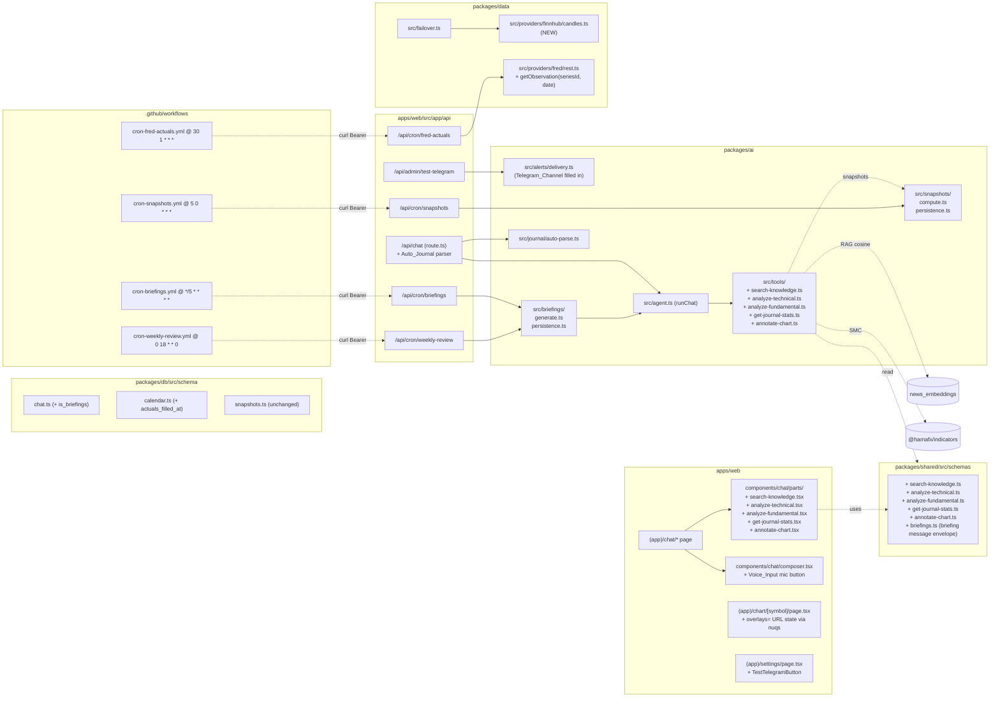

# Design Document — Phase 2

## Overview

Phase 2 adds five new AI tools (`search_knowledge`, `analyze_technical`, `analyze_fundamental`, `get_journal_stats`, `annotate_chart`), four new cron handlers (`/api/cron/snapshots`, `/api/cron/briefings`, `/api/cron/weekly-review`, `/api/cron/fred-actuals`), one alert delivery channel (`telegram`), one chat composer extension (voice input), and one route-side parser (auto-journal). It also wires the chart's existing `OverlaySet` shape to the agent so `annotate_chart` produces visual output. Two purely additive DB migrations are needed: `chat_threads.is_briefings boolean default false` and `economic_events.actuals_filled_at timestamp`. Everything else extends existing tables, modules, and steering docs without touching the project's hard rules.

The slicing inside this monolithic spec is the dependency graph (data → indicator → tool → UI part → cron → docs), not three separate phases. Each tool is a standalone PR-able unit because Phase 1 already shipped the registry, the per-tool zod schemas pattern, and the typed Tool_Part_Registry — so adding a tool is a six-file change (schema, tool, registry entry, part component, registry mapping, doc note).

## Architecture

### Where each piece lives



### Pinned facts

- **No new package.** Briefings, snapshots, and auto-journal live under `packages/ai/src/{briefings,snapshots,journal}` rather than spawning their own packages — they're tightly coupled to chat persistence and the LLM, so new packages would force circular workspace deps.
- **No new deployable.** All four new crons live under `apps/web/src/app/api/cron/*`. GitHub Actions external scheduler (already chosen in Phase 1) extends to four new workflows.
- **No `apps/worker/`.** The roadmap explicitly forbids spinning one up at this phase.
- **Tools follow the existing pattern.** Each tool: input zod schema in `@shared`, output zod schema in `@shared`, `tool({ description, inputSchema, execute })` in `packages/ai/src/tools/<name>.ts`, registry entry in `tools/index.ts`, bespoke part in `apps/web/src/components/chat/parts/<name>.tsx`, registry entry in `parts/registry.tsx`. Six-file change per tool.
- **`OverlaySet` is the contract for `annotate_chart`.** The chart already accepts `OverlaySet`; we don't reinvent annotation primitives — the tool produces what the chart consumes.

---

## Data Models

### Migration `0002_phase_2.sql`

Two additive ALTERs:

```sql
-- packages/db/drizzle/0002_phase_2.sql
ALTER TABLE chat_threads
  ADD COLUMN is_briefings boolean NOT NULL DEFAULT false;

ALTER TABLE economic_events
  ADD COLUMN actuals_filled_at timestamp with time zone;

-- Idempotency for briefings: prevent two pre-event or two post-event
-- briefings firing for the same event. Stored in a simple lookup table
-- so we don't have to query JSONB on chat_messages.parts.
CREATE TABLE IF NOT EXISTS briefings_emitted (
  event_id text NOT NULL,
  kind text NOT NULL,                    -- 'pre' | 'post' | 'weekly_review'
  message_id uuid NOT NULL REFERENCES chat_messages(id) ON DELETE CASCADE,
  created_at timestamp with time zone NOT NULL DEFAULT now(),
  PRIMARY KEY (event_id, kind)
);
```

### Drizzle schema additions

```ts
// packages/db/src/schema/chat.ts (additive on chatThreads)
isBriefings: boolean('is_briefings').notNull().default(false),

// packages/db/src/schema/calendar.ts (additive on economicEvents)
actualsFilledAt: timestamp('actuals_filled_at', { withTimezone: true }),

// packages/db/src/schema/briefings.ts (NEW)
export const briefingsEmitted = pgTable('briefings_emitted', {
  eventId: text('event_id').notNull(),
  kind: text('kind').notNull(),          // 'pre' | 'post' | 'weekly_review'
  messageId: uuid('message_id')
    .notNull()
    .references(() => chatMessages.id, { onDelete: 'cascade' }),
  createdAt: timestamp('created_at', { withTimezone: true }).defaultNow().notNull(),
}, (t) => [primaryKey({ columns: [t.eventId, t.kind] })]);
```

The `briefings_emitted` table replaces an alternative design that piggy-backed on `chat_messages.parts->>eventId` — that path required GIN-indexing JSONB and a custom uniqueness constraint, while a tiny lookup table is two lines of SQL and one drizzle file. The trade-off (extra row per emitted briefing) is negligible at personal-mode volume.

### Schema additions in `@hamafx/shared`

```ts
// packages/shared/src/schemas/search-knowledge.ts
export const SearchKnowledgeInputSchema = z.object({
  query: z.string().min(2).max(500),
  since: z.number().int().optional(),
  symbol: SymbolSchema.optional(),
  limit: z.number().int().min(1).max(10).default(5),
});

export const SearchKnowledgeItemSchema = ToolNewsItemSchema.extend({
  similarity: z.number().min(0).max(1),
});

export const SearchKnowledgeOutputSchema = z.object({
  items: z.array(SearchKnowledgeItemSchema),
  model: z.string(),
  pipelinePending: z.boolean(),
});

// packages/shared/src/schemas/analyze-technical.ts
export const AnalyzeTechnicalInputSchema = z.object({
  symbol: SymbolSchema,
  timeframes: z.array(TimeframeSchema).min(1).max(5).default(['4h', '1h', '15m']),
});

export const PerTimeframeReadingSchema = z.object({
  tf: TimeframeSchema,
  trend: z.union([z.literal('up'), z.literal('down'), z.literal('range')]),
  bias: z.union([z.literal('bullish'), z.literal('bearish'), z.literal('neutral')]),
  momentum: z.object({ rsi14: z.number(), macdHist: z.number() }),
  structure: z.object({
    swingHigh: z.number().nullable(),
    swingLow: z.number().nullable(),
    latestStructureEvent: z
      .union([z.literal('BOS_up'), z.literal('BOS_down'), z.literal('CHoCH_up'), z.literal('CHoCH_down')])
      .nullable(),
  }),
  levels: z.object({
    pivot: z.number().nullable(),
    r1: z.number().nullable(),
    s1: z.number().nullable(),
    atr14: z.number().nullable(),
  }),
});

export const AnalyzeTechnicalOutputSchema = z.object({
  symbol: SymbolSchema,
  asOf: z.number().int(),
  perTimeframe: z.array(PerTimeframeReadingSchema),
  summary: z.string(),
  partial: z.boolean(),                                         // true if one tf was dropped
});

// packages/shared/src/schemas/analyze-fundamental.ts
export const AnalyzeFundamentalInputSchema = z.object({
  symbol: SymbolSchema,
  horizonHours: z.number().int().min(1).max(168).default(24),
});

export const AnalyzeFundamentalOutputSchema = z.object({
  symbol: SymbolSchema,
  windowFromMs: z.number().int(),
  windowToMs: z.number().int(),
  currencies: z.array(z.string()),
  events: z.array(EconomicEventSchema),
  headlines: z.array(ToolNewsItemSchema),
  sentiment: z.object({
    positive: z.number().int(),
    negative: z.number().int(),
    neutral: z.number().int(),
  }),
  summary: z.string(),
  pipelinePending: z.boolean(),                                // true when both events + headlines are empty
});

// packages/shared/src/schemas/get-journal-stats.ts
export const GetJournalStatsInputSchema = z.object({
  sinceMs: z.number().int().optional(),
  untilMs: z.number().int().optional(),
  symbol: SymbolSchema.optional(),
  side: TradeSideSchema.optional(),
});

export const StatBreakdownSchema = z.object({
  key: z.string(),
  count: z.number().int(),
  winRate: z.number(),
  avgR: z.number(),
});

export const GetJournalStatsOutputSchema = z.object({
  stats: JournalStatsSchema,
  bySymbol: z.array(StatBreakdownSchema),
  byTag: z.array(StatBreakdownSchema),
});

// packages/shared/src/schemas/annotate-chart.ts
export const AnnotateChartKindSchema = z.union([
  z.literal('swings'),
  z.literal('bos_choch'),
  z.literal('fvg'),
  z.literal('order_blocks'),
  z.literal('liquidity'),
  z.literal('pdh_pdl'),
  z.literal('asian_range'),
]);

export const AnnotateChartInputSchema = z.object({
  symbol: SymbolSchema,
  tf: TimeframeSchema,
  kinds: z.array(AnnotateChartKindSchema).min(1),
  lookback: z.number().int().min(1).max(20).default(3),
  count: z.number().int().min(50).max(1000).default(300),
});

// Marker / PriceLine primitive shapes mirror what the chart already accepts.
export const ChartMarkerSchema = z.object({
  time: z.number().int(),
  position: z.union([z.literal('aboveBar'), z.literal('belowBar'), z.literal('inBar')]),
  color: z.string(),
  shape: z.union([
    z.literal('arrowUp'),
    z.literal('arrowDown'),
    z.literal('circle'),
    z.literal('square'),
  ]),
  text: z.string().optional(),
});
export const ChartPriceLineSchema = z.object({
  price: z.number(),
  color: z.string(),
  lineWidth: z.number().int().min(1).max(4).optional(),
  lineStyle: z.union([z.literal(0), z.literal(1), z.literal(2), z.literal(3), z.literal(4)]).optional(),
  axisLabelVisible: z.boolean().optional(),
  title: z.string().optional(),
});

export const AnnotateChartOutputSchema = z.object({
  symbol: SymbolSchema,
  tf: TimeframeSchema,
  asOf: z.number().int(),
  markers: z.array(ChartMarkerSchema),
  priceLines: z.array(ChartPriceLineSchema),
  countsByKind: z.record(AnnotateChartKindSchema, z.number().int()),
});
```

`SearchKnowledgeItemSchema.extend(...)`, `JournalStatsSchema`, `EconomicEventSchema`, `ToolNewsItemSchema`, `TradeSideSchema`, `SymbolSchema`, `TimeframeSchema` already exist — Phase 2 adds five new schema files but doesn't touch the foundational ones.

Each new schema is wired into `packages/shared/src/ai/tool-io.ts` via the `ToolIOMap` declaration-merging interface so `ToolOutput<'search_knowledge'>` typechecks the way the rest of the registry does.

---

## Components and Interfaces

### 1. `search_knowledge` (Requirement 1)

#### Tool body (skeleton)

```ts
// packages/ai/src/tools/search-knowledge.ts
export const searchKnowledgeTool = tool({
  description:
    'Search the news embeddings index for the top-K articles most semantically similar to a query. Returns sourced items with cosine similarity scores. Returns empty + pipelinePending=true when the embedding index is empty.',
  inputSchema: SearchKnowledgeInputSchema,
  execute: async ({ query, since, symbol, limit }) => {
    const embeddingsCount = await countEmbeddings();
    if (embeddingsCount === 0) {
      return { items: [], model: defaultEmbeddingModel(), pipelinePending: true };
    }

    const queryEmbedding = await embedTexts({ texts: [query] });
    const rows = await runRagQuery({
      embedding: queryEmbedding.embeddings[0]!,
      limit,
      ...(since !== undefined ? { since } : {}),
      ...(symbol !== undefined ? { symbol } : {}),
    });
    return { items: rows.map(rowToItem), model: queryEmbedding.model, pipelinePending: false };
  },
});
```

#### SQL (`runRagQuery`)

```sql
SELECT
  na.id, na.title, na.summary, na.url, na.source, na.publisher,
  na.published_at, na.sentiment, na.sentiment_score,
  1 - (ne.embedding <=> $1::vector) AS similarity
FROM news_embeddings ne
JOIN news_articles na ON na.id = ne.article_id
WHERE ($2::timestamp IS NULL OR na.published_at >= $2)
  AND ($3::text IS NULL OR na.symbols && ARRAY[$3]::text[])
ORDER BY ne.embedding <=> $1::vector
LIMIT $4;
```

`<=>` is pgvector's cosine distance; `1 - distance` puts the score in `[0, 1]` with 1 = identical.

#### UI part

`apps/web/src/components/chat/parts/search-knowledge.tsx` — server component, mirrors `get-news.tsx` layout but adds a similarity pill on the right (`{Math.round(similarity * 100)}% match`).

### 2. `analyze_technical` (Requirement 2)

The tool is a deterministic orchestrator over existing primitives:

```ts
// packages/ai/src/tools/analyze-technical.ts
async function readOneTimeframe(symbol, tf): Promise<PerTimeframeReading | null> {
  try {
    const candles = await getCandles(symbol, tf, 200);
    const indicators = computeIndicators(candles, [
      { kind: 'rsi', params: { period: 14 } },
      { kind: 'macd', params: { fast: 12, slow: 26, signal: 9 } },
      { kind: 'pivots', params: { type: 'standard' } },
      { kind: 'atr', params: { period: 14 } },
    ]);
    const structure = computeStructure(candles, { lookback: 3 });
    return projectReading({ tf, candles, indicators, structure });
  } catch (err) {
    return null;
  }
}

export const analyzeTechnicalTool = tool({
  description:
    'Compute a multi-timeframe technical readout (trend, bias, momentum, structure, levels) for a symbol. Equivalent to calling get_candles + get_indicators + get_market_structure across each timeframe and projecting the result.',
  inputSchema: AnalyzeTechnicalInputSchema,
  execute: async ({ symbol, timeframes }) => {
    const readings = await Promise.all(timeframes.map((tf) => readOneTimeframe(symbol, tf)));
    const perTimeframe = readings.filter((r): r is PerTimeframeReading => r !== null);
    const partial = perTimeframe.length < timeframes.length;
    return {
      symbol,
      asOf: Date.now(),
      perTimeframe,
      summary: deterministicSummary({ symbol, perTimeframe, partial }),
      partial,
    };
  },
});
```

`projectReading()` collapses indicator arrays to scalars (last RSI14, last MACD histogram bar, last EMA200 vs close → `trend`, RSI > 60 / RSI < 40 → `bias` adjustments).

`deterministicSummary()` is a 3-line template: trend chain across timeframes + structure event mention + ATR-based volatility note. **No LLM second pass.**

### 3. `analyze_fundamental` (Requirement 3)

Symbol → currency mapping is deterministic:

```ts
const CURRENCIES: Record<Symbol, string[]> = {
  XAUUSD: ['USD'],
  EURUSD: ['EUR', 'USD'],
  GBPUSD: ['GBP', 'USD'],
};
```

The tool runs three queries: events filtered by currency + window + importance, news filtered by symbol membership, sentiment counts derived from the news result. `summary` is templated:

> "Window: 2026-05-26T22:00Z → 2026-05-27T22:00Z. 3 high-impact USD events upcoming. Sentiment skew: 60 % positive, 30 % negative, 10 % neutral across 12 headlines."

No LLM second pass.

### 4. `get_journal_stats` (Requirement 4)

Reuses `computeStats` for the global block. Per-symbol/per-tag breakdowns are SQL group-bys:

```sql
SELECT
  symbol AS key,
  count(*) AS count,
  sum(CASE WHEN outcome = 'win' THEN 1 ELSE 0 END)::float / NULLIF(count(*), 0) AS win_rate,
  avg(r_multiple) FILTER (WHERE r_multiple IS NOT NULL) AS avg_r
FROM journal_entries
WHERE ($1::timestamp IS NULL OR opened_at >= $1)
  AND ($2::timestamp IS NULL OR opened_at <= $2)
  AND ($3::text     IS NULL OR symbol = $3)
  AND ($4::text     IS NULL OR side = $4)
GROUP BY symbol
ORDER BY count(*) DESC;
```

Same shape for tags via `unnest(tags) AS tag`.

### 5. `annotate_chart` (Requirement 5)

The output type is **identical** to `OverlaySet` from `apps/web/src/components/chart/overlays.ts`. We move the type into `@hamafx/shared` (so the AI package can import it without a deep cross-package import) and have both the chart and the tool consume it from there.

```ts
// packages/ai/src/tools/annotate-chart.ts
export const annotateChartTool = tool({
  description:
    'Compute SMC annotations (swings, BOS/CHoCH markers, FVG bands, order blocks, liquidity sweeps, previous-day high/low, Asian range) for a symbol/timeframe. Output is the OverlaySet the chart UI consumes; rendering happens client-side.',
  inputSchema: AnnotateChartInputSchema,
  execute: async ({ symbol, tf, kinds, lookback, count }) => {
    const candles = await getCandles(symbol, tf, count);
    const palette = readPaletteFromTheme();              // reuses overlays.ts colour table

    const buckets: Record<AnnotateChartKind, BucketResult> = {} as never;
    if (kinds.includes('swings'))      buckets.swings      = computeSwings(candles, { lookback });
    if (kinds.includes('bos_choch'))   buckets.bos_choch   = computeStructure(candles, { lookback });
    if (kinds.includes('fvg'))         buckets.fvg         = computeFvg(candles);
    if (kinds.includes('order_blocks'))buckets.order_blocks= computeOrderBlocks(candles);
    if (kinds.includes('liquidity'))   buckets.liquidity   = computeLiquidity(candles);
    if (kinds.includes('pdh_pdl'))     buckets.pdh_pdl     = computePdhPdl(candles);
    if (kinds.includes('asian_range')) buckets.asian_range = computeAsianRange(candles);

    return assembleOverlay(buckets, palette);
  },
});
```

The chart page already accepts `?overlays=...` URL state (existing nuqs wiring on the chart route — Phase 1 ships overlay toggles). The annotate-chart part adds a deep link of the form `/chart/XAUUSD?tf=15m&overlays=swings,bos_choch,fvg`.

### 6. Snapshots cron + read API (Requirement 6)

```ts
// apps/web/src/app/api/cron/snapshots/route.ts (replace stub)
export async function GET(req: Request): Promise<Response> {
  return withCronAuth(req, async () => {
    const yesterdayMidnight = previousUtcMidnight();
    const out = [];
    for (const symbol of SYMBOLS) {
      const candles = await getCandles(symbol, '1h', 200);
      const data = await computeDailySnapshot(symbol, candles, yesterdayMidnight);
      await upsertSnapshot({ symbol, kind: 'daily', asOf: yesterdayMidnight, data });
      out.push({ symbol });
    }
    return { processed: out.length };
  });
}
```

`computeDailySnapshot()` is a pure function over the last day's bars: `{ open: firstBarOfDay.o, high: max(h), low: min(l), close: lastBarOfDay.c, pivot, r1, r2, s1, s2, atr14, prevDayHigh, prevDayLow, asianRangeHigh, asianRangeLow }`.

`getLatestSnapshot(symbol, kind = 'daily')` is a one-row select ordered by `as_of DESC` — read by `analyze_technical`, the chart UI, and the system-prompt builder (when present).

### 7. Telegram alert delivery (Requirement 7)

```ts
// packages/ai/src/alerts/delivery.ts (extend the 'telegram' branch)
async function deliverTelegram({ alert, reading, env }: DeliverArgs): Promise<DeliveryResult> {
  if (!env.TELEGRAM_BOT_TOKEN || !env.TELEGRAM_CHAT_ID) {
    return { alertId: alert.id, channel: 'telegram', ok: false, message: 'not configured (TELEGRAM_BOT_TOKEN / TELEGRAM_CHAT_ID missing)' };
  }
  const subject = describeRule(alert.rule);
  const body    = renderTelegramBody(alert, reading);

  const url = `https://api.telegram.org/bot${env.TELEGRAM_BOT_TOKEN}/sendMessage`;
  let res: Response;
  try {
    res = await fetch(url, {
      method: 'POST',
      headers: { 'content-type': 'application/json' },
      body: JSON.stringify({
        chat_id: env.TELEGRAM_CHAT_ID,
        text: `*${escapeMd(subject)}*\n\n${escapeMd(body)}`,
        parse_mode: 'MarkdownV2',
      }),
    });
  } catch (err) {
    return { alertId: alert.id, channel: 'telegram', ok: false, message: String(err) };
  }

  if (!res.ok) {
    const text = await res.text().catch(() => '');
    console.error(`[alerts] telegram HTTP ${res.status} for alert ${alert.id}: ${text.slice(0, 200)}`);
    return { alertId: alert.id, channel: 'telegram', ok: false, message: `telegram HTTP ${res.status}` };
  }

  await markFired(alert.id);
  return { alertId: alert.id, channel: 'telegram', ok: true };
}

// MarkdownV2 reserved chars per https://core.telegram.org/bots/api#markdownv2-style
function escapeMd(s: string): string {
  return s.replace(/[_*\[\]()~`>#+\-=|{}.!]/g, '\\$&');
}
```

`/api/admin/test-telegram` is a near-copy of the existing `/api/admin/test-alert-email` route: 401 → `requireSession()` recheck; 503 → `{ missing: string[] }`; 502 → upstream Telegram non-2xx; 200 → `{ id }`.

`TestTelegramButton` is a near-copy of `TestEmailButton`.

### 8. Voice input (Requirement 8)

The composer at `apps/web/src/components/chat/composer.tsx` becomes a `'use client'` component (already is). We add:

```ts
const Recognition: typeof SpeechRecognition | undefined =
  typeof window !== 'undefined'
    ? (window.SpeechRecognition ?? window.webkitSpeechRecognition)
    : undefined;

function useVoiceInput({ lang, onText }: { lang: string; onText: (t: string) => void }) {
  const ref = useRef<SpeechRecognition | null>(null);
  const [active, setActive] = useState(false);

  const start = useCallback(() => {
    if (!Recognition || ref.current) return;
    const rec = new Recognition();
    rec.lang = lang;
    rec.interimResults = true;
    rec.continuous = false;
    rec.onresult = (e) => {
      const t = Array.from(e.results).map((r) => r[0]?.transcript ?? '').join('');
      onText(t);
    };
    rec.onend = () => { setActive(false); ref.current = null; };
    rec.onerror = () => { setActive(false); ref.current = null; };
    ref.current = rec;
    setActive(true);
    rec.start();
  }, [lang, onText]);

  const stop = useCallback(() => ref.current?.stop(), []);
  return { active, start, stop, supported: Boolean(Recognition) };
}
```

Layout: a 44×44 mic button at the right edge of the textarea, hidden when `!supported`. A small language dropdown above the textarea (English, Arabic — the user's two — defaulting to `navigator.language`). Recording indicator is a `pulsing red dot` rendered as an `aria-live="polite"` span so screen readers announce state changes.

### 9. Briefings cron (Requirement 9) + Auto-Journal (Requirement 10) + Weekly review (Requirement 11)

Briefings logic lives in `packages/ai/src/briefings/`:

```ts
// generate.ts
export async function emitPreEvent(eventId: string): Promise<void>;
export async function emitPostEvent(eventId: string): Promise<void>;
export async function emitWeeklyReview(): Promise<void>;
```

Each function:
1. Loads `Briefings_Thread` (or creates it via `createThread({ pinnedSymbol: null })` then sets `is_briefings = true`).
2. Checks `briefings_emitted` for `(eventId, kind)` to enforce idempotency.
3. Builds the briefing content (LLM-authored when budget allows; deterministic fallback otherwise).
4. Persists via `appendAssistantMessage` and writes the `briefings_emitted` row inside the same transaction.

Auto-Journal lives in `packages/ai/src/journal/auto-parse.ts` — a regex-based parser:

```
^Journal:\s*(?:I\s+)?(long(?:ed|ing)?|short(?:ed|ing)?|buy|sell|sold|bought)\s+
(XAUUSD|EURUSD|GBPUSD)\s+(?:at\s+)?([\d.]+)
(?:.*?(?:SL|stop(?:\s+loss)?)\s+([\d.]+))?
(?:.*?(?:TP|target|take\s+profit)\s+([\d.]+))?
```

Returns `{ side, symbol, entry, stop, target } | null`. The route handler tries the parse, calls `createEntry()` server-side, prepends a system message recapping the saved entry, then proceeds to the LLM. The LLM still calls `log_journal` if it wants to — but the parser shortcut means the journal is saved even if the LLM call fails.

### 10. Finnhub candle fallback (Requirement 12)

`packages/data/src/providers/finnhub/candles.ts`:

```ts
export async function getFinnhubCandles(symbol, tf, count): Promise<Candle[]> {
  if (tf === '4h') {
    const oneH = await fetch1H(symbol, count * 4);
    return synth4HFrom1H(oneH);
  }
  const r = await fetch(`${BASE}/forex/candle?symbol=${mapSymbol(symbol)}&resolution=${mapTf(tf)}&count=${count}&token=${env.FINNHUB_API_KEY}`);
  if (!r.ok) throw new ProviderError('finnhub', 'PROVIDER_UNAVAILABLE', `HTTP ${r.status}`);
  return mapFinnhubCandles(await r.json());
}
```

`synth4HFrom1H()` aggregates four consecutive 1H bars: first open, last close, max high, min low, summed volume.

`packages/data/src/failover.ts` — extend the existing failover plan for candles to include Finnhub for 1m/5m/15m/1h/4h:

```ts
const CANDLE_PROVIDERS: ProviderId[] = ['twelve-data', 'finnhub'];
```

Cache keys are already provider-prefixed in `packages/data/src/cache/keys.ts`, so no cache-pollution concern.

### 11. FRED actuals backfill (Requirement 13)

```ts
// apps/web/src/app/api/cron/fred-actuals/route.ts
export async function GET(req: Request): Promise<Response> {
  return withCronAuth(req, async () => {
    const events = await listFredEventsMissingActual({ until: new Date() });
    let filled = 0;
    for (const ev of events) {
      const seriesId = parseSeriesIdFromEventId(ev.id);  // 'fred:CPIAUCSL:2024-05-15'
      if (!seriesId) continue;
      const obs = await getFredObservation(seriesId, ev.date);
      if (obs?.value !== undefined) {
        await patchEventActual(ev.id, obs.value, new Date());
        filled++;
      }
    }
    return { processed: events.length, filled };
  });
}
```

`getFredObservation()` lives in `packages/data/src/providers/fred/rest.ts` — adds a thin wrapper around `/fred/series/observations?series_id=...&observation_start=...&observation_end=...`.

`parseSeriesIdFromEventId()` is a pure helper: split on `:`, strip prefix.

---

## Cron Strategy

Phase 1 uses GitHub Actions with the four existing workflow files (`cron-news.yml`, `cron-calendar.yml`, `cron-alerts.yml`, `cron-embedding-backfill.yml`). Phase 2 adds **four more workflow files** under `.github/workflows/` following the same template.

| Endpoint                       | Workflow                            | Cadence (UTC)   | Per-day |
|--------------------------------|-------------------------------------|-----------------|--------:|
| `/api/cron/snapshots`          | `cron-snapshots.yml`                | `5 0 * * *`     | 1       |
| `/api/cron/briefings`          | `cron-briefings.yml`                | `*/5 * * * *`   | 288     |
| `/api/cron/weekly-review`      | `cron-weekly-review.yml`            | `0 18 * * 0`    | 1/week  |
| `/api/cron/fred-actuals`       | `cron-fred-actuals.yml`             | `30 1 * * *`    | 1       |

All four workflows use the same `curl -fsS -X GET -H "Authorization: Bearer ${{ secrets.CRON_SECRET }}" ${{ secrets.PRODUCTION_URL }}/api/cron/<name>` pattern, with `concurrency.cancel-in-progress: false` and `workflow_dispatch:` for manual runs.

---

## Environment Variables (Phase 2 additions)

| Variable                     | Required | Notes                                                                         |
|------------------------------|----------|-------------------------------------------------------------------------------|
| `TELEGRAM_BOT_TOKEN`         | optional | Required for Telegram alert delivery. Without it, the channel returns "not configured". |
| `TELEGRAM_CHAT_ID`           | optional | Required for Telegram alert delivery. Personal chat id (numeric).             |

(`FINNHUB_API_KEY` and `FRED_API_KEY` already exist from Phase 1.)

`packages/shared/src/env.ts` already declares both telegram vars as optional; no change needed there.

`docs/09a-phase-0-deployed-state.md` gains a Phase 2 entry that flips Telegram from "not yet" to "wired" once `TELEGRAM_BOT_TOKEN` is set on Vercel.

---

## Testing Strategy

- **Schemas (Phase 1 pattern):** every new schema gets a fixture-parse positive test + a missing-required-field negative test in `packages/shared/test/schemas.test.ts`.
- **Tools:** unit-test `analyze_technical` and `analyze_fundamental` summaries with a deterministic fixture; assert `partial: true` when a timeframe fetch fails. Unit-test `search_knowledge` with mocked `embedTexts` and an in-memory pgvector mock; assert similarity scores are in `[0, 1]` and pipeline-empty fast-path. Unit-test `annotate_chart` with a hand-crafted candle fixture; assert at least one marker per requested kind when the kind is present in the fixture.
- **Telegram delivery:** mock `fetch` to return 200 → `markFired` called once. Mock 500 → `markFired` NOT called and the error logged.
- **Auto-Journal parser:** property test that for any valid combination of `(side word, symbol, prices, optional SL/TP)`, the parser produces a `JournalEntry` whose round-tripped fields match the inputs.
- **Snapshots compute:** golden-test the daily snapshot against a known fixture (one full UTC day of 1H candles, expected pivot/r1/s1/atr14 values pre-computed by hand or pandas).
- **Finnhub 4H synth:** golden-test `synth4HFrom1H` with a 16-bar 1H fixture → 4 expected 4H bars.
- **Briefings idempotency:** integration-test that emitting the same `(eventId, 'pre')` twice writes only one row.
- **Voice input:** manual smoke checklist (mobile Chrome + iOS Safari) — no automated test, the Web Speech API isn't testable without a real audio device.
- **Acceptance:** re-run the eval harness against production after Phase 2 deploys; the 10 prompts SHALL still pass with the new tools available (the model will choose between atomic and composite tools as appropriate).

Property-based tests are limited to the auto-journal parser — every other Phase 2 surface uses example-based unit tests, RTL render tests, or manual smoke checklists.

---

## Out of scope

- Vision (drop-a-screenshot, Phase 3).
- CoT report ingestion (Phase 3).
- Sharable analysis snapshots (Phase 3).
- Web push (Phase 3).
- Cross-pair correlation / DXY proxy (Phase 3).
- TradingView Advanced Charting Widget (Phase 3, gated by config).

These are explicitly deferred and SHALL NOT slip into Phase 2 PRs.

---

## Correctness Properties

Two universal properties hold across the Phase 2 surface; everything else is example-tested.

### Property 1: Auto-Journal parser round-trip

For any (`side ∈ {long, short, buy, sell}`, `symbol ∈ {XAUUSD, EURUSD, GBPUSD}`, `entry`, optional `stop`, optional `target`) such that the rendered shortcut conforms to the documented format, `parseJournalShortcut(rendered)` returns those fields unchanged (case-insensitive on side; lowercase symbols are normalized to uppercase).

**Validates: Requirements 10.1, 10.4.**

### Property 2: Snapshots / SMC pure-function determinism

For any candle array, `computeDailySnapshot`, `computePdhPdl`, `computeAsianRange`, and `synth4HFrom1H` return the same output for the same input — no clock or env reads.

**Validates: Requirements 6.2, 12.5.** (Property test optional; covered by golden tests.)

---

## Error Handling

The Phase 2 surface inherits the project's existing error envelope (`AppError` → JSON via `apps/web/src/lib/api.ts:errorResponse`) and never throws raw provider errors past `/api/*`. Specific rules:

- **Tool errors are returned as data, not thrown.** Per `.kiro/steering/10-ai-tools.md` rule 3, tools return `{ ok: false, error: { code, message } }` so the model can reason and explain. Phase 2 tools follow this — `analyze_technical` returns a partial result with `partial: true`; `search_knowledge` returns `pipelinePending: true` with empty items; `analyze_fundamental` returns `pipelinePending: true` when both events and headlines are empty.
- **Cron handlers return `{ processed, … }` JSON, never 500 on a per-row failure.** Each cron iterates with try/catch around the per-row work so one bad event id doesn't sink the run; per-row failures are logged via `console.error` and surfaced in the workflow run.
- **Telegram delivery failures don't throw.** Mirror the Resend-style ordering rule from Phase 1 §7: `markFired` is called only after a 2xx response. Non-2xx is logged with the truncated upstream body and the alert remains un-marked-as-fired so the next cron tick retries.
- **DB outage → tool returns empty + `pipelinePending`/`partial` flag.** No tool retries Postgres; that's the connection pool's job. A connection error bubbles to the AI SDK as a thrown Error and the model receives an error tool result, which is what we want.
- **Schema validation failures at the route layer return 400 via `ZodError`** — already handled by `errorResponse` in `apps/web/src/lib/api.ts`.
