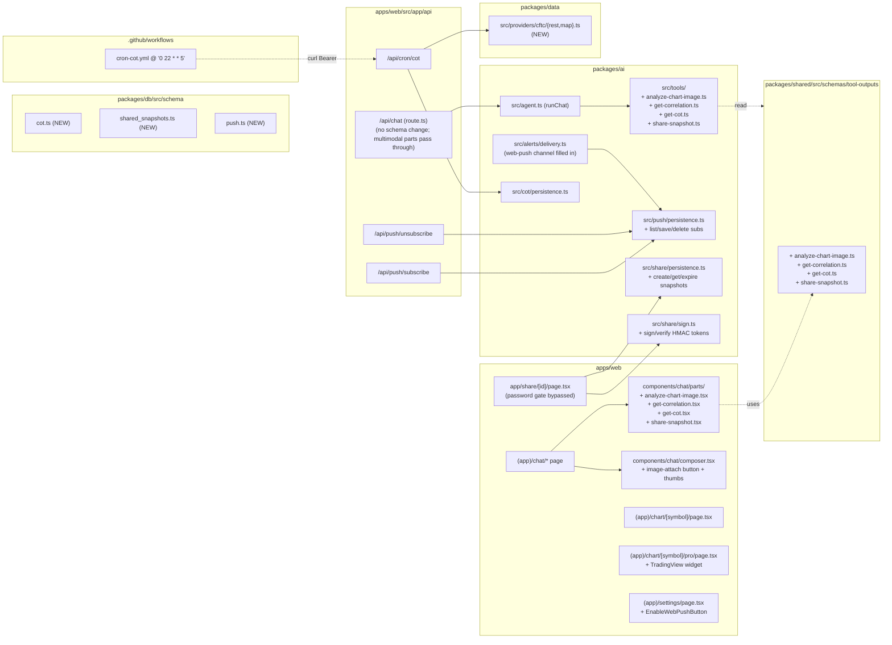

# Design Document — Phase 3

## Overview

Phase 3 adds **multimodal + breadth** to the feature-complete Phase 2 product: vision input on chat (with the new `analyze_chart_image` tool), cross-pair correlation + a labelled DXY proxy (`get_correlation`), opt-in TradingView Advanced Charting Widget at a `/chart/[symbol]/pro` route, weekly CFTC Commitment-of-Traders ingestion (`get_cot` + cron), sharable analysis snapshots through a signed-link route at `/share/[id]`, and web-push as a third alert channel. Three additive DB migrations (`cot_reports`, `shared_snapshots`, `push_subscriptions`) and three new env vars (`VAPID_PUBLIC_KEY`/`PRIVATE_KEY`, `NEXT_PUBLIC_VAPID_PUBLIC_KEY`, `NEXT_PUBLIC_TRADINGVIEW_ENABLED`, `AI_VISION_MODEL`). Everything else extends existing modules.

The slicing inside this monolithic spec is the dependency graph (data → schema → AI tool → UI part → cron → docs), not three separate phases. Each new tool follows the same six-file pattern Phases 1 and 2 already used. The biggest net-new surface is the share route — a public `/share/*` path bypassed by the password gate, gated instead by an HMAC-signed token. We re-use `AUTH_COOKIE_SECRET` for the share token because it's already a 32-byte hex secret and rotating it would invalidate active sessions anyway, which is a risk surface the user already accepts.

## Architecture

### Where each piece lives



### Pinned facts

- **No new package.** Vision, push, share, CoT — all live under `packages/ai/src/{push,share,cot}` plus `packages/data/src/providers/cftc/`. New packages would force circular workspace deps.
- **No new deployable.** All new endpoints live under `apps/web/src/app/api/*`. GitHub Actions external scheduler picks up `cron-cot.yml`.
- **No `apps/worker/`.** Hard rule still holds.
- **Multimodal goes through the existing `/api/chat` shape.** The route already accepts `parts: z.array(z.unknown()).default([])` so file parts pass through. The AI SDK v5 chat models on Gemini Pro / GPT-4.1 / Claude all consume `image` parts natively.
- **Pro chart is opt-in.** Defaults remain on the bundled `lightweight-charts` view. The TradingView widget loads from `s3.tradingview.com` and we accept that as a third-party script — the Pro page is gated by `NEXT_PUBLIC_TRADINGVIEW_ENABLED='1'` so it can be disabled at build time.
- **Share route bypasses the password gate.** The middleware adds `/share` to the bypass set with the same defense-in-depth rule applied at the share route handler — a missing/invalid `?t=` token returns 401, an expired snapshot returns 410.
- **Web push uses RFC-8030 directly.** We avoid the heavy `web-push` npm package by building the JWT and AES-128-GCM ciphertext with Node's `crypto`, which keeps Vercel function cold-starts fast. We sign with the configured VAPID pair and accept the runtime cost (one POST per active subscription) since the single user has 1–3 subscriptions.

---

## Data Models

### Migration `0003_phase_3.sql`

Three additive tables:

```sql
-- packages/db/drizzle/0003_phase_3.sql
CREATE TABLE IF NOT EXISTS cot_reports (
  id              text PRIMARY KEY,                       -- 'cftc:XAUUSD:2026-05-24'
  symbol          text NOT NULL,
  report_date     timestamp with time zone NOT NULL,
  dealer_long     int,
  dealer_short    int,
  asset_long      int,
  asset_short     int,
  leveraged_long  int,
  leveraged_short int,
  other_long      int,
  other_short     int,
  source          text NOT NULL,                          -- 'cftc'
  raw             jsonb,                                  -- full provider row, debugging
  created_at      timestamp with time zone NOT NULL DEFAULT now()
);
CREATE INDEX IF NOT EXISTS cot_reports_symbol_date_idx ON cot_reports(symbol, report_date DESC);

CREATE TABLE IF NOT EXISTS shared_snapshots (
  id          uuid PRIMARY KEY DEFAULT gen_random_uuid(),
  title       text NOT NULL,
  body        text NOT NULL,
  overlay     jsonb,                                       -- AnnotateChartOutput (nullable)
  symbol      text,
  tf          text,
  expires_at  timestamp with time zone NOT NULL,
  created_at  timestamp with time zone NOT NULL DEFAULT now()
);
CREATE INDEX IF NOT EXISTS shared_snapshots_expires_at_idx ON shared_snapshots(expires_at);

CREATE TABLE IF NOT EXISTS push_subscriptions (
  id          uuid PRIMARY KEY DEFAULT gen_random_uuid(),
  endpoint    text NOT NULL UNIQUE,
  p256dh      text NOT NULL,
  auth        text NOT NULL,
  user_agent  text,
  created_at  timestamp with time zone NOT NULL DEFAULT now()
);
```

### Schema additions in `@hamafx/shared`

```ts
// packages/shared/src/schemas/tool-outputs/analyze-chart-image.ts
export const AnalyzeChartImageInputSchema = z.object({
  symbolHint: SymbolSchema.optional(),
  timeframeHint: TimeframeSchema.optional(),
});

export const AnalyzedLevelSchema = z.object({
  price: z.number(),
  label: z.string(),
});

export const AnalyzeChartImageOutputSchema = z.object({
  symbol: SymbolSchema.nullable(),
  tf: TimeframeSchema.nullable(),
  trend: z.union([z.literal('up'), z.literal('down'), z.literal('range')]).nullable(),
  bias: z.union([z.literal('bullish'), z.literal('bearish'), z.literal('neutral')]).nullable(),
  levels: z.array(AnalyzedLevelSchema),
  observed: z.string(),
  /** Reusable in the chart UI via the existing OverlaySet pipeline. */
  overlay: AnnotateChartOutputSchema.nullable(),
  /** Stable identifier of the source image (sha256 of the bytes), so the
   *  agent can refer to multiple images in the same turn. */
  sourceImageRef: z.string(),
});

// packages/shared/src/schemas/tool-outputs/get-correlation.ts
export const CorrelationCellSchema = z.object({
  a: SymbolSchema,
  b: SymbolSchema,
  /** Pearson correlation in [-1, 1]. */
  r: z.number().min(-1.001).max(1.001),
});

export const GetCorrelationInputSchema = z.object({
  tf: TimeframeSchema.default('1h'),
  windowBars: z.number().int().min(20).max(500).default(100),
});

export const GetCorrelationOutputSchema = z.object({
  tf: TimeframeSchema,
  windowBars: z.number().int(),
  asOf: z.number().int(),
  matrix: z.array(CorrelationCellSchema),
  dxyProxy: z.object({
    value: z.number(),
    /** Percent change over the most recent 24 hours. */
    change24h: z.number(),
    /** Bars used to compute the value. */
    samples: z.number().int(),
    /** Verbatim formula + weights so the agent can cite it. */
    formula: z.string(),
  }),
});

// packages/shared/src/schemas/tool-outputs/get-cot.ts
export const CoTSampleSchema = z.object({
  reportDate: z.number().int(),               // ms epoch UTC of the report date
  dealerLong: z.number().int().nullable(),
  dealerShort: z.number().int().nullable(),
  assetLong: z.number().int().nullable(),
  assetShort: z.number().int().nullable(),
  leveragedLong: z.number().int().nullable(),
  leveragedShort: z.number().int().nullable(),
  otherLong: z.number().int().nullable(),
  otherShort: z.number().int().nullable(),
});

export const GetCoTInputSchema = z.object({
  symbol: SymbolSchema.optional(),
  weeks: z.number().int().min(1).max(52).default(8),
});

export const GetCoTOutputSchema = z.object({
  symbol: SymbolSchema,
  samples: z.array(CoTSampleSchema),
  summary: z.string(),
  pipelinePending: z.boolean(),
});

// packages/shared/src/schemas/tool-outputs/share-snapshot.ts
export const ShareSnapshotInputSchema = z.object({
  title: z.string().min(2).max(200),
  body: z.string().min(2).max(8000),
  overlay: AnnotateChartOutputSchema.optional(),
  symbol: SymbolSchema.optional(),
  tf: TimeframeSchema.optional(),
  ttlMinutes: z.number().int().min(5).max(43200).default(7 * 24 * 60),
});

export const ShareSnapshotOutputSchema = z.object({
  id: z.string().uuid(),
  url: z.string().url(),
  expiresAt: z.number().int(),
});
```

`SymbolSchema`, `TimeframeSchema`, `AnnotateChartOutputSchema` already exist. Each new schema is wired into `packages/shared/src/ai/tool-io.ts` via the `ToolOutputMap` declaration-merging interface so `ToolOutput<'analyze_chart_image'>` typechecks at the per-tool level.

---

## Components and Interfaces

### 1. Vision input + `analyze_chart_image` (Requirements 1, 2)

The composer change is purely additive — a new file-input control next to the mic button that produces multimodal `parts`. The chat surface forwards them as `file` parts; `parseJsonBody` already accepts `parts: z.array(z.unknown()).default([])`. The agent passes them straight to the model.

```tsx
// apps/web/src/components/chat/composer.tsx
const [images, setImages] = useState<{ id: string; dataUrl: string; mediaType: string }[]>([]);

function handleFiles(files: FileList | null) {
  if (!files) return;
  for (const file of Array.from(files).slice(0, 4 - images.length)) {
    if (!file.type.startsWith('image/')) continue;
    if (file.size > 5 * 1024 * 1024) {
      setError('image too large (max 5MB)');
      continue;
    }
    const reader = new FileReader();
    reader.onload = () => {
      setImages((prev) => [
        ...prev,
        {
          id: crypto.randomUUID(),
          dataUrl: reader.result as string,
          mediaType: file.type,
        },
      ]);
    };
    reader.readAsDataURL(file);
  }
}
```

On submit, the surface composes parts as:

```ts
const parts = [
  { type: 'text' as const, text: trimmed },
  ...images.map((i) => ({
    type: 'file' as const,
    mediaType: i.mediaType,
    url: i.dataUrl,
  })),
];
```

The agent sees the parts via `convertToModelMessages(history)` which the AI SDK already understands. The vision model is selected via `env.AI_VISION_MODEL` (defaults to `google-vertex/gemini-2.5-pro`), and the `analyze_chart_image` tool's prompt instructs the model to output a structured `AnalyzeChartImageOutput` shape using `experimental_output` / response schemas (the AI SDK's native structured-output API).

The bespoke chat part renders levels + observation + a deep link when the overlay is present:

```tsx
// apps/web/src/components/chat/parts/analyze-chart-image.tsx
<dl className="grid grid-cols-2 gap-2 text-[11px] tabular-nums">
  {output.levels.map((l) => (
    <Fragment key={`${l.label}-${l.price}`}>
      <dt className="text-fg-subtle">{l.label}</dt>
      <dd className="text-fg text-right">{l.price.toFixed(decimals)}</dd>
    </Fragment>
  ))}
</dl>
{output.overlay ? (
  <Link href={`/chart/${output.symbol}?tf=${output.tf}&overlays=swings,bos_choch,fvg`}>
    apply on chart →
  </Link>
) : null}
```

### 2. `get_correlation` + DXY proxy (Requirement 3)

Pure orchestration over existing primitives. We pull `windowBars + 1` candles per symbol, compute close-to-close returns, then Pearson-correlate the returns vectors pairwise. The DXY proxy is `100 / (EUR^0.5 * GBP^0.5)`; `change24h` is `(current - 24hAgo) / 24hAgo * 100`.

```ts
// packages/ai/src/tools/get-correlation.ts
function pearson(xs: number[], ys: number[]): number {
  const n = Math.min(xs.length, ys.length);
  if (n < 2) return 0;
  let sx = 0, sy = 0, sxy = 0, sxx = 0, syy = 0;
  for (let i = 0; i < n; i += 1) {
    const x = xs[i]!, y = ys[i]!;
    sx += x; sy += y;
    sxy += x * y; sxx += x * x; syy += y * y;
  }
  const num = n * sxy - sx * sy;
  const den = Math.sqrt((n * sxx - sx * sx) * (n * syy - sy * sy));
  return den === 0 ? 0 : Math.max(-1, Math.min(1, num / den));
}
```

### 3. TradingView Pro chart route (Requirement 4)

Static HTML container + the official `tv.js` script + a `TradingView.widget` constructor call wrapped in a useEffect. The script is loaded with `<script src="https://s3.tradingview.com/tv.js" defer />` using `next/script` strategy `afterInteractive` so it doesn't block initial render. Symbol mapping is the same OANDA prefix the `/forex/candle` endpoint uses: `OANDA:XAUUSD`, etc. The `tv.js` widget reads its container by id, so we generate `tv-${symbol}-${tf}` and pass it.

The header link on `/chart/[symbol]/page.tsx` lives inside the existing `chart-view.tsx` and is gated by:

```ts
const proEnabled = process.env.NEXT_PUBLIC_TRADINGVIEW_ENABLED === '1';
```

### 4. CFTC ingestion + `get_cot` (Requirement 5)

The CFTC publishes the report as a public CSV at https://www.cftc.gov/files/dea/cotarchives/<year>/futures/c_year.zip. For Phase 3 simplicity we call their newer **Socrata** dataset endpoint at `https://publicreporting.cftc.gov/resource/gpe5-46if.json` (Disaggregated Futures-Only) with a `where` clause filtering by commodity name. That's a simple GET with no auth and a JSON response, friendlier than parsing zipped CSV.

```ts
// packages/data/src/providers/cftc/rest.ts
export async function fetchLatestCoT(commodityCode: 'GC' | '6E' | '6B'): Promise<RawCoTRow[]>;
```

The cron handler maps each row's `report_date_as_yyyy_mm_dd` into the schema columns and upserts with `ON CONFLICT (id) DO UPDATE`.

### 5. Sharable analysis snapshots (Requirement 6)

Two pieces:

```ts
// packages/ai/src/share/sign.ts
export async function signShareToken(payload: { id: string; expiresAt: number }, secret: string): Promise<string>;
export async function verifyShareToken(token: string, secret: string): Promise<{ id: string; expiresAt: number } | null>;
```

Same HMAC-SHA-256 + base64url scheme as the existing auth cookie (`packages/web/src/lib/auth.ts`). `signShareToken` emits `${b64url(payload)}.${b64url(sig)}`.

The middleware at `apps/web/src/middleware.ts` adds `/share` to the bypass set:

```ts
const PUBLIC_PATHS = [/^\/login(\/|$)/, /^\/api\/auth\//, /^\/api\/cron\//, /^\/share\//];
```

The share page reads the token, verifies, fetches the row, renders it. When the overlay is present we render a small read-only `lightweight-charts` instance using cached candles fetched server-side with `getCandles(symbol, tf, { count: 200 })` — no auth hop.

### 6. Web Push channel (Requirement 7)

```ts
// packages/ai/src/alerts/delivery.ts
async function deliverWebPush({ alert, reading, env }: DeliverArgs): Promise<DeliveryResult> {
  if (!env.VAPID_PUBLIC_KEY || !env.VAPID_PRIVATE_KEY) {
    return { ok: false, channel: 'web-push', alertId: alert.id, message: 'not configured (VAPID_*)' };
  }
  const subs = await listPushSubscriptions();
  if (subs.length === 0) {
    return { ok: false, channel: 'web-push', alertId: alert.id, message: 'no subscriptions' };
  }
  const payload = JSON.stringify({ title: describeRule(alert.rule), body: renderEmailBody(alert, reading), url: '/alerts' });
  let allOk = true;
  for (const sub of subs) {
    const r = await sendWebPush(sub, payload, env);
    if (!r.ok) {
      if (r.status === 410 || r.status === 404) await deletePushSubscription(sub.id);
      else allOk = false;
    }
  }
  if (!allOk) return { ok: false, channel: 'web-push', alertId: alert.id, message: 'one or more pushes failed' };
  await markFired(alert.id);
  return { ok: true, channel: 'web-push', alertId: alert.id };
}
```

`sendWebPush` is a 100-line implementation of the Web Push protocol using `crypto.subtle` for ECDH + AES-128-GCM and Node's `crypto` module for the JWT (ES256 signature). It's verbose but avoids pulling the `web-push` package which has historically had Node-version-pinning issues on Vercel.

The service worker at `apps/web/public/sw.js` gets a new event listener:

```js
self.addEventListener('push', (event) => {
  const data = event.data?.json() ?? {};
  event.waitUntil(
    self.registration.showNotification(data.title ?? 'HamaFX-Ai', {
      body: data.body ?? '',
      data: { url: data.url ?? '/alerts' },
      icon: '/icons/icon-192.png',
      badge: '/icons/icon-192.png',
    }),
  );
});
self.addEventListener('notificationclick', (event) => {
  event.notification.close();
  const url = event.notification.data?.url ?? '/alerts';
  event.waitUntil(self.clients.openWindow(url));
});
```

### 7. Doc updates (Requirement 8)

Mechanical: roadmap + deployed-state + features + steering. Same approach as Phase 2 wave 11.

---

## Cron Strategy

Phase 1 chose GitHub Actions with the four existing workflow files. Phase 2 added four more (`snapshots`, `briefings`, `weekly-review`, `fred-actuals`). Phase 3 adds **one more workflow file** under `.github/workflows/` following the same template:

| Endpoint           | Workflow         | Cadence (UTC)   | Per-week |
|--------------------|------------------|-----------------|---------:|
| `/api/cron/cot`    | `cron-cot.yml`   | `0 22 * * 5`    | 1        |

CFTC publishes weekly on Friday afternoon ET (~21:30 UTC); we fire 30 min later.

---

## Environment Variables (Phase 3 additions)

| Variable                            | Required for                                  | Notes                                                                |
|-------------------------------------|-----------------------------------------------|----------------------------------------------------------------------|
| `AI_VISION_MODEL`                   | `analyze_chart_image`                         | Defaults to `google-vertex/gemini-2.5-pro`. Any vision-capable id.   |
| `VAPID_PUBLIC_KEY`                  | Web Push delivery                             | Generate via `node -e "require('crypto').generateKeyPairSync('ec',{namedCurve:'P-256'})"`. |
| `VAPID_PRIVATE_KEY`                 | Web Push delivery                             | Server-only. Never expose.                                            |
| `NEXT_PUBLIC_VAPID_PUBLIC_KEY`      | Browser-side `pushManager.subscribe`          | Must equal `VAPID_PUBLIC_KEY`. Exposed to client.                     |
| `NEXT_PUBLIC_TRADINGVIEW_ENABLED`   | Pro chart toggle                              | `'1'` to show the link / route, anything else hides it.              |

---

## Testing Strategy

- **Schemas:** every new schema gets a fixture-parse positive test + a missing-required-field negative test in `packages/shared/test/schemas.test.ts` following the Phase 1/2 pattern.
- **Tools:** unit-test `get_correlation` with a deterministic returns fixture; assert Pearson math and DXY proxy formula. Unit-test `analyze_chart_image` with a mocked structured-output LLM call asserting schema parse and the no-image fast path. Unit-test `share_snapshot` with mocked persistence asserting URL shape and TTL math. Unit-test `get_cot` with a mocked persistence list asserting summary string format.
- **Share token:** property-test that `verify(sign(payload)) === payload` for any well-formed payload, and that a one-byte mutation of the token fails verification.
- **Push delivery:** mock `fetch` to return 200 → `markFired` called once; 410 → subscription deleted, alert still fires; 500 → no `markFired`, no deletion.
- **CoT cron:** mock the CFTC fetch; assert idempotent upsert when the same row is ingested twice.
- **Pro chart route:** RTL render test asserting the TradingView script tag is added (or that the gate hides the page when disabled).
- **Vision composer:** RTL render test asserting the file picker accepts `image/*` only, rejects > 5 MB, and renders thumbnails with remove buttons that satisfy the 44×44 tap target rule.
- **Acceptance:** re-run the eval harness once Phase 3 is live; the 10 prompts SHALL still pass.

Property-based tests are limited to one universal property (the share-token round-trip).

---

## Out of scope

- Voice output / TTS (`C-09`) — Phase 3 does not ship it; it stays as a Phase 4 candidate.
- Vision reasoning across multiple images per turn — the schema accepts up to 4 attached images per turn but the structured-output tool examines only the most recent image. Improving multi-image reasoning is a follow-up.
- Backtesting UI — explicitly parking-lot.
- Native mobile app — explicitly parking-lot.
- Adding instruments beyond `XAUUSD | EURUSD | GBPUSD` — explicitly parking-lot.

---

## Correctness Properties

### Property 1: Share token round-trip

For any well-formed `(id: uuid, expiresAt: int)` payload, `verifyShareToken(signShareToken(payload, k), k)` returns the same payload bytes; flipping any single byte of the token causes verification to fail.

**Validates: Requirements 6.3, 6.5.**

---

## Error Handling

The Phase 3 surface inherits the project's existing error envelope (`AppError` → JSON via `apps/web/src/lib/api.ts:errorResponse`) and never throws raw provider errors past `/api/*`. Specific rules:

- **Vision tool errors return as data, not thrown.** The `analyze_chart_image` tool returns `observed: 'no image attached' | 'parse failed' | 'model timed out'` so the model can self-correct.
- **Push delivery failures are partitioned by HTTP status.** 410 / 404 → delete the dead subscription, don't fail the alert. Other non-2xx → don't `markFired` so the next cron tick retries.
- **Share route gates fail closed.** Missing token → 401. Invalid signature → 401. Expired snapshot → 410. Missing row → 404. Never 500 on user input.
- **CoT cron tolerates partial CFTC outages.** Per-symbol fetch failures are logged and the cron returns the count of upserted rows; one bad symbol doesn't sink the run.
- **Pro chart blocked-by-network** → graceful fallback message with a link back to `/chart/<symbol>`. We don't try to silently swap in our own chart.
- **Schema validation failures at the route layer return 400 via `ZodError`** — already handled by `errorResponse` in `apps/web/src/lib/api.ts`.
