# Design Document — Phase 5: UI/UX Polish & Design System

## Overview

Phase 5 ships a **cohesive design system** layered on top of the working Phase 4 product. No new features. Three new dependencies (`motion`, `lucide-react`, `vaul`, `sonner`) — each tree-shakeable and battle-tested in the shadcn/ui ecosystem. The work is page-by-page polish following a consistent token/motion/icon vocabulary.

The biggest UX shifts:

- **Bottom sheets replace inline forms** for alerts and journal — matches iOS native patterns and frees vertical space.
- **Floating "+" FABs** for primary create actions on alerts/journal pages.
- **Motion** — every interaction gets a 150–240ms response (button press, page enter, price tick, chart overlay toggle).
- **Toasts** for write confirmations — non-blocking, auto-dismiss, replace inline status strings.
- **Lucide icons** everywhere — replaces the inline SVG hodgepodge.

## Architecture

### Where each new piece lives

```mermaid
flowchart LR
  subgraph TOKENS["packages/config/tailwind/tokens.ts + globals.css"]
    DS_TOKENS["new tokens:<br/>bgElev3, divider, overlay<br/>type scale, fonts"]
  end

  subgraph UI["apps/web/src/components/ui"]
    UI_DRAWER["drawer.tsx (vaul)"]
    UI_TOAST["toaster.tsx (sonner)"]
    UI_BUTTON["button.tsx (motion-wrapped)"]
    UI_MOTION["motion-config.tsx (LazyMotion)"]
    UI_FAB["fab.tsx (floating action button)"]
    UI_STAT_CARD["stat-card.tsx (with sparkline)"]
  end

  subgraph LAYOUT["apps/web/src/components/layout"]
    L_BOTTOMNAV["bottom-nav.tsx<br/>(lucide icons + tab indicator)"]
    L_TOPBAR["top-bar.tsx<br/>(glass blur)"]
    L_PAGEHEADER["page-header.tsx<br/>(consistent spacing)"]
  end

  subgraph PAGES["apps/web/src/app/(app)/*"]
    P_CHAT["chat-surface, composer, message-list, quick-prompts"]
    P_CHART["chart-view (overlay sheet, sticky sub-header)"]
    P_NEWS["news/page (live timestamp client island)"]
    P_CAL["calendar/page (sticky day headers, now-line)"]
    P_ALERTS["alerts (FAB → drawer for create form)"]
    P_JOURNAL["journal (FAB → drawer for entry form, stat-cards)"]
    P_SETTINGS["settings (sectioned with icons)"]
    P_MORE["more (lucide icons, bigger rows)"]
    P_LOGIN["login (gradient glow, brand icon)"]
  end

  TOKENS --> UI
  UI --> LAYOUT
  UI --> PAGES
  LAYOUT --> PAGES
```



### Key choices

| Concern | Choice | Why |
|---------|--------|-----|
| Animation library | `motion` (Motion v12, formerly framer-motion) | De-facto standard; LazyMotion + domAnimation = ~25KB gz. shadcn examples use it. |
| Icon library | `lucide-react` | Already used by shadcn; tree-shaken; 1000+ icons; consistent stroke. Phosphor is broader but Lucide matches the minimalist aesthetic better. |
| Bottom sheet | `vaul` | shadcn/ui's `Drawer` is built on it; iOS-feel swipe-to-dismiss out of the box. |
| Toasts | `sonner` | shadcn-ecosystem standard; tiny (~3KB); great motion defaults. |
| Number animation | `<motion.span>` with `useSpring` + `useTransform` | No extra dep; smooth tween between digits. |

### Out of scope (parking lot)

- Light theme polish — dark theme stays canonical; light mode tokens already exist but won't be visually audited this phase.
- Custom illustrations beyond using lucide icons at large sizes.
- Confetti/celebration animations on milestones.
- Chart annotations panel as a side-drawer on desktop (the bottom sheet works for mobile and desktop).
- Pull-to-refresh — gesture is still finicky on web; refresh button is fine.

---

## 1. Tokens & Typography

### `packages/config/tailwind/tokens.ts`

```ts
export const colors = {
  // ...existing...
  bgElev3: 'oklch(25% 0.02 260)',          // sticky sub-headers, raised surfaces
  divider: 'oklch(28% 0.01 260 / 0.6)',    // subtle separator (replaces border-on-border)
  overlay: 'oklch(8% 0.02 260 / 0.7)',     // modal/drawer backdrop
} as const;
```

### `apps/web/src/app/globals.css`

```css
@theme {
  /* surfaces */
  --color-bg-elev-3: oklch(25% 0.02 260);
  --color-divider: oklch(28% 0.01 260 / 0.6);
  --color-overlay: oklch(8% 0.02 260 / 0.7);

  /* type scale */
  --text-xs: 0.6875rem;       /* 11px */
  --text-sm: 0.8125rem;       /* 13px */
  --text-base: 0.9375rem;     /* 15px */
  --text-lg: 1.0625rem;       /* 17px */
  --text-xl: 1.375rem;        /* 22px */
  --text-2xl: 1.75rem;        /* 28px */
  --text-3xl: 2.25rem;        /* 36px */

  /* fonts (variable) */
  --font-sans: 'InterVariable', 'Inter', system-ui, -apple-system, sans-serif;
  --font-mono: 'JetBrainsMonoVariable', 'JetBrains Mono', ui-monospace, monospace;
}
```

Inter Variable + JetBrains Mono Variable served via `next/font/google` so they self-host with no FOIT.

```ts
// apps/web/src/app/layout.tsx
import { Inter, JetBrains_Mono } from 'next/font/google';
const inter = Inter({ subsets: ['latin'], variable: '--font-inter', display: 'swap' });
const mono = JetBrains_Mono({ subsets: ['latin'], variable: '--font-mono', display: 'swap' });
```

---

## 2. Safe-area & Dynamic Island

The viewport meta tag must include `viewport-fit=cover`:

```tsx
// apps/web/src/app/layout.tsx
export const viewport: Viewport = {
  width: 'device-width',
  initialScale: 1,
  viewportFit: 'cover',
};
```

A small Tailwind plugin (`@hamafx/config/tailwind/safe-area-plugin.ts`) adds utilities:

- `pt-safe` → `padding-top: env(safe-area-inset-top)`
- `pb-safe` → `padding-bottom: env(safe-area-inset-bottom)`
- `bottom-safe` → `bottom: env(safe-area-inset-bottom)`

The chat surface height becomes:

```tsx
<div style={{ height: 'calc(100svh - var(--top-bar-h, 48px) - var(--bottom-nav-h, 64px) - env(safe-area-inset-bottom))' }}>
```

A CSS custom property at the layout root tracks the heights so child components don't have to compute them.

---

## 3. Motion library setup

```tsx
// apps/web/src/components/ui/motion-config.tsx
'use client';
import { LazyMotion, domAnimation, MotionConfig } from 'motion/react';

export function MotionRoot({ children }: { children: React.ReactNode }) {
  return (
    <LazyMotion features={domAnimation} strict>
      <MotionConfig
        transition={{ type: 'spring', stiffness: 400, damping: 30 }}
        reducedMotion="user"
      >
        {children}
      </MotionConfig>
    </LazyMotion>
  );
}
```

Mounted in `(app)/layout.tsx` once. The `reducedMotion="user"` flag automatically disables animations when `prefers-reduced-motion: reduce` is set.

### Page transitions

```tsx
<motion.main
  initial={{ opacity: 0, y: 8 }}
  animate={{ opacity: 1, y: 0 }}
  transition={{ duration: 0.22, ease: [0.2, 0.8, 0.2, 1] }}
>
  {children}
</motion.main>
```

### Button presses

The `Button` component gets a motion wrapper:

```tsx
import { m } from 'motion/react';
const MotionButton = m.create('button');

<MotionButton whileTap={{ scale: 0.97 }} transition={{ type: 'spring', stiffness: 400, damping: 30 }} ... />
```

### Animated number (price ticks)

```tsx
// apps/web/src/components/ui/animated-number.tsx
'use client';
import { useEffect } from 'react';
import { useMotionValue, useSpring, useTransform, m } from 'motion/react';

export function AnimatedNumber({ value, decimals = 2 }: { value: number; decimals?: number }) {
  const motionValue = useMotionValue(value);
  const spring = useSpring(motionValue, { stiffness: 100, damping: 30 });
  const display = useTransform(spring, (v) => v.toFixed(decimals));
  useEffect(() => motionValue.set(value), [motionValue, value]);
  return <m.span>{display}</m.span>;
}
```

---

## 4. Bottom sheet (vaul)

`apps/web/src/components/ui/drawer.tsx` is a thin wrapper over vaul matching the shadcn/ui API:

```tsx
'use client';
import { Drawer as DrawerPrimitive } from 'vaul';
// ...exports: Drawer, DrawerTrigger, DrawerContent, DrawerHeader, DrawerTitle, DrawerDescription, DrawerFooter, DrawerClose
```

The `DrawerContent` styles:

```css
fixed inset-x-0 bottom-0 z-50
flex flex-col
rounded-t-2xl border border-divider
bg-bg-elev-2 shadow-2xl
pb-safe pt-2
```

Plus the standard drag handle:

```tsx
<div className="mx-auto mt-2 mb-3 h-1 w-10 rounded-full bg-fg-subtle/30" />
```

### Where it's used

| Trigger | Sheet content |
|---------|--------------|
| Alerts FAB ("+") | `<AlertForm>` wrapped in DrawerContent |
| Journal FAB ("+") | `<EntryForm>` wrapped in DrawerContent |
| Chart Settings2 icon | `<OverlayToggleSheet>` listing the 5 SMC overlays as toggles |

---

## 5. Toasts (sonner)

```tsx
// apps/web/src/components/ui/toaster.tsx
'use client';
import { Toaster as SonnerToaster } from 'sonner';
import { useEffect, useState } from 'react';

export function Toaster() {
  const [position, setPosition] = useState<'bottom-center' | 'bottom-right'>('bottom-center');
  useEffect(() => {
    const mq = window.matchMedia('(min-width: 768px)');
    const update = () => setPosition(mq.matches ? 'bottom-right' : 'bottom-center');
    update();
    mq.addEventListener('change', update);
    return () => mq.removeEventListener('change', update);
  }, []);
  return (
    <SonnerToaster
      position={position}
      toastOptions={{
        classNames: {
          toast: 'border border-border bg-bg-elev-2 text-fg',
          success: 'border-bull/40',
          error: 'border-bear/40',
        },
      }}
      offset={20}
      style={{ marginBottom: 'env(safe-area-inset-bottom)' }}
    />
  );
}
```

Mounted in `(app)/layout.tsx` once. Replace every inline "ok" / "error" status with `toast.success()` / `toast.error()`.

---

## 6. Page-by-page changes

### 6.1 Login

```tsx
<main className="bg-bg relative flex min-h-svh items-center justify-center px-6">
  {/* ambient glow — single radial gradient, no animation, GPU-cheap */}
  <div className="bg-brand/15 absolute left-1/2 top-1/3 h-[400px] w-[400px] -translate-x-1/2 rounded-full blur-3xl" />
  <div className="relative w-full max-w-sm">
    <header className="flex flex-col items-center gap-3 pb-8">
      <Image src="/icons/icon-192.png" alt="" width={56} height={56} className="rounded-2xl" />
      <h1 className="text-2xl font-semibold tracking-tight">HamaFX-Ai</h1>
      <p className="text-fg-muted text-sm">Personal trading copilot</p>
    </header>
    <LoginForm next={safeNext} />
  </div>
</main>
```

### 6.2 Chat

Composer gets a focus-state shadow:

```tsx
<form className={cn(
  'border-divider bg-bg-elev-1 sticky bottom-0 flex flex-col gap-2 border-t px-3 py-2 transition-shadow',
  focused && 'shadow-[0_-8px_32px_rgba(0,0,0,0.25)]',
)}>
```

Bubbles get iOS Messages styling — already 85% there; tighten radii (`rounded-2xl rounded-br-sm` for user, mirrored for assistant), add max-width 85%.

The typing indicator becomes a chat bubble:

```tsx
<div className="flex justify-start">
  <div className="bg-bg-elev-1 flex items-center gap-1 rounded-2xl rounded-bl-sm px-3 py-2.5">
    <span className="bg-fg-muted h-1.5 w-1.5 rounded-full animate-pulse" />
    <span className="bg-fg-muted h-1.5 w-1.5 rounded-full animate-pulse [animation-delay:150ms]" />
    <span className="bg-fg-muted h-1.5 w-1.5 rounded-full animate-pulse [animation-delay:300ms]" />
  </div>
</div>
```

### 6.3 Chart

Sticky sub-header:

```tsx
<header className="bg-bg-elev-1/85 backdrop-blur-md border-b border-divider sticky top-12 z-20 -mx-4 px-4 py-2">
  <div className="flex items-center justify-between gap-3">
    <SymbolPicker active={symbol} />
    <PriceTag symbol={symbol} referencePrice={referenceClose} />
    <TimeframePicker value={tf} onChange={setTf} />
  </div>
</header>
```

The TimeframePicker selection underline uses `<motion.div layoutId="tf-indicator" />` for the seamless slide.

### 6.4 News

The "Last updated" timestamp becomes a client island that re-computes every 30s:

```tsx
'use client';
export function LiveTimestamp({ ms }: { ms: number }) {
  const [_, force] = useState(0);
  useEffect(() => {
    const id = setInterval(() => force((v) => v + 1), 30_000);
    return () => clearInterval(id);
  }, []);
  return <span>{formatRelative(ms)}</span>;
}
```

### 6.5 Calendar

Sticky day headers via `position: sticky`. The "now" line is a single `<hr>` element absolutely positioned in the day group, with `top` computed from current UTC time vs first/last event time in the day.

### 6.6 Alerts

```tsx
{/* FAB above bottom nav */}
<DrawerTrigger asChild>
  <m.button
    whileTap={{ scale: 0.92 }}
    className="bg-brand text-brand-fg fixed right-4 z-40 inline-flex h-14 w-14 items-center justify-center rounded-full shadow-lg"
    style={{ bottom: 'calc(80px + env(safe-area-inset-bottom))' }}
    aria-label="Create alert"
  >
    <Plus className="h-6 w-6" />
  </m.button>
</DrawerTrigger>
<DrawerContent>
  <DrawerHeader>
    <DrawerTitle>New alert</DrawerTitle>
  </DrawerHeader>
  <AlertForm onCreated={() => setOpen(false)} />
</DrawerContent>
```

Swipe-left actions use Motion's `drag="x"` with `dragConstraints={{ left: -120, right: 0 }}` revealing pause/delete buttons underneath.

### 6.7 Journal

The stats grid becomes 2×2 on mobile:

```tsx
<dl className="grid grid-cols-2 gap-3 sm:grid-cols-4">
  <StatCard icon={<Activity className="h-4 w-4" />} label="trades" value={stats.count} sparkline={...} />
  <StatCard icon={<Target className="h-4 w-4" />} label="win-rate" value={`${winRatePct}%`} tone={...} />
  <StatCard icon={<TrendingUp className="h-4 w-4" />} label="avg R" value={stats.avgR.toFixed(2)} tone={...} />
  <StatCard icon={<Calculator className="h-4 w-4" />} label="total R" value={stats.totalR.toFixed(2)} tone={...} />
</dl>
```

Each `StatCard` includes a 60×16 inline SVG sparkline of the metric over the last 20 entries. Pure SVG path, no chart lib.

### 6.8 Settings

Sectioned with icons:

```tsx
<Section icon={<Bell />} title="Notifications">
  <SettingRow label="Test email" description="..." action={<TestEmailButton />} />
  <SettingRow label="Test Telegram" description="..." action={<TestTelegramButton />} />
  <SettingRow label="Web push" description="..." action={<EnableWebPushButton />} />
</Section>

<Section icon={<Cpu />} title="Models">
  {/* future: model picker */}
</Section>

<Section icon={<User />} title="Session">
  <SettingRow label="Sign out" action={<LogoutButton />} />
</Section>
```

### 6.9 More

Just swap inline `›` chevron and item descriptions for `<ChevronRight />` and Lucide left-icons.

---

## 7. Component additions

### `<Fab>` — floating action button

```tsx
// apps/web/src/components/ui/fab.tsx
import { forwardRef } from 'react';
import { m } from 'motion/react';

export const Fab = forwardRef<HTMLButtonElement, React.ComponentProps<typeof m.button>>(
  function Fab({ className, ...rest }, ref) {
    return (
      <m.button
        ref={ref}
        whileTap={{ scale: 0.92 }}
        className={cn(
          'bg-brand text-brand-fg fixed right-4 z-40 inline-flex h-14 w-14 items-center justify-center rounded-full shadow-lg',
          'focus-visible:ring-brand focus:outline-none focus-visible:ring-2 focus-visible:ring-offset-2',
          className,
        )}
        style={{ bottom: 'calc(80px + env(safe-area-inset-bottom))' }}
        {...rest}
      />
    );
  },
);
```

### `<StatCard>` — labeled stat with sparkline

```tsx
// apps/web/src/components/ui/stat-card.tsx
export function StatCard({ icon, label, value, tone = 'fg', sparkline }: StatCardProps) {
  return (
    <div className="border-divider bg-bg-elev-1 flex flex-col gap-1.5 rounded-lg border p-3">
      <div className="text-fg-subtle flex items-center gap-1.5 text-[10px] uppercase tracking-wide">
        {icon}<span>{label}</span>
      </div>
      <div className={cn('text-lg font-semibold tabular-nums', toneClass(tone))}>{value}</div>
      {sparkline ? <Sparkline values={sparkline} className="h-4 w-full" /> : null}
    </div>
  );
}
```

### `<Sparkline>` — minimal SVG line

```tsx
// apps/web/src/components/ui/sparkline.tsx
export function Sparkline({ values, className }: { values: number[]; className?: string }) {
  if (values.length < 2) return null;
  const min = Math.min(...values);
  const max = Math.max(...values);
  const range = max - min || 1;
  const path = values
    .map((v, i) => `${i === 0 ? 'M' : 'L'} ${(i / (values.length - 1)) * 100} ${100 - ((v - min) / range) * 100}`)
    .join(' ');
  return (
    <svg viewBox="0 0 100 100" preserveAspectRatio="none" className={className}>
      <path d={path} fill="none" stroke="currentColor" strokeWidth="2" strokeLinecap="round" strokeLinejoin="round" />
    </svg>
  );
}
```

---

## 8. Bundle size budget

| Library | Approx gzipped | When loaded |
|---------|---------------|-------------|
| motion (LazyMotion + domAnimation) | ~25 KB | All pages (mounted in layout) |
| lucide-react (tree-shaken) | ~0.5 KB per icon × ~30 icons | Per page on demand |
| vaul | ~6 KB | Pages with bottom sheets (alerts, journal, chart) |
| sonner | ~3 KB | All pages (toaster mounted once) |
| Inter Variable + JetBrains Mono Variable | ~70 KB total | All pages, swap |

Total upper bound: ~110 KB additional first-paint cost. Acceptable for a dark-mode trading UI. Budget enforced by Lighthouse perf check ≥ 90.

---

## 9. Migration order

1. **Foundation** — install deps, add tokens, wire `next/font`, mount MotionConfig + Toaster + viewport-fit meta.
2. **UI primitives** — Drawer, Fab, StatCard, Sparkline, AnimatedNumber.
3. **Layout** — TopBar (glass), BottomNav (lucide icons + tab indicator), PageHeader (consistent spacing).
4. **Login** — gradient glow + brand mark.
5. **Chart** — sticky sub-header, overlay-sheet, animated TF picker, animated price.
6. **Chat** — bubble polish, focus shadow, typing-indicator-as-bubble.
7. **News** — live timestamp, sentiment pulse.
8. **Calendar** — sticky day headers, now-line, past-event dim.
9. **Alerts** — FAB + drawer for create form, swipe actions, lucide icons.
10. **Journal** — FAB + drawer for entry form, 2×2 stat-card grid with sparklines, lazy load.
11. **Settings** — sectioned with icons, toast-based confirmations.
12. **More** — lucide icons, bigger rows.
13. **Docs** — expand `docs/05-ui-ux.md`, update steering, flip roadmap.

Each step is its own commit; the app stays shippable at every step.

---

## 10. Testing strategy

- No new unit tests required — motion + visual changes are best validated by Lighthouse + visual smoke tests.
- Run `pnpm typecheck && pnpm test` after each migration step (existing tests must keep passing).
- After all 13 steps, run the eval harness one more time (10/10 must still pass).
- Manual mobile audit on iPhone 14 Pro Max viewport (Chrome DevTools 430×932 emulation) for safe-area + gesture flows.
