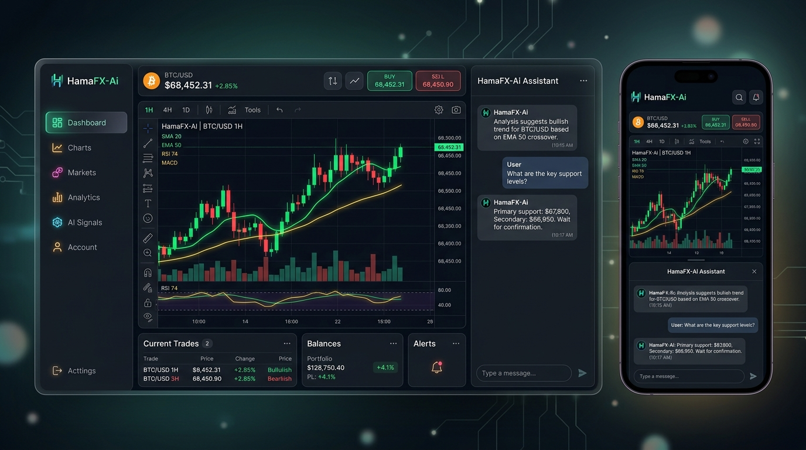

<p align="center">
  
</p>

<p align="center">
  <h1 align="center">🥇 HamaFX-Ai</h1>
</p>

<p align="center">
  <strong>The Open-Source, Multi-Tenant AI Trading Platform.</strong><br>
  Chat-driven. Mobile-first. Domain-routed Multi-Agent Deliberation.
</p>

<p align="center">
  <a href="https://github.com/HamaFx/HamaFX-Ai/actions"></a>
  <a href="https://github.com/HamaFx/HamaFX-Ai/blob/main/LICENSE"></a>
  <a href="https://github.com/HamaFx/HamaFX-Ai/actions/workflows/ci-fast.yml"></a>
  <a href="https://nextjs.org"></a>
</p>

<p align="center">
  <a href="#-core-highlights">✨ Highlights</a> ·
  <a href="#-quick-start">🚀 Quick Start</a> ·
  <a href="#-monorepo-architecture">🧱 Monorepo Architecture</a> ·
  <a href="#-ai-agent--routing">🤖 AI Agent & Routing</a> ·
  <a href="#-product-documentation">📚 Documentation Index</a> ·
  <a href="#-maintenance-commands">🔧 CLI Tools</a>
</p>

---

## ✨ Core Highlights

HamaFX-Ai is an **autonomous AI trading companion that lives in your pocket**. Chat with it about gold (XAU/USD) and forex markets like you'd talk to a seasoned macro fund trader. It operates as a continuous, intelligent copilot: monitoring live tick feeds, executing structural charting math, checking macroeconomic event calendars, and drafting secure order executions with rigorous real-time verification checks.

*   💬 **Chat-First Workflow:** Every feature—from chart drawing to alert configuration—is controllable through fluid conversation. Deep-linked system prompts start target market analyses instantly.
*   📊 **Hybrid Charting Engine:** Toggles on the fly between a high-performance **TradingView Pro** widget and **Lightweight-charts SMC** (Smart Money Concepts) indicator overlay charts.
*   🧠 **Plan-Then-Act Reasoning:** Analytical instructions generate clear, chronological execution stages displayed as an interactive "Thinking" workflow pill before calling model tools.
*   🏛️ **Multi-Agent Committee:** Convenes a panel of virtual experts (**Economist**, **Technician**, and **Risk Manager**) to parallel-evaluate market patterns and return a consolidated grade consensus (A/B/C/D/F).
*   🔒 **Bring Your Own Key (BYOK):** Zero platform vendor lock-in. Connect Gemini, Claude, OpenAI, Groq, DeepSeek, or Mistral keys securely stored and encrypted client-side using **AES-256-GCM**.
*   📱 **Progressive Web App (PWA):** Mobile-first design that installs natively on iOS and Android. Sub-second page loads, virtualized feeds via TanStack Virtual, and optimized SWR local query caching.
*   🟢 **Zero-Database Dev Hook:** Uses native PGlite (in-process Postgres) to boot the entire stack in under 5 seconds with zero local database instances to install or configure.

---

## 🚀 Quick Start

Ensure you have [Node.js v20+](https://nodejs.org/), [pnpm v9+](https://pnpm.io/), and optionally [Docker](https://www.docker.com/) installed.

### 1. 🟢 Native PGlite (Zero-Setup Local Dev)

Perfect for rapid local testing. This mode runs Postgres entirely in-process (`PGlite`) with zero databases to set up or configure.

```bash
# Clone the repository
git clone https://github.com/HamaFx/HamaFX-Ai
cd HamaFX-Ai

# Install workspace dependencies
pnpm install

# Set up local key (Any supported AI API key)
echo 'GOOGLE_GENERATIVE_AI_API_KEY=your-gemini-key-here' >> .env.local

# Run developer loop
pnpm dev:local

# Open: http://localhost:3000
```

> [!TIP]
> Sign up at `/auth/register` and connect your API keys on the `/onboarding` screen. Database credentials, session encryption keys, and cron authentication secrets are automatically generated and stored under `.hamafx/dev-secrets.json` on first boot.

---

### 2. 🐳 Docker Compose (Production Ready)

Enables full production services, including a persistent PostgreSQL 16 database, custom vector embeddings via `pgvector` for memory/RAG, and the background daemon worker.

```bash
# Set up production environment configuration
cp .env.example .env

# Edit .env to add your production generative AI keys and credentials
nano .env

# Spin up services in detached mode
docker compose up -d

# Open: http://localhost:3000
```

> [!NOTE]
> Docker Compose boots PostgreSQL 16 with `pgvector` enabled out-of-the-box. Vector features are disabled under the PGlite local developer script.

---

## 🧱 Monorepo Architecture

HamaFX-Ai is structured as a monorepo utilizing Turborepo to coordinate fast builds, linting, and multi-package testing pipelines.

```text
                            +-----------------------------------+
                            |           CLIENT LAYER            |
                            |  @hamafx/web (Next.js - 33k LOC)  |
                            +─────────┬───────────────┬─────────+
                                      │               │
                                      ▼               ▼
                            +──────────────────+ +──────────────────+
                            |    AGENT CORE    | |  MARKET ADAPTERS  |
                            | @hamafx/ai (20k) | | @hamafx/data (6k) |
                            +─────────┬────────+ +────────┬─────────+
                                      │                   │
                     +────────────────┼───────────────────┤
                     │                │                   │
                     ▼                ▼                   ▼
            +──────────────────+ +──────────────────+ +──────────────────+
            |  SHARED SCHEMAS  | |  STORAGE LAYER   | |     SMC MATH     |
            |@hamafx/shared(4k)| | @hamafx/db (2k)  | |@hamafx/indicators|
            +──────────────────+ +────────▲─────────+ +──────(2k)────────+
                                          │
                                          │
                            +─────────────┴─────+
                            |   DAEMON LAYER    |
                            | @hamafx/worker(5k)|
                            +-------------------+
```

### Monorepo Directory Layout

| Package / App | Location | Purpose | Lines of Code (LOC) |
|:---|:---|:---|:---|
| **`@hamafx/web`** | [`apps/web`](./apps/web) | Next.js 15 App Router client app (Chat, Charts, Journal, Settings, PWA configuration). | ~33,300 |
| **`@hamafx/worker`**| [`apps/worker`](./apps/worker) | Node daemon consuming ticks at 1Hz, caching candles, checking systemd cron timers. | ~4,900 |
| **`@hamafx/ai`** | [`packages/ai`](./packages/ai) | Core prompt compilation, classification routing, RAG pipeline, and AI tool bindings. | ~20,200 |
| **`@hamafx/data`** | [`packages/data`](./packages/data) | Market data integrations with automatic failover (BiQuote primary, Finnhub fallback). | ~5,900 |
| **`@hamafx/indicators`**| [`packages/indicators`](./packages/indicators) | Pure mathematics for indicators (EMA, SMA, Bollinger Bands) and Smart Money Concepts. | ~2,300 |
| **`@hamafx/db`** | [`packages/db`](./packages/db) | Multi-tenant schema definition and Drizzle ORM migration harness. | ~2,300 |
| **`@hamafx/shared`** | [`packages/shared`](./packages/shared) | Shared validation schemas, error definitions, and AES-256-GCM encryption helpers. | ~4,400 |

---

## 🤖 AI Agent & Routing

HamaFX-Ai routes incoming user queries to specific model domains based on task complexity, cost budget constraints, and model capabilities.

```
Incoming Turn
     │
     ├── Classify Intent
     │     ├─► Fundamental (Weekly macro recaps, news events) ──► Gemini 2.5 Pro (Search Grounding)
     │     ├─► Technical (Indicators math, structure drawings) ──► Gemini 2.5 Flash
     │     ├─► Summary (Brief chats, alert status checks)      ──► Gemini 2.5 Flash
     │     ├─► Vision (Chart screenshots uploaded)             ──► Gemini 2.5 Pro
     │     └─► Simple (Generic conversational fallback)         ──► Gemini 2.5 Flash-Lite
     │
     └── Execute Plan (Interactive "Thinking" pill) 
           └─► Assemble Context ──► Pull Memory/RAG ──► Run Verification Warnings
```

### The 30 AI Tools Registry

The agent core accesses a suite of 30 specialized tools to analyze and interact with market data.

<details>
<summary><b>🔍 Expand to View the Full 30 Tools Matrix</b></summary>

| Domain | Tools | Description |
|:---|:---|:---|
| **📈 Live Data** | `get_price` <br> `get_candles` <br> `get_indicators` <br> `get_market_structure` <br> `get_session_levels` | Fetches real-time price ticks, historical candles, indicators math, SMC structures, and key daily/weekly session ranges. |
| **🔬 Analysis** | `analyze_technical` <br> `analyze_fundamental` <br> `analyze_chart_image` <br> `annotate_chart` | Initiates technical scans, macroeconomic evaluations, vision screenshot reads, and adds visual markers onto charts. |
| **🌐 Macro & Vol** | `get_news` <br> `get_calendar` <br> `get_correlation` <br> `get_intermarket` <br> `get_seasonality` <br> `get_cot` <br> `forecast_volatility` <br> `get_intermarket_resonance` | Inspects macro news, economic events, symbol cross-correlations, asset seasonalities, COT reports, and forecasts market volatility. |
| **⚖️ Risk & Backtest** | `compute_risk` <br> `compute_position_health` <br> `verify_call` <br> `replay_setup` | Calculates position sizes, reviews current trade health, verifies order compliance, and replays historical setups. |
| **🧠 Memory & RAG** | `search_knowledge` <br> `summarize_thread` | Searches PGVector embeddings for historical context, and compacts long conversation histories. |
| **✍️ Write Actions** | `set_alert` <br> `log_journal` <br> `get_journal_stats` <br> `share_snapshot` | Creates price/macro alerts, records journals, retrieves performance stats, and exports chart snaps. |
| **🏛️ Deliberation** | `convene_committee` <br> `get_system_diagnostics` <br> `run_system_action` | Triggers parallel expert agents, evaluates diagnostics, and executes verified actions. |

</details>

---

## 🧠 Multi-Agent Deliberation Mode

HamaFX-Ai supports a **multi-agent deliberation mode** where multiple specialized AI agents analyze the user's question in parallel, then a **Decision Agent** fuses their opinions into a final unified response.

### Modes

| Mode | Agents | LLM Calls | Latency | Cost | Use Case |
|:---|:---|:---|:---|:---|:---|
| **Auto** | AI picks | Varies | Varies | Varies | Default — auto-detects based on question |
| **Single** | Current single agent | 1 | ~2s | 1× | Fast, simple questions |
| **Quick** | Technical → Decision | 2 | ~3s | 1.5× | "What's the price of gold?" |
| **Standard** | Technical + Fundamental → Decision | 3 | ~5s | 2.5× | "Analyze XAUUSD" |
| **Full** | Technical + Fundamental + Risk + Sentiment → Decision | 5 | ~8s | 4× | "Should I buy XAUUSD now?" |

### Specialist Agents

- **Technical Agent** — Price action, indicators, market structure, session levels. Uses fast-tier models (Gemini Flash). Scoped tools: `get_candles`, `get_indicators`, `get_price`, `get_market_structure`, etc.
- **Fundamental Agent** — Macroeconomic context, central bank policy, COT data, economic calendar. Uses mid-tier models. Scoped tools: `get_calendar`, `get_cot`, `get_news`, etc.
- **Risk Agent** — Devil's advocate: identifies risks, red flags, worst-case scenarios. Can issue a `hardVeto` to block buy recommendations. Uses mid-tier models.
- **Sentiment Agent** — News sentiment, social sentiment, fear/greed, contrarian signals. Uses fast-tier models. (Full mode only.)
- **Decision Agent** — Fuses all specialist opinions into a final response. Surfaces agreement/disagreement, enforces vetoes, produces actionable plan. Uses strong-tier models (Claude/GPT-4o). No tools — only processes opinions.

### Architecture

```
User Message
     ↓
Mode Router (auto / single / quick / standard / full)
     ↓
┌─────────────────────────────────────────────────────┐
│  IF single: existing runChat() flow                 │
│  IF multi-agent:                                    │
│                                                      │
│  ┌─────────┐ ┌────────────┐ ┌──────┐ ┌───────────┐  │
│  │Technical│ │Fundamental │ │ Risk │ │ Sentiment │  │ (parallel)
│  │ Agent   │ │  Agent     │ │Agent │ │   Agent   │  │
│  └────┬────┘ └─────┬──────┘ └──┬───┘ └─────┬─────┘  │
│       └────────────┼───────────┼────────────┘       │
│                     ↓                                │
│            ┌─────────────┐                           │
│            │  Decision   │                           │
│            │   Agent     │                           │
│            └──────┬──────┘                           │
│                   ↓                                  │
│         Streamed fused response                      │
└─────────────────────────────────────────────────────┘
```

### Key Features

- **Parallel execution**: Specialists run via `Promise.all` for minimum latency
- **Budget guardrails**: Cost estimated upfront per mode, reserved before pipeline starts, reconciled after
- **Per-agent model overrides**: Assign different models to each agent via Settings → Agent
- **Opinion persistence**: All specialist opinions saved to `agent_opinions` table, linked to messages
- **SSE streaming**: Real-time progress events (agent start/done) + final text streaming
- **Error fallback**: If a specialist fails, Decision agent proceeds with available opinions. If Decision fails, specialist reasoning is concatenated as raw response
- **Veto enforcement**: Risk agent's `hardVeto` prevents Decision agent from recommending buys
- **Timeout handling**: Per-agent timeouts (15s specialists, 30s decision) with AbortController

### Settings

Configure in **Settings → Agent**:
- Default analysis mode (Auto / Single / Quick / Standard / Full)
- Show/hide agent opinions panel in chat
- Per-agent model override (assign specific provider:model to each agent)

### Usage Tracking

Per-agent and per-mode cost breakdowns available via `/api/settings/usage-by-agent`.

---

## ⚙️ Environmental Configurations

During local development and testing, `NEXTAUTH_SECRET`, `ENCRYPTION_SECRET`, and `CRON_SECRET` are automatically generated if missing and stored in `.hamafx/dev-secrets.json`. In production, all secrets **must** be set explicitly.

### Configuration Reference Table

| Variable | Scope / Value | Required | Purpose |
|:---|:---|:---|:---|
| `DATABASE_URL` | PostgreSQL URI | Production | Connects to PostgreSQL. (PGlite is used locally instead if not set). |
| `NEXTAUTH_URL` | URL | Production | The base URL of the client app (e.g. `https://hamafx.com`). |
| `NEXTAUTH_SECRET` | String (>=32 chars) | Production | Key used to sign JWTs for user authentication session management. |
| `ENCRYPTION_SECRET` | Hex String (32 bytes) | Production | Key used to encrypt client-side BYOK credentials via AES-256-GCM. |
| `CRON_SECRET` | String (>=16 chars) | Production | Bearer token required to invoke cron trigger routes at `/api/cron/*`. |
| `GOOGLE_GENERATIVE_AI_API_KEY` | Gemini Key | Option | API Key for Google generative models (default routing option). |
| `BIQUOTE_API_KEY` | BiQuote Forex Key | Option | Live tick feed primary provider credentials. |
| `FINNHUB_API_KEY` | Finnhub Stock Key | Option | Macroeconomic calendar and news feed credentials. |

---

## 📚 Product Documentation

See [`AGENTS.md`](./docs/AGENTS.md) first if you are an AI agent writing code on this codebase.

### Core Architecture & System Layout
*   [**01 - Architecture**](./docs/01-architecture.md): System layout, database topologies, multi-tenant boundaries, and deployment schemes.
*   [**02 - Codebase**](./docs/02-codebase.md): Coding guidelines, directory conventions, custom TS rules, and scripts configurations.
*   [**03 - AI Agent**](./docs/03-ai-agent.md): Routing logic, RAG pipelines, verification engines, and detailed descriptions of all 30 tools.
*   [**04 - Data Layer**](./docs/04-data-layer.md): Schemas, cache policies, market provider mappings, and failovers.
*   [**05 - API Routes**](./docs/05-api-routes.md): Comprehensive routing registry (authentication, charts, cron triggers).

### Frontend & Daemon Layer
*   [**06 - Frontend**](./docs/06-frontend.md): Pages layout, Tailwind design variables, component primitives, and client states.
*   [**07 - Worker**](./docs/07-worker.md): Nodes daemon internals, tick ingestion buffers, and timers scheduler.
*   [**15 - Motion Conventions**](./docs/15-motion-conventions.md): UI transitions, animations, layouts, and responsive state policies.
*   [**USER_FLOW.md**](./docs/USER_FLOW.md): UI/UX pathways, navigation maps, Pro chart views, and SMC analysis layout.
*   [**UX_UPGRADE_PLAN.md**](./docs/UX_UPGRADE_PLAN.md): Progressive upgrades to visual layouts, themes, responsive drawers, and loading states.

### Deployment & Security Operations
*   [**08 - Deployment**](./docs/08-deployment.md): Hosting guides for Vercel + GCE (Google Compute Engine) VM instances.
*   [**10 - Self-Hosting**](./docs/10-self-hosting.md): Steps for deploying your own multi-tenant clone of HamaFX-Ai.
*   [**12 - Security**](./docs/12-security.md): Client-side BYOK safety boundaries, data storage sanitizations, and access controls.

### Maintenance, Setup & Contributions
*   [**09 - Testing**](./docs/09-testing.md): Automated tests, mock setups, playbooks, and CLI benchmarks.
*   [**14 - First-Run Setup**](./docs/14-first-run-setup.md): Comprehensive details on what gets auto-generated and how to configure providers.
*   [**11 - Contributing Guide**](./docs/11-contributing-guide.md): Standard onboarding, issue reporting, and pull request structures.
*   [**13 - Roadmap**](./docs/13-roadmap.md): Historical progress milestones and future feature directions.

---

## 🔧 Maintenance Commands

Manage the workspace build, testing, and formatting with standard Turborepo and package commands.

```bash
# Execute local unit/integration tests
pnpm test

# Run typescript compilation audits globally
pnpm typecheck

# Audit ESLint configuration rules
pnpm turbo run lint

# Compile production bundles
pnpm --filter @hamafx/web build

# Format entire codebase
pnpm format

# Run AI Evaluation cases (Requires running server)
pnpm --filter @hamafx/ai eval -- --base-url http://localhost:3000 --cookie "hfx_auth=..." --cases
```

---

## ⚖️ License & Contributing

Licensed under the [Apache License, Version 2.0](LICENSE). 

Before submitting Pull Requests, please review the [Contributing Guidelines](CONTRIBUTING.md) and the [Code of Conduct](CODE_OF_CONDUCT.md).

<p align="center">
  <sub>Built for gold and forex traders. Optimized for autonomous coding agents.</sub>
</p>