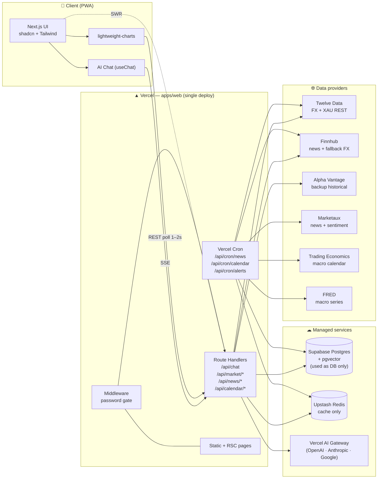
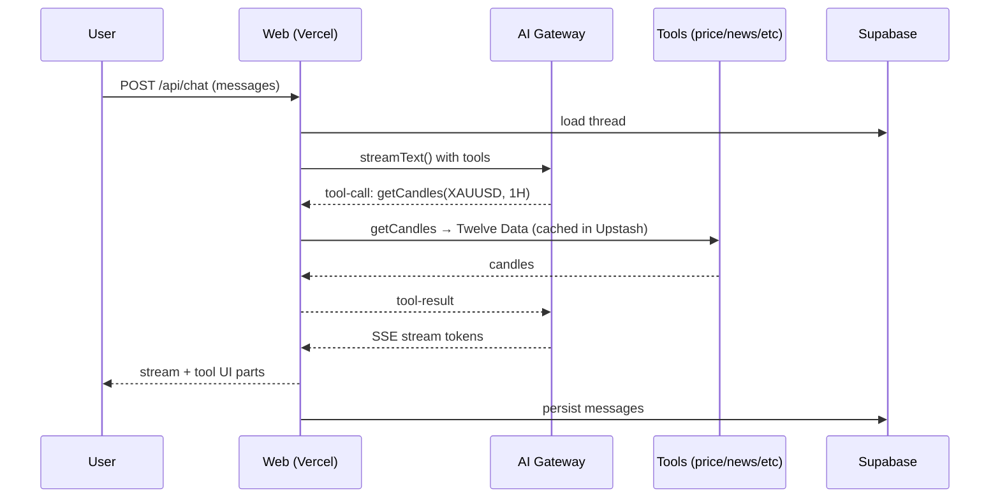
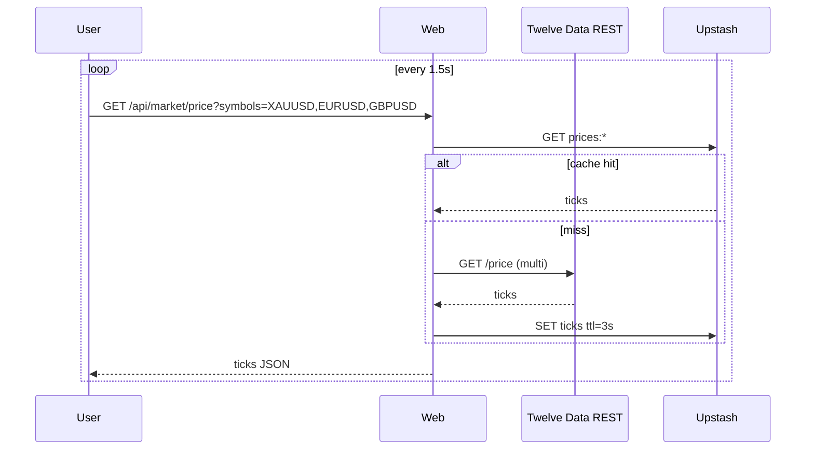
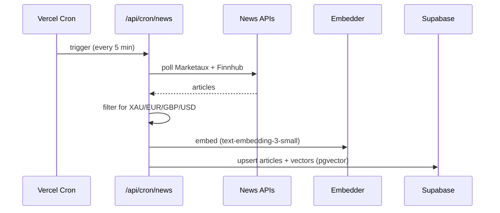
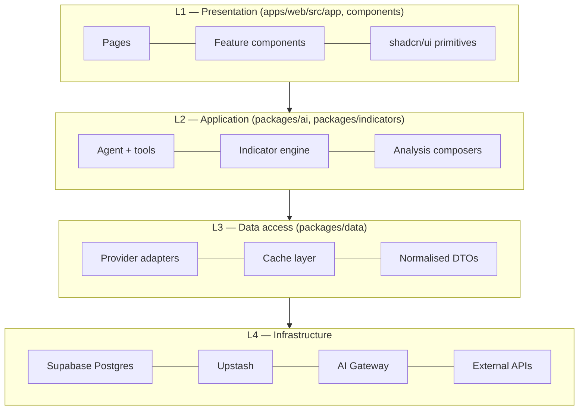

# 01 — System Architecture

## High-level view

HamaFX-Ai is a **single deployable unit** on Vercel that talks to a few managed services. There is **no separate worker** at MVP — Vercel Cron handles the scheduled jobs and the browser polls REST for live prices. We may add a worker on Fly.io later if we ever need a persistent upstream WebSocket — see "Future: optional worker" below.

## Why no worker at MVP?

We considered a separate Hono service on Fly.io for persistent upstream WebSockets. For a **single-user app**, the math doesn't justify it:

| Need                                        | Vercel-only? | Trade-off accepted                                                         |
| ------------------------------------------- | ------------ | -------------------------------------------------------------------------- |
| Live prices                                 | ✅ via 1–2 s polling | Slightly worse latency, but provider quotas easily cover it for one user. |
| Cron for news / calendar                    | ✅ Vercel Cron       | Limited to Vercel's cron cadence (≥ 1 min) — fine for our 2–5 min jobs.   |
| Alert evaluator                             | ✅ Vercel Cron / 1 min | Slightly less responsive than a 30 s loop, fine.                         |
| Long-lived in-memory caches                 | ❌                   | Use Upstash Redis instead (faster than free-tier Postgres).               |
| Persistent upstream WebSocket               | ❌                   | We don't need it for one user; revisit if/when we do.                     |

If we ever do need a worker, the migration path is clean: drop a Hono service into `apps/worker/`, move `/api/cron/*` into it, and that's it.

## Request flows (summary — full diagrams in `13-data-flow.md`)

### A. Chat turn (most common)

### B. Live price tile

### C. News / calendar ingestion (Vercel Cron)

The agent later does RAG against this table — see `07-ai-agent.md`.

## Layered architecture

**Strict rule**: a layer may import from layers **below** it, never above. UI never calls a provider directly — it goes via `packages/data` or a route handler.

## Shared types boundary

`packages/shared` exports zod schemas + inferred TS types for:

- `Symbol` (`"XAUUSD" | "EURUSD" | "GBPUSD"`)
- `Timeframe` (`"1m" | "5m" | "15m" | "30m" | "1h" | "4h" | "1d" | "1w"`)
- `Candle`, `Tick`
- `IndicatorRequest`, `IndicatorResult`
- `NewsArticle`, `EconomicEvent`
- `ChatMessage`, `ToolName`, `ToolInput<T>`, `ToolOutput<T>`
- `AlertRule`, `JournalEntry`

The same schemas validate inputs at:

1. UI form boundaries
2. API route handlers
3. AI tool definitions
4. DB write paths

## Failure & resilience

- **Provider failover**: each data type has primary + fallback adapter; on error or stale cache, we transparently fall back. See `06-data-sources.md`.
- **Stale-while-error**: if everything fails, we serve the last cached value and flag the freshness in the UI.
- **Graceful degradation**: if charts API is down, chat still works with last cached snapshot and a warning banner.
- **No silent staleness**: every tool result includes `fetchedAt` and `source`; the UI surfaces "data is N seconds old".

## Observability (light)

Personal mode — we don't need a full observability stack:

- Vercel built-in logs are the primary sink.
- Server code uses simple structured `console.log({ level, msg, ...meta })`.
- Cost tracking: a tiny `chat_telemetry` table records (model, input tokens, output tokens, tool calls, ms) per turn. A `/settings/usage` page shows last 30 days.

## Future: optional worker

If at v2 we want:

- A persistent upstream WebSocket to Twelve Data (sub-second updates)
- Heavy backtests / long-running computations
- Telegram / native push fan-out

…we'll add `apps/worker/` (Hono on Fly.io) and move the cron routes there. Until then, **single-deploy on Vercel**.
