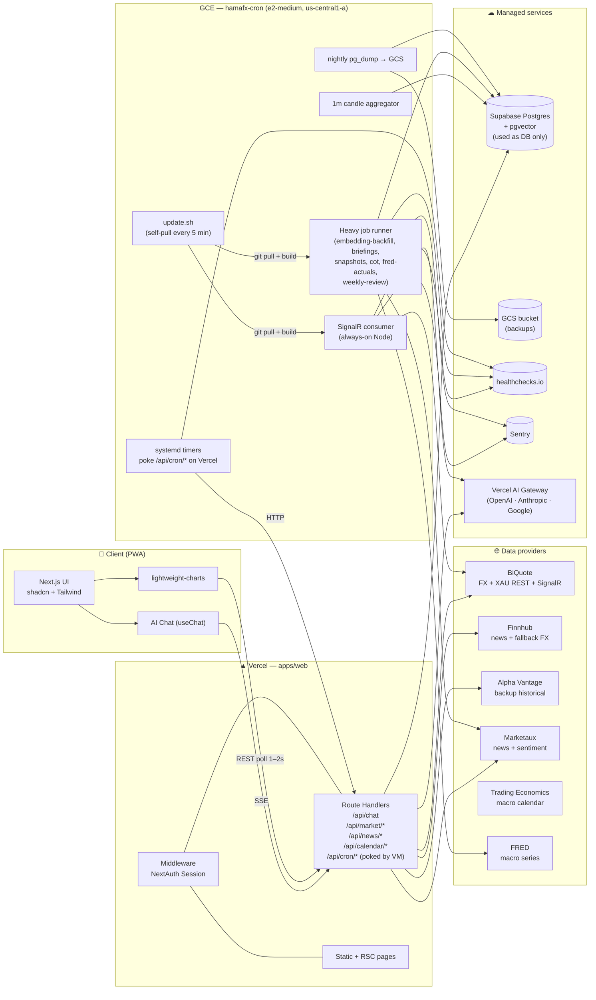
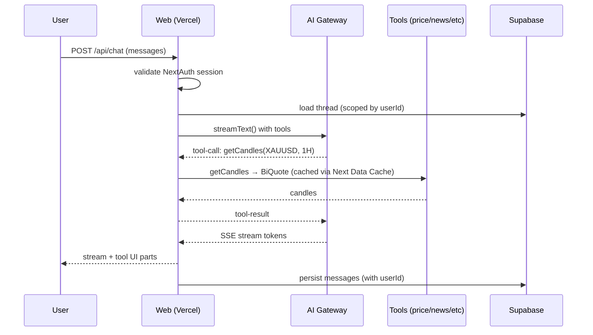
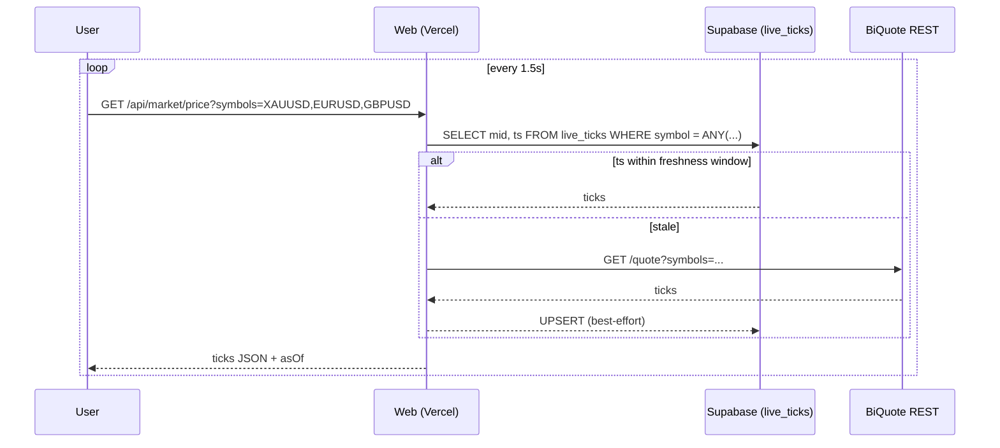
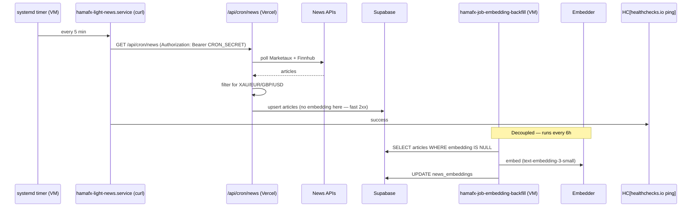
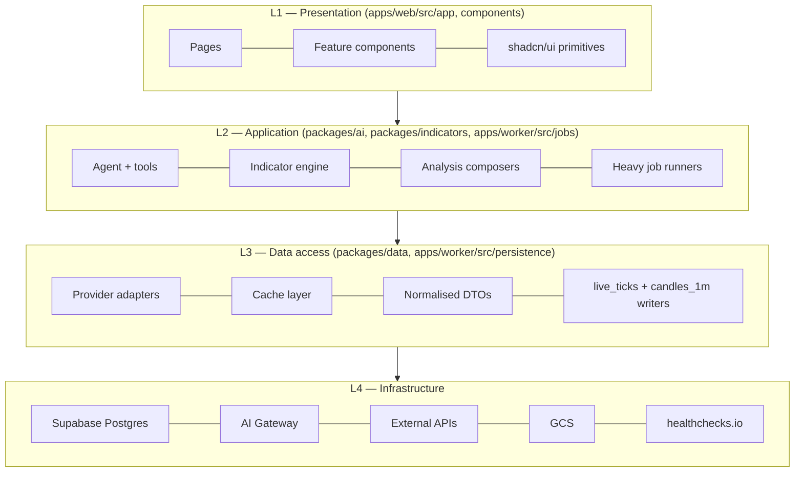

# 01 — System Architecture

> **New to the project?** Start with [AGENTS.md](./AGENTS.md) for a quick overview.
> Deep dives: [02-codebase.md](./02-codebase.md), [03-ai-agent.md](./03-ai-agent.md), [04-data-layer.md](./04-data-layer.md), [07-worker.md](./07-worker.md).

## Deployment modes

HamaFX-Ai supports three deployment targets with the same source code:

| Mode | Database | Scheduler | Setup |
|------|----------|-----------|-------|
| **Local native** | PGlite (embedded Postgres) | node-cron (embedded) | `pnpm dev:local` |
| **Local Docker** | Postgres 16 + pgvector | node-cron (embedded) | `docker compose -f docker-compose.prod.yml up -d` |
| **Production** | Supabase Postgres | systemd timers (GCE VM) | Vercel + GCE |

This document describes the production cloud architecture. See [08-deployment.md](./08-deployment.md) for details.

## High-level view

HamaFX-Ai runs on **two co-operating deployments**: Vercel hosts the web app + chat + read APIs + light cron pokers, and a single GCE VM (`hamafx-cron`, e2-medium in `us-central1-a`) runs the always-on BiQuote SignalR consumer + heavy scheduled jobs. Phase 8 lifted the previous "single deployable unit" rule once we needed sub-second prices and heavy jobs that don't fit in Vercel Hobby's 60s function ceiling.

## Why the worker now (Phase 8)

The original "single Vercel deploy" rule held until two needs forced our hand:

| Need                                | Why Vercel-only stopped working                                                                         |
| ----------------------------------- | ------------------------------------------------------------------------------------------------------- |
| Sub-second live prices              | Polling REST every 1–2 s wasted provider quota and still produced visibly stale candles for live trading. |
| Heavy jobs (RAG backfill, weekly review) | Vercel Hobby has a 60 s function ceiling. An embedding backfill that touches 200 articles needs 90 s+. |
| Persistent BiQuote SignalR feed     | A serverless function can't hold a multi-hour WebSocket.                                                |
| Reliable cron at sub-5-min cadence  | GitHub Actions cron has a 5-minute floor and degrades on shared-runner load.                            |

Phase 8 picked the smallest possible escape hatch: **one `e2-medium` VM in `us-central1-a` running a single Node service plus systemd timers.** Vercel still hosts the chat surface, the read APIs, and the `/api/cron/*` light handlers — the VM just trades persistent connections and longer-running jobs for what Vercel can't do on Hobby.

## Request flows (summary — full diagrams in `13-data-flow.md`)

### A. Chat turn (most common)

### B. Live price tile

The tile reads from the live ticks the worker writes into Postgres, with a REST fallback when the worker hasn't published in N seconds.

The worker's BiQuote SignalR consumer keeps `live_ticks` updated continuously (sub-second), so the REST fallback is a degraded-mode path — not the primary one.

### C. News / calendar ingestion (VM-driven)

The split keeps the Vercel route under the 60 s ceiling (it just upserts text rows) and lets the heavier embedding pass run on the VM where it can take its time.

The agent later does RAG against this table — see `07-ai-agent.md`.

## Layered architecture

**Strict rule**: a layer may import from layers **below** it, never above. UI never calls a provider directly — it goes via `packages/data` or a route handler. The worker imports the same packages/* as the web app — single source of truth for schemas, providers, DB queries.

## Shared types boundary

`packages/shared` exports zod schemas + inferred TS types for:

- `Symbol` (`"XAUUSD" | "EURUSD" | "GBPUSD"`)
- `Timeframe` (`"1m" | "5m" | "15m" | "30m" | "1h" | "4h" | "1d" | "1w"`)
- `Candle`, `Tick`
- `IndicatorRequest`, `IndicatorResult`
- `NewsArticle`, `EconomicEvent`
- `ChatMessage`, `ToolName`, `ToolInput<T>`, `ToolOutput<T>`
- `AlertRule`, `JournalEntry`

The same schemas validate inputs at:

1. UI form boundaries
2. API route handlers
3. AI tool definitions
4. DB write paths

## Failure & resilience

- **Provider failover**: each data type has primary + fallback adapter; on error or stale cache, we transparently fall back. See `06-data-sources.md`.
- **Stale-while-error**: if everything fails, we serve the last cached value and flag the freshness in the UI.
- **Graceful degradation**: if charts API is down, chat still works with last cached snapshot and a warning banner.
- **No silent staleness**: every tool result includes `fetchedAt` and `source`; the UI surfaces "data is N seconds old".

## Observability

- **Vercel logs** for the web app + every `/api/cron/*` call. JSON-structured (`console.log({ level, msg, ...meta })`).
- **journald** on the VM, queryable via `sudo journalctl -u hamafx-<unit>.service`. Same JSON shape.
- **healthchecks.io** pings: SignalR consumer heartbeat (30 s), every heavy job (start/success/fail), every light cron (`ExecStartPost` on success). UUIDs are listed in `infra/cron-vm/RECOVERY.md`.
- **Sentry** (server-only) on both `apps/web` and `apps/worker`. `SENTRY_DSN` shared between server and client SDK; the route handler exception handler and the worker's `captureException` both flush within 2 s.
- **Cost tracking**: a tiny `chat_telemetry` table records (model, input tokens, output tokens, tool calls, ms, est cost, kind) per turn. `/settings/usage` shows last 30 days.

If something breaks: `journalctl` on the VM, Vercel logs for routes, healthchecks.io dashboard for "what stopped firing recently", Sentry for the stack trace.

## Disaster recovery

`infra/cron-vm/RECOVERY.md` is the playbook. Five scenarios covered with concrete commands:

1. Restore the database from yesterday's backup.
2. Restore journal-only from the JSON export.
3. Worker won't start (rollback to a known-good SHA).
4. Provision a fresh VM from scratch.
5. Revoke a leaked service-account key.

A weekly `hamafx-verify-restore.timer` boots a throwaway Postgres in Docker, restores the latest dump, runs row-count assertions, and writes `gs://${GCS_BUCKET}/verify/last-success.txt`. If that file goes stale, healthchecks.io pages.
