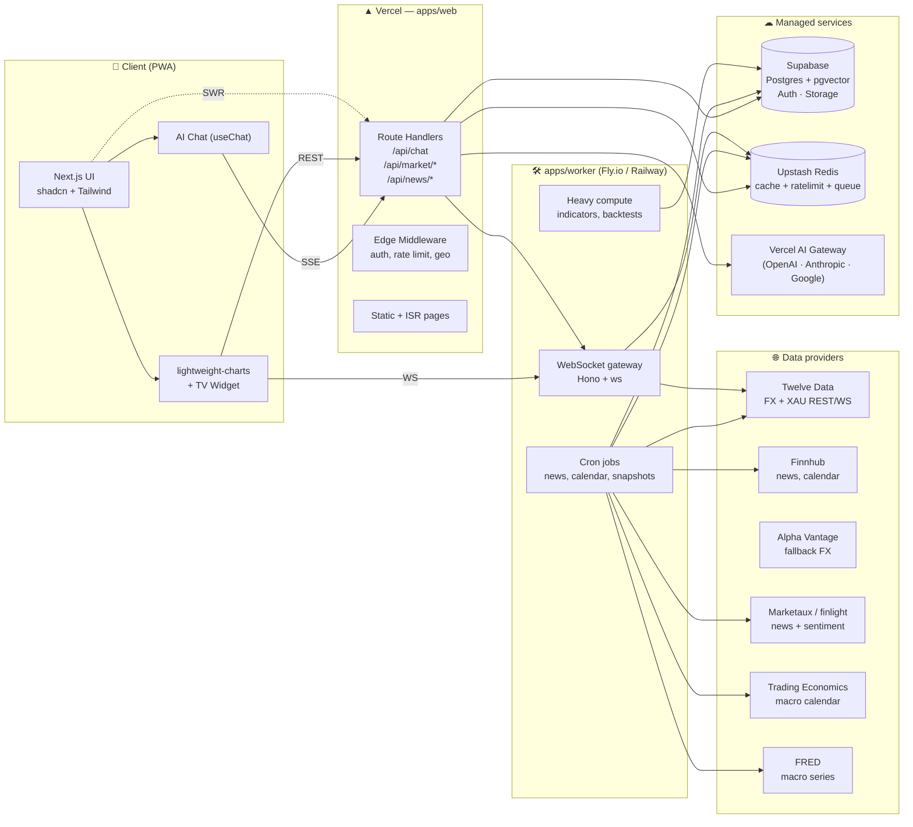
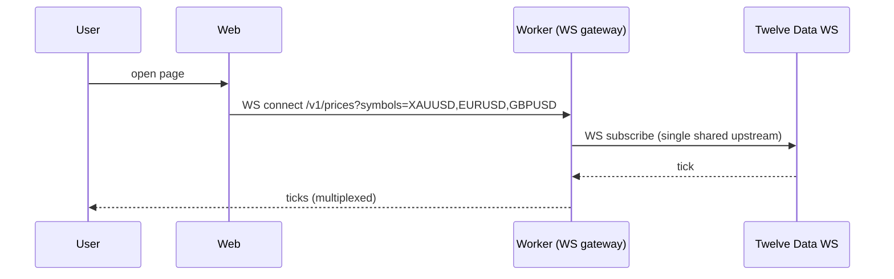
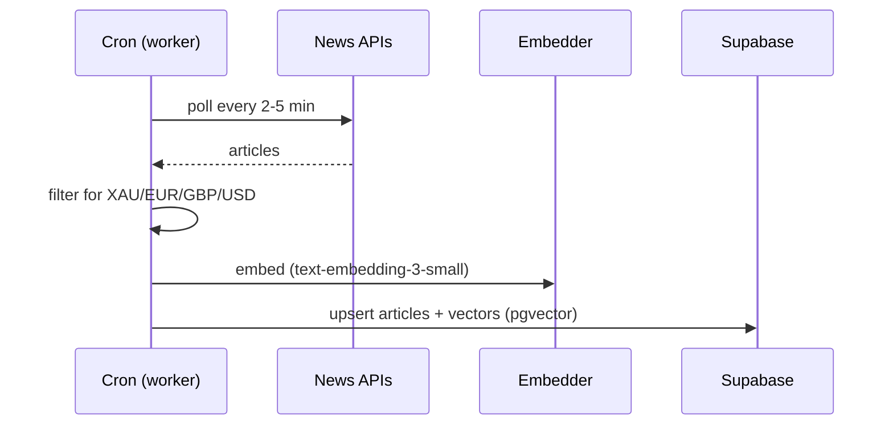
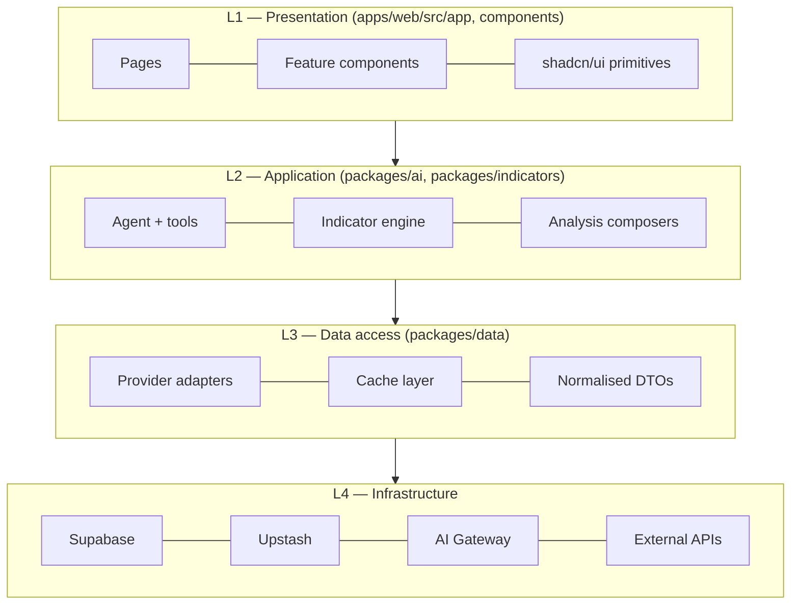

# 01 — System Architecture

## High-level view

HamaFX-Ai is split into **three deployable units** plus shared packages:

1. **`apps/web`** — Next.js 15 App Router (Vercel). UI + AI chat + light API routes.
2. **`apps/worker`** — Hono (Node) service (Fly.io or Railway). WebSocket fan-out, cron ingestion, heavy compute.
3. **External managed services** — Supabase (Postgres + Auth + Realtime + Storage), Upstash Redis, Vercel AI Gateway, data providers.

## Why two deployable units?

Vercel is excellent for the web app and short-lived AI streaming, but has constraints we need to escape for trading data:

| Need                                        | Vercel? | Worker? |
| ------------------------------------------- | ------- | ------- |
| Persistent WebSocket to a price provider    | ❌       | ✅       |
| Cron > a few minutes runtime                | ⚠️       | ✅       |
| Long-lived in-memory caches (price tape)    | ❌       | ✅       |
| Streaming SSE to browser (chat)             | ✅       | ✅       |
| ISR / static pages, edge auth               | ✅       | ❌       |
| Tight Next.js DX, zero-config previews      | ✅       | ❌       |

So we keep **stateless / request-scoped** logic on Vercel and put **stateful / connection-holding** logic on the worker.

## Request flows (summary — full diagrams in `13-data-flow.md`)

### A. Chat turn (most common)

### B. Live price tile

A single upstream WebSocket is shared across all connected users — drastically reducing provider quota usage.

### C. News / calendar ingestion (cron)

The agent later does RAG against this table — see `07-ai-agent.md`.

## Layered architecture

**Strict rule**: a layer may import from layers **below** it, never above. UI never calls a provider directly — it goes via `packages/data` or a route handler.

## Shared types boundary

`packages/shared` exports zod schemas + inferred TS types for:

- `Symbol` (`"XAUUSD" | "EURUSD" | "GBPUSD"`)
- `Timeframe` (`"1m" | "5m" | "15m" | "30m" | "1h" | "4h" | "1d" | "1w"`)
- `Candle`, `Tick`, `OrderBookLevel`
- `IndicatorRequest`, `IndicatorResult`
- `NewsArticle`, `EconomicEvent`
- `ChatMessage`, `ToolName`, `ToolInput<T>`, `ToolOutput<T>`

The same schemas validate inputs at:

1. UI form boundaries
2. API route handlers
3. AI tool definitions
4. DB write paths

This is what makes the system safe for AI agents to refactor.

## Failure & resilience

- **Provider failover**: each data type has primary + fallback adapter; on error or stale cache, we transparently fall back. See `06-data-sources.md`.
- **Circuit breaker**: per-provider error rate triggers temporary disable (Upstash counter).
- **Idempotent writes**: chat messages, alerts, journal entries use client-generated UUIDs.
- **Graceful degradation**: if charts API is down, chat still works with last cached snapshot and a warning banner.
- **No silent staleness**: every tool result includes `fetchedAt` and `source`; the chat UI surfaces "data is N seconds old".

## Observability (sketch — full in `12-security-and-config.md`)

- Structured logs via `pino` on worker, `console` + Vercel logs on web.
- Tracing: OpenTelemetry exporter to a single backend (Axiom or Better Stack — TBD).
- Metrics: latency histograms for `chat.firstToken`, `tool.<name>.duration`, `provider.<name>.error`.
- AI-specific: prompt version, model id, tool-call count, token usage per turn — persisted to a `chat_telemetry` table.
