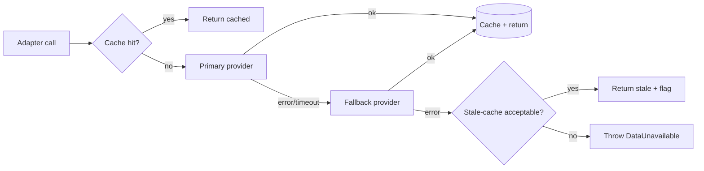
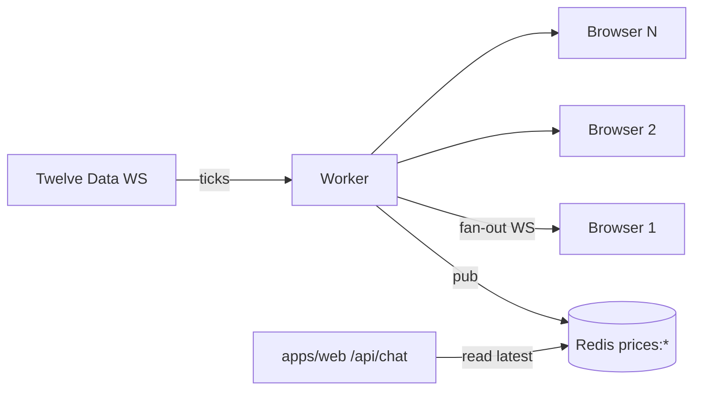

# 06 — Data Sources

> All third-party access goes through `packages/data/src/providers/<name>/` adapters. The rest of the codebase only ever sees normalised DTOs from `packages/shared/src/schemas/`. Provider keys are mentioned by name but actual quotas/prices must be re-checked at scaffold time — they change.

## Provider matrix

### Real-time price + candles

| Provider              | Tier                     | XAUUSD | EURUSD | GBPUSD | WS  | Use as          |
| --------------------- | ------------------------ | :----: | :----: | :----: | :-: | --------------- |
| **Twelve Data**       | Free 800 reqs/day, paid  | ✅     | ✅     | ✅     | ✅  | **Primary**     |
| **Finnhub**           | Free 60/min              | ⚠️     | ✅     | ✅     | ✅  | Fallback FX     |
| **Alpha Vantage**     | Free 25/day, paid        | ✅     | ✅     | ✅     | ❌  | Backup historical |
| **OANDA Exchange API**| Paid only                | ✅     | ✅     | ✅     | ✅  | Production-grade upgrade path |
| **FCS API**           | Cheap paid               | ✅     | ✅     | ✅     | ✅  | Alternative primary |
| **EODHD**             | Paid                     | ✅     | ✅     | ✅     | ⚠️  | EOD historical & dividends |

> **Rationale.** Twelve Data covers all three symbols with REST + WebSocket on a generous free tier, plus a reasonable paid step. Finnhub is the cleanest fallback for FX and gives us news in the same key. We keep Alpha Vantage for deep historicals.

### News

| Provider           | Tier               | Sentiment | Realtime WS | Use as            |
| ------------------ | ------------------ | :-------: | :---------: | ----------------- |
| **Marketaux**      | Free + paid        | ✅        | ❌ (poll)   | **Primary news**  |
| **finlight**       | Free + paid        | ✅        | ✅          | Realtime upgrade  |
| **Finnhub news**   | Inside Finnhub key | ⚠️        | ❌ (poll)   | Secondary news    |
| **Tiingo News**    | Paid               | ✅        | ❌ (poll)   | Optional v2       |
| **Benzinga**       | Paid (enterprise)  | ✅        | ✅          | v2+ if needed     |

### Macro / economic calendar

| Provider                  | Tier                         | Use as           |
| ------------------------- | ---------------------------- | ---------------- |
| **Trading Economics API** | Has free guest key (limited) | **Primary**      |
| **FRED**                  | Free, registration           | Macro series     |
| **Finnhub `/calendar/economic`** | Paid                  | Fallback         |
| **economic-calendar.net** | Paid                         | Alternative      |

> Forex Factory scraping is **not** used — its terms forbid it.

### Sentiment / on-chain / extras (deferred)

| Provider                    | Phase | Notes                         |
| --------------------------- | ----- | ----------------------------- |
| Stocktwits / X (X API v2)   | v2    | XAU sentiment volume.         |
| CoT (CFTC) reports          | v1    | Free CSV; weekly cron.        |
| World Gold Council releases | v2    | Manual curation acceptable.   |

## Normalised DTOs (single source: `packages/shared/src/schemas`)

```ts
// candle.ts
export const CandleSchema = z.object({
  symbol: SymbolSchema,             // "XAUUSD" | "EURUSD" | "GBPUSD"
  tf: TimeframeSchema,              // "1m"..."1w"
  t: z.number().int(),              // open time, ms epoch UTC
  o: z.number(),
  h: z.number(),
  l: z.number(),
  c: z.number(),
  v: z.number().nullable(),         // volume optional / synthetic for FX
  source: z.string(),               // "twelve-data"
  fetchedAt: z.number().int(),      // ms epoch UTC
});

// tick.ts
export const TickSchema = z.object({
  symbol: SymbolSchema,
  bid: z.number(),
  ask: z.number(),
  mid: z.number(),
  ts: z.number().int(),
  source: z.string(),
});

// news.ts
export const NewsArticleSchema = z.object({
  id: z.string(),                   // stable across sources via hash(url)
  title: z.string(),
  summary: z.string().nullable(),
  url: z.string().url(),
  source: z.string(),               // "marketaux" | "finnhub" | ...
  publisher: z.string().nullable(),
  publishedAt: z.number().int(),
  symbols: z.array(SymbolOrCurrencyTagSchema),
  sentiment: z.enum(["positive","negative","neutral"]).nullable(),
  sentimentScore: z.number().min(-1).max(1).nullable(),
  topics: z.array(z.string()).default([]),
});

// calendar.ts
export const EconomicEventSchema = z.object({
  id: z.string(),
  title: z.string(),                // "CPI YoY"
  country: z.enum(["US","EZ","UK","DE","FR","XAU"]).or(z.string()),
  currency: z.enum(["USD","EUR","GBP"]).nullable(),
  importance: z.enum(["low","medium","high"]),
  date: z.number().int(),           // ms epoch UTC
  actual: z.number().nullable(),
  forecast: z.number().nullable(),
  previous: z.number().nullable(),
  unit: z.string().nullable(),
  source: z.string(),
});
```

## Failover strategy



Each adapter accepts:

```ts
type Options = {
  ttlMs?: number;                       // override per-call cache TTL
  maxStaleMs?: number;                  // serve cached value up to this age on failure
  tryProviders?: Array<"twelve-data"|"finnhub"|"alpha-vantage">; // override order
  signal?: AbortSignal;
};
```

## Cache TTL policy

| Resource                       | TTL (default)  | Stale-while-error |
| ------------------------------ | -------------- | ----------------- |
| Tick / mid price (REST)        | 3 s            | 30 s              |
| Candle (1m, last bar)          | 5 s            | 60 s              |
| Candle (≥5m, last bar)         | 30 s           | 5 min             |
| Candle (closed bars batch)     | 10 min         | 1 day             |
| Indicator computation result   | derived from candle TTL | same     |
| News list (per symbol)         | 60 s           | 10 min            |
| News article body              | 24 h           | 7 days            |
| Economic calendar (today)      | 5 min          | 1 h               |
| Economic calendar (week)       | 15 min         | 6 h               |
| FRED series                    | 6 h            | 7 days            |

Implementation: Upstash Redis with a key scheme `hfx:<resource>:<symbol|null>:<tf|null>:<extra>`. See `packages/data/src/cache/`.

## Rate-limit budgets

We rate-limit ourselves to provider quotas using `@upstash/ratelimit` keyed by `provider:env`. If we hit the budget, we serve cached / stale and surface a yellow `freshness` badge — never throw on the user.

| Provider     | Max RPM (free) | Our internal cap |
| ------------ | -------------- | ---------------- |
| Twelve Data  | ~8 / min (varies)  | 6 / min      |
| Finnhub      | 60 / min        | 30 / min        |
| Marketaux    | ~100 / day      | 60 / day        |
| Trading Econ.| 10 / min (guest)| 5 / min         |

## WebSocket strategy (worker-only)

- The worker maintains **one upstream WS** to Twelve Data (or fallback) per process.
- It fans out to all connected browser clients via its own WS gateway.
- On upstream disconnect: exponential backoff, then fall back to REST polling at 1 Hz.
- Each tick is normalised and put on a Redis pub/sub channel `prices:<symbol>` so the chat tools can read latest tick from cache without the WS.



## News ingestion pipeline

Cron (every 2 minutes for news, every 5 for calendar):

1. Pull from primary; on failure, pull from secondary.
2. Filter: keep articles where any of `tags ∋ {XAU, gold, EUR, USD, GBP}` or text contains FX symbols / "ECB" / "Fed" / "BoE" / "NFP" / "CPI" / "FOMC" etc. (regex defined in `packages/data/src/providers/<x>/filter.ts`).
3. Compute embeddings (`text-embedding-3-small`) on `title + summary`.
4. Upsert to `news_articles` and `news_embeddings` (pgvector).
5. Enqueue web-push for users subscribed to symbol if `importance === "high"`.

## Symbol mapping

Each provider has its own symbol code. We map at the adapter boundary:

| Internal | Twelve Data | Finnhub      | Alpha Vantage | OANDA   |
| -------- | ----------- | ------------ | ------------- | ------- |
| XAUUSD   | `XAU/USD`   | `OANDA:XAU_USD` | `XAU` (alt)| `XAU_USD` |
| EURUSD   | `EUR/USD`   | `OANDA:EUR_USD` | `EUR/USD` | `EUR_USD` |
| GBPUSD   | `GBP/USD`   | `OANDA:GBP_USD` | `GBP/USD` | `GBP_USD` |

Mapping table lives in `packages/data/src/providers/<name>/map.ts` and is exported as `toProviderSymbol(internal): string`.

## Pip and lot conventions

- XAUUSD: 1 pip = 0.1 (some brokers use 0.01; we standardise to 0.1).
- EURUSD: 1 pip = 0.0001.
- GBPUSD: 1 pip = 0.0001.

`packages/shared/src/symbols.ts` exports `pipSize(symbol)` and `formatPips(symbol, valueDelta)`.

## Compliance notes

- We **redistribute** prices only as live read-only displays to authenticated users — most free tiers permit this. We do **not** offer raw bulk download or re-licensing.
- News articles: we display title + summary + link to source. We do **not** mirror full article text. RAG operates on title + summary embeddings.
- Trading Economics: free guest key has very limited rights — upgrade to a paid plan before any public launch.
