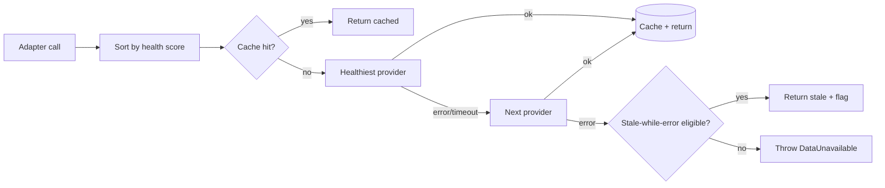

# 06 — Data Sources

> All third-party access goes through `packages/data/src/providers/<name>/` adapters. The rest of the codebase only ever sees normalised DTOs from `packages/shared/src/schemas/`. Provider keys are mentioned by name but actual quotas/prices must be re-checked at scaffold time — they change.

## Provider matrix

### Real-time price + candles

| Provider               | Tier                    | XAUUSD | EURUSD | GBPUSD | WS  | Use as                        |
| ---------------------- | ----------------------- | :----: | :----: | :----: | :-: | ----------------------------- |
| **BiQuote**            | Free, no key            |   ✅   |   ✅   |   ✅   | ✅  | **Primary (Phase 8)**         |
| **Finnhub**            | Free 60/min             |   ⚠️   |   ✅   |   ✅   | ✅  | Fallback FX                   |
| **Alpha Vantage**      | Free 25/day, paid       |   ✅   |   ✅   |   ✅   | ❌  | Backup historical             |
| **OANDA Exchange API** | Paid only               |   ✅   |   ✅   |   ✅   | ✅  | Production-grade upgrade path |
| **FCS API**            | Cheap paid              |   ✅   |   ✅   |   ✅   | ✅  | Alternative primary           |
| **EODHD**              | Paid                    |   ✅   |   ✅   |   ✅   | ⚠️  | EOD historical & dividends    |

> **Rationale (Phase 8).** BiQuote is free and unauthenticated, covers all three symbols at REST + SignalR, and lets us hold a persistent live-tick stream from a single VM-hosted worker without paying for a market-data tier. We keep Finnhub and Alpha Vantage in the failover chain so a BiQuote outage degrades to REST-cached values rather than going dark. Twelve Data was retired in Phase 8 PR-19 — it had been our primary since Phase 1a but BiQuote's free tier covers everything Twelve Data did with the added benefit of WebSocket support without per-day caps.

### News

| Provider         | Tier               | Sentiment | Realtime WS | Use as           |
| ---------------- | ------------------ | :-------: | :---------: | ---------------- |
| **Marketaux**    | Free + paid        |    ✅     |  ❌ (poll)  | **Primary news** |
| **finlight**     | Free + paid        |    ✅     |     ✅      | Realtime upgrade |
| **Finnhub news** | Inside Finnhub key |    ⚠️     |  ❌ (poll)  | Secondary news   |
| **Tiingo News**  | Paid               |    ✅     |  ❌ (poll)  | Optional v2      |
| **Benzinga**     | Paid (enterprise)  |    ✅     |     ✅      | v2+ if needed    |

### Macro / economic calendar

| Provider                         | Tier                         | Use as       |
| -------------------------------- | ---------------------------- | ------------ |
| **Trading Economics API**        | Has free guest key (limited) | **Primary**  |
| **FRED**                         | Free, registration           | Macro series |
| **Finnhub `/calendar/economic`** | Paid                         | Fallback     |
| **economic-calendar.net**        | Paid                         | Alternative  |

> Forex Factory scraping is **not** used — its terms forbid it.

### Sentiment / on-chain / extras (deferred)

| Provider                    | Phase | Notes                       |
| --------------------------- | ----- | --------------------------- |
| Stocktwits / X (X API v2)   | v2    | XAU sentiment volume.       |
| CoT (CFTC) reports          | v1    | Free CSV; weekly cron.      |
| World Gold Council releases | v2    | Manual curation acceptable. |

## Normalised DTOs (single source: `packages/shared/src/schemas`)

```ts
// candle.ts
export const CandleSchema = z.object({
  symbol: SymbolSchema, // "XAUUSD" | "EURUSD" | "GBPUSD"
  tf: TimeframeSchema, // "1m"..."1w"
  t: z.number().int(), // open time, ms epoch UTC
  o: z.number(),
  h: z.number(),
  l: z.number(),
  c: z.number(),
  v: z.number().nullable(), // volume optional / synthetic for FX
  source: z.string(), // "biquote", "biquote-signalr", "finnhub"
  fetchedAt: z.number().int(), // ms epoch UTC
});

// tick.ts
export const TickSchema = z.object({
  symbol: SymbolSchema,
  bid: z.number(),
  ask: z.number(),
  mid: z.number(),
  ts: z.number().int(),
  source: z.string(),
});

// news.ts
export const NewsArticleSchema = z.object({
  id: z.string(), // stable across sources via hash(url)
  title: z.string(),
  summary: z.string().nullable(),
  url: z.string().url(),
  source: z.string(), // "marketaux" | "finnhub" | ...
  publisher: z.string().nullable(),
  publishedAt: z.number().int(),
  symbols: z.array(SymbolOrCurrencyTagSchema),
  sentiment: z.enum(['positive', 'negative', 'neutral']).nullable(),
  sentimentScore: z.number().min(-1).max(1).nullable(),
  topics: z.array(z.string()).default([]),
});

// calendar.ts
export const EconomicEventSchema = z.object({
  id: z.string(),
  title: z.string(), // "CPI YoY"
  country: z.enum(['US', 'EZ', 'UK', 'DE', 'FR', 'XAU']).or(z.string()),
  currency: z.enum(['USD', 'EUR', 'GBP']).nullable(),
  importance: z.enum(['low', 'medium', 'high']),
  date: z.number().int(), // ms epoch UTC
  actual: z.number().nullable(),
  forecast: z.number().nullable(),
  previous: z.number().nullable(),
  unit: z.string().nullable(),
  source: z.string(),
});
```

## Failover strategy



Each adapter accepts:

```ts
type Options = {
  ttlSeconds?: number;       // override per-call cache TTL
  maxStaleSeconds?: number;  // SWR ceiling — serve cached value past TTL on producer failure
  signal?: AbortSignal;
  apiKeys?: Partial<Record<string, string>>; // test override
};
```

Adapters expose a `*WithMeta` sibling (`getPriceWithMeta`, `getCandlesWithMeta`) that returns `{ value, stale, producedAt }` so route handlers can surface freshness to the UI. The default surface stays a clean `getPrice(symbol)` for callers that don't care.

### Provider health (Phase 7a)

`packages/data/src/health.ts` keeps a 5-minute rolling success/failure window per provider. `runWithFailover` reorders the caller's attempt list by health score (descending), preserving caller order on ties, so a provider that's been failing for the last few minutes gets deprioritised without being permanently sidelined.

### Adaptive throttle (Phase 7a)

`tryReserve(provider, cfg)` enforces a per-window cap. On HTTP 429 the provider client calls `noteBackoff(provider, cfg)` which lowers the effective cap to `cfg.backoffFraction × cfg.limit` (default 80 %) for `cfg.cooloffMs` (default 90 s), then recovers automatically. Wired into BiQuote, Finnhub, Marketaux, and FRED clients.

## Cache TTL policy

| Resource                     | TTL (default)           | Stale-while-error |
| ---------------------------- | ----------------------- | ----------------- |
| Tick / mid price (REST)      | 3 s                     | 30 s              |
| Candle (1m, last bar)        | 5 s                     | 60 s              |
| Candle (≥5m, last bar)       | 30 s                    | 5 min             |
| Candle (closed bars batch)   | 10 min                  | 1 day             |
| Indicator computation result | derived from candle TTL | same              |
| News list (per symbol)       | 60 s                    | 10 min            |
| News article body            | 24 h                    | 7 days            |
| Economic calendar (today)    | 5 min                   | 1 h               |
| Economic calendar (week)     | 15 min                  | 6 h               |
| FRED series                  | 6 h                     | 7 days            |

Implementation: **Next.js Data Cache** (`unstable_cache` + fetch-cache) wrapped
behind a `Cache` interface in `packages/data/src/cache/`. The interface gained
`fetchWithMeta` (Phase 7a) so adapters can opt into stale-while-revalidate:
when `maxStaleSeconds > 0` and the producer fails, the most recent cached
value is returned with `meta.stale = true` up to the SWR ceiling. We picked
the Next Data Cache over Redis because: (a) it's free and persists
across invocations on Vercel, (b) it has built-in single-flight + tag-based
invalidation, (c) it removes one external dependency. The interface keeps
the door open: if we ever need cross-region consistency, swapping in a
Redis-backed `Cache` is a one-file change.
Key scheme stays `hfx:<resource>:<symbol|null>:<tf|null>:<extra>`.

## Provider self-throttling

We don't run a per-user rate limiter (single user). We do keep a small
**per-provider in-memory token bucket** (`packages/data/src/cache/throttle.ts`)
so we never burn the free-tier quota by accident. State is per Vercel
function instance — for a single user that's accepted; the cache absorbs
duplicates anyway. If we ever need a globally consistent counter, the same
`tryReserve()` API can move into Postgres with an `INSERT ... ON CONFLICT`
counter without changing call sites.

| Provider      | Max RPM (free)    | Our internal cap |
| ------------- | ----------------- | ---------------- |
| BiQuote       | unmetered         | 10 / min (self)  |
| Finnhub       | 60 / min          | 30 / min         |
| Marketaux     | ~100 / day        | 60 / day         |
| Trading Econ. | 10 / min (guest)  | 5 / min          |

## Live-price strategy (Phase 8)

- The worker holds a persistent BiQuote SignalR connection from `apps/worker/src/signalr/` and writes every tick into `live_ticks`.
- Browser **polls** `/api/market/price` every 1.5 s. The route reads from `live_ticks` (Postgres) — sub-second freshness when the worker is healthy.
- If `live_ticks.ts` falls outside the freshness window (worker behind / down), the route falls back to BiQuote REST and best-effort upserts the result, so the UI degrades to "polled REST" instead of going dark.

## News ingestion pipeline

A systemd timer on the VM (`hamafx-light-news.timer`) curls `/api/cron/news` every 5 min:

1. Pull from primary (Marketaux); on failure, pull from secondary (Finnhub).
2. Filter: keep articles where any of `tags ∋ {XAU, gold, EUR, USD, GBP}` or text contains FX symbols / "ECB" / "Fed" / "BoE" / "NFP" / "CPI" / "FOMC" etc. (regex defined in `packages/data/src/providers/<x>/filter.ts`).
3. Upsert to `news_articles` (no embeddings here — fast 2xx).
4. The worker's `hamafx-job-embedding-backfill.timer` (every 6 h) computes `text-embedding-3-small` for any rows still missing an embedding and updates `news_embeddings`.
5. If a high-impact event matches one of our 3 symbols, write a row that the alert evaluator picks up on its next cron tick (Telegram delivery in v2).

The split keeps the Vercel cron route under the 60 s ceiling and lets the embedding pass run on the VM without budget pressure.

## Symbol mapping

Each provider has its own symbol code. We map at the adapter boundary:

| Internal | BiQuote | Finnhub         | Alpha Vantage | OANDA     |
| -------- | ------- | --------------- | ------------- | --------- |
| XAUUSD   | `XAUUSD` | `OANDA:XAU_USD` | `XAU` (alt)   | `XAU_USD` |
| EURUSD   | `EURUSD` | `OANDA:EUR_USD` | `EUR/USD`     | `EUR_USD` |
| GBPUSD   | `GBPUSD` | `OANDA:GBP_USD` | `GBP/USD`     | `GBP_USD` |

Mapping table lives in `packages/data/src/providers/<name>/map.ts` and is exported as `toProviderSymbol(internal): string`.

## Pip and lot conventions

- XAUUSD: 1 pip = 0.1 (some brokers use 0.01; we standardise to 0.1).
- EURUSD: 1 pip = 0.0001.
- GBPUSD: 1 pip = 0.0001.

`packages/shared/src/symbols.ts` exports `pipSize(symbol)` and `formatPips(symbol, valueDelta)`.

## Compliance notes

- We **redistribute** prices only as live read-only displays to authenticated users — most free tiers permit this. We do **not** offer raw bulk download or re-licensing.
- News articles: we display title + summary + link to source. We do **not** mirror full article text. RAG operates on title + summary embeddings.
- Trading Economics: free guest key has very limited rights — upgrade to a paid plan before any public launch.
