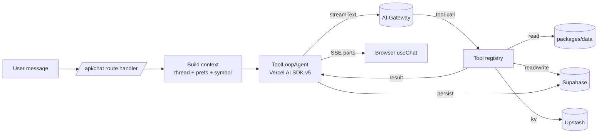

# 07 — AI Agent

> The agent is a **single tool-using LLM** with carefully scoped tools, a strong system prompt, and persistent memory. It is **not** a multi-agent crew — that adds latency and failure surface for no MVP benefit.

## High-level



## Model strategy

The agent picks a model **per turn** based on a domain classifier in
`packages/ai/src/routing.ts`. Each call to `streamText` sees one of:

| Domain | Default model | Env override | When |
| --- | --- | --- | --- |
| Fundamental | `google-vertex/gemini-2.5-pro` | `AI_FUNDAMENTAL_MODEL` | "why", "macro", news + events |
| Technical | `google-vertex/gemini-2.5-flash` | `AI_TECHNICAL_MODEL` | structure, indicators, levels, top-down |
| Summary | `google-vertex/gemini-2.5-flash` | `AI_SUMMARY_MODEL` | recap / list / "show me" |
| Vision | `google-vertex/gemini-2.5-pro` | `AI_VISION_MODEL` | image attached |
| Generic | `google-vertex/gemini-2.5-flash` | `AI_DEFAULT_MODEL` | everything else |
| Title | `google-vertex/gemini-2.5-flash-lite` | `AI_TITLE_MODEL` | first-turn auto-title |
| Embeddings | `openai/text-embedding-3-small` | `AI_EMBEDDING_MODEL` | news + memory index (1536-dim) |

The model resolver in `packages/ai/src/model.ts` accepts three transports:
direct Vertex AI, Vercel AI Gateway, or direct Google Gemini API. Set
`AI_GATEWAY_API_KEY` for gateway routing; set
`GOOGLE_VERTEX_PROJECT + GOOGLE_VERTEX_LOCATION + GOOGLE_APPLICATION_CREDENTIALS_JSON`
for Vertex AI; set `GOOGLE_GENERATIVE_AI_API_KEY` for direct Gemini.

The router writes a `routing_<domain>` row to `chat_telemetry` per turn so
spend can be broken down by domain on `/settings/usage` later.

## Tools (the agent's only side effects)

Every tool is defined with **zod input + zod output**, a one-line description,
and a matching React part in `apps/web/src/components/chat/parts/<name>.tsx`.
Tools live in `packages/ai/src/tools/`. The registry in
`apps/web/src/components/chat/parts/registry.tsx` is a typed map keyed on
`ToolName` — adding a tool to `TOOL_NAMES` without its UI part fails typecheck.

### Phase 1 — atomic data + mutating tools

| Tool                  | Output                   | UI part           |
| --------------------- | ------------------------ | ----------------- |
| `get_price`           | `Tick[]`                 | inline price chip |
| `get_candles`         | `Candle[]`               | mini chart card   |
| `get_indicators`      | `IndicatorResult[]`      | indicator panel   |
| `get_market_structure`| structure events JSON    | structure card    |
| `get_news`            | `ToolNewsItem[]`         | news list card    |
| `get_calendar`        | `EconomicEvent[]`        | calendar table    |
| `set_alert`           | `{ alertId }`            | alert receipt     |
| `log_journal`         | `{ entryId, summary }`   | journal receipt   |

### Phase 2 — composite + RAG + visual tools

| Tool                  | Output                   | UI part           |
| --------------------- | ------------------------ | ----------------- |
| `analyze_technical`   | per-tf reading + summary | analysis card     |
| `analyze_fundamental` | events + sentiment + summary | FA card       |
| `search_knowledge`    | top-K + similarity       | citations strip   |
| `annotate_chart`      | OverlaySet (markers + lines) | applied to chart |
| `get_journal_stats`   | global + per-symbol + per-tag breakdowns | stats card |

### Phase 3 — multimodal + breadth

| Tool                  | Output                   | UI part           |
| --------------------- | ------------------------ | ----------------- |
| `analyze_chart_image` | structured chart readout | analyse-image card |
| `get_correlation`     | 3×3 corr matrix + DXY proxy | corr card     |
| `get_cot`             | weekly CoT samples + net | cot card          |
| `share_snapshot`      | signed `/share/[id]?t=` URL | share card     |

### Phase 7b — risk + intermarket + memory tools

| Tool                       | Output                       | UI part                     |
| -------------------------- | ---------------------------- | --------------------------- |
| `compute_risk`             | size / RR / pip distances    | risk card                   |
| `get_session_levels`       | Asia / London / NY OHLC + forming flag | session-levels card |
| `get_intermarket`          | DXY pulse + XAU↔DXY corr + regime | intermarket card     |
| `forecast_volatility`      | ATR-based forward range      | forecast card               |
| `get_seasonality`          | monthly / weekday / hourly buckets | seasonality card      |
| `compute_position_health`  | live P/L per open trade      | position-health card        |
| `replay_setup`             | rule replay trades + stats   | replay card                 |
| `summarize_thread`         | synopsis + 3 insights, embedded | summary card             |

### Phase 7c — verification

| Tool          | Output                   | UI part           |
| ------------- | ------------------------ | ----------------- |
| `verify_call` | agree + caveats + nearest opposing liquidity | verify card |

### Why these are _separate_ tools

Composing them is the LLM's job. By keeping each tool atomic and single-purpose:

- They're cacheable behind the same `Cache` interface in `packages/data/src/cache/`.
- Their schemas are small enough for any model to use reliably.
- Each maps 1:1 to a route handler / DB read + a UI part — easy to test and visualise.
- The chat-part registry's typed map enforces parity at typecheck.

### Composite tools (`analyze_*`)

`analyze_technical` and `analyze_fundamental` exist because asking the model to call `get_candles` 6 times across timeframes adds tokens and latency. The composite tools run the orchestration in TS, returning a single rich object. The model receives this JSON and turns it into prose + decides which UI parts to render.

## Plan-then-act (Phase 7c)

For analytical turns (`routing.planRequired === true`, currently fundamental + technical) the agent runs `runPlanner()` BEFORE `streamText`. The planner uses the cheap summary model to produce JSON `{ steps[], expectedTools[], rationale }`. The plan is persisted as a sibling system message with a single `data-plan` UI part; the chat surface renders it as a collapsible "Thinking" pill above the assistant's answer. Trivial turns skip the planner. Failure falls back to a deterministic checklist; the chat UX never regresses on a planner side-effect bug.

## Verification (Phase 7c)

Two layers:

1. **`verify_call` tool** — invoked by the model after it names a directional setup. Re-checks (entry, stop, target) geometry and scans recent structure for the nearest opposing liquidity. Emits caveats inline with `agree: false`. The chat part renders a tone-warning card next to the answer; the user sees the call AND the caveats together.

2. **Citation enforcement** — post-finish heuristic in `packages/ai/src/verification.ts`. Scans the assistant's text for price-shaped tokens and macro event names; flags any that aren't backed by a tool call from the same turn AND don't carry an attribution clue. Emits a `data-citation-warning` part as a tone-muted footer pill. Stance is `'soft'` — false positives render quietly, never overshadow the answer.

## System prompt (canonical)

Lives in `packages/ai/src/prompts/system.md`. Key directives (paraphrased — the file itself is the source of truth):

1. You are a focused trading copilot for **only** XAUUSD, EURUSD, GBPUSD. Refuse other instruments politely and offer to talk in general terms instead.
2. Never invent prices or candle data — always call a tool.
3. Cite sources for any factual claim drawn from news or macro data.
4. State your time reference explicitly (e.g., "as of 2024-05-26 13:42 UTC").
5. Distinguish **bias** (multi-day) from **setup** (intraday). Always give an invalidation level.
6. Prefer concise structured answers on mobile; verbose only when asked.
7. Do not provide financial advice; provide _analysis_. Use language like "scenario", "if X then Y", not "you should buy".
8. If the user asks for an alert / journal / annotation, **do** call the tool — don't just describe it.
9. If a tool fails, surface the failure in plain language and offer alternatives.
10. Match the user's language; default to English.

## Memory model

Four layers (Phase 7a + 7b additions noted):

1. **Working memory** — the current thread (last N messages, default 30) sent to the model each turn.
2. **Rolling thread summary** (Phase 7a) — once a thread crosses 30 messages, `compactThread()` collapses the older portion into a single durable system note and keeps the last 12 verbatim. The summary is digest-keyed so it isn't recomputed every turn. Budget-guarded with a deterministic fallback.
3. **Thread metadata** — pinned symbol, user preferences (timezone, default model, indicator defaults), passed in the system context.
4. **Long-term retrieval** — `search_knowledge` over the unified retrieval surface:
   - `news_articles` + `news_embeddings` (pgvector cosine + Postgres FTS, fused via RRF)
   - `memory_embeddings` table with `kind` discriminator (`journal`, `briefing`, `thread_synopsis`)
   - Each row is similarity-ranked and time-decayed via `exp(-ln2 · age / halflifeDays)` (default 7d for news, 30d for memory rows)

Vector similarity uses cosine, top-k configurable (default 5). Hybrid retrieval combines dense + lexical signals so name-shaped queries ("FOMC minutes hawkish") work alongside thematic queries ("macro volatility tonight").

`rememberJournalEntry`, `rememberBriefing`, and `rememberThreadSynopsis` are best-effort fire-and-forget upserts called from journal CRUD, briefings cron, and the `summarize_thread` tool respectively.

## Context payload sent each turn

```ts
type ChatContext = {
  user: { id: string; tz: string; locale: string };
  thread: { id: string; pinnedSymbol?: Symbol; modelOverride?: string };
  prefs: {
    defaultIndicators: IndicatorRequest[];
    style: 'concise' | 'detailed';
  };
  liveSnapshot: {
    // small, fast — no tool call needed for ambient awareness
    prices: Record<Symbol, Tick>;
    session: 'asia' | 'london' | 'ny' | 'off';
    nextHighImpactEvent?: EconomicEvent;
  };
};
```

The snapshot is generated server-side in the route handler (cheap reads from the data layer) and inlined into the system prompt as a small JSON block. This dramatically reduces "what's the price?" tool calls.

## Streaming UI parts

Vercel AI SDK v5 supports custom message _parts_. Each tool maps to a part type, and a typed `partRegistry: { [K in ToolName]: ComponentType<ToolPartProps<K>> }` map enforces "one part per tool" at typecheck:

```ts
type ChatPart =
  | { type: 'text'; text: string }
  | { type: `tool-${ToolName}`; output: ToolOutput<T>; state: 'loading' | 'done' | 'error' }
  // Phase 7c — UI-only parts persisted into the message's `parts` JSON
  | { type: 'data-plan'; ... }                  // collapsible "Thinking" pill
  | { type: 'data-citation-warning'; ... }      // soft footer pill
  | { type: 'data-verify-warning'; ... };       // tone-warning card
```

The chat surface registers a renderer per `type` (`apps/web/src/components/chat/parts/<name>.tsx`). Per-tool zod schemas in `partSchemas` validate raw stream payloads before they hand off to a bespoke renderer; on parse failure we fall back to the generic `ToolCard` rather than crashing the chat surface.

## Refusals & guardrails

- Off-scope instruments → "I'm scoped to XAU/EUR/GBP only." Optionally answer in general terms.
- Order placement requests → explain we're read-only and offer to set an alert instead.
- Shilling / pump-and-dump style asks → refuse + redirect.
- Sensitive personal financial advice → reframe as scenario analysis.

The full refusal patterns live in `packages/ai/src/prompts/refusals.md`.

## Evaluation (manual + assertions)

Personal-mode keeps CI off — runs are local + manual.

Two prompt files in `packages/ai/src/eval/`:

- `prompts.json` — the original 10 acceptance prompts from `00-overview.md`. Run with `pnpm --filter ai eval -- --base-url ... --cookie ...`. Outputs a markdown report with TTFT, total ms, tool calls, and the streamed text.
- `cases.json` (Phase 7c) — extends each entry with `expectedTools` / `forbiddenTools` / `mustContainSubstrings`. Run with `pnpm --filter ai eval -- --cases ...`. The runner asserts each case and writes pass/fail rows into the report; non-zero exit on any failure or assertion violation.

Run either whenever:

- You change the system prompt.
- You add or modify a tool.
- You bump models.

`/settings/agent` exposes a live read of the per-tool telemetry table — invocations / failures / p50 / p95 over the last 24h — so you can spot regressions without re-running the eval.

## Cost / latency budgets

| Metric                                | Target                                                          |
| ------------------------------------- | --------------------------------------------------------------- |
| Avg input tokens / turn               | ≤ 4 000                                                         |
| Avg output tokens / turn              | ≤ 600                                                           |
| Avg tool calls / turn                 | 1.6                                                             |
| p50 first token                       | ≤ 800 ms                                                        |
| p95 first token                       | ≤ 2 000 ms                                                      |
| p95 full answer (with 2 tool calls)   | ≤ 6 000 ms                                                      |
| Cost / turn (flash-tier baseline)     | ≤ $0.005                                                        |
| Cost / turn (pro-tier — fundamental)  | ≤ $0.020                                                        |
| **Daily $ ceiling** (global)          | **$5** default — rejects new turns past it; resets UTC midnight |

Levers: domain routing (Phase 7a — pro only when fundamental analysis is needed), trim system prompt, prune thread via the rolling summary (Phase 7a), prefer composite tools, cache candle/news reads via the SWR `Cache` interface (Phase 7a).

## Why no agentic crew?

We considered LangGraph/Mastra-style multi-agent patterns. Rejected for MVP because:

- Latency multiplies (each hop = a model call).
- Debugging becomes opaque.
- The work splits cleanly into **deterministic tools + one model**, which is simpler and faster.

We can introduce sub-agents later for: weekly review writing, backtest narration, and watchlist scans.
