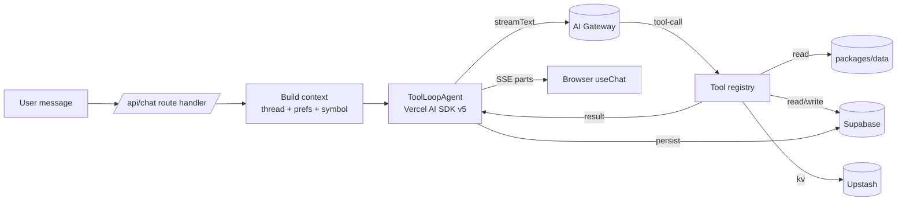

# 07 — AI Agent

> The agent is a **single tool-using LLM** with carefully scoped tools, a strong system prompt, and persistent memory. It is **not** a multi-agent crew — that adds latency and failure surface for no MVP benefit.

## High-level



## Model strategy

| Use case                        | Model (default)                    | Rationale                  |
| ------------------------------- | ---------------------------------- | -------------------------- |
| Main chat (TA + FA reasoning)   | `gpt-4.1` (or `claude-3.7-sonnet`) | Strong tool-use + context. |
| Quick replies / titles          | `gpt-4.1-mini` / `gemini-flash`    | Cheap.                     |
| Embeddings                      | `text-embedding-3-small`           | Cheap, good for news.      |
| Vision (chart screenshot in v2) | `gpt-4.1` / `claude-3.7-sonnet`    | Multimodal.                |

All routed via **Vercel AI Gateway** so swapping is one env variable.

## Tools (the agent's only side effects)

Every tool is defined with **zod input + zod output**, a one-line description, and a `render` hint for the UI part. Tools live in `packages/ai/src/tools/`.

| Tool                  | Input (zod)                                  | Output                   | UI part           |
| --------------------- | -------------------------------------------- | ------------------------ | ----------------- |
| `get_price`           | `{ symbols: Symbol[] }`                      | `Tick[]`                 | inline price chip |
| `get_candles`         | `{ symbol, tf, limit?, end? }`               | `Candle[]`               | mini chart card   |
| `get_indicators`      | `{ symbol, tf, indicators: IndicatorReq[] }` | `IndicatorResult[]`      | indicator panel   |
| `get_news`            | `{ symbol?, since?, limit?, query? }`        | `NewsArticle[]`          | news list card    |
| `get_calendar`        | `{ from, to, currencies?, importance? }`     | `EconomicEvent[]`        | calendar table    |
| `analyze_technical`   | `{ symbol, tfs: Timeframe[], style? }`       | structured analysis JSON | analysis report   |
| `analyze_fundamental` | `{ symbol, horizon? }`                       | structured analysis JSON | analysis report   |
| `search_knowledge`    | `{ query, k?, filter? }`                     | `RetrievedChunk[]`       | citations strip   |
| `annotate_chart`      | `{ symbol, tf, items: Annotation[] }`        | `{ annotationId }`       | applied to chart  |
| `set_alert`           | `{ rule: AlertRule, channel? }`              | `{ alertId }`            | alert receipt     |
| `log_journal`         | `{ entry: JournalEntry }`                    | `{ entryId }`            | journal receipt   |
| `get_journal_stats`   | `{ from?, to?, symbol? }`                    | `JournalStats`           | stats card        |

### Why these are _separate_ tools

Composing them is the LLM's job. By keeping each tool atomic and single-purpose:

- They're cacheable in Redis with simple keys.
- Their schemas are small enough for any model to use reliably.
- Each maps 1:1 to a route handler + a UI part — easy to test and visualise.

### Composite tools (`analyze_*`)

`analyze_technical` and `analyze_fundamental` exist because asking the model to call `get_candles` 6 times across timeframes adds tokens and latency. The composite tools run the orchestration in TS, returning a single rich object:

```ts
type TechnicalAnalysis = {
  symbol: Symbol;
  asOf: number;
  bias: 'bullish' | 'bearish' | 'neutral';
  confidence: number; // 0..1
  byTimeframe: Array<{
    tf: Timeframe;
    structure: 'uptrend' | 'downtrend' | 'range';
    keyLevels: { support: number[]; resistance: number[] };
    indicators: {
      rsi?: number;
      ema50?: number;
      ema200?: number;
      macd?: { hist: number; signal: number };
    };
    pattern?: string | null;
    notes: string;
  }>;
  invalidations: number[];
  scenarios: Array<{ if: string; then: string; probability: number }>;
};
```

The model receives this JSON and turns it into prose + decides which UI parts to render.

## System prompt (canonical)

Lives in `packages/ai/src/prompts/system.md`. Key directives (paraphrased — the file itself is the source of truth):

1. You are a focused trading copilot for **only** XAUUSD, EURUSD, GBPUSD. Refuse other instruments politely and offer to talk in general terms instead.
2. Never invent prices or candle data — always call a tool.
3. Cite sources for any factual claim drawn from news or macro data.
4. State your time reference explicitly (e.g., "as of 2024-05-26 13:42 UTC").
5. Distinguish **bias** (multi-day) from **setup** (intraday). Always give an invalidation level.
6. Prefer concise structured answers on mobile; verbose only when asked.
7. Do not provide financial advice; provide _analysis_. Use language like "scenario", "if X then Y", not "you should buy".
8. If the user asks for an alert / journal / annotation, **do** call the tool — don't just describe it.
9. If a tool fails, surface the failure in plain language and offer alternatives.
10. Match the user's language; default to English.

## Memory model

Three layers:

1. **Working memory** — the current thread (last N messages, default 30) sent to the model each turn.
2. **Thread metadata** — pinned symbol, user preferences (timezone, default model, indicator defaults), passed in the system context.
3. **Long-term retrieval** — `search_knowledge` over:
   - `news_articles` (pgvector embeddings)
   - `journal_entries` (per-user)
   - `saved_analyses` (per-user, when the user clicks "save this analysis")

Vector similarity uses cosine, top-k = 6 default.

## Context payload sent each turn

```ts
type ChatContext = {
  user: { id: string; tz: string; locale: string };
  thread: { id: string; pinnedSymbol?: Symbol; modelOverride?: string };
  prefs: {
    defaultIndicators: IndicatorRequest[];
    style: 'concise' | 'detailed';
  };
  liveSnapshot: {
    // small, fast — no tool call needed for ambient awareness
    prices: Record<Symbol, Tick>;
    session: 'asia' | 'london' | 'ny' | 'off';
    nextHighImpactEvent?: EconomicEvent;
  };
};
```

The snapshot is generated server-side in the route handler (cheap reads from Redis) and inlined into the system prompt as a small JSON block. This dramatically reduces "what's the price?" tool calls.

## Streaming UI parts

Vercel AI SDK v5 supports custom message _parts_. Each tool maps to a part type:

```ts
type ChatPart =
  | { type: "text"; text: string }
  | { type: "tool-get_candles"; data: ToolOutput<"get_candles">; state: "loading" | "done" | "error" }
  | { type: "tool-get_news"; ... }
  | { type: "tool-set_alert"; ... }
  | { type: "tool-annotate_chart"; ... }
  /* ... one per tool */;
```

The chat surface registers a renderer per `type` (`apps/web/src/components/chat/parts/<name>.tsx`).

## Refusals & guardrails

- Off-scope instruments → "I'm scoped to XAU/EUR/GBP only." Optionally answer in general terms.
- Order placement requests → explain we're read-only and offer to set an alert instead.
- Shilling / pump-and-dump style asks → refuse + redirect.
- Sensitive personal financial advice → reframe as scenario analysis.

The full refusal patterns live in `packages/ai/src/prompts/refusals.md`.

## Evaluation (manual)

Personal-mode keeps this simple. `packages/ai/src/eval/prompts.json` holds the 10 acceptance prompts from `00-overview.md`. A small `pnpm --filter ai eval` script runs them sequentially against the local dev server and prints the model's responses, tool calls, and timings. **You** read the output and judge — no LLM-as-judge in CI.

Run it whenever:

- You change the system prompt.
- You add or modify a tool.
- You bump models.

## Cost / latency budgets

| Metric                              | Target                                                          |
| ----------------------------------- | --------------------------------------------------------------- |
| Avg input tokens / turn             | ≤ 4 000                                                         |
| Avg output tokens / turn            | ≤ 600                                                           |
| Avg tool calls / turn               | 1.6                                                             |
| p50 first token                     | ≤ 800 ms                                                        |
| p95 first token                     | ≤ 2 000 ms                                                      |
| p95 full answer (with 2 tool calls) | ≤ 6 000 ms                                                      |
| Cost / turn (gpt-4.1 baseline)      | ≤ $0.012                                                        |
| **Daily $ ceiling** (global)        | **$5** default — rejects new turns past it; resets UTC midnight |

Levers: trim system prompt, prune thread, prefer composite tools, cache candle/news reads.

## Why no agentic crew?

We considered LangGraph/Mastra-style multi-agent patterns. Rejected for MVP because:

- Latency multiplies (each hop = a model call).
- Debugging becomes opaque.
- The work splits cleanly into **deterministic tools + one model**, which is simpler and faster.

We can introduce sub-agents later for: weekly review writing, backtest narration, and watchlist scans.
