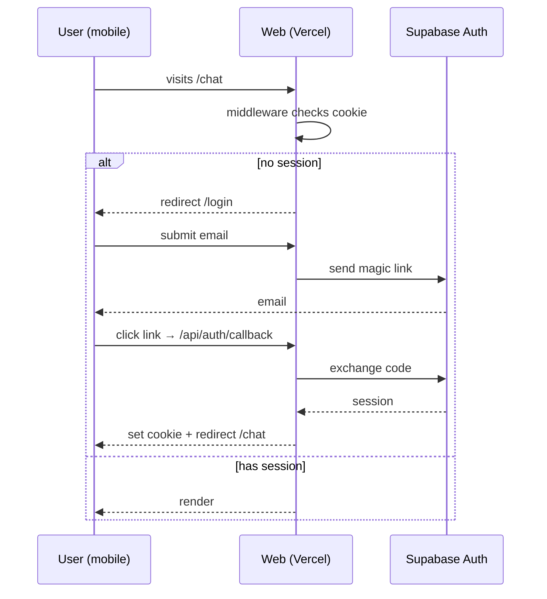
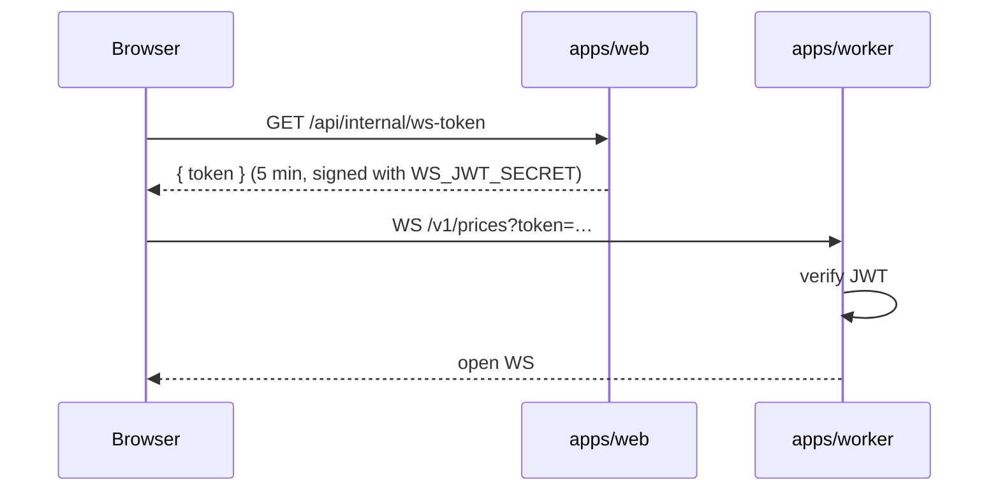

# 08 — Backend & API

## Two services, one type system

| Service       | Where        | Runtime         | Purpose                                                            |
| ------------- | ------------ | --------------- | ------------------------------------------------------------------ |
| `apps/web`    | Vercel       | Edge + Node     | UI + auth + chat streaming + light data proxy                      |
| `apps/worker` | Fly.io / Railway | Node 20 (long-running) | Upstream WS, news/calendar cron, heavy compute, push delivery |

They share types via `packages/shared` and the same Drizzle DB schema in `packages/db`.

## `apps/web` route map

All routes under `/api/*` are POST/GET as appropriate, return JSON or SSE, and are protected by auth + rate-limit middleware (see `12-security-and-config.md`).

### Auth & user

| Route                          | Method | Runtime | Purpose                       |
| ------------------------------ | ------ | ------- | ----------------------------- |
| `/api/auth/[...]`              | *      | Edge    | Supabase Auth callback / OAuth |
| `/api/me`                      | GET    | Edge    | Current user + prefs          |
| `/api/me/prefs`                | PATCH  | Edge    | Update prefs                  |

### Chat

| Route                          | Method | Runtime | Purpose                                  |
| ------------------------------ | ------ | ------- | ---------------------------------------- |
| `/api/chat`                    | POST   | Node    | Streaming chat with tool-loop agent (SSE) |
| `/api/chat/threads`            | GET    | Edge    | List user threads                        |
| `/api/chat/threads`            | POST   | Edge    | Create new thread                        |
| `/api/chat/threads/[id]`       | GET    | Edge    | Load thread + messages                   |
| `/api/chat/threads/[id]`       | DELETE | Edge    | Delete thread                            |
| `/api/chat/threads/[id]/title` | POST   | Node    | Auto-title (cheap LLM call)              |

> `POST /api/chat` runs in the **Node** runtime because the agent's tools include DB and Redis access patterns that can be heavy; using Node also gives us Sentry-style instrumentation more easily. Streaming still works.

### Market data (proxy + cache)

| Route                          | Method | Runtime | Purpose                                  |
| ------------------------------ | ------ | ------- | ---------------------------------------- |
| `/api/market/price`            | GET    | Edge    | `?symbols=XAUUSD,EURUSD` → `Tick[]`      |
| `/api/market/candles`          | GET    | Edge    | `?symbol=&tf=&limit=` → `Candle[]`       |
| `/api/market/indicators`       | POST   | Edge    | Compute indicators on a candle window    |
| `/api/market/snapshot`         | GET    | Edge    | One-shot bias + key levels per symbol    |

These routes:

1. Validate input with zod.
2. Hit Upstash cache.
3. On miss, call `packages/data` adapters (which apply failover).
4. Return DTOs from `packages/shared`.

### News & calendar

| Route                          | Method | Runtime | Purpose                                           |
| ------------------------------ | ------ | ------- | ------------------------------------------------- |
| `/api/news`                    | GET    | Edge    | `?symbol=&limit=&since=` → `NewsArticle[]`        |
| `/api/news/[id]`               | GET    | Edge    | Article detail (no full body — link out)          |
| `/api/calendar`                | GET    | Edge    | `?from=&to=&importance=` → `EconomicEvent[]`      |

### Alerts & journal

| Route                          | Method | Runtime | Purpose         |
| ------------------------------ | ------ | ------- | --------------- |
| `/api/alerts`                  | GET    | Edge    | List user alerts |
| `/api/alerts`                  | POST   | Edge    | Create alert    |
| `/api/alerts/[id]`             | DELETE | Edge    | Remove alert    |
| `/api/journal`                 | GET    | Edge    | List entries    |
| `/api/journal`                 | POST   | Edge    | Create entry    |
| `/api/journal/[id]`            | PATCH  | Edge    | Edit entry      |
| `/api/journal/[id]`            | DELETE | Edge    | Remove entry    |
| `/api/journal/stats`           | GET    | Edge    | Aggregated stats |

### Internal / web→worker

| Route                          | Method | Runtime | Purpose                                          |
| ------------------------------ | ------ | ------- | ------------------------------------------------ |
| `/api/internal/push/test`      | POST   | Node    | Used by tests; signed with `INTERNAL_HMAC_KEY`   |

## `apps/worker` route map

Hono app, mounted at `/v1`.

| Route                  | Method | Purpose                                                 |
| ---------------------- | ------ | ------------------------------------------------------- |
| `/v1/health`           | GET    | Liveness                                                |
| `/v1/ready`            | GET    | DB + Redis + upstream WS health                         |
| `/v1/prices`           | WS     | Browser subscribes; receives normalised tick stream     |
| `/v1/news`             | WS     | (optional) live news ticker                             |
| `/v1/internal/eval-alerts` | POST | Internal — re-run alert evaluator (cron triggers this)  |
| `/v1/internal/ingest/news` | POST | Internal — manual reingest news for a window           |
| `/v1/internal/ingest/calendar` | POST | Internal — manual reingest calendar                |

### Cron schedule

| Job                        | Cadence       | Implementation                                  |
| -------------------------- | ------------- | ----------------------------------------------- |
| News poll (primary)        | every 2 min   | `node-cron` inside worker                       |
| News poll (fallback)       | every 5 min   |                                                 |
| Calendar refresh           | every 5 min   |                                                 |
| Daily snapshot (HLOC, levels) | 23:55 UTC | Stores per-symbol per-day pivot/levels          |
| Alert evaluator            | every 30 s    | Reads cached prices, evaluates rules, fires push |
| Embedding backfill         | hourly        | Embeds any rows missing vectors                 |
| Stale cache GC             | hourly        | Sanity                                          |

## Auth flow



## Authorization (worker)

Browser↔worker WS uses a short-lived JWT minted by `apps/web` (`/api/internal/ws-token`) and verified by the worker.



## Idempotency

Mutating routes (`/api/alerts`, `/api/journal`) accept an `Idempotency-Key` header (UUID v4, generated client-side). The server keys the write on `(user_id, idempotency_key)` to deduplicate.

## Error envelope

All API errors return:

```json
{
  "error": {
    "code": "RATE_LIMITED" | "PROVIDER_UNAVAILABLE" | "VALIDATION" | "AUTH" | "NOT_FOUND" | "INTERNAL",
    "message": "Human-readable",
    "details": { "...optional zod issues..." },
    "traceId": "01J..."
  }
}
```

Status codes: 400 (validation), 401 (auth), 403 (forbidden), 404, 429 (rate limited), 503 (provider), 500 (internal).

## OpenAPI sketch

We will publish an OpenAPI document at `/api/openapi.json` for the public-shaped routes. It is generated from zod schemas via `@asteasolutions/zod-to-openapi`. This is what the AI agent's `analyze_*` tools rely on for self-documenting types.

## Performance targets

| Endpoint                       | p50      | p95      |
| ------------------------------ | -------- | -------- |
| `GET /api/market/price`        | < 80 ms  | < 250 ms |
| `GET /api/market/candles` (cached) | < 120 ms | < 350 ms |
| `GET /api/market/candles` (cold)   | < 600 ms | < 1500 ms |
| `POST /api/chat` first token   | < 800 ms | < 2000 ms |
| `WS /v1/prices` tick fan-out latency | < 80 ms | < 200 ms |
