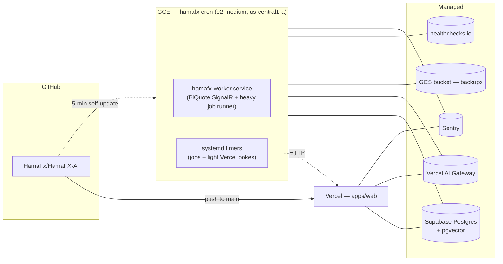

# 09 — Deployment

> **For local development:** see the [Quickstart section in README](../README.md#quickstart)
> — zero-config native (`pnpm dev:local`) or one-command Docker (`docker compose up`).
> This document covers production cloud deployment only.

## Topology

Two deployments, one user, one push-to-main pipeline.



The web app is one Vercel deploy and the worker is one VM. Both pull from the same `main` branch. Vercel rebuilds on push; the VM's `hamafx-update.timer` pulls and rebuilds every 5 minutes.

## Vercel project

- **Project**: `hama-fx-ai` (linked to the monorepo, `Root Directory = apps/web`).
- **Build command**: handled by Turborepo: `turbo run build --filter=web...`.
- **Install command**: `pnpm install --frozen-lockfile`.
- **Output**: standard Next.js.
- **Node**: 20.x.
- **Regions**: primary `iad1`; `/api/chat` runs Node, light reads run Edge.
- **Deployment Protection**: not used (we do our own password gate).
- **Environments**: `Production` (`main`), `Preview` (PRs), `Development` (local).

### `vercel.json`

```json
{
  "buildCommand": "pnpm dlx turbo run build --filter=web...",
  "framework": "nextjs",
  "installCommand": "pnpm install --frozen-lockfile",
  "ignoreCommand": "npx turbo-ignore web",
  "functions": {
    "src/app/api/chat/route.ts": { "maxDuration": 60 },
    "src/app/api/cron/news/route.ts": { "maxDuration": 60 },
    "src/app/api/cron/calendar/route.ts": { "maxDuration": 30 },
    "src/app/api/cron/alerts/route.ts": { "maxDuration": 15 },
    "src/app/api/cron/snapshots/route.ts": { "maxDuration": 30 }
  }
}
```

We do **not** ship a `crons` block in `vercel.json` — Vercel Hobby caps cron at once-per-day, and we run sub-5-minute cadences. Scheduling lives on the VM (see below).

### Edge vs Node runtime

- Default runtime: **Edge** for the cheap reads (`/api/market/*`, `/api/news`, `/api/calendar`, `/api/alerts`, `/api/journal`).
- **Node** runtime for `/api/chat` (longer streaming, heavier deps), `/api/cron/*`, and any route that touches `getDb()` (postgres-js doesn't run on Edge).

## VM project

- **Instance**: `hamafx-cron` (`e2-medium`, `us-central1-a`, project `hamafx-78845`, Ubuntu 24.04 LTS, 10 GB pd-standard).
- **System user**: `hamafx` (system, `nologin`, owns `/opt/hamafx`).
- **Always-on**: `hamafx-worker.service` — `Type=simple`, restarts on failure with backoff.
- **Timers**: 14 oneshot units in `infra/cron-vm/units/`. See `infra/cron-vm/README.md` for the schedule table.
- **Self-update**: `hamafx-update.timer` runs every 5 min — `git pull`, `pnpm install --frozen-lockfile`, `pnpm --filter @hamafx/worker build`, then `systemctl restart hamafx-worker.service` if the SHA changed. The hamafx user has a sudoers entry for that one restart only.
- **Cost**: ~$8/mo (`e2-medium` standard, no sustained-use discount applied).

Bootstrap is `infra/cron-vm/setup.sh` (drops every unit into `/etc/systemd/system/`, enables timers, masks the legacy `cron` daemon, installs sudoers, points logrotate at `/var/log/hamafx-cron.log`). One-off provisioning is `infra/cron-vm/_provision.sh`. Recovery is `infra/cron-vm/RECOVERY.md` — five concrete scenarios with paste-ready commands.

## Domains

Whatever apex you want — the password gate handles "no public access" anyway. Production currently lives at `hama-fx-ai.vercel.app`.

## Environment variables

`.env.example` is the source of truth. Vercel envs mirror it for the web app; the VM has its own `/opt/hamafx/.env` that mirrors a subset (worker doesn't need PWA / NEXT_PUBLIC_*).

```
# --- App ---
NEXT_PUBLIC_APP_URL=https://hama-fx-ai.vercel.app
PRODUCTION_URL=https://hama-fx-ai.vercel.app                 # VM only — what the light crons curl

# --- Auth (personal mode) ---
APP_PASSWORD=                    # the single password you'll type
AUTH_COOKIE_SECRET=              # random 32+ byte hex; HMAC for the cookie
CRON_SECRET=                     # set on Vercel + on VM; used for /api/cron/* bearer

# --- Supabase (DB only — we don't use Supabase Auth) ---
DATABASE_URL=                    # Supabase pooler (transaction mode)
POSTGRES_URL=                    # alias accepted by the worker (Supabase Vercel integration ships this name)
SUPABASE_URL=                    # for direct REST if ever needed
SUPABASE_SERVICE_ROLE_KEY=

# --- AI (Vercel AI Gateway) ---
AI_GATEWAY_API_KEY=
AI_DEFAULT_MODEL=google-vertex/gemini-2.5-flash
AI_TITLE_MODEL=google-vertex/gemini-2.5-flash-lite
AI_EMBEDDING_MODEL=openai/text-embedding-3-small
AI_VISION_MODEL=google-vertex/gemini-2.5-pro

# --- AI domain-routed models (Phase 7a) ---
AI_FUNDAMENTAL_MODEL=google-vertex/gemini-2.5-pro
AI_TECHNICAL_MODEL=google-vertex/gemini-2.5-flash
AI_SUMMARY_MODEL=google-vertex/gemini-2.5-flash

# --- Direct Google Vertex (optional — bypasses the gateway) ---
GOOGLE_VERTEX_PROJECT=
GOOGLE_VERTEX_LOCATION=
GOOGLE_APPLICATION_CREDENTIALS_JSON=

# --- Data providers ---
BIQUOTE_BASE_URL=https://biquote.io          # primary FX + XAU REST
BIQUOTE_HUB_URL=https://biquote.io/hubs/tick # SignalR endpoint
FINNHUB_API_KEY=                             # fallback FX + news
ALPHAVANTAGE_API_KEY=                        # backup historical
MARKETAUX_API_KEY=                           # primary news
TRADING_ECONOMICS_KEY=                       # macro calendar (optional)
FRED_API_KEY=                                # FRED actuals backfill

# --- Optional: Telegram alerts ---
TELEGRAM_BOT_TOKEN=
TELEGRAM_CHAT_ID=

# --- Web Push (server-side keys) ---
VAPID_PUBLIC_KEY=
VAPID_PRIVATE_KEY=
VAPID_SUBJECT=

# --- Observability ---
SENTRY_DSN=                                  # server-side; same value used as NEXT_PUBLIC_SENTRY_DSN

# --- VM-only ---
GCS_BACKUP_BUCKET=hamafx-backups-hamafx-78845
DEPLOYED_SHA=                                # written by update.sh after each pull
HC_SIGNALR_UUID=
HC_UPDATE_UUID=
HC_LIGHT_NEWS_UUID=
HC_LIGHT_CALENDAR_UUID=
HC_LIGHT_ALERTS_UUID=
HC_LIGHT_WARM_CACHE_UUID=
HC_JOB_BRIEFINGS_UUID=
HC_JOB_COT_UUID=
HC_JOB_EMBEDDING_BACKFILL_UUID=
HC_JOB_FRED_ACTUALS_UUID=
HC_JOB_SNAPSHOTS_UUID=
HC_JOB_WEEKLY_REVIEW_UUID=
HC_BACKUP_DB_UUID=
HC_BACKUP_JOURNAL_UUID=
HC_VERIFY_RESTORE_UUID=
```

`packages/shared/src/env.ts` exports `envSchema` (zod) used at boot. `apps/worker/src/env.ts` validates the worker subset. Boot fails fast on missing/invalid envs.

### Generating secrets

```bash
# AUTH_COOKIE_SECRET
node -e "console.log(require('crypto').randomBytes(32).toString('hex'))"

# CRON_SECRET — must match between Vercel and /opt/hamafx/.env
node -e "console.log(require('crypto').randomBytes(24).toString('hex'))"
```

### Seeding the VM

`/opt/hamafx/.env` should be hand-written from a secure paste, mode `600`, owned by `hamafx`. Vercel CLI's `vercel env pull` redacts encrypted values, so you can't migrate them automatically — paste from the Vercel dashboard instead. `infra/cron-vm/RECOVERY.md` § Pre-flight has the full list.

## CI

`.github/workflows/ci.yml` runs `pnpm turbo run lint typecheck test` on every PR + push to main. **No deploy step**; Vercel handles that. The legacy `.github/workflows/cron-*.yml` files were retired in Phase 8 PR-21 — every cron is now a systemd timer on the VM.

## Supabase setup (one-time)

1. Create a Supabase project (Free tier).
2. Enable `pgvector`:
   ```sql
   create extension if not exists vector;
   ```
3. Copy the **pooler** connection string (Transaction mode) from Project Settings → Database → "Connection pooling". That goes into `DATABASE_URL` (and `POSTGRES_URL`).
4. We do **not** enable Supabase Auth — leave it unconfigured.
5. We do **not** enable RLS — there's only one user, our own server.

> Supabase Free tier pauses a project after 7 days of _no activity_. With the worker hitting the DB every second and the timers firing every few minutes, this never triggers. If you ever take a long break, manually unpause from the dashboard.

## GCS setup (Phase 8)

1. Create the backup bucket: `gs://hamafx-backups-${PROJECT_ID}` (us-central1, standard storage class).
2. Set lifecycle policy: delete after 30 days for `db/`, 90 days for `journal/`, 7 days for `verify/`.
3. Grant the VM's service account `roles/storage.objectAdmin` on the bucket.
4. Set `GCS_BACKUP_BUCKET=hamafx-backups-${PROJECT_ID}` on the VM.

## Database migrations

- Schema lives in `packages/db/src/schema/*.ts`.
- `pnpm --filter db migrate:gen` creates SQL.
- `pnpm --filter db migrate:apply` runs against `DATABASE_URL`.
- Run migrations locally before deploying. CI doesn't run them automatically (personal-mode trade-off; safer this way for a single-user repo).

## Logging & monitoring

- **Web logs**: Vercel function logs.
- **Worker logs**: `sudo journalctl -u hamafx-worker.service` (or any heavy/light unit). JSON-structured with a `commit` field tagging the deployed SHA.
- **Healthchecks.io**: every heartbeat / job emits a `start` + `success`/`fail` ping. A stale check pages immediately.
- **Sentry**: server-side errors from both `apps/web` and `apps/worker` flow into the same project. The worker's heavy-job runner adds `{ job: <name> }` to every event.
- **Cost telemetry**: `chat_telemetry` table → `/settings/usage` UI.

If something feels slow or expensive, look at Vercel function logs + `chat_telemetry` first, then `journalctl` on the VM, then healthchecks.io for "what stopped firing".

## Rollback

- **Web**: instant via Vercel "Rollback to deployment" in the dashboard.
- **VM**: `hamafx-update.timer` pulls every 5 min. To pin to an older commit:
  ```bash
  sudo systemctl mask hamafx-update.timer  # stop the auto-update
  sudo -u hamafx git -C /opt/hamafx/app fetch origin
  sudo -u hamafx git -C /opt/hamafx/app reset --hard <good-sha>
  sudo -u hamafx pnpm -C /opt/hamafx/app install --frozen-lockfile
  sudo -u hamafx pnpm -C /opt/hamafx/app --filter @hamafx/worker build
  echo <good-sha> | sudo tee /opt/hamafx/.deployed-sha
  sudo systemctl restart hamafx-worker.service
  ```
  Then push the fix to `main` and unmask the timer.
- **DB**: forward-only migrations. For emergencies, restore from the latest GCS backup per `infra/cron-vm/RECOVERY.md` § Scenario 1.

## Cost ceiling (your own usage)

| Component                | Estimate / month |
| ------------------------ | ---------------- |
| Vercel Hobby             | $0               |
| GCE `e2-medium` VM       | ~$8              |
| GCS backup storage       | $0–$1            |
| Supabase Free            | $0               |
| Data providers           | $0 (BiQuote + Finnhub free tiers cover it) |
| AI Gateway / models      | $3–$15 (your usage) |
| Sentry / healthchecks.io | $0 (free tiers)  |
| **Total**                | **$11–$25 / month** |

Designed so a hobby personal run sits comfortably under $25/mo.
