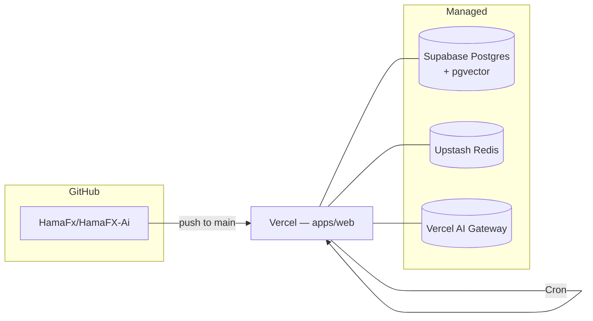

# 09 — Deployment

## Topology

Single Vercel deploy + three managed services.



## Vercel project

- **Project**: `hamafx-ai` linked to the monorepo, `Root Directory = apps/web`.
- **Build command**: handled by Turborepo: `turbo run build --filter=web...`.
- **Install command**: `pnpm install --frozen-lockfile`.
- **Output**: standard Next.js.
- **Node**: 20.x.
- **Regions**: primary `iad1`; route handlers run on Edge by default, `/api/chat` runs Node.
- **Deployment Protection**: not used (we do our own password gate).
- **Environments**:
  - `Production`: `main`
  - `Preview`: every PR
  - `Development`: local

### `vercel.json`

```json
{
  "buildCommand": "pnpm dlx turbo run build --filter=web...",
  "framework": "nextjs",
  "installCommand": "pnpm install --frozen-lockfile",
  "ignoreCommand": "npx turbo-ignore web",
  "functions": {
    "src/app/api/chat/route.ts": { "maxDuration": 60 },
    "src/app/api/cron/news/route.ts": { "maxDuration": 60 },
    "src/app/api/cron/calendar/route.ts": { "maxDuration": 30 },
    "src/app/api/cron/alerts/route.ts": { "maxDuration": 15 },
    "src/app/api/cron/snapshots/route.ts": { "maxDuration": 30 }
  },
  "crons": [
    { "path": "/api/cron/news", "schedule": "*/5 * * * *" },
    { "path": "/api/cron/calendar", "schedule": "*/15 * * * *" },
    { "path": "/api/cron/alerts", "schedule": "* * * * *" },
    { "path": "/api/cron/snapshots", "schedule": "55 23 * * *" },
    { "path": "/api/cron/embedding-backfill", "schedule": "0 * * * *" }
  ]
}
```

> The 1-minute alert cron requires Vercel Pro. On Hobby, change to `*/2 * * * *` or larger.

### Edge vs Node runtime

- Default runtime: **Edge** for the cheap reads (`/api/market/*`, `/api/news`, `/api/calendar`, `/api/alerts`, `/api/journal`).
- **Node** runtime for `/api/chat` (longer streaming, heavier deps) and any cron that does embeddings.

## Domains

Whatever apex you want — the password gate handles "no public access" anyway. Suggested:

- `hamafx.you.dev` (or your apex of choice)

## Environment variables

`.env.example` is the source of truth. Vercel envs mirror it.

```
# --- App ---
NEXT_PUBLIC_APP_URL=https://hamafx.you.dev

# --- Auth (personal mode) ---
APP_PASSWORD=                    # the single password you'll type
AUTH_COOKIE_SECRET=              # random 32+ byte hex; HMAC for the cookie
CRON_SECRET=                     # Vercel-provided; verifies cron requests

# --- Supabase (DB only — we don't use Supabase Auth) ---
DATABASE_URL=                    # Supabase pooler connection string (used by Drizzle)
SUPABASE_URL=                    # for direct REST if ever needed
SUPABASE_SERVICE_ROLE_KEY=       # admin key — server-only

# --- AI (Vercel AI Gateway) ---
AI_GATEWAY_API_KEY=
AI_DEFAULT_MODEL=google-vertex/gemini-2.5-flash
AI_TITLE_MODEL=google-vertex/gemini-2.5-flash-lite
AI_EMBEDDING_MODEL=openai/text-embedding-3-small
AI_VISION_MODEL=google-vertex/gemini-2.5-pro

# --- AI domain-routed models (Phase 7a) ---
AI_FUNDAMENTAL_MODEL=google-vertex/gemini-3-pro
AI_TECHNICAL_MODEL=google-vertex/gemini-3-flash
AI_SUMMARY_MODEL=google-vertex/gemini-2.5-flash

# --- Cache ---
UPSTASH_REDIS_REST_URL=
UPSTASH_REDIS_REST_TOKEN=

# --- Data providers ---
TWELVEDATA_API_KEY=
FINNHUB_API_KEY=
ALPHAVANTAGE_API_KEY=
MARKETAUX_API_KEY=
TRADING_ECONOMICS_KEY=
FRED_API_KEY=

# --- Optional: Telegram alerts (v1) ---
TELEGRAM_BOT_TOKEN=
TELEGRAM_CHAT_ID=
```

`packages/shared/src/env.ts` exports `envSchema` (zod) used at boot. Boot fails fast on missing/invalid envs.

### Generating secrets

```bash
# AUTH_COOKIE_SECRET
node -e "console.log(require('crypto').randomBytes(32).toString('hex'))"
```

`CRON_SECRET` is set automatically by Vercel when you enable Cron.

## CI

Personal-mode keeps it minimal. `.github/workflows/ci.yml`:

```yaml
name: ci
on: { pull_request: {}, push: { branches: [main] } }
jobs:
  check:
    runs-on: ubuntu-latest
    steps:
      - uses: actions/checkout@v4
      - uses: pnpm/action-setup@v4
        with: { version: 9 }
      - uses: actions/setup-node@v4
        with: { node-version: 20, cache: pnpm }
      - run: pnpm install --frozen-lockfile
      - run: pnpm turbo run lint typecheck test
```

Vercel handles the actual build + deploy on every push. No GitHub Actions deploy step.

## Supabase setup (one-time)

1. Create a new Supabase project (Free tier).
2. Enable `pgvector`:

   ```sql
   create extension if not exists vector;
   ```

3. Take the **pooler** connection string from Project Settings → Database → "Connection pooling" → URI mode = `transaction`. That goes into `DATABASE_URL`.
4. We do **not** enable Supabase Auth — leave it unconfigured.
5. We do **not** enable RLS — there's only one user, our own server.
6. Set up a daily logical backup if you want extra safety (optional; Supabase keeps daily backups on its side too).

> Supabase Free tier pauses a project after 7 days of _no activity_. With cron running every 1–15 min this never triggers, but if you ever take a break for a week, you'll need to manually unpause from the dashboard.

## Upstash setup (one-time)

1. Create a Redis database (Free tier; 10k commands/day, 256 MB).
2. Copy `UPSTASH_REDIS_REST_URL` + `UPSTASH_REDIS_REST_TOKEN` into Vercel.
3. That's it.

## Database migrations

- Schema lives in `packages/db/src/schema/*.ts`.
- `pnpm --filter db migrate:gen` creates SQL.
- `pnpm --filter db migrate:apply` runs against `DATABASE_URL`.
- Run migrations locally before deploying. CI doesn't run them automatically (personal-mode trade-off; safer this way for a single-user repo).

## Logging & monitoring

- **Vercel logs** are the only sink at MVP.
- Server code uses `console.log({ level: 'info', msg, ...meta })` — Vercel parses JSON nicely.
- We track AI usage in a `chat_telemetry` table; the `/settings/usage` page reads it.
- If something feels slow or expensive, look at Vercel function logs and the `chat_telemetry` table.

## Rollback

- Vercel: instant via "Rollback to deployment" in the dashboard.
- DB: forward-only migrations; for emergencies a "shadow migration" is added rather than reverting.

## Cost ceiling (your own usage)

| Component             | Estimate / month                                    |
| --------------------- | --------------------------------------------------- |
| Vercel (Hobby or Pro) | $0 (Hobby) – $20 (Pro, if needed for cron cadence)  |
| Supabase Free         | $0                                                  |
| Upstash Redis Free    | $0                                                  |
| Data providers        | $0–$10 (free tiers + Twelve Data starter if needed) |
| AI Gateway / models   | $3–$15 (your usage)                                 |
| **Total**             | **$3–$45 / month**                                  |

Designed so a hobby personal run sits comfortably under $20/mo most months.
