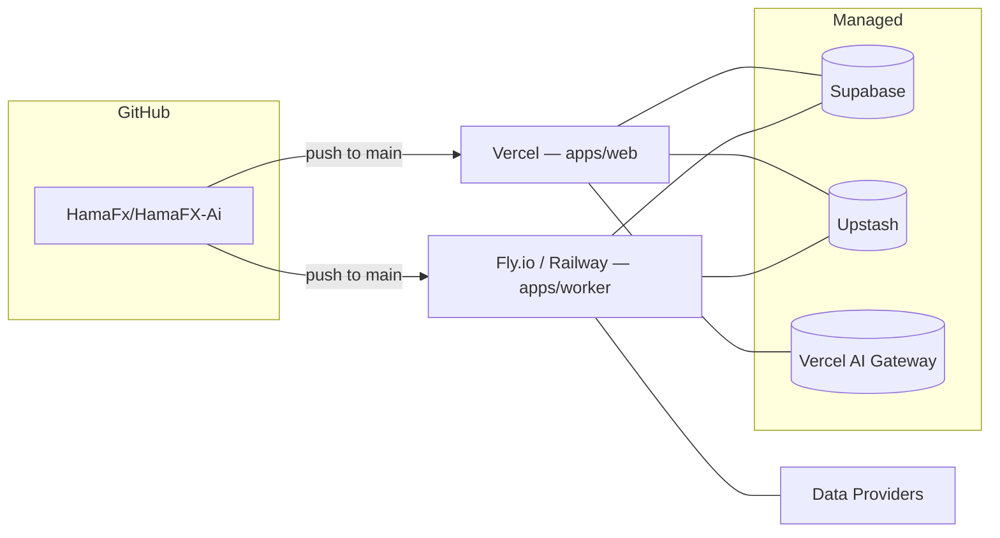

# 09 — Deployment

## Topology



## `apps/web` on Vercel

- **Project**: `hamafx-ai-web` linked to the monorepo root, `Root Directory = apps/web`.
- **Build command**: handled by Turborepo: `turbo run build --filter=web...`.
- **Install command**: `pnpm install --frozen-lockfile`.
- **Output**: standard Next.js.
- **Node**: 20.x.
- **Regions**: primary `iad1` + edge functions globally.
- **Environments**:
  - `Production`: `main`
  - `Preview`: every PR (sandboxed env file)
  - `Development`: local

### `vercel.json` essentials

```json
{
  "buildCommand": "pnpm dlx turbo run build --filter=web...",
  "framework": "nextjs",
  "installCommand": "pnpm install --frozen-lockfile",
  "ignoreCommand": "npx turbo-ignore web",
  "functions": {
    "src/app/api/chat/route.ts": { "maxDuration": 60 }
  }
}
```

### Edge vs Node runtime

- Default runtime: **Edge** for cheap reads (`/api/market/*`, `/api/news`, `/api/calendar`, `/api/me`).
- **Node** runtime for `/api/chat` (longer streaming, heavier dependencies, easier instrumentation).

## `apps/worker` on Fly.io (preferred) or Railway

Why Fly.io first:

- Region pinning close to Twelve Data's POP for lower WS latency.
- Generous always-on free machines + cheap incremental cost.
- Native HTTP/WS, no platform quirks for Hono.

### Fly setup

`apps/worker/fly.toml` (sketch):

```toml
app = "hamafx-ai-worker"
primary_region = "iad"

[build]
  dockerfile = "Dockerfile"

[env]
  PORT = "8080"

[[services]]
  internal_port = 8080
  protocol = "tcp"

  [[services.ports]]
    handlers = ["http"]
    port = 80

  [[services.ports]]
    handlers = ["tls", "http"]
    port = 443

  [services.concurrency]
    type = "connections"
    hard_limit = 1000
    soft_limit = 800

[checks]
  [checks.health]
    type = "http"
    path = "/v1/health"
    interval = "15s"
    timeout = "2s"
```

Single VM ≥ 1 GB is plenty at MVP — we scale horizontally only if WS clients > a few thousand (the upstream WS is shared, so most cost is idle).

### Railway alternative

If Fly is unavailable, Railway works equally well:

- Service from Dockerfile, healthcheck `/v1/health`.
- Add environment from a single shared env group.
- Expose only HTTPS / WSS via the public domain.

## Domains

| Service        | Domain                                    |
| -------------- | ----------------------------------------- |
| Web            | `hamafx-ai.app` (apex), `www.hamafx-ai.app` |
| Worker (WS)    | `realtime.hamafx-ai.app`                  |
| Worker (HTTP)  | (same host, only used internally)         |

Cookies are set on the apex; CORS for the WS domain is locked to the apex.

## Environment variables

`.env.example` is the source of truth at root. Each app has a local `.env.local`. In CI / Vercel / Fly we mirror these.

### Web (`apps/web`)

```
# public
NEXT_PUBLIC_APP_URL=https://hamafx-ai.app
NEXT_PUBLIC_WORKER_WS_URL=wss://realtime.hamafx-ai.app/v1/prices

# Supabase
NEXT_PUBLIC_SUPABASE_URL=
NEXT_PUBLIC_SUPABASE_ANON_KEY=
SUPABASE_SERVICE_ROLE_KEY=

# AI
AI_GATEWAY_API_KEY=
AI_DEFAULT_MODEL=openai/gpt-4.1
AI_TITLE_MODEL=openai/gpt-4.1-mini
AI_EMBEDDING_MODEL=openai/text-embedding-3-small

# Cache / RL
UPSTASH_REDIS_REST_URL=
UPSTASH_REDIS_REST_TOKEN=

# Data providers (server-only)
TWELVEDATA_API_KEY=
FINNHUB_API_KEY=
ALPHAVANTAGE_API_KEY=
MARKETAUX_API_KEY=
TRADING_ECONOMICS_KEY=
FRED_API_KEY=

# Internal
INTERNAL_HMAC_KEY=
WS_JWT_SECRET=

# Telemetry
AXIOM_DATASET=
AXIOM_TOKEN=
```

### Worker (`apps/worker`)

```
NODE_ENV=production
PORT=8080
PUBLIC_ORIGIN=https://hamafx-ai.app

DATABASE_URL=                     # Supabase pooler
SUPABASE_URL=
SUPABASE_SERVICE_ROLE_KEY=

UPSTASH_REDIS_REST_URL=
UPSTASH_REDIS_REST_TOKEN=

TWELVEDATA_API_KEY=
FINNHUB_API_KEY=
MARKETAUX_API_KEY=
TRADING_ECONOMICS_KEY=
FRED_API_KEY=

INTERNAL_HMAC_KEY=
WS_JWT_SECRET=                    # same value as in web
LOG_LEVEL=info
AXIOM_DATASET=
AXIOM_TOKEN=
```

`packages/shared/src/env.ts` exports `envSchema` (zod) used by both apps to validate at boot. Boot fails fast on missing/invalid envs.

## CI/CD

GitHub Actions (`.github/workflows/`):

- `ci.yml` — on every PR:
  - `pnpm install`
  - `turbo run lint typecheck test`
  - `turbo run build` for affected apps
  - playwright e2e against a built preview when feasible
- `deploy-web.yml` — on push to `main`, only if `apps/web` or shared packages changed → triggers Vercel deploy hook.
- `deploy-worker.yml` — on push to `main`, only if `apps/worker` or shared packages changed → `flyctl deploy --remote-only`.
- `eval-ai.yml` — on changes to `packages/ai/**` → run AI eval suite + comment results on PR.

Affected detection uses `turbo-ignore` and `dorny/paths-filter`.

## Database migrations

- Schema lives in `packages/db/src/schema/*.ts`.
- `pnpm --filter db migrate:gen` creates SQL.
- `pnpm --filter db migrate:apply` runs against `DATABASE_URL`.
- CI applies migrations to a Supabase **branch** for PR previews when possible (Supabase branching).
- Production migrations are gated on a manual approval step.

## Observability stack

- **Axiom** datasets:
  - `hamafx-web-logs`
  - `hamafx-worker-logs`
  - `hamafx-traces`
- Logs include `traceId`, `userId` (hashed), `route`, `model`, `provider`.
- Web Vitals reported via `next/script` to Axiom.
- Alerting: Axiom monitors for error-rate spikes; Slack/Email webhook.

## Rollback

- Vercel: instant via "Rollback to deployment".
- Fly.io: `flyctl releases` + `flyctl deploy --image <previous>`.
- DB: forward-only migrations; for emergencies a "shadow migration" is added rather than reverting.

## Cost ceiling (MVP)

| Component            | Estimate / month |
| -------------------- | ---------------- |
| Vercel (Hobby/Pro)   | $0–$20           |
| Fly worker           | $0–$10           |
| Supabase Pro         | $0–$25           |
| Upstash Redis        | $0–$10           |
| Data providers       | $0–$30           |
| AI Gateway / models  | $5–$50           |
| Axiom logs           | $0–$25           |
| **Total**            | **$5–$170**      |

Designed so a hobby/MVP run sits comfortably under $25 / month.
