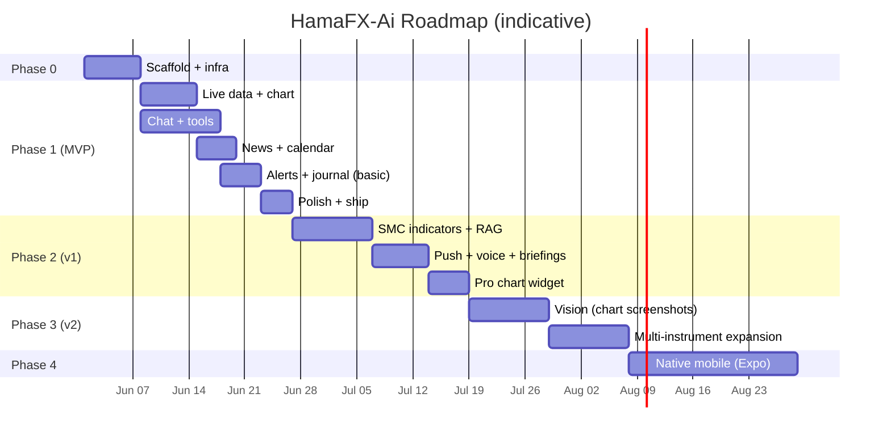

# 10 — Roadmap

> Phases are scoped by **value delivered**, not by effort. Each phase ends with a working, deployed product.

---

## Phase 0 — Scaffold (Week 1)

**Goal**: empty-but-real project deploys to Vercel + Fly with health checks green and the design system rendering.

- [ ] pnpm + Turborepo monorepo per `03-project-structure.md`
- [ ] `packages/config` (eslint, prettier, tsconfig, tailwind preset)
- [ ] `packages/shared` skeletons (zod schemas)
- [ ] `apps/web` Next.js 15 + Tailwind v4 + shadcn init + theme tokens
- [ ] `apps/worker` Hono + healthcheck + Dockerfile
- [ ] Supabase project + Auth + initial Drizzle migration
- [ ] Upstash Redis + ratelimit primitive
- [ ] Vercel project + Fly app + GitHub Actions CI
- [ ] `.env.example` complete and documented

**Exit criteria**: visiting `/login` works, magic-link sign-in completes, worker `/v1/health` returns 200.

---

## Phase 1 — MVP (Weeks 2–5)

**Goal**: a focused chat-driven assistant with charts, indicators, news, calendar, alerts, journal — for XAUUSD/EURUSD/GBPUSD only.

### Phase 1a — Live data & chart

- [ ] Twelve Data adapter (REST + WS)
- [ ] Worker WS gateway + browser hook (`use-prices`)
- [ ] `lightweight-charts` wrapper + multi-timeframe URL state
- [ ] Indicator engine MVP (EMA, SMA, RSI, MACD, ATR, Bollinger, pivots)
- [ ] `/api/market/*` routes with Upstash caching
- [ ] Mobile shell with bottom nav and command palette

### Phase 1b — Chat & tools

- [ ] Chat thread schema + persistence
- [ ] Vercel AI SDK v5 wired with Gateway
- [ ] Tools: `get_price`, `get_candles`, `get_indicators`, `analyze_technical`, `analyze_fundamental`, `get_news`, `get_calendar`, `set_alert`, `log_journal`, `annotate_chart`
- [ ] Custom UI parts per tool
- [ ] Auto-titled threads
- [ ] Eval harness with the 10 acceptance prompts

### Phase 1c — News & calendar

- [ ] Marketaux + Finnhub adapters
- [ ] Worker cron ingestion
- [ ] Trading Economics + FRED adapters
- [ ] News page + Calendar page
- [ ] Sentiment chips

### Phase 1d — Alerts & journal (basic)

- [ ] Alert rules (price, indicator, candle close)
- [ ] Worker alert evaluator
- [ ] Email delivery (Supabase / Resend)
- [ ] Journal CRUD UI + basic stats

### Phase 1e — Polish + ship

- [ ] Mobile Lighthouse passes (perf ≥ 90, a11y ≥ 95)
- [ ] PWA install + offline shell
- [ ] OG images + sitemap + robots
- [ ] Empty / error / stale states everywhere
- [ ] Run eval suite, fix top failure modes
- [ ] Public beta release

**Exit criteria**: all 10 acceptance prompts in `00-overview.md` pass on the eval suite at ≥ 90% rate; can be used end-to-end on a phone over 4G.

---

## Phase 2 — v1 (Weeks 6–8)

**Goal**: depth where it matters — smart-money structure, RAG-grounded answers, push notifications, voice.

- [ ] SMC / ICT structure module: swings, BOS/CHoCH, order blocks, FVG, liquidity sweeps
- [ ] Chart annotation overlays for the above
- [ ] News RAG over `news_articles` + `journal_entries` (pgvector)
- [ ] Web Push delivery for alerts + high-impact news
- [ ] Voice input (Web Speech API)
- [ ] Pre-event and post-event briefings (cron + LLM)
- [ ] BYOK provider keys
- [ ] Optional **TradingView Advanced Charting Widget** view (gated by config)
- [ ] Auto-fill journal from chat ("Journal: I shorted…")
- [ ] Weekly review (LLM-authored from journal stats)

---

## Phase 3 — v2 (Weeks 9–12)

**Goal**: multimodal + breadth.

- [ ] Vision: drop a chart screenshot, get analysis
- [ ] Cross-pair correlation + DXY proxy module
- [ ] Optional: add USDJPY, AUDUSD, USDCAD (still focused, max 6)
- [ ] Backtest narration tool (no full lab UI yet)
- [ ] CoT (CFTC) report ingestion
- [ ] Sharable analysis snapshots (public read-only links)
- [ ] i18n: EN + AR/FA + DE

---

## Phase 4 — Native (optional, post-v2)

- [ ] Expo app reusing `packages/ui` and hooks
- [ ] Native push (APNs / FCM)
- [ ] On-device session memory

---

## Stretch / parking lot

- Broker integration (read-only): MetaTrader, OANDA, IG.
- Strategy compiler: convert a description to a runnable rule set.
- Discord / Telegram bot using the same agent.
- Public eval leaderboard for trading copilots.

## How we measure success per phase

| Phase | KPI                                                                |
| ----- | ------------------------------------------------------------------ |
| 0     | Both deploys green; Lighthouse PWA passes baseline.                |
| 1     | DAU > 0 with eval suite ≥ 90%; cost / DAU ≤ $0.50 / mo.            |
| 2     | Median session length ≥ 6 min; retention D7 ≥ 25%.                 |
| 3     | Vision-prompted chart analyses converted to alert/journal ≥ 30%.   |
| 4     | Push CTR ≥ 15%; native crash-free rate ≥ 99.5%.                    |
