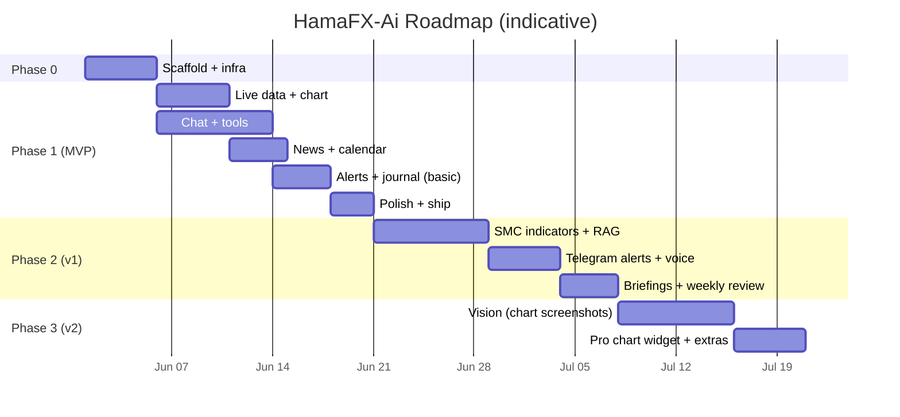

# 10 — Roadmap

> Personal-mode roadmap. Phases scoped by **value to you**. Each phase ends with a working, deployed product.

---

## Phase 0 — Scaffold ✅ DONE

**Goal**: empty-but-real project deploys to Vercel, password gate works, design system renders.

- [x] pnpm + Turborepo monorepo per `03-project-structure.md`
- [x] `packages/config` (eslint, prettier, tsconfig, tailwind preset)
- [x] `packages/shared` skeletons (zod schemas)
- [x] `apps/web` Next.js 15 + Tailwind v4 + shadcn init + theme tokens
- [x] Supabase project + Drizzle initial migration (no Auth, no RLS)
- [ ] ~~Upstash Redis (cache only)~~ — **skipped**, replaced by Next.js Data Cache (free, persistent on Vercel). See `docs/06-data-sources.md` § Cache.
- [x] Vercel project + minimal CI (`lint typecheck test`)
- [x] `/api/auth/login` + `/login` page + middleware cookie gate
- [x] `.env.example` complete and documented

**Exit criteria** ✅: visiting any URL on the deploy redirects to `/login`; entering `APP_PASSWORD` lets you in; the app shell renders on mobile.

---

## Phase 1 — MVP ✅ DONE

**Goal**: a focused chat-driven assistant with charts, indicators, news, calendar, alerts, journal — for XAUUSD/EURUSD/GBPUSD only.

### Phase 1a — Live data & chart ✅

- [x] Twelve Data REST adapter (price + candles)
- [x] Finnhub fallback adapter (price only; candles deferred to Phase 2)
- [x] Polling hook (`use-prices`, `use-candles`) via TanStack Query
- [x] `lightweight-charts` wrapper + multi-timeframe URL state
- [x] Indicator engine MVP (EMA, SMA, RSI, MACD, ATR, Bollinger, pivots)
- [x] `/api/market/*` routes with Next.js Data Cache (was: Upstash)
- [x] Mobile shell with bottom nav

### Phase 1b — Chat & tools ✅

- [x] Chat thread schema + persistence
- [x] Vercel AI SDK v5 wired with Gateway
- [x] Tools shipped: `get_price`, `get_candles`, `get_indicators`, `get_news`, `get_calendar`, `set_alert`, `log_journal`
- [ ] Tools deferred to Phase 2: `analyze_technical`, `analyze_fundamental`, `search_knowledge`, `annotate_chart`, `get_journal_stats`
- [x] Generic ToolCard renderer (per-tool bespoke renderers deferred)
- [ ] Auto-titled threads — deferred (cosmetic)
- [x] `chat_telemetry` recording (tokens, model, ms, est-cost)
- [ ] Manual run of the **10 acceptance prompts** from `00-overview.md` — pending live walkthrough

### Phase 1c — News & calendar ✅

- [x] Marketaux primary news adapter (Finnhub news fallback deferred to Phase 2)
- [x] FRED calendar adapter (Trading Economics intentionally skipped — FRED covers what we need)
- [x] Cron endpoints `/api/cron/news`, `/api/cron/calendar`, `/api/cron/embedding-backfill` (auto-schedule deferred — Hobby plan caps daily, see "Cron triggering" below)
- [x] News page + Calendar page (server-rendered, with empty-state curl recipes)
- [x] Sentiment chips (Marketaux per-entity scores aggregated to article-level)
- [ ] News RAG via `search_knowledge` tool — deferred to Phase 2 (embeddings table is populated; the tool that queries it isn't implemented yet)

### Phase 1d — Alerts & journal (basic) ✅

- [x] Alert rule schema (price-cross, indicator-cross, candle-close)
- [x] Cron endpoint `/api/cron/alerts` (eval + email + markFired)
- [x] Email delivery via Resend (Telegram + web-push deferred to Phase 2 / 3)
- [x] Journal CRUD UI + win-rate / R-multiple stats
- [x] AI tools `set_alert` and `log_journal`

### Phase 1e — Polish + ship ✅

- [x] `/settings/usage` page (token spend, daily-budget gauge, per-model breakdown, last 7d chart)
- [x] Loading skeletons for `/news`, `/calendar`, `/chart/[symbol]`, `/settings/usage`
- [x] Root + per-segment error boundaries with retry
- [x] 404 page
- [x] Empty / error / stale states reviewed across all pages
- [ ] PWA install + offline shell — deferred (manifest works; service worker not added — risk vs. reward not worth it)
- [ ] Mobile Lighthouse perf ≥ 90, a11y ≥ 95 — needs measurement
- [ ] Re-run the 10 acceptance prompts — pending live walkthrough
- [ ] You start using it daily — pending

**Exit criteria**: app is feature-complete. Real-world acceptance still owed.

---

## Cron triggering (Phase 1 → Phase 2 deployment note)

Vercel **Hobby** caps cron jobs at once-per-day. We don't have a `crons` block in `vercel.json`. Three options to actually fire the cron endpoints on a useful cadence:

1. **Upgrade to Vercel Pro** — re-add the `crons` block per the original `09-deployment.md` schedule and you're done.
2. **External scheduler** — Fly.io tiny worker, GitHub Actions on a schedule, or [cron-job.org](https://cron-job.org) hitting the URLs with `Authorization: Bearer ${CRON_SECRET}`.
3. **Manual trigger** — visit the empty-state UIs in `/news` / `/calendar` / `/alerts` and copy the curl recipe shown there.

Original Phase 1c plan was option 2 (Fly.io worker). Decision was deferred so we could ship the surfaces first and pick once you actually need sub-daily firing.

---

## Phase 2 — v1 (≈ 2–3 weeks)

**Goal**: depth where it matters — smart-money structure, RAG-grounded answers, voice, briefings.

- [ ] SMC / ICT structure module: swings, BOS/CHoCH, order blocks, FVG, liquidity sweeps
- [ ] Chart annotation overlays for the above (`annotate_chart` AI tool)
- [ ] **Telegram bot** for alerts (faster than email, easier than web push)
- [ ] Voice input (Web Speech API)
- [ ] Pre-event and post-event briefings (cron + LLM, persisted as messages in a "briefings" thread)
- [ ] Auto-fill journal from chat ("Journal: I shorted…")
- [ ] Weekly review (LLM-authored from journal stats; runs Sunday)
- [ ] Composite tools: `analyze_technical`, `analyze_fundamental`
- [ ] RAG tool: `search_knowledge` (cosine similarity over `news_embeddings`)
- [ ] Journal stats tool: `get_journal_stats`
- [ ] Snapshots cron: precomputed daily HLOC / pivots / ATR per symbol
- [ ] Finnhub candle fallback (synth 4h from 1h)
- [ ] Backfill FRED actuals via `/fred/series/observations`

---

## Phase 3 — v2 (≈ 2 weeks)

**Goal**: multimodal + breadth.

- [ ] Vision: drop a chart screenshot, get analysis
- [ ] Cross-pair correlation + DXY proxy module
- [ ] Optional **TradingView Advanced Charting Widget** view (gated by config)
- [ ] CoT (CFTC) report ingestion (weekly cron)
- [ ] Sharable analysis snapshots (private link with cookie-gated read access)
- [ ] Optional Web Push as a 2nd alert channel

---

## Stretch / parking lot

- Add a separate **worker** on Fly.io if/when sub-second WS becomes worth it.
- Backtest narration tool (no full lab UI — just describe a rule, get historical performance).
- Add USDJPY / AUDUSD / USDCAD if you actively trade them (still keep total ≤ 6 instruments).
- Native mobile (Expo) reusing UI hooks.

## Definition of "done" per phase

| Phase | Done when…                                                                            |
| ----- | ------------------------------------------------------------------------------------- |
| 0     | ✅ You can log into the deploy and see a styled empty shell.                          |
| 1     | ✅ Feature-complete. Real-world acceptance still owed (re-run 10 prompts; daily use). |
| 2     | You stopped using your old workflow because this is enough.                           |
| 3     | You drop chart screenshots and get useful analysis without typing.                    |
