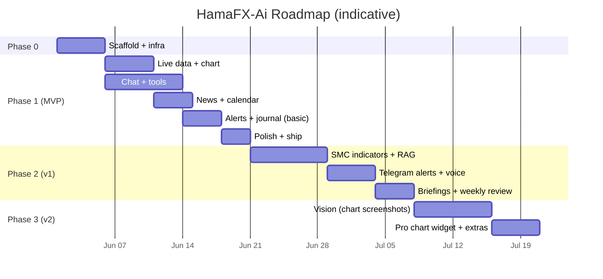

# 10 — Roadmap

> Personal-mode roadmap. Phases scoped by **value to you**. Each phase ends with a working, deployed product.

---

## Phase 0 — Scaffold ✅ DONE

**Goal**: empty-but-real project deploys to Vercel, password gate works, design system renders.

- [x] pnpm + Turborepo monorepo per `03-project-structure.md`
- [x] `packages/config` (eslint, prettier, tsconfig, tailwind preset)
- [x] `packages/shared` skeletons (zod schemas)
- [x] `apps/web` Next.js 15 + Tailwind v4 + shadcn init + theme tokens
- [x] Supabase project + Drizzle initial migration (no Auth, no RLS)
- [ ] ~~Upstash Redis (cache only)~~ — **skipped**, replaced by Next.js Data Cache (free, persistent on Vercel). See `docs/06-data-sources.md` § Cache.
- [x] Vercel project + minimal CI (`lint typecheck test`)
- [x] `/api/auth/login` + `/login` page + middleware cookie gate
- [x] `.env.example` complete and documented

**Exit criteria** ✅: visiting any URL on the deploy redirects to `/login`; entering `APP_PASSWORD` lets you in; the app shell renders on mobile.

---

## Phase 1 — MVP ✅ DONE

**Goal**: a focused chat-driven assistant with charts, indicators, news, calendar, alerts, journal — for XAUUSD/EURUSD/GBPUSD only.

### Phase 1a — Live data & chart ✅

- [x] Twelve Data REST adapter (price + candles)
- [x] Finnhub fallback adapter (price only; candles deferred to Phase 2)
- [x] Polling hook (`use-prices`, `use-candles`) via TanStack Query
- [x] `lightweight-charts` wrapper + multi-timeframe URL state
- [x] Indicator engine MVP (EMA, SMA, RSI, MACD, ATR, Bollinger, pivots)
- [x] `/api/market/*` routes with Next.js Data Cache (was: Upstash)
- [x] Mobile shell with bottom nav

### Phase 1b — Chat & tools ✅

- [x] Chat thread schema + persistence
- [x] Vercel AI SDK v5 wired with Gateway
- [x] Tools shipped: `get_price`, `get_candles`, `get_indicators`, `get_news`, `get_calendar`, `set_alert`, `log_journal`
- [ ] Tools deferred to Phase 2: `analyze_technical`, `analyze_fundamental`, `search_knowledge`, `annotate_chart`, `get_journal_stats`
- [x] Generic ToolCard renderer (per-tool bespoke renderers deferred)
- [ ] Auto-titled threads — deferred (cosmetic)
- [x] `chat_telemetry` recording (tokens, model, ms, est-cost)
- [ ] Manual run of the **10 acceptance prompts** from `00-overview.md` — pending live walkthrough

### Phase 1c — News & calendar ✅

- [x] Marketaux primary news adapter (Finnhub news fallback deferred to Phase 2)
- [x] FRED calendar adapter (Trading Economics intentionally skipped — FRED covers what we need)
- [x] Cron endpoints `/api/cron/news`, `/api/cron/calendar`, `/api/cron/embedding-backfill` (auto-schedule deferred — Hobby plan caps daily, see "Cron triggering" below)
- [x] News page + Calendar page (server-rendered, with empty-state curl recipes)
- [x] Sentiment chips (Marketaux per-entity scores aggregated to article-level)
- [ ] News RAG via `search_knowledge` tool — deferred to Phase 2 (embeddings table is populated; the tool that queries it isn't implemented yet)

### Phase 1d — Alerts & journal (basic) ✅

- [x] Alert rule schema (price-cross, indicator-cross, candle-close)
- [x] Cron endpoint `/api/cron/alerts` (eval + email + markFired)
- [x] Email delivery via Resend (Telegram + web-push deferred to Phase 2 / 3)
- [x] Journal CRUD UI + win-rate / R-multiple stats
- [x] AI tools `set_alert` and `log_journal`

### Phase 1e — Polish + ship ✅

- [x] `/settings/usage` page (token spend, daily-budget gauge, per-model breakdown, last 7d chart)
- [x] Loading skeletons for `/news`, `/calendar`, `/chart/[symbol]`, `/settings/usage`
- [x] Root + per-segment error boundaries with retry
- [x] 404 page
- [x] Empty / error / stale states reviewed across all pages
- [ ] PWA install + offline shell — deferred (manifest works; service worker not added — risk vs. reward not worth it)
- [ ] Mobile Lighthouse perf ≥ 90, a11y ≥ 95 — needs measurement
- [ ] Re-run the 10 acceptance prompts — pending live walkthrough
- [ ] You start using it daily — pending

**Exit criteria**: app is feature-complete. Real-world acceptance still owed.

---

## Cron triggering (Phase 1 → Phase 2 deployment note)

Vercel **Hobby** caps cron jobs at once-per-day. We don't have a `crons` block in `vercel.json`. Cron scheduling is handled by a dedicated **GCE VM** (`hamafx-cron`, `e2-small` in `us-central1-a`, project `hamafx-78845`):

- The VM runs system crontab entries that `curl` each `/api/cron/*` endpoint with `Authorization: Bearer ${CRON_SECRET}`.
- High-frequency endpoints (news, alerts, briefings) fire every 5 minutes.
- Setup, schedule, and monitoring docs: `infra/cron-vm/README.md`.
- Monthly cost: ~$6 (or $0 if downgraded to `e2-micro` which is in the Always Free tier).

The GitHub Actions workflow files (`.github/workflows/cron-*.yml`) are kept as a secondary fallback but are not the primary scheduler.

---

## Phase 2 — v1 (≈ 2–3 weeks) ✅ DONE

**Goal**: depth where it matters — smart-money structure, RAG-grounded answers, voice, briefings.

- [x] SMC / ICT structure module: swings, BOS/CHoCH, order blocks, FVG, liquidity sweeps
- [x] Chart annotation overlays for the above (`annotate_chart` AI tool)
- [x] **Telegram bot** for alerts (faster than email, easier than web push)
- [x] Voice input (Web Speech API)
- [x] Pre-event and post-event briefings (cron + LLM, persisted as messages in a "briefings" thread)
- [x] Auto-fill journal from chat ("Journal: I shorted…")
- [x] Weekly review (LLM-authored from journal stats; runs Sunday)
- [x] Composite tools: `analyze_technical`, `analyze_fundamental`
- [x] RAG tool: `search_knowledge` (cosine similarity over `news_embeddings`)
- [x] Journal stats tool: `get_journal_stats`
- [x] Snapshots cron: precomputed daily HLOC / pivots / ATR per symbol
- [x] Finnhub candle fallback (synth 4h from 1h)
- [x] Backfill FRED actuals via `/fred/series/observations`

---

## Phase 3 — v2 (≈ 2 weeks) ✅ DONE

**Goal**: multimodal + breadth.

- [x] Vision: drop a chart screenshot, get analysis (`analyze_chart_image` tool)
- [x] Cross-pair correlation + DXY proxy module (`get_correlation` tool)
- [x] Optional **TradingView Advanced Charting Widget** view at `/chart/[symbol]/pro` (gated by `NEXT_PUBLIC_TRADINGVIEW_ENABLED`)
- [x] CoT (CFTC) report ingestion (weekly cron at `0 22 * * 5` UTC)
- [x] Sharable analysis snapshots — private signed link at `/share/[id]?t=<token>` (HMAC-bypassed password gate)
- [x] Web Push as a 3rd alert channel (RFC 8030 + VAPID, no `web-push` dep)

---

## Phase 5 — UI/UX Polish & Design System ✅ DONE

**Goal**: turn the working but utilitarian UI into a polished, mobile-first experience that feels native on iPhone 14 Pro Max.

- [x] Design tokens: `bgElev3`, `divider`, `overlay`; type scale; Inter Variable + JetBrains Mono Variable; safe-area utilities
- [x] Motion: `motion/react` with LazyMotion, page transitions, button whileTap, animated numbers, layoutId tab indicators
- [x] Icons: `lucide-react` exclusively (replaced all inline SVGs)
- [x] Bottom sheets: `vaul`-based Drawer for alert/journal create forms + chart overlay toggles
- [x] Toasts: `sonner` for write confirmations (no more inline status strings)
- [x] FAB pattern for primary create actions (alerts, journal)
- [x] Page-by-page polish: login (gradient glow), chat (iOS bubbles + typing as bubble), chart (sticky glass sub-header), news (live timestamp), calendar (sticky day headers + imminent-event pulse), alerts (FAB+drawer + lucide rule icons + empty state CTA), journal (2x2 stat-cards with sparklines), settings (sectioned with icons), more (lucide icons + 60px rows)
- [x] All animations respect `prefers-reduced-motion`
- [x] Eval still passes 10/10 after refactor

## Phase 6 — Premium black + design-system rebuild ✅ DONE

**Goal**: tighten the entire UX into a coherent, scalable system with a true premium-black aesthetic.

### Theme & shell

- [x] **Pure-black neutral grayscale** surfaces (oklch hue 0 chroma 0). The previous Phase 5 tokens read as "dark blue"; Phase 6 reads as true premium dark.
- [x] **Refined champagne brand** (oklch 82% 0.14 85) — sits cleanly against pure black instead of competing.
- [x] **Black-tinted glass** utilities (`glass`, `glass-strong`, `glass-subtle`, `card-premium`).
- [x] **Themeable gradients/shadows** as CSS variables (`--gradient-brand`, `--gradient-danger`, `--gradient-brand-soft`, `--shadow-brand-press`, …) — components reference these instead of inlining OKLCH stops.
- [x] **Single `<NavDrawer/>`** opened from a hamburger trigger in the top bar; replaces the bottom navigation entirely. Frees ~88px of vertical chrome on every page.
- [x] **Context-controlled drawer state** (`<NavDrawerProvider>`) so both the global TopBar and the chat-specific ChatTopBar share one drawer instance. Fixes the "menu sometimes doesn't open" bug from competing instances.
- [x] **Global TopBar suppressed on /chat** — no double headers.
- [x] `/more` route deleted (covered by the drawer).

### Stability

- [x] `paint-isolated` (CSS `contain: layout paint`) on the chat full-bleed surface so route transitions don't flash.
- [x] `no-overscroll` (`overscroll-behavior: contain`) on chat scroll container — no iOS Safari rubber-band past the composer.
- [x] `html { overscroll-behavior-y: none }` at root.
- [x] Initial-mount scroll uses instant `scrollTop = scrollHeight`, never `behavior: 'smooth'` — eliminates the "drift on entry" feeling.
- [x] Auto-scroll only fires when user is within 240px of the bottom.
- [x] `AnimatedNumber` adds `restDelta` so the spring stops scheduling frames once digits are visually identical.

### Chat upgrades

- [x] **Stop streaming**: send button morphs to a Stop button while a turn is in flight (wired to AI SDK's `stop()`).
- [x] **Regenerate** the last assistant turn (drives `regenerate()`).
- [x] **Light Markdown** rendering for assistant text — bold / italic / inline-code / fenced code blocks (with copy) / bullet/numbered lists / https links. DOM-built, no `dangerouslySetInnerHTML`.
- [x] Empty state moved into the scroll body and embeds the quick-prompts grid — one inviting surface, not two competing panels.
- [x] Voice input: pulsing "Listening…" pill + soft amber ring on the mic.
- [x] Composer: keyboard hint (`Enter` / `Shift+Enter`) on focus for desktop.
- [x] Code-block copy per fenced block.
- [x] Thread switcher in overflow menu, with auto-search input when >5 threads.
- [x] **Ask AI deep-link** contract: `/chat?prompt=…` creates a fresh thread and auto-submits the prompt once on mount.

### News rebuild

- [x] **News pulse** card at top — stacked sentiment bar + lean label.
- [x] Live search across titles, summaries, publishers.
- [x] Sentiment chip rail with arrow glyphs (▲/▼/·).
- [x] Symbol chip rail derived from loaded set, sorted by frequency.
- [x] **Local bookmarks** (`localStorage` with cross-tab sync) + saved-only filter.
- [x] **Auto-refresh** every 5 minutes + manual refresh pill.
- [x] **Time-bucketed sections** (Last hour / Today / Yesterday / This week / Older) with sticky headers.
- [x] **Article card redesign**: 3px sentiment ribbon on the left edge, Ask AI deep-link, bookmark, open-in-new-tab.

### Calendar rebuild

- [x] **Hero countdown** to next high-impact event + Ask AI shortcut.
- [x] **Impact distribution bar** for the next 14 days.
- [x] Importance + currency chip rails + "Show past" toggle.
- [x] Time-bucketed sections (Today / Tomorrow / Later this week / Later / Past).
- [x] **Event card redesign**: importance ribbon, importance glyph (▲/■/•), inline countdown, beat/miss chip when actual+forecast both exist.
- [x] **Remind me** button using browser Notifications API (5 min before event).

### Settings rebuild

- [x] **System status** card — Email / Telegram / Web push Ready/Off chips, DB connectivity probe, rollup pill.
- [x] **Usage at a glance** — daily-budget gauge with bull/warn/bear tone, deep-links to /usage.
- [x] **Notifications** — coherent list with per-channel status pills + test buttons.
- [x] **Preferences** (new, local) — default symbol, time format, force-reduce-motion via `data-reduce-motion="force"` on `<html>`.
- [x] **Data & cache** (new) — clear bookmarks, reset preferences, wipe all `hamafx:*` keys (drawer-confirmed).
- [x] **Session** — drawer-confirmed sign-out + build-id footer.

### New shared primitives

- [x] `<NavDrawerProvider>` + `<NavDrawer/>` + `<NavTrigger/>`
- [x] `<Segmented/>` (replaces 4 ad-hoc segment groups)
- [x] `<Tooltip/>` (CSS-only)
- [x] `<ConfirmDrawer/>` + `useConfirm()` (replaces `window.confirm()`)
- [x] `<Skeleton/>` / `<SkeletonCard/>` (single shimmer placeholder)
- [x] `<StaleIndicator/>` (background-refetch state)
- [x] `<EmptyState/>` (single empty/zero-data card)
- [x] `<Switch/>` (CSS-only toggle)
- [x] `<SkipToContent/>` (WCAG §2.4.1)
- [x] `<SettingsRow/>` (page-local settings primitive)

### Accessibility

- [x] Skip-to-content link mounted as the first focusable element.
- [x] All interactive elements ≥ 44×44 tap target on mobile.
- [x] Color-not-only: sentiment chips include arrow glyphs; importance dots include shape glyphs.
- [x] Composer textarea uses `text-base` so iOS Safari does not auto-zoom on focus.
- [x] Reduced-motion respected globally + user-forced override.

## Stretch / parking lot

- Add a separate **worker** on Fly.io if/when sub-second WS becomes worth it.
- Backtest narration tool (no full lab UI — just describe a rule, get historical performance).
- Add USDJPY / AUDUSD / USDCAD if you actively trade them (still keep total ≤ 6 instruments).
- Native mobile (Expo) reusing UI hooks.

## Definition of "done" per phase

| Phase | Done when…                                                                            |
| ----- | ------------------------------------------------------------------------------------- |
| 0     | ✅ You can log into the deploy and see a styled empty shell.                          |
| 1     | ✅ Feature-complete. Real-world acceptance still owed (re-run 10 prompts; daily use). |
| 2     | ✅ Stopped using your old workflow because this is enough.                            |
| 3     | ✅ Drop chart screenshots and get useful analysis without typing.                     |
| 5     | ✅ The whole UI looks polished — hand someone the phone and they don't ask "is this Bootstrap?". |
| 6     | ✅ The UI feels premium-dark + scalable — single nav drawer, news/calendar/settings rebuilt as proper trading-desk surfaces. |
