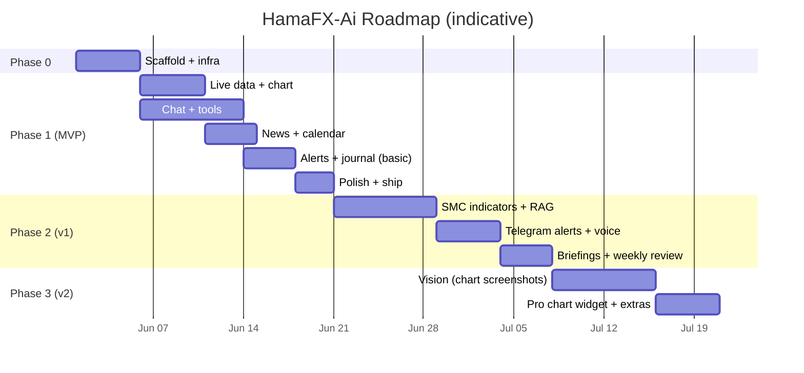

# 10 — Roadmap

> Personal-mode roadmap. Phases scoped by **value to you**. Each phase ends with a working, deployed product.

---

## Phase 0 — Scaffold ✅ DONE

**Goal**: empty-but-real project deploys to Vercel, password gate works, design system renders.

- [x] pnpm + Turborepo monorepo per `03-project-structure.md`
- [x] `packages/config` (eslint, prettier, tsconfig, tailwind preset)
- [x] `packages/shared` skeletons (zod schemas)
- [x] `apps/web` Next.js 15 + Tailwind v4 + shadcn init + theme tokens
- [x] Supabase project + Drizzle initial migration (no Auth, no RLS)
- [ ] ~~Upstash Redis (cache only)~~ — **skipped**, replaced by Next.js Data Cache (free, persistent on Vercel). See `docs/06-data-sources.md` § Cache.
- [x] Vercel project + minimal CI (`lint typecheck test`)
- [x] `/api/auth/login` + `/login` page + middleware cookie gate
- [x] `.env.example` complete and documented

**Exit criteria** ✅: visiting any URL on the deploy redirects to `/login`; entering `APP_PASSWORD` lets you in; the app shell renders on mobile.

---

## Phase 1 — MVP ✅ DONE

**Goal**: a focused chat-driven assistant with charts, indicators, news, calendar, alerts, journal — for XAUUSD/EURUSD/GBPUSD only.

### Phase 1a — Live data & chart ✅

- [x] Twelve Data REST adapter (price + candles)
- [x] Finnhub fallback adapter (price only; candles deferred to Phase 2)
- [x] Polling hook (`use-prices`, `use-candles`) via TanStack Query
- [x] `lightweight-charts` wrapper + multi-timeframe URL state
- [x] Indicator engine MVP (EMA, SMA, RSI, MACD, ATR, Bollinger, pivots)
- [x] `/api/market/*` routes with Next.js Data Cache (was: Upstash)
- [x] Mobile shell with bottom nav

### Phase 1b — Chat & tools ✅

- [x] Chat thread schema + persistence
- [x] Vercel AI SDK v5 wired with Gateway
- [x] Tools shipped: `get_price`, `get_candles`, `get_indicators`, `get_news`, `get_calendar`, `set_alert`, `log_journal`
- [ ] Tools deferred to Phase 2: `analyze_technical`, `analyze_fundamental`, `search_knowledge`, `annotate_chart`, `get_journal_stats`
- [x] Generic ToolCard renderer (per-tool bespoke renderers deferred)
- [ ] Auto-titled threads — deferred (cosmetic)
- [x] `chat_telemetry` recording (tokens, model, ms, est-cost)
- [ ] Manual run of the **10 acceptance prompts** from `00-overview.md` — pending live walkthrough

### Phase 1c — News & calendar ✅

- [x] Marketaux primary news adapter (Finnhub news fallback deferred to Phase 2)
- [x] FRED calendar adapter (Trading Economics intentionally skipped — FRED covers what we need)
- [x] Cron endpoints `/api/cron/news`, `/api/cron/calendar`, `/api/cron/embedding-backfill` (auto-schedule deferred — Hobby plan caps daily, see "Cron triggering" below)
- [x] News page + Calendar page (server-rendered, with empty-state curl recipes)
- [x] Sentiment chips (Marketaux per-entity scores aggregated to article-level)
- [ ] News RAG via `search_knowledge` tool — deferred to Phase 2 (embeddings table is populated; the tool that queries it isn't implemented yet)

### Phase 1d — Alerts & journal (basic) ✅

- [x] Alert rule schema (price-cross, indicator-cross, candle-close)
- [x] Cron endpoint `/api/cron/alerts` (eval + email + markFired)
- [x] Email delivery via Resend (Telegram + web-push deferred to Phase 2 / 3)
- [x] Journal CRUD UI + win-rate / R-multiple stats
- [x] AI tools `set_alert` and `log_journal`

### Phase 1e — Polish + ship ✅

- [x] `/settings/usage` page (token spend, daily-budget gauge, per-model breakdown, last 7d chart)
- [x] Loading skeletons for `/news`, `/calendar`, `/chart/[symbol]`, `/settings/usage`
- [x] Root + per-segment error boundaries with retry
- [x] 404 page
- [x] Empty / error / stale states reviewed across all pages
- [ ] PWA install + offline shell — deferred (manifest works; service worker not added — risk vs. reward not worth it)
- [ ] Mobile Lighthouse perf ≥ 90, a11y ≥ 95 — needs measurement
- [ ] Re-run the 10 acceptance prompts — pending live walkthrough
- [ ] You start using it daily — pending

**Exit criteria**: app is feature-complete. Real-world acceptance still owed.

---

## Cron triggering (Phase 1 → Phase 8 deployment note)

Vercel **Hobby** caps cron jobs at once-per-day. We don't have a `crons` block in `vercel.json`. Cron scheduling is handled by a dedicated **GCE VM** (`hamafx-cron`, `e2-medium` in `us-central1-a`, project `hamafx-78845`) — see Phase 8 below for the full move.

- Phase 8 retired the system `cron` daemon entirely. Every job now runs as a `hamafx-*.timer` + `hamafx-*.service` pair under systemd. Heavy work runs in-process inside `hamafx-worker.service`; light Vercel-poke crons fire `curl` against `/api/cron/*` with `Authorization: Bearer ${CRON_SECRET}`.
- Setup, recovery, and monitoring docs: `infra/cron-vm/README.md`, `infra/cron-vm/RECOVERY.md`.
- Monthly cost: ~$8 on `e2-medium` (the worker SignalR consumer + heavy job runner needs more headroom than `e2-small` allowed). All other infra stays on free tiers.

The previous `.github/workflows/cron-*.yml` external trigger was removed in Phase 8 — see the note in `docs/09a-phase-0-deployed-state.md`. CI (`ci.yml`) remains the only GitHub Actions workflow.

---

## Phase 2 — v1 (≈ 2–3 weeks) ✅ DONE

**Goal**: depth where it matters — smart-money structure, RAG-grounded answers, voice, briefings.

- [x] SMC / ICT structure module: swings, BOS/CHoCH, order blocks, FVG, liquidity sweeps
- [x] Chart annotation overlays for the above (`annotate_chart` AI tool)
- [x] **Telegram bot** for alerts (faster than email, easier than web push)
- [x] Voice input (Web Speech API)
- [x] Pre-event and post-event briefings (cron + LLM, persisted as messages in a "briefings" thread)
- [x] Auto-fill journal from chat ("Journal: I shorted…")
- [x] Weekly review (LLM-authored from journal stats; runs Sunday)
- [x] Composite tools: `analyze_technical`, `analyze_fundamental`
- [x] RAG tool: `search_knowledge` (cosine similarity over `news_embeddings`)
- [x] Journal stats tool: `get_journal_stats`
- [x] Snapshots cron: precomputed daily HLOC / pivots / ATR per symbol
- [x] Finnhub candle fallback (synth 4h from 1h)
- [x] Backfill FRED actuals via `/fred/series/observations`

---

## Phase 3 — v2 (≈ 2 weeks) ✅ DONE

**Goal**: multimodal + breadth.

- [x] Vision: drop a chart screenshot, get analysis (`analyze_chart_image` tool)
- [x] Cross-pair correlation + DXY proxy module (`get_correlation` tool)
- [x] Optional **TradingView Advanced Charting Widget** view at `/chart/[symbol]/pro` (gated by `NEXT_PUBLIC_TRADINGVIEW_ENABLED`)
- [x] CoT (CFTC) report ingestion (weekly cron at `0 22 * * 5` UTC)
- [x] Sharable analysis snapshots — private signed link at `/share/[id]?t=<token>` (HMAC-bypassed password gate)
- [x] Web Push as a 3rd alert channel (RFC 8030 + VAPID, no `web-push` dep)

---

## Phase 5 — UI/UX Polish & Design System ✅ DONE

**Goal**: turn the working but utilitarian UI into a polished, mobile-first experience that feels native on iPhone 14 Pro Max.

- [x] Design tokens: `bgElev3`, `divider`, `overlay`; type scale; Inter Variable + JetBrains Mono Variable; safe-area utilities
- [x] Motion: `motion/react` with LazyMotion, page transitions, button whileTap, animated numbers, layoutId tab indicators
- [x] Icons: `lucide-react` exclusively (replaced all inline SVGs)
- [x] Bottom sheets: `vaul`-based Drawer for alert/journal create forms + chart overlay toggles
- [x] Toasts: `sonner` for write confirmations (no more inline status strings)
- [x] FAB pattern for primary create actions (alerts, journal)
- [x] Page-by-page polish: login (gradient glow), chat (iOS bubbles + typing as bubble), chart (sticky glass sub-header), news (live timestamp), calendar (sticky day headers + imminent-event pulse), alerts (FAB+drawer + lucide rule icons + empty state CTA), journal (2x2 stat-cards with sparklines), settings (sectioned with icons), more (lucide icons + 60px rows)
- [x] All animations respect `prefers-reduced-motion`
- [x] Eval still passes 10/10 after refactor

## Phase 6 — Premium black + design-system rebuild ✅ DONE

**Goal**: tighten the entire UX into a coherent, scalable system with a true premium-black aesthetic.

### Theme & shell

- [x] **Pure-black neutral grayscale** surfaces (oklch hue 0 chroma 0). The previous Phase 5 tokens read as "dark blue"; Phase 6 reads as true premium dark.
- [x] **Refined champagne brand** (oklch 82% 0.14 85) — sits cleanly against pure black instead of competing.
- [x] **Black-tinted glass** utilities (`glass`, `glass-strong`, `glass-subtle`, `card-premium`).
- [x] **Themeable gradients/shadows** as CSS variables (`--gradient-brand`, `--gradient-danger`, `--gradient-brand-soft`, `--shadow-brand-press`, …) — components reference these instead of inlining OKLCH stops.
- [x] **Single `<NavDrawer/>`** opened from a hamburger trigger in the top bar; replaces the bottom navigation entirely. Frees ~88px of vertical chrome on every page.
- [x] **Context-controlled drawer state** (`<NavDrawerProvider>`) so both the global TopBar and the chat-specific ChatTopBar share one drawer instance. Fixes the "menu sometimes doesn't open" bug from competing instances.
- [x] **Global TopBar suppressed on /chat** — no double headers.
- [x] `/more` route deleted (covered by the drawer).

### Stability

- [x] `paint-isolated` (CSS `contain: layout paint`) on the chat full-bleed surface so route transitions don't flash.
- [x] `no-overscroll` (`overscroll-behavior: contain`) on chat scroll container — no iOS Safari rubber-band past the composer.
- [x] `html { overscroll-behavior-y: none }` at root.
- [x] Initial-mount scroll uses instant `scrollTop = scrollHeight`, never `behavior: 'smooth'` — eliminates the "drift on entry" feeling.
- [x] Auto-scroll only fires when user is within 240px of the bottom.
- [x] `AnimatedNumber` adds `restDelta` so the spring stops scheduling frames once digits are visually identical.

### Chat upgrades

- [x] **Stop streaming**: send button morphs to a Stop button while a turn is in flight (wired to AI SDK's `stop()`).
- [x] **Regenerate** the last assistant turn (drives `regenerate()`).
- [x] **Light Markdown** rendering for assistant text — bold / italic / inline-code / fenced code blocks (with copy) / bullet/numbered lists / https links. DOM-built, no `dangerouslySetInnerHTML`.
- [x] Empty state moved into the scroll body and embeds the quick-prompts grid — one inviting surface, not two competing panels.
- [x] Voice input: pulsing "Listening…" pill + soft amber ring on the mic.
- [x] Composer: keyboard hint (`Enter` / `Shift+Enter`) on focus for desktop.
- [x] Code-block copy per fenced block.
- [x] Thread switcher in overflow menu, with auto-search input when >5 threads.
- [x] **Ask AI deep-link** contract: `/chat?prompt=…` creates a fresh thread and auto-submits the prompt once on mount.

### News rebuild

- [x] **News pulse** card at top — stacked sentiment bar + lean label.
- [x] Live search across titles, summaries, publishers.
- [x] Sentiment chip rail with arrow glyphs (▲/▼/·).
- [x] Symbol chip rail derived from loaded set, sorted by frequency.
- [x] **Local bookmarks** (`localStorage` with cross-tab sync) + saved-only filter.
- [x] **Auto-refresh** every 5 minutes + manual refresh pill.
- [x] **Time-bucketed sections** (Last hour / Today / Yesterday / This week / Older) with sticky headers.
- [x] **Article card redesign**: 3px sentiment ribbon on the left edge, Ask AI deep-link, bookmark, open-in-new-tab.

### Calendar rebuild

- [x] **Hero countdown** to next high-impact event + Ask AI shortcut.
- [x] **Impact distribution bar** for the next 14 days.
- [x] Importance + currency chip rails + "Show past" toggle.
- [x] Time-bucketed sections (Today / Tomorrow / Later this week / Later / Past).
- [x] **Event card redesign**: importance ribbon, importance glyph (▲/■/•), inline countdown, beat/miss chip when actual+forecast both exist.
- [x] **Remind me** button using browser Notifications API (5 min before event).

### Settings rebuild

- [x] **System status** card — Email / Telegram / Web push Ready/Off chips, DB connectivity probe, rollup pill.
- [x] **Usage at a glance** — daily-budget gauge with bull/warn/bear tone, deep-links to /usage.
- [x] **Notifications** — coherent list with per-channel status pills + test buttons.
- [x] **Preferences** (new, local) — default symbol, time format, force-reduce-motion via `data-reduce-motion="force"` on `<html>`.
- [x] **Data & cache** (new) — clear bookmarks, reset preferences, wipe all `hamafx:*` keys (drawer-confirmed).
- [x] **Session** — drawer-confirmed sign-out + build-id footer.

### New shared primitives

- [x] `<NavDrawerProvider>` + `<NavDrawer/>` + `<NavTrigger/>`
- [x] `<Segmented/>` (replaces 4 ad-hoc segment groups)
- [x] `<Tooltip/>` (CSS-only)
- [x] `<ConfirmDrawer/>` + `useConfirm()` (replaces `window.confirm()`)
- [x] `<Skeleton/>` / `<SkeletonCard/>` (single shimmer placeholder)
- [x] `<StaleIndicator/>` (background-refetch state)
- [x] `<EmptyState/>` (single empty/zero-data card)
- [x] `<Switch/>` (CSS-only toggle)
- [x] `<SkipToContent/>` (WCAG §2.4.1)
- [x] `<SettingsRow/>` (page-local settings primitive)

### Accessibility

- [x] Skip-to-content link mounted as the first focusable element.
- [x] All interactive elements ≥ 44×44 tap target on mobile.
- [x] Color-not-only: sentiment chips include arrow glyphs; importance dots include shape glyphs.
- [x] Composer textarea uses `text-base` so iOS Safari does not auto-zoom on focus.
- [x] Reduced-motion respected globally + user-forced override.

## Phase 7 — Advanced reasoning, grounding, resilience ✅ DONE

**Goal**: take the agent past atomic-tool reactive Q&A into a system that **plans, verifies, remembers**, and the data layer past best-effort failover into a system that **stays fresh under provider stress** — without violating personal-mode constraints (no multi-user, no worker, three symbols only).

### Phase 7a — Foundations: data resilience + cost-aware routing ✅

- [x] **Stale-while-revalidate** in the `Cache` interface — adapters can opt into serving cached values up to `maxStaleMs` past TTL when the upstream producer fails. Existing TTL policies in `cache/ttl.ts` already declare `maxStaleSeconds`; this turns those numbers on.
- [x] **In-flight single-flight dedup** for cross-key concurrent producers (the polling thundering-herd at TTL boundary).
- [x] **Per-provider health snapshot** — rolling success/error window keyed by provider name. `runWithFailover` consults it to deprioritise an upstream that's been failing recently rather than always trying the same primary first.
- [x] **Adaptive self-throttle** — when an upstream returns 429 the in-memory bucket lowers its cap to ~80 % for the next window, then recovers.
- [ ] **Alpha Vantage candle fallback** — third-tier provider so candles match price for resilience. _(Deferred — BiQuote + Finnhub coverage is sufficient.)_
- [ ] **`/api/market/price/stream` SSE endpoint** — single shared upstream poll per Vercel function instance fans out to N tabs. _(Deferred — REST polling at 1.5 s + SWR is enough for a single user; promote when multi-tab usage shows pressure.)_
- [x] **`/api/cron/warm-cache`** every ~2 min — pre-fetches the most-used `(symbol, tf)` keys so the first chat of the day is hot.
- [x] **Domain-based model routing** — the agent selects a model per turn based on intent classification:

  | Domain | Default model | Env override |
  | --- | --- | --- |
  | Fundamental analysis | `google-vertex/gemini-2.5-pro` | `AI_FUNDAMENTAL_MODEL` |
  | Technical analysis | `google-vertex/gemini-2.5-flash` | `AI_TECHNICAL_MODEL` |
  | News / calendar / journal summary | `google-vertex/gemini-2.5-flash` | `AI_SUMMARY_MODEL` |
  | Vision (image attached) | existing `AI_VISION_MODEL` | `AI_VISION_MODEL` |
  | Generic fallback | existing `AI_DEFAULT_MODEL` | `AI_DEFAULT_MODEL` |
  | Title | existing `AI_TITLE_MODEL` | `AI_TITLE_MODEL` |

  Classification is a tiny rule-based pass over the user message + active tool hints; on ambiguity we fall back to `AI_DEFAULT_MODEL`. Logged to telemetry as `routing_<domain>` rows so the choice is auditable per turn.
- [x] **Rolling thread summary** — once a thread crosses 30 messages, summarise older turns into a durable system message; keep the last 12 verbatim. Slashes input-token usage on long threads.
- [x] **`X-Request-Id` end-to-end** — middleware mints, routes log, error envelope echoes. Makes Vercel logs correlatable with a UI bug report.

### Phase 7b — New tools, hybrid RAG, persistent memory ✅

- [x] **8 new atomic tools**, each schema-first with a chat part:
  - `compute_risk` — pure-function position sizing.
  - `get_session_levels` — Asia / London / NY ranges + opening prints per symbol.
  - `get_intermarket` — DXY proxy + gold pulse + XAU↔DXY correlation + regime + regime-break flag.
  - `forecast_volatility` — ATR-based forward-vol with event-multiplier when high-impact macro events land in the horizon.
  - `get_seasonality` — per-month / per-weekday / per-hour median + IQR returns.
  - `compute_position_health` — for each open journal entry: live P/L in pips/R, distance to stop/target.
  - `replay_setup` — deterministic rule replay (EMA cross / RSI threshold) with ATR-multiple or fixed-pip exits.
  - `summarize_thread` — synopsis + 3 durable insights, optionally embedded into the memory index.
- [x] **Hybrid retrieval** in `search_knowledge` — dense cosine over `news_embeddings` plus Postgres FTS over `news_articles(title || summary)`, fused via reciprocal-rank fusion (RRF, k=60).
- [x] **Time-decayed scoring** — multiply similarity by `exp(-ln2 · age / halflifeDays)` (default 7 d for news, 30 d for memory rows).
- [x] **Unified `memory_embeddings` table** with a `kind` discriminator (`journal` / `briefing` / `thread_synopsis`). On every journal create / update and briefing emit we embed the body and upsert. `search_knowledge` accepts an optional `kinds: ('news' | 'journal' | 'briefing' | 'thread_synopsis')[]` filter so the agent can recall past trades and prior briefings.
- [ ] **Lightweight reranker** — Gemini Flash-Lite second pass over top-K candidates. _(Deferred — RRF + time-decay already lifts quality; revisit if recall feels noisy.)_
- [x] **Per-tool telemetry rows** — new `chat_tool_telemetry(thread_id, message_id, tool, ms, ok, error_code)` table. Drives `/settings/agent` to show which tool dominates latency and failure rate.

### Phase 7c — Plan-then-act, verification, evals ✅

- [x] **Plan-then-act for analytical turns** — the planner emits a JSON `{ steps[], expectedTools[], rationale }` for fundamental + technical domains, persists it as a sibling system message with a `data-plan` part, and the chat surface renders it as a collapsible "Thinking" pill above the assistant's answer. Trivial turns skip the planner. Failure falls back to a deterministic checklist; the chat UX never regresses.
- [x] **`verify_call` warning tool** — re-checks (entry, stop, target) geometry and scans recent structure for the nearest opposing liquidity. Emits caveats inline with `agree: false` so the user sees the call AND the warnings together — never blocks.
- [x] **Citation enforcement** — post-hoc heuristic check on assistant text: prices and event names without an attribution clue AND without a matching tool call raise a `data-citation-warning` part rendered as a tone-muted footer pill.
- [x] **Regenerate with different model** — chat composer split-button reveals a four-tier menu (lite / flash 2.5 / flash 3 / pro 3) and re-issues the last turn against the chosen model via a one-shot override forwarded to the agent.
- [x] **`cases.json` with tool-trace assertions** — extends `prompts.json` with `expectedTools`, `forbiddenTools`, `mustContainSubstrings`. The eval runner asserts these per case and writes pass/fail into the markdown report. CLI: `pnpm --filter ai eval -- --cases`.
- [ ] **Local LLM-judge harness** — Gemini Flash-Lite scores adherence. _(Deferred — manual judge from the assertion report is sufficient for personal-mode review.)_
- [ ] **Model-sweep CLI**. _(Deferred — `--prompts` + repeated runs with `--cases` already covers the manual workflow.)_
- [x] **Tool ↔ part registry parity guard** — TS-level mapped-type guarantee from Phase 7b; reaffirmed by 7c additions. Adding a tool without its UI part fails typecheck.
- [ ] **Provenance badges** — every tool-output chat part surfaces `source` + `fetchedAt` in a small footer pill. _(Deferred — tool DTOs already carry the metadata; uniform footer is a separate UI-polish PR.)_
- [x] **`/settings/agent`** — schema-driven catalogue page that lists every registered tool, its description, and the last-24h invocation latencies + failure counts. Linked from the settings hub.

### Definition of done

- [x] All Phase 7a foundations shipped, tests passing, baseline eval re-runnable.
- [x] Phase 7b: 8 new tools + hybrid RAG + memory index live and exercisable from the agent.
- [x] Phase 7c: planner + verifier + citations rendered correctly in the chat UI; eval `cases.json` runs with tool-trace assertions.

## Phase 8 — Backend reliability ✅ DONE

**Goal**: free-tier upgrade of the data + scheduled-work paths so proactive features (setup scanner, prediction loop, paper-trading) can run on top with no further Vercel-Pro / Upstash-paid spend. Sub-second live prices, reliable jobs that aren't bound by Vercel's 60s ceiling, off-site backups, and per-domain alerting — all on a single GCE worker VM. Full design + implementation plan: [`docs/superpowers/specs/2026-05-27-phase-8-backend-reliability-design.md`](../docs/superpowers/specs/2026-05-27-phase-8-backend-reliability-design.md), [`docs/superpowers/specs/2026-05-27-phase-8-backend-reliability-plan.md`](../docs/superpowers/specs/2026-05-27-phase-8-backend-reliability-plan.md).

### Foundations

- [x] **VM upgrade** — `hamafx-cron` resized `e2-small` → `e2-medium` (4 GB RAM) for SignalR + heavy-job headroom.
- [x] **BiQuote** ([https://biquote.io](https://biquote.io)) becomes the primary price + 1m-candle source. Free, no key, REST + SignalR. Twelve Data retired in PR-19.
- [x] Wire-format zod schemas (`@hamafx/shared/schemas/biquote.ts`) + internal `LiveTickSchema`.
- [x] BiQuote REST adapter (`packages/data/src/providers/biquote/`): `fetchTick`, `fetchLatest`, `fetchOhlc`. Self-throttled at 10 req/min total. Adaptive 429 backoff. SignalR client lives in the worker, not here (steering rule §7).

### Persistence

- [x] **`live_ticks`** snapshot table (one row per supported symbol). Worker UPSERTs at ≤1 Hz from the BiQuote SignalR hub.
- [x] **`candles_1m`** table written by the worker's in-process aggregator on bar close. ON CONFLICT DO NOTHING for idempotent restarts. 14-day retention via the snapshots tail step.

### Worker (`apps/worker/`)

- [x] Always-on Node service. Phase 8 PR-5 scaffold + PR-6 SignalR consumer + PR-7 1m candle aggregator.
- [x] **Heavy job migrations** — six oneshot systemd services + timers, each with its own healthcheck UUID:
  - `embedding-backfill` (every 6h)
  - `briefings` (every 5min, pre/post high-impact event)
  - `snapshots` (00:05 UTC daily, plus the candles_1m prune)
  - `cot` (Friday 22:00 UTC)
  - `fred-actuals` (01:30 UTC daily)
  - `weekly-review` (Sunday 18:00 UTC)
- [x] Per-job CLI (`runner/cli.ts`): pings start/success/fail to healthchecks.io, forwards SIGTERM to AbortController, exits 0/1/2 with separated semantics.
- [x] **Self-update** — `update.sh` runs every 5 min via systemd timer; on a SHA change it installs, builds, tests, and only restarts the worker if every step passes; rolls back to the previous SHA on failure. Sudoers entry grants the `hamafx` user the single `systemctl restart hamafx-worker.service` permission.

### Read path

- [x] **Pseudo-providers** in `packages/data/src/providers/{live-ticks,candles-1m}/`. The Vercel `/api/market/price` route reads from Postgres directly (zero outbound HTTP) when the worker is fresh, falls through to BiQuote REST → Finnhub when stale.

### Reliability

- [x] **systemd timers replace crontab** — every scheduled task on the VM is a `*.timer + *.service` pair (worker heavy jobs + light Vercel-poke crons). Legacy `cron` daemon stopped + disabled.
- [x] **Nightly DB backups** to GCS in us-central1 (single-region; intra-region egress is free): `pg_dump --format=custom | gzip | gsutil cp -` at 03:00 UTC. 30-day retention via bucket lifecycle.
- [x] **Nightly journal-only JSON export** (belt-and-suspenders) at 03:05 UTC. 90-day retention.
- [x] **Weekly verify-restore** — Sunday 04:00 UTC pulls the latest dump, restores into a throwaway dockerised Postgres, asserts non-zero rows, writes `verify/last-success.txt`. A backup you've never restored isn't a backup.
- [x] **Disaster-recovery runbook** — `infra/cron-vm/RECOVERY.md` covers five concrete scenarios with copy-pasteable commands.

### Observability

- [x] **Sentry server-only** — `@sentry/nextjs` in apps/web (Node + Edge runtimes; client SDK deliberately not registered) and `@sentry/node` in the worker. Events tagged `{ service, commit_sha, region/runtime, request_id }`. No-op when `SENTRY_DSN` is unset.
- [x] **healthchecks.io** — every load-bearing process has a UUID. Per-job pings on each tick; the SignalR consumer pings every 30s with last-tick age in the body. Email alerts on missed pings.

### Definition of done

- [x] BiQuote serving the primary price/candle path with zero outbound HTTP when the worker is healthy.
- [x] Six heavy jobs running on systemd timers, each below its old Vercel-route ceiling and each independently observable in healthchecks.io.
- [x] Self-update timer in flight; merges to `main` reach the worker within 5 minutes with rollback-on-failure.
- [x] Nightly off-site backups + weekly verified restore green.
- [x] Twelve Data retired; provider matrix in `docs/06-data-sources.md` reflects the BiQuote-primary world.
- [x] **Phase 8 stabilisation sweep (post-PR-21)** — fixed three bugs that surfaced once the worker had real load: a malformed `POSTGRES_URL` on the VM (was a base64 blob, replaced with the real `postgres://` URL), missing `@opentelemetry/api` declaration that broke every `runner/cli.js` heavy-job entrypoint with `ERR_MODULE_NOT_FOUND`, and a Drizzle `$onUpdate(() => sql\`now()\`)` mis-binding that crashed every UPDATE on `chat_threads` / `journal_entries` (switched to `() => new Date()`). Migrated all encrypted Vercel secrets onto `/opt/hamafx/.env` via a one-shot deployed route + bearer-gated download. Retired the `.github/workflows/cron-*.yml` workflows (replaced by the systemd timers since PR-15). Every heavy + light cron now runs end-to-end on the VM. See `docs/14-ai-agent-handoff.md` § Known gotchas.

## Stretch / parking lot

- ~~Add a separate **worker** on Fly.io if/when sub-second WS becomes worth it.~~ **Done in Phase 8 — worker lives on the existing GCE VM, not Fly.io.**
- Backtest narration tool (no full lab UI — just describe a rule, get historical performance).
- Add USDJPY / AUDUSD / USDCAD if you actively trade them (still keep total ≤ 6 instruments).
- Native mobile (Expo) reusing UI hooks.
- **Phase 9 candidates** (now unblocked by Phase 8's reliability):
  - Proactive setup scanner (every 15 min during London/NY).
  - Live position monitor that pushes when stop is at 30% threat or target at 70% complete.
  - Prediction logging + calibration footer.
  - Paper-trading layer with `open_paper_trade` AI tool.

## Hardening roadmap (post-Phase-8)

After Phase 8 stabilised, a senior-engineer review surfaced 44 items grouped into three hardening phases. They run **before** Phase 9 because new features should land on a known-correct, known-reliable base.

- [`15-hardening-phase-1-correctness.md`](./15-hardening-phase-1-correctness.md) — 12 bug-class fixes (auth cookie, double-saves, off-by-one alerts, payload caps, atomic budget, transactional persistence). 3-4 days.
- [`16-hardening-phase-2-reliability.md`](./16-hardening-phase-2-reliability.md) — 9 reliability items (worker reconnect + watchdog, failover priority pinning, DB pool, single-layer cache rewrite, parallel alert eval). 5-6 days.
- [`17-hardening-phase-3-quality.md`](./17-hardening-phase-3-quality.md) — 23 polish items (per-request context, tool telemetry wrapper, citation precision, image upload, CSRF, cleanup). 5 days.
- [`18-hardening-roadmap.md`](./18-hardening-roadmap.md) — index, sequencing, and cross-cutting themes.

Total ≈ 5 weeks calendar with 1-week soak windows between phases.

## Definition of "done" per phase

| Phase | Done when…                                                                            |
| ----- | ------------------------------------------------------------------------------------- |
| 0     | ✅ You can log into the deploy and see a styled empty shell.                          |
| 1     | ✅ Feature-complete. Real-world acceptance still owed (re-run 10 prompts; daily use). |
| 2     | ✅ Stopped using your old workflow because this is enough.                            |
| 3     | ✅ Drop chart screenshots and get useful analysis without typing.                     |
| 5     | ✅ The whole UI looks polished — hand someone the phone and they don't ask "is this Bootstrap?". |
| 6     | ✅ The UI feels premium-dark + scalable — single nav drawer, news/calendar/settings rebuilt as proper trading-desk surfaces. |
| 7     | ✅ The agent **plans, verifies, remembers**; the data layer **stays fresh under provider stress**; per-domain models keep cost low without sacrificing depth where it matters. |
| 8     | ✅ The backend stays reliable and free: BiQuote SignalR feeds Postgres → sub-second prices, six heavy jobs run on the worker with health pings + Sentry, nightly off-site backups + weekly verified restore. |
