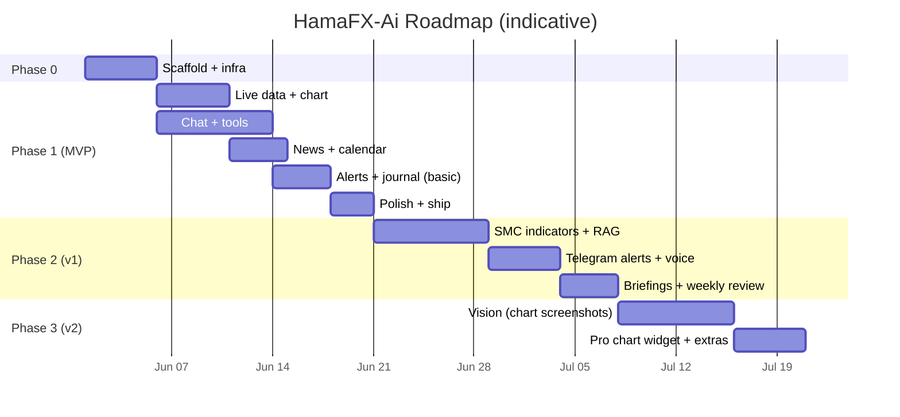

# 10 — Roadmap

> Personal-mode roadmap. Phases scoped by **value to you**. Each phase ends with a working, deployed product.

---

## Phase 0 — Scaffold (≈ 1 week)

**Goal**: empty-but-real project deploys to Vercel, password gate works, design system renders.

- [ ] pnpm + Turborepo monorepo per `03-project-structure.md`
- [ ] `packages/config` (eslint, prettier, tsconfig, tailwind preset)
- [ ] `packages/shared` skeletons (zod schemas)
- [ ] `apps/web` Next.js 15 + Tailwind v4 + shadcn init + theme tokens
- [ ] Supabase project + Drizzle initial migration (no Auth, no RLS)
- [ ] Upstash Redis (cache only)
- [ ] Vercel project + minimal CI (`lint typecheck test`)
- [ ] `/api/auth/login` + `/login` page + middleware cookie gate
- [ ] `.env.example` complete and documented

**Exit criteria**: visiting any URL on the deploy redirects to `/login`; entering `APP_PASSWORD` lets you in; the app shell renders on mobile.

---

## Phase 1 — MVP (≈ 4 weeks)

**Goal**: a focused chat-driven assistant with charts, indicators, news, calendar, alerts, journal — for XAUUSD/EURUSD/GBPUSD only.

### Phase 1a — Live data & chart

- [ ] Twelve Data REST adapter (price + candles)
- [ ] Finnhub fallback adapter
- [ ] Polling hook (`use-prices`, `use-candles`) via TanStack Query
- [ ] `lightweight-charts` wrapper + multi-timeframe URL state
- [ ] Indicator engine MVP (EMA, SMA, RSI, MACD, ATR, Bollinger, pivots)
- [ ] `/api/market/*` routes with Upstash caching
- [ ] Mobile shell with bottom nav and command palette

### Phase 1b — Chat & tools

- [ ] Chat thread schema + persistence
- [ ] Vercel AI SDK v5 wired with Gateway
- [ ] Tools: `get_price`, `get_candles`, `get_indicators`, `analyze_technical`, `analyze_fundamental`, `get_news`, `get_calendar`, `set_alert`, `log_journal`, `annotate_chart`, `search_knowledge`
- [ ] Custom UI parts per tool
- [ ] Auto-titled threads
- [ ] `chat_telemetry` recording (tokens, model, ms, est-cost)
- [ ] Manual run of the **10 acceptance prompts** from `00-overview.md`

### Phase 1c — News & calendar

- [ ] Marketaux + Finnhub adapters
- [ ] Trading Economics + FRED adapters
- [ ] **Vercel Cron** `/api/cron/news` (every 5 min) and `/api/cron/calendar` (every 15 min)
- [ ] News page + Calendar page
- [ ] Sentiment chips
- [ ] News RAG (pgvector) wired to `search_knowledge`

### Phase 1d — Alerts & journal (basic)

- [ ] Alert rule schema (price-cross, indicator-cross, candle-close)
- [ ] **Vercel Cron** `/api/cron/alerts` (every 1–2 min)
- [ ] Email delivery (Resend free tier)
- [ ] Journal CRUD UI + basic stats

### Phase 1e — Polish + ship

- [ ] Mobile Lighthouse passes (perf ≥ 90, a11y ≥ 95)
- [ ] PWA install + offline shell
- [ ] Empty / error / stale states everywhere
- [ ] `/settings/usage` page (token spend)
- [ ] Re-run the 10 prompts; fix top failures
- [ ] You start using it daily

**Exit criteria**: you've used it for 3 consecutive days and it solved a real question each day.

---

## Phase 2 — v1 (≈ 2–3 weeks)

**Goal**: depth where it matters — smart-money structure, RAG-grounded answers, voice, briefings.

- [ ] SMC / ICT structure module: swings, BOS/CHoCH, order blocks, FVG, liquidity sweeps
- [ ] Chart annotation overlays for the above (agent can draw them via `annotate_chart`)
- [ ] **Telegram bot** for alerts (faster than email, easier than web push)
- [ ] Voice input (Web Speech API)
- [ ] Pre-event and post-event briefings (cron + LLM, persisted as messages in a "briefings" thread)
- [ ] Auto-fill journal from chat ("Journal: I shorted…")
- [ ] Weekly review (LLM-authored from journal stats; runs Sunday)

---

## Phase 3 — v2 (≈ 2 weeks)

**Goal**: multimodal + breadth.

- [ ] Vision: drop a chart screenshot, get analysis
- [ ] Cross-pair correlation + DXY proxy module
- [ ] Optional **TradingView Advanced Charting Widget** view (gated by config)
- [ ] CoT (CFTC) report ingestion (weekly cron)
- [ ] Sharable analysis snapshots (private link with cookie-gated read access)
- [ ] Optional Web Push as a 2nd alert channel

---

## Stretch / parking lot

- Add a separate **worker** on Fly.io if/when sub-second WS becomes worth it.
- Backtest narration tool (no full lab UI — just describe a rule, get historical performance).
- Add USDJPY / AUDUSD / USDCAD if you actively trade them (still keep total ≤ 6 instruments).
- Native mobile (Expo) reusing UI hooks.

## Definition of "done" per phase

| Phase | Done when…                                                       |
| ----- | ----------------------------------------------------------------- |
| 0     | You can log into the deploy and see a styled empty shell.         |
| 1     | You've used it daily for a week and your 10 acceptance prompts pass. |
| 2     | You stopped using your old workflow because this is enough.       |
| 3     | You drop chart screenshots and get useful analysis without typing.|
