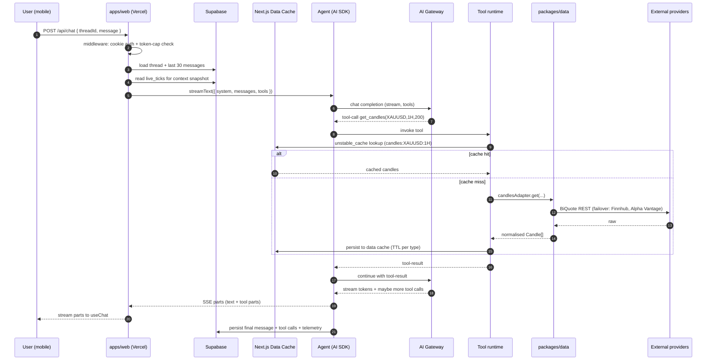
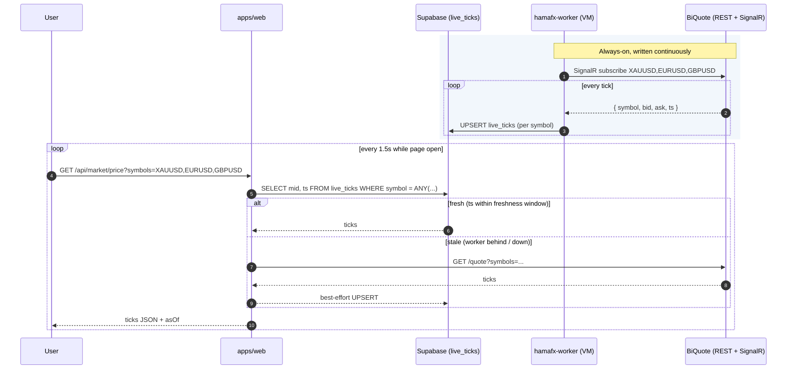
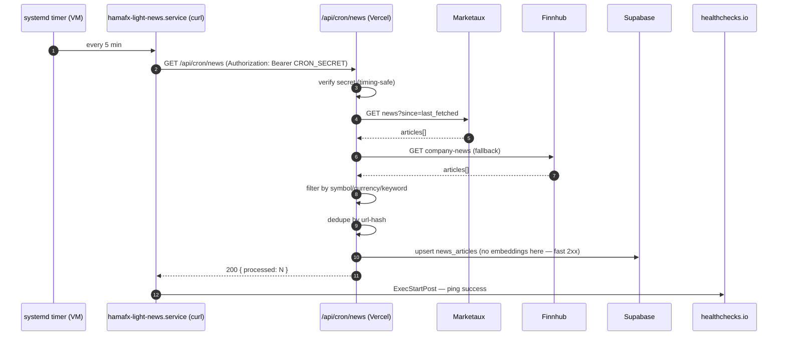
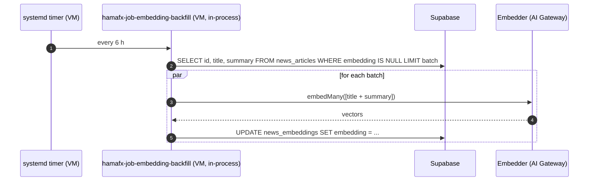
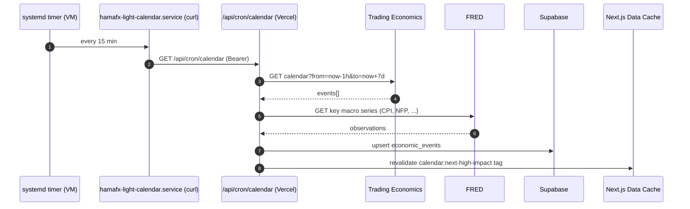
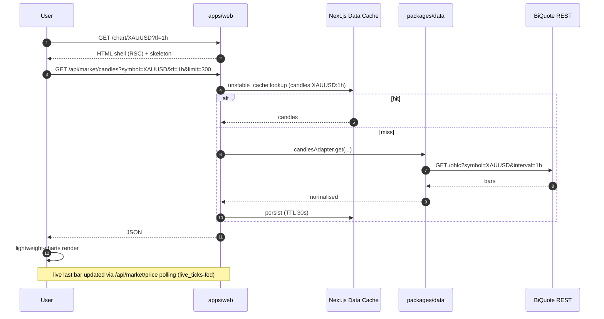
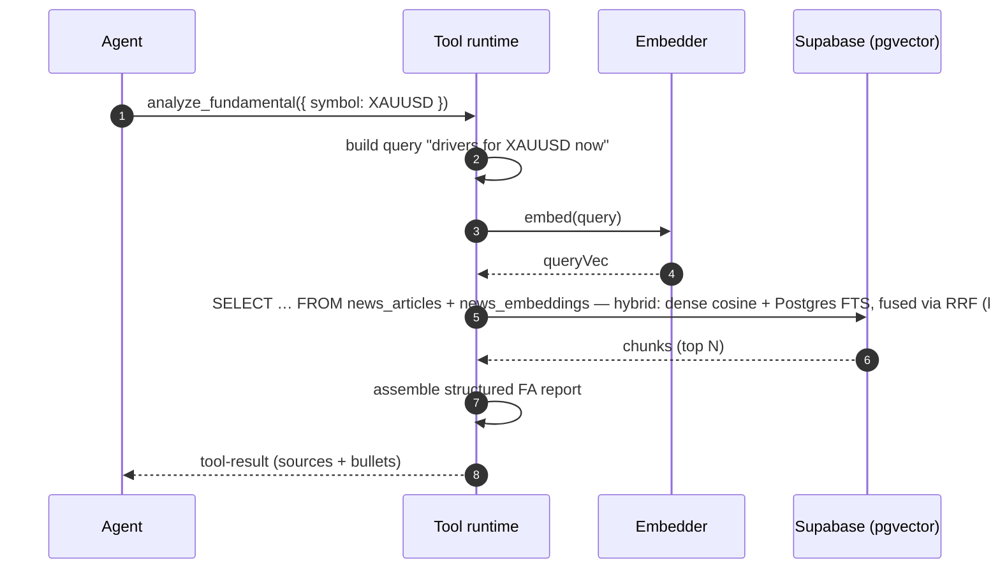
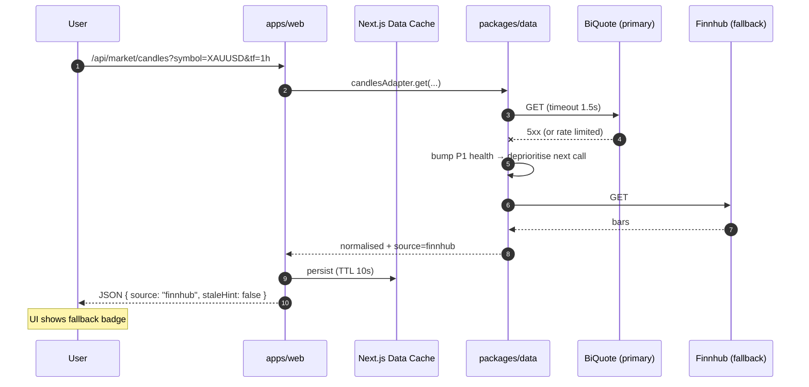

# 13 — Data Flow

> Sequence diagrams for every flow that crosses two or more layers. If you're adding a new flow, draw the sequence first, then implement.
>
> Personal-mode reminders (post Phase 8):
>
> - Two deployments: Vercel (`apps/web`) + one GCE VM (`apps/worker`).
> - Cache is the **Next.js Data Cache** (`unstable_cache` + fetch-cache) behind a `Cache` interface in `packages/data/src/cache`.
> - Live prices come from the worker's BiQuote SignalR consumer writing into `live_ticks` (Postgres). REST is a degraded-mode fallback.
> - Heavy scheduled work runs in-process inside `hamafx-worker.service`. Light Vercel-poke crons fire `curl` against `/api/cron/*` from systemd timers on the VM.

## 1. Chat turn (full lifecycle)



## 2. Live price tile (worker-fed, REST fallback)



When the worker is healthy, `/api/market/price` is a single Postgres lookup. The REST fallback exists so the UI keeps working through worker outages.

## 3. News ingestion pipeline (VM-driven)



Embeddings are decoupled — `hamafx-job-embedding-backfill.timer` runs every 6 h on the worker and fills `news_embeddings.embedding` for any rows still NULL. That keeps the Vercel route under the 60 s ceiling and lets the heavier embedding pass take its time on the VM.



## 4. Economic calendar refresh (light cron)



The `fred-actuals` heavy job (worker, daily 01:30 UTC) backfills `economic_events.actual` once the prints land — light cron writes the schedule, heavy job patches the values.

## 5. Alert evaluation loop (light cron)

```mermaid
sequenceDiagram
    autonumber
    participant T as systemd timer (VM)
    participant Light as hamafx-light-alerts.service (curl)
    participant W as /api/cron/alerts (Vercel)
    participant DB as Supabase
    participant N as Notifier (email/Telegram/web push)
    participant U as User device

    T->>Light: every 5 min
    Light->>W: GET /api/cron/alerts (Bearer)
    W->>DB: SELECT active alerts
    W->>DB: SELECT latest live_ticks
    par evaluate each rule
      W->>W: rule.match(price, indicators)
      alt match
        W->>DB: mark alert fired (set firedAt; idempotent)
        W->>N: send notification(s)
        N-->>U: email / Telegram / push
      end
    end
```

`/api/cron/alerts` marks `firedAt` only after the notifier returns 2xx, so a duplicate fire from a hand-run `curl` during incident response is safe.

## 6. Chart load (cold)



For 1m candles specifically, the worker's aggregator emits closes into `candles_1m` so the chart never has to roundtrip to BiQuote for the most-recent minute — see `apps/worker/src/aggregator/candle-1m.ts`.

## 7. Setting an alert from chat

```mermaid
sequenceDiagram
    autonumber
    participant U as User
    participant A as Agent
    participant T as Tool runtime
    participant DB as Supabase
    participant Cron as hamafx-light-alerts (VM)

    U->>A: "Alert me if XAUUSD 1H closes < 2378"
    A->>A: parse intent
    A->>T: set_alert({ symbol: XAUUSD, rule: { type: closeBelow, tf: 1h, level: 2378 } })
    T->>DB: insert alerts row
    DB-->>T: { alertId }
    T-->>A: tool-result
    A-->>U: "Alert set ✓ — I'll notify when 1H closes below 2 378."

    Note over Cron: every 5 minutes
    Cron->>DB: read alerts; evaluate against live_ticks
    Cron-->>U: notification on trigger
```

## 8. RAG retrieval inside `analyze_fundamental`



`search_knowledge` widens recall to the memory index (`memory_embeddings.kind ∈ {journal, briefing, thread_synopsis}`) when called with `kinds: [...]`. See `packages/ai/src/rag.ts`.

## 9. Login & first load

```mermaid
sequenceDiagram
    autonumber
    participant U as User
    participant W as apps/web

    U->>W: GET /chat
    W->>W: middleware reads `hfx_auth` cookie
    alt no/invalid cookie
      W-->>U: 302 /login
      U->>W: POST /api/auth/login { password }
      W->>W: timing-safe compare to APP_PASSWORD
      alt match
        W-->>U: Set-Cookie hfx_auth=<signed>; HttpOnly; Secure; 30d
        W-->>U: 302 /chat
      else mismatch
        W-->>U: 401 (with login rate-limit headers)
      end
    else valid cookie
      W-->>U: render
    end
```

## 10. Failure: provider down, graceful degrade



The per-provider rolling success/error window in `runWithFailover` keeps a flapping primary from being retried first on the next call. Adaptive 429 backoff lowers the in-memory bucket cap to ~80 % for a cool-off window then recovers. Both encode the "stale-while-error" rule from `06-data-sources.md`: when everything fails, the most recent cached value is returned with `meta.stale = true` up to the SWR ceiling.
