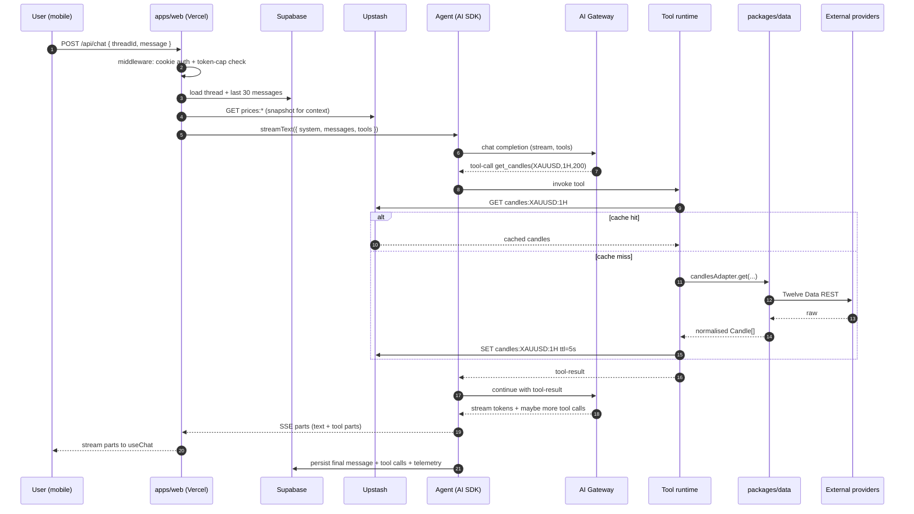
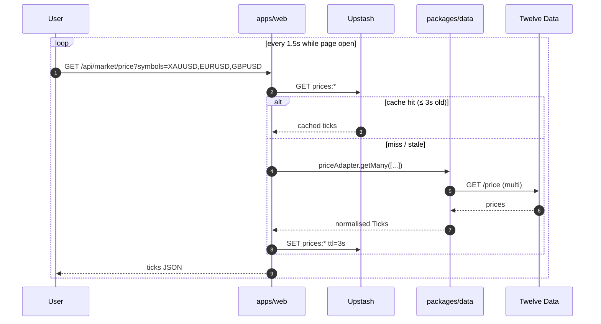
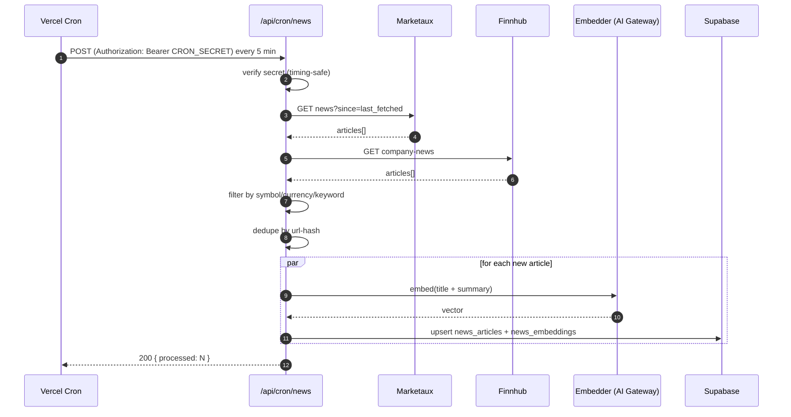
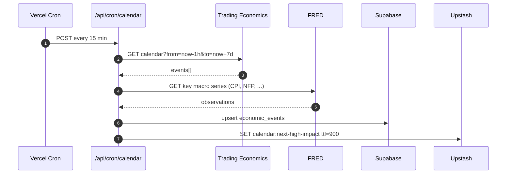
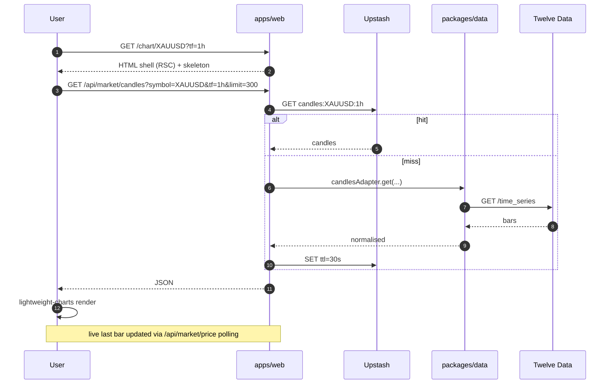
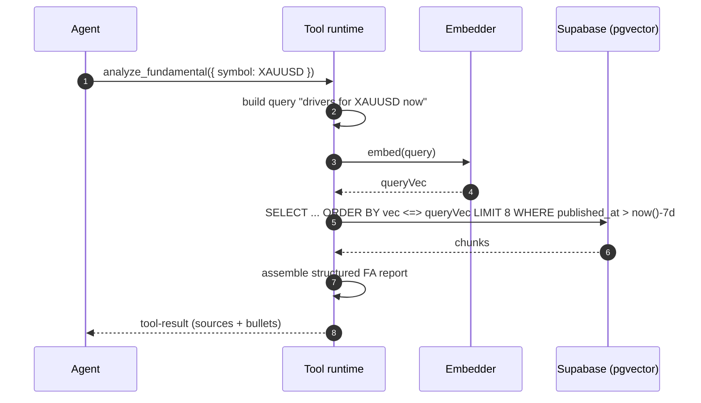

# 13 — Data Flow

> Sequence diagrams for every flow that crosses two or more layers. If you're adding a new flow, draw the sequence first, then implement.
>
> Personal-mode: there is **no worker** — everything runs inside the Next.js deploy. Cron is **Vercel Cron**.

## 1. Chat turn (full lifecycle)



## 2. Live price tile (polling)



The 1–2 s polling cadence is gentle on free-tier providers because the cache absorbs most of it (only one Vercel function instance refetches per TTL window).

## 3. News ingestion pipeline (Vercel Cron)



## 4. Economic calendar refresh (Vercel Cron)



## 5. Alert evaluation loop (Vercel Cron)

```mermaid
sequenceDiagram
    autonumber
    participant V as Vercel Cron
    participant W as /api/cron/alerts
    participant DB as Supabase
    participant R as Upstash
    participant N as Notifier (email/Telegram)
    participant U as User device

    V->>W: POST every 1 min (Pro) / 2-5 min (Hobby)
    W->>DB: SELECT active alerts
    W->>R: read latest cached prices
    par evaluate each rule
      W->>W: rule.match(price, indicators)
      alt match
        W->>DB: mark alert fired (set firedAt; idempotent)
        W->>N: send notification(s)
        N-->>U: email / Telegram message
      end
    end
```

## 6. Chart load (cold)



## 7. Setting an alert from chat

```mermaid
sequenceDiagram
    autonumber
    participant U as User
    participant A as Agent
    participant T as Tool runtime
    participant DB as Supabase
    participant V as Vercel Cron (later)

    U->>A: "Alert me if XAUUSD 1H closes < 2378"
    A->>A: parse intent
    A->>T: set_alert({ symbol: XAUUSD, rule: { type: closeBelow, tf: 1h, level: 2378 } })
    T->>DB: insert alerts row
    DB-->>T: { alertId }
    T-->>A: tool-result
    A-->>U: "Alert set ✓ — I'll notify when 1H closes below 2 378."

    Note over V: later (every minute)
    V->>DB: read alerts; evaluate
    V-->>U: notification on trigger
```

## 8. RAG retrieval inside `analyze_fundamental`



## 9. Login & first load

```mermaid
sequenceDiagram
    autonumber
    participant U as User
    participant W as apps/web

    U->>W: GET /chat
    W->>W: middleware reads `hfx_auth` cookie
    alt no/invalid cookie
      W-->>U: 302 /login
      U->>W: POST /api/auth/login { password }
      W->>W: timing-safe compare to APP_PASSWORD
      alt match
        W-->>U: Set-Cookie hfx_auth=<signed>; HttpOnly; Secure; 30d
        W-->>U: 302 /chat
      else mismatch
        W-->>U: 401 (with login rate-limit headers)
      end
    else valid cookie
      W-->>U: render
    end
```

## 10. Failure: provider down, graceful degrade


