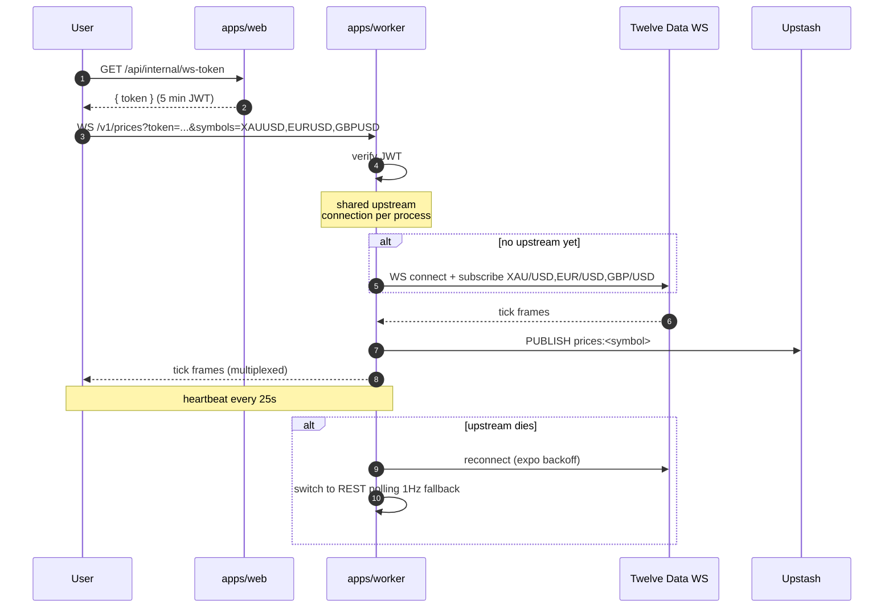
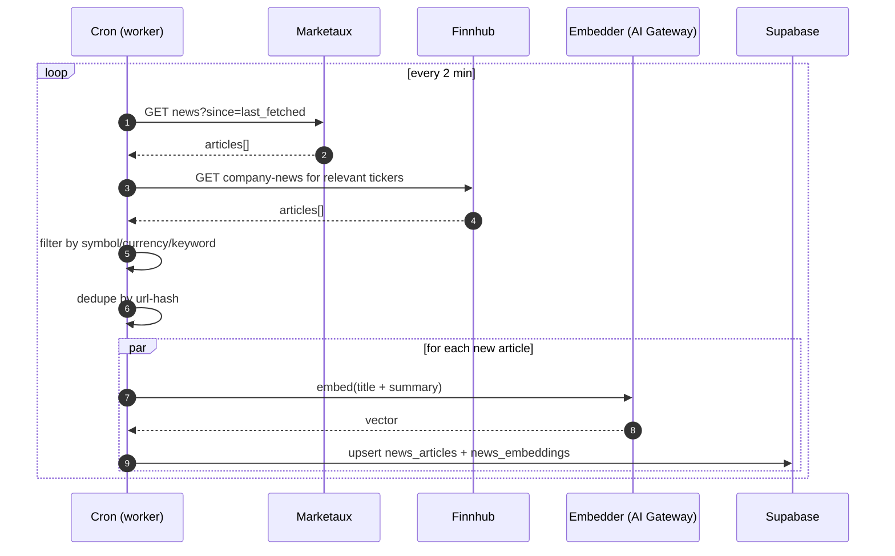
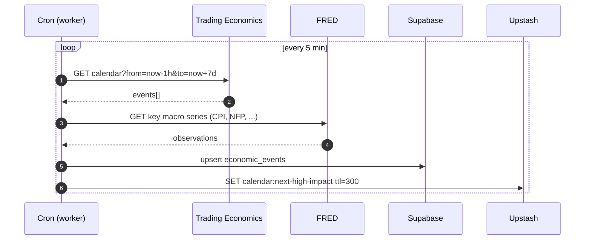
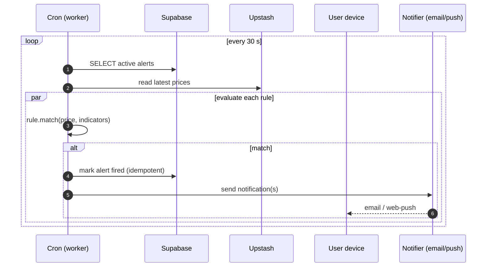
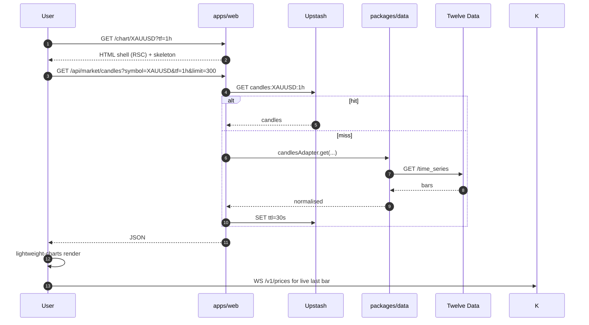
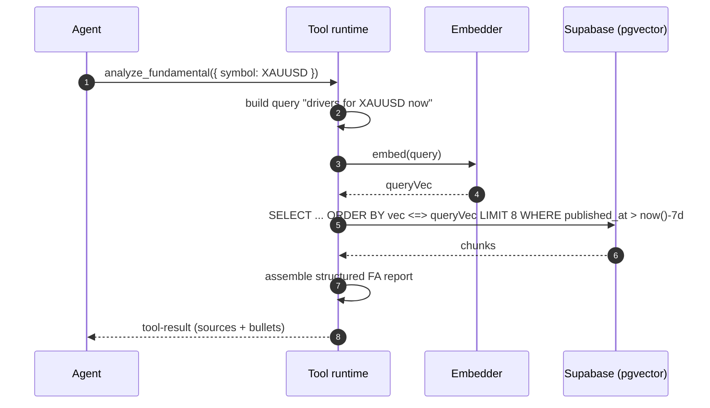
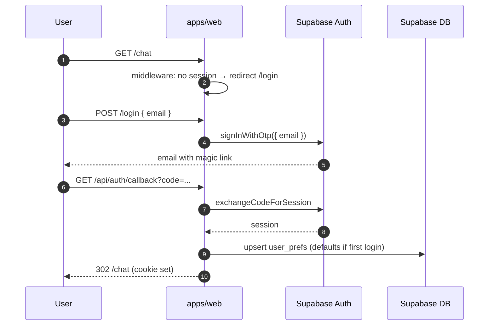
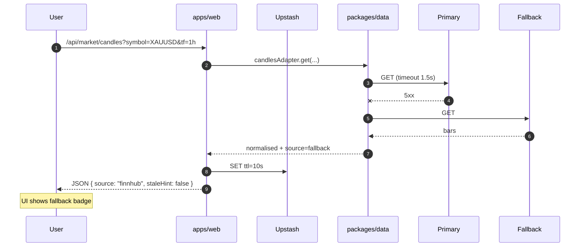

# 13 — Data Flow

> Sequence diagrams for every flow that crosses two or more layers. If you're adding a new flow, draw the sequence first, then implement.

## 1. Chat turn (full lifecycle)


## 2. Live price stream (WebSocket fan-out)



## 3. News ingestion pipeline (cron)



## 4. Economic calendar refresh



## 5. Alert evaluation loop



## 6. Chart load (cold)



## 7. Setting an alert from chat

```mermaid
sequenceDiagram
    autonumber
    participant U as User
    participant A as Agent
    participant T as Tool runtime
    participant DB as Supabase
    participant W as Worker (cron)

    U->>A: "Alert me if XAUUSD 1H closes < 2378"
    A->>A: parse intent
    A->>T: set_alert({ symbol: XAUUSD, rule: { type: closeBelow, tf: 1h, level: 2378 } })
    T->>DB: insert alerts row (idempotency-keyed)
    DB-->>T: { alertId }
    T-->>A: tool-result
    A-->>U: "Alert set ✓ — I'll notify when 1H closes below 2 378."

    Note over W: later
    W->>DB: read alerts; evaluate
    W-->>U: notification on trigger
```

## 8. RAG retrieval inside `analyze_fundamental`



## 9. Auth & first-load



## 10. Failure: provider down, graceful degrade


