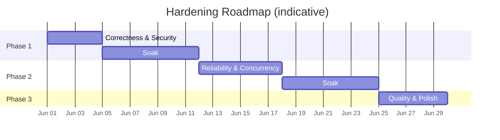

# 18 — Hardening Roadmap

> Post-Phase-8 stabilisation work. Three phases that take the system from "feature-complete" to **production-grade** for a single power user. Each phase ends with a system that is measurably more correct, more reliable, or more pleasant to use.

This doc is an **index**. The detailed work plans live in:

- [`15-hardening-phase-1-correctness.md`](./15-hardening-phase-1-correctness.md)
- [`16-hardening-phase-2-reliability.md`](./16-hardening-phase-2-reliability.md)
- [`17-hardening-phase-3-quality.md`](./17-hardening-phase-3-quality.md)

## Origin

Senior-engineer review of the codebase against production-readiness criteria for: maintainability, reliability, simplicity, scalability, clarity, consistency, plus the AI/agent-specific concerns (hallucination risk, context overflow, prompt injection, tool misuse, memory issues, token efficiency, silent failures).

55 issues found. 44 actioned across these three phases. 11 trivial / explicit-trade-off items noted in the review but not promoted to work items.

## Sequencing

**Total calendar:** ≈ 5 weeks for one senior engineer, including soak windows between phases.

## Phase summary

| #   | Phase                          | Issues | Eff. days | Theme                                                                                                                       |
| --- | ------------------------------ | ------ | --------- | --------------------------------------------------------------------------------------------------------------------------- |
| 1   | Correctness & Security         | 12     | 3-4       | Things that produce **wrong behavior**, **wrong data**, or weakened security today. Most are 1-2 line fixes.                |
| 2   | Reliability & Concurrency      | 9      | 5-6       | Things that work fine on a quiet day but **break under load, during outages, or after long uptime**.                        |
| 3   | Quality & Polish               | 23     | 5         | Things that aren't broken but **drag on developer experience, cost, or UX polish**. Each item small in isolation; together they raise the floor. |

## Why the phases are ordered this way

1. **Correctness first.** Wrong data + double-writes + auth bugs erode trust. Fix these before anything else, even if the system "works" for now.
2. **Reliability second.** Once we're sure the system is right when it works, we make it work under stress. Fixing reliability before correctness can mask bugs (e.g. retries hiding a race condition).
3. **Polish last.** Quality work is reversible and rarely critical. Doing it before the foundation is solid produces nice-looking code that breaks under real conditions.

## Cross-cutting themes

These appear in multiple phases and should be tracked as standing principles:

### Atomicity

- **Phase 1 §7:** atomic budget counter (no read-then-decide race).
- **Phase 1 §8:** memory upsert via `INSERT ON CONFLICT DO UPDATE`.
- **Phase 1 §9:** all multi-statement persistence pairs in transactions.
- **Phase 2 §5:** Postgres-backed throttle counter (atomic increment).

### Per-request context (no module-global state)

- **Phase 3 §1:** `AsyncLocalStorage`-backed tool context replaces `setX(...)` setters.
- **Phase 3 §3:** `AbortSignal` propagation through tool calls.
- **Phase 3 §4:** budget snapshot cached per turn.

### Single canonical layer

- **Phase 2 §7:** one cache layer, not two.
- **Phase 3 §6:** one regex source for verification.
- **Phase 3 §18:** one provider catalogue (Twelve Data fully retired).

### Observability

- **Phase 2 §1:** systemd watchdog + healthchecks UUID per process.
- **Phase 3 §2:** uniform tool telemetry via wrapper.
- **Phase 3 §12:** journald JSON output in production.

## What's deliberately not in scope

- **Multi-user features.** Personal-mode is a hard rule from `docs/00-overview.md`.
- **New features.** Hardening only fixes existing surface area.
- **Re-architecture.** No new packages, no provider swaps, no framework upgrades.
- **Phase 9 candidates** (proactive setup scanner, paper-trading, etc.) — these belong in `docs/10-roadmap.md`, not here.

## Definition of done (whole roadmap)

- [ ] All three phase plans' `Definition of done` checklists complete.
- [ ] No new Sentry error class introduced for 2 weeks after Phase 3 ships.
- [ ] `docs/01-architecture.md`, `docs/05-ui-ux.md`, `docs/07-ai-agent.md`, `docs/14-ai-agent-handoff.md` all reflect the post-hardening conventions.
- [ ] One additional eval-suite run on a stable production deploy passes 100%.

## How to use this doc

1. Working on a hardening item → open the per-phase doc and find the matching `§` heading.
2. Adding a new issue you want to land later → propose it as a §X under the right phase, with severity, fix, acceptance criteria, tests, and rollback. Match the existing format.
3. Re-prioritising → move §X between phases by editing both the source and target docs and updating the cross-phase summary table at the bottom of [`17-hardening-phase-3-quality.md`](./17-hardening-phase-3-quality.md).
