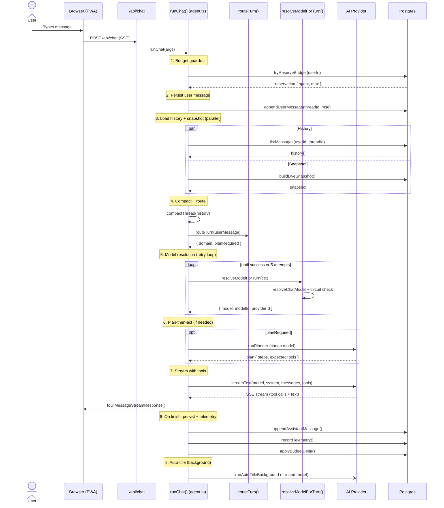
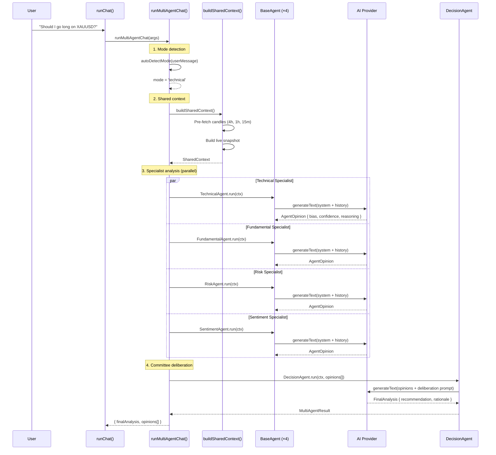
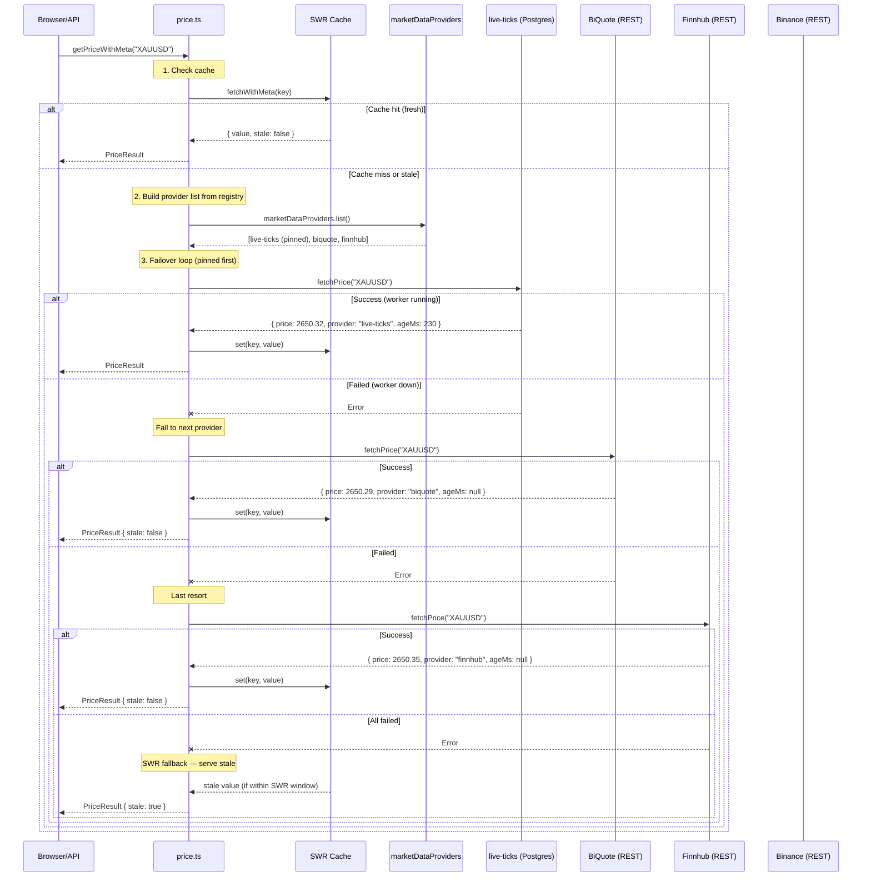

# Sequence Diagrams

> **P2-6** — Architecture audit fix. Mermaid sequence diagrams for the three most complex flows in the system.

---

## 1. Full Chat Turn Lifecycle



---

## 2. Multi-Agent Orchestration Flow



---

## 3. Market Data Failover Flow



### Provider Registry OCP Compliance

Adding a new market data provider (e.g., Polygon.io) requires:

1. Implement `MarketDataProvider` interface
2. Register: `marketDataProviders.register(polygonProvider)`
3. No changes to `price.ts` adapter code

```typescript
// Example: adding Polygon.io as a provider
const polygonProvider: MarketDataProvider = {
  name: 'polygon',
  label: 'Polygon.io (REST)',
  pinned: false,
  async fetchPrice(symbol, opts) {
    // ... fetch from Polygon API
    return { price, provider: 'polygon', ageMs: null };
  },
};
marketDataProviders.register(polygonProvider);
```

---

*Generated as part of the comprehensive SOLID architecture audit of HamaFX-Ai (P2-6).*
