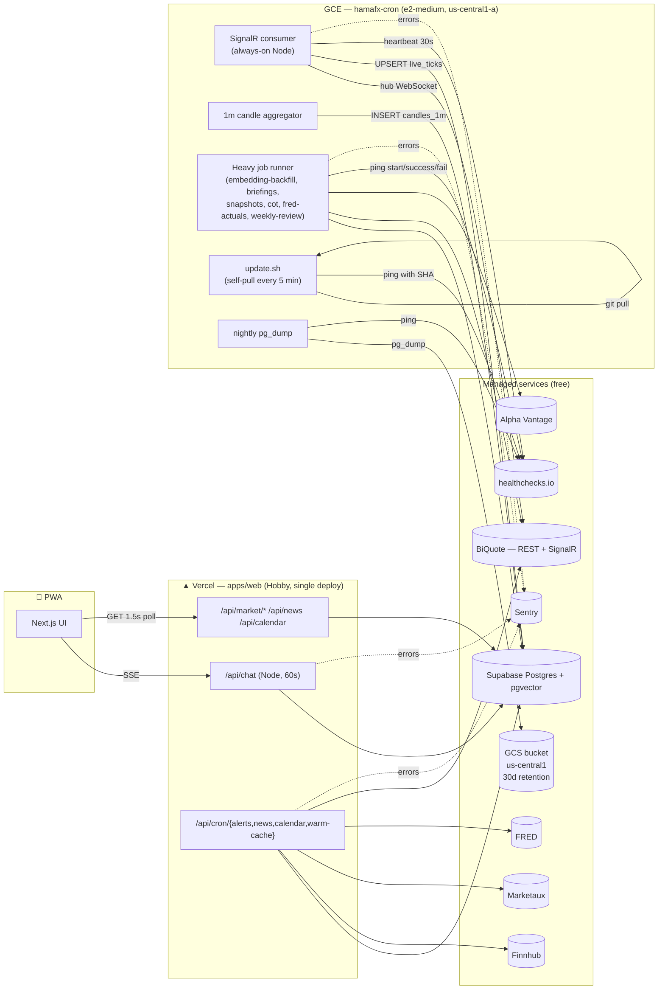
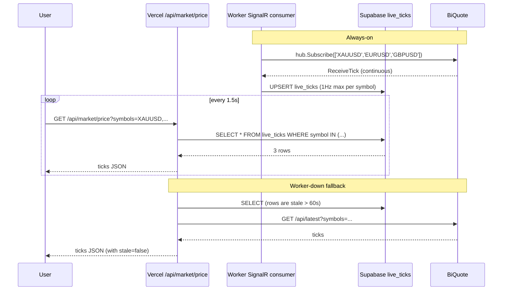
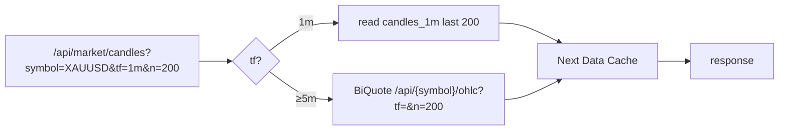

# Phase 8 — Backend Reliability (free-tier worker on GCE)

> Design spec. Written 2026-05-27.
>
> **Status**: design. Implementation plan follows once approved.
> **Owners**: single-user app — design author + repo owner.
> **Predecessors**: Phase 7 (`docs/10-roadmap.md`).

## 1 — Goal

Make HamaFX-Ai's data and scheduled-work paths reliable enough to host
proactive features (setup scanner, prediction loop, paper-trading) on top
of, **without paying for Vercel Pro, Upstash paid tier, or any paid
market-data subscription**. Achieve this by:

1. Replacing Twelve Data with [BiQuote](https://biquote.io) as the
   primary market-data source (free, no API key, REST + SignalR).
2. Upgrading the existing GCE cron VM from `e2-small` → `e2-medium`
   and turning it into a real lightweight worker that holds a
   persistent SignalR connection to BiQuote and runs heavy scheduled
   jobs locally.
3. Backing up the database off-site, instrumenting unhandled errors,
   and pinging healthchecks.io from every load-bearing job.

The Vercel app keeps the chat surface, the read APIs, and the lightweight
crons. The worker holds the always-on connection and the heavy work.

## 2 — Non-goals (explicit)

- **No second VM, no managed-cluster failover.** Single VM with
  self-healing systemd. If it dies, Vercel falls back to direct BiQuote
  REST polling — degraded but not down.
- **No multi-region.** us-central1 only.
- **No Upstash dependency.** Env vars stay accepted but unused.
- **No paid market-data tier.** Twelve Data API key is removed.
- **No multi-user concepts.** No `user_id` columns, no RLS, no per-user
  rate limiting (steering rule §8 unchanged).
- **No `/api/chat` migration.** It stays on Vercel; Hobby's 60s limit is
  accepted. If we hit it, escape hatch is "move chat handler to worker"
  — not in v1.
- **No tick history table.** `live_ticks` is a 3-row snapshot table; we
  don't store every tick. If we ever need replay precision, we add a
  retention-pruned `ticks` table later — reversible.
- **No Cloudflare R2 or second-cloud backup.** GCS in us-central1 only
  at v1. Adding R2 is one extra `gcloud storage cp` command if we ever
  need it.
- **No paging surface beyond email.** Healthchecks.io and Sentry both
  email; Telegram/Slack alerts are not wired at v1.

## 3 — Architecture

### 3.1 Topology



### 3.2 What lives where

| Concern | Vercel | Worker (VM) |
| --- | --- | --- |
| `/api/chat` (SSE chat) | ✅ | — |
| `/api/market/price` (read live_ticks) | ✅ | — |
| `/api/market/candles` (read candles_1m + BiQuote OHLC) | ✅ | — |
| `/api/market/indicators`, `/api/market/structure` | ✅ | — |
| `/api/news`, `/api/calendar`, `/api/alerts`, `/api/journal` | ✅ | — |
| `/api/cron/news`, `/api/cron/calendar`, `/api/cron/alerts`, `/api/cron/warm-cache` | ✅ | — |
| BiQuote SignalR consumer (always-on) | — | ✅ |
| 1m candle aggregator | — | ✅ |
| `embedding-backfill`, `briefings`, `snapshots`, `cot`, `fred-actuals`, `weekly-review` | — | ✅ |
| Nightly `pg_dump` → GCS | — | ✅ |
| Weekly verification restore | — | ✅ |
| Self-update (`update.sh`) | — | ✅ |

### 3.3 Read path (the live-price loop)



The fallback is the existing failover mechanism with a `live_ticks-staleness` adapter slotted in front. **No new code path on read** — the
provider chain becomes `live_ticks (≤60s) → BiQuote REST → Finnhub → Alpha Vantage`.

## 4 — Components

### 4.1 `apps/worker/` (new)

A small Node service. **Single concept per file** (steering rule §3 file
placement table is unchanged for `apps/web`; the worker gets its own
section in `docs/03-project-structure.md`).

```
apps/worker/
  package.json           # name: @hamafx/worker, type: module, scripts: build / start / test
  tsconfig.json          # extends config/tsconfig
  src/
    index.ts             # process bootstrap: env validation, signal handlers, child-runner orchestration
    env.ts               # zod-validated env (importing CRON_SECRET, DATABASE_URL, BIQUOTE_HUB_URL, etc.)
    log.ts               # structured logger w/ request-id + commit-sha tags
    sentry.ts            # @sentry/node init (server-only); guards on SENTRY_DSN
    healthchecks.ts      # tiny client: ping(uuid, status: 'start' | 'success' | 'fail', body?)
    signalr/
      consumer.ts        # SignalRConsumer — connects, subscribes, dispatches ReceiveTick
      reconnect.ts       # exponential backoff + jitter; max 60s
      tick-buffer.ts     # in-memory ring buffer; coalesces to ≤1Hz per symbol
    aggregator/
      candle-1m.ts       # in-process 1m bar builder; emits CandleClosed events
      flush.ts           # writes closed bars to candles_1m via Drizzle
    persistence/
      live-ticks.ts      # UPSERT live_ticks (1Hz throttle)
      candles-1m.ts      # INSERT ... ON CONFLICT (symbol, t) DO NOTHING
    jobs/
      index.ts           # registry: name → JobFn
      embedding-backfill.ts
      briefings.ts
      snapshots.ts
      cot.ts
      fred-actuals.ts
      weekly-review.ts
    runner/
      cli.ts             # `node dist/runner/cli.js <job>` — invoked by systemd timers
      schedule.ts        # crontab-equivalent table for documentation; systemd is the actual scheduler
  test/
    consumer.test.ts     # mocks @microsoft/signalr; asserts tick dispatch
    candle-1m.test.ts    # property: closing prices & volumes match feed
    aggregator-flush.test.ts
```

The worker imports from the same workspace packages as the web app:
`@hamafx/shared`, `@hamafx/db`, `@hamafx/data`, `@hamafx/ai`,
`@hamafx/indicators`. Steering rule §4 (no deep imports across packages)
is preserved.

#### 4.1.1 `index.ts` orchestration

```ts
// pseudocode — final source matches steering rule §4 conventions
async function main() {
  const env = loadEnv();
  initSentry(env);
  const log = createLogger({ service: 'worker', commit: env.DEPLOYED_SHA });

  const consumer = new SignalRConsumer({
    hubUrl: env.BIQUOTE_HUB_URL,
    symbols: SUPPORTED_SYMBOLS,
    onTick: (t) => {
      tickBuffer.push(t);
      aggregator.feed(t);
      hb.heartbeat();
    },
    onClosed: (bar) => flushCandle(bar),
  });

  await consumer.start();
  setInterval(() => flushLiveTicks(tickBuffer.drain()), 1_000);
  registerSignalHandlers(consumer);
}
```

#### 4.1.2 SignalR client

Use `@microsoft/signalr@^8`. The consumer:

- Builds a `HubConnectionBuilder().withUrl(BIQUOTE_HUB_URL).withAutomaticReconnect([0, 2_000, 5_000, 10_000, 30_000])`.
- On `onreconnecting`/`onclose`, logs to journald + Sentry breadcrumb (not as an error unless reconnect fails for >5min).
- After `start()`, calls `Subscribe([SUPPORTED_SYMBOLS])`. On reconnect, re-subscribes.
- `ReceiveTick` handler validates against a zod `BiquoteTickSchema` (lives in `packages/shared/src/schemas/biquote.ts`); invalid ticks are logged and dropped.
- `tick-buffer.ts` keeps the latest tick per symbol and emits to `live-ticks.ts` at most once per second per symbol.

#### 4.1.3 1m candle aggregator

In-process, deterministic from the tick stream:

- Per symbol, holds the current open bar `{ t, o, h, l, c, ticks }`.
- On every tick: update `h = max(h, mid)`, `l = min(l, mid)`, `c = mid`, `ticks++`.
- On minute rollover (`Math.floor(now/60000)` changes): emit `CandleClosed`, start a new bar with `o = c = mid`.
- `flush.ts` `INSERT ... ON CONFLICT (symbol, t) DO NOTHING` so duplicate writes are safe (idempotent restart).
- Volume is `null` for FX (matches `CandleSchema`); `tickVolume` is the count.

The aggregator is the **source of truth for 1m bars**. Higher TFs still come from BiQuote `/api/{symbol}/ohlc`, cached via `@hamafx/data`.

#### 4.1.4 Heavy job runner

Each job is a single `async function run({ env, log, hc, signal }): Promise<void>`. The CLI takes a job name, validates the name against the registry, pings healthchecks `start` → runs → pings `success` or `fail` with body containing duration, error message, commit SHA.

`systemd` invokes `node dist/runner/cli.js <name>` with timeouts:

| Job | Cadence | Timeout |
| --- | --- | --- |
| `embedding-backfill` | every 6h | 10 min |
| `briefings` | every 5 min | 2 min |
| `snapshots` | 00:05 UTC daily | 5 min |
| `cot` | Friday 22:00 UTC | 2 min |
| `fred-actuals` | 01:30 UTC daily | 2 min |
| `weekly-review` | Sunday 18:00 UTC | 5 min |

Each job is **idempotent** (re-running doesn't double-insert). Steering
rule on cron handlers (§F in `14-ai-agent-handoff.md`) is preserved by
moving the same logic — not rewriting it. The Vercel routes are kept as
"manual fallback" routes: same code path, callable with the cron secret.
That gives us a one-command emergency override if the worker is down.

### 4.2 BiQuote provider adapter

New: `packages/data/src/providers/biquote/`.

```
biquote/
  rest.ts        # GET /api/{symbol}, /api/latest, /api/{symbol}/ohlc, /api/{symbol}/history
  ws.ts          # SignalR client used by apps/worker — exposed here so it lives next to the REST client
  map.ts         # toProviderSymbol(internal) → 'XAUUSD' | 'EURUSD' | 'GBPUSD' (BiQuote uses our internal codes directly)
  schema.ts      # BiquoteTickSchema, BiquoteOhlcBarSchema (zod, live in packages/shared/src/schemas/biquote.ts; re-exported here)
  filter.ts      # symbol whitelist; refuses to fetch unsupported symbols
```

Wired into the failover order in `packages/data/src/failover.ts`:

```ts
// Before
const PRICE_PROVIDERS = ['twelve-data', 'finnhub', 'alpha-vantage'];

// After
const PRICE_PROVIDERS = ['live-ticks', 'biquote', 'finnhub', 'alpha-vantage'];
const CANDLE_PROVIDERS = ['candles-1m', 'biquote', 'finnhub', 'alpha-vantage'];
```

Where:
- `live-ticks` is a pseudo-provider that reads the `live_ticks` table and is "healthy" if `now - ts < 60s`.
- `candles-1m` is a pseudo-provider that reads `candles_1m` and is "healthy" if a bar within the last 90s exists.
- `biquote` is the BiQuote REST adapter (used both as a fallback for live data and as the primary higher-TF candle source).
- `finnhub` and `alpha-vantage` stay as today.
- **`twelve-data` is removed.** Its key is deleted from `.env.example` and `apps/web/src/lib/env.ts`. The provider directory is deleted.

The existing health-aware failover, single-flight, SWR, adaptive
throttle from Phase 7a all keep working — they're provider-name-keyed
and don't care that the provider list changed.

### 4.3 New DB tables

Migration `0XXX_phase-8-live-data.sql`:

```sql
CREATE TABLE live_ticks (
  symbol      TEXT PRIMARY KEY,         -- 'XAUUSD' | 'EURUSD' | 'GBPUSD'
  bid         DOUBLE PRECISION NOT NULL,
  ask         DOUBLE PRECISION NOT NULL,
  mid         DOUBLE PRECISION NOT NULL,
  ts          BIGINT NOT NULL,           -- ms epoch UTC
  source      TEXT NOT NULL,             -- 'biquote-signalr' | 'biquote-rest' | …
  updated_at  TIMESTAMPTZ NOT NULL DEFAULT now()
);

CREATE TABLE candles_1m (
  symbol       TEXT NOT NULL,
  t            BIGINT NOT NULL,          -- bar open time, ms epoch UTC
  o            DOUBLE PRECISION NOT NULL,
  h            DOUBLE PRECISION NOT NULL,
  l            DOUBLE PRECISION NOT NULL,
  c            DOUBLE PRECISION NOT NULL,
  v            DOUBLE PRECISION,         -- nullable for FX
  tick_volume  INTEGER NOT NULL,
  source       TEXT NOT NULL DEFAULT 'biquote-signalr',
  created_at   TIMESTAMPTZ NOT NULL DEFAULT now(),
  PRIMARY KEY (symbol, t)
);

CREATE INDEX idx_candles_1m_symbol_t ON candles_1m (symbol, t DESC);
```

Retention: `candles_1m` is pruned to last 14 days via the `snapshots`
nightly job. 14d × 3 symbols × 1440 bars = 60,480 rows — trivial.

### 4.4 GCS backup target

```
gs://hamafx-backups-${PROJECT_ID}/
  db/YYYY-MM-DD.dump.gz                  # nightly pg_dump (custom format, gzipped) — 30d retention
  journal/YYYY-MM-DD.json                # nightly journal-only export — 90d retention
  verify/last-success.txt                # weekly verification: timestamp + SHA + row counts
```

Bucket lifecycle policy (gcloud-managed):

```yaml
lifecycle:
  rule:
    - action: { type: Delete }
      condition: { age: 30, matchesPrefix: ['db/'] }
    - action: { type: Delete }
      condition: { age: 90, matchesPrefix: ['journal/'] }
```

Bucket is **single-region us-central1** so intra-region egress from the
VM is free. Storage class **Standard** (Nearline isn't cheaper for our
volume given retrieval costs during a restore).

IAM: a service account `hamafx-cron@${PROJECT_ID}.iam.gserviceaccount.com`
already attached to the VM is granted `roles/storage.objectAdmin` on this
bucket (and **only** this bucket). No project-wide GCS access.

### 4.5 Observability wiring

`packages/shared/src/healthchecks.ts` (new): a 30-line client.

```ts
export async function ping(
  uuid: string,
  status: 'start' | 'success' | 'fail' = 'success',
  body?: string,
): Promise<void> {
  const url = `https://hc-ping.com/${uuid}${status === 'success' ? '' : `/${status}`}`;
  try {
    await fetch(url, {
      method: body ? 'POST' : 'GET',
      body,
      signal: AbortSignal.timeout(5_000),
    });
  } catch {
    /* never throw from a heartbeat */
  }
}
```

Each load-bearing process owns one healthcheck UUID:

| UUID env var | Owner | Cadence |
| --- | --- | --- |
| `HC_SIGNALR_UUID` | worker SignalR consumer | every 30s heartbeat |
| `HC_BACKUP_DB_UUID` | nightly pg_dump | daily |
| `HC_BACKUP_JOURNAL_UUID` | nightly journal export | daily |
| `HC_VERIFY_RESTORE_UUID` | weekly verification | weekly |
| `HC_UPDATE_UUID` | self-update timer | per-update (POST body = SHA) |
| `HC_JOB_<NAME>_UUID` | each heavy job | per-cadence |
| `HC_LIGHT_<NAME>_UUID` | light Vercel cron | per-cadence |

Sentry: `@sentry/nextjs` for `apps/web` (server-only — the client SDK
is **not** included to avoid the bundle hit; we add `clientConfig: false`
in the wizard) and `@sentry/node` for `apps/worker`. Tags:

```ts
Sentry.setTags({
  service: 'web' | 'worker',
  route: process.env.NEXT_PUBLIC_VERCEL_REGION || 'worker',
  commit_sha: process.env.VERCEL_GIT_COMMIT_SHA || readDeployedSha(),
});
```

The middleware already mints `X-Request-Id` (Phase 7a). We pass it through
on every fetch from web to worker (none yet, but reserved) and stamp it
on Sentry events as `request_id`.

### 4.6 Self-updating worker

`/opt/hamafx/update.sh`:

```bash
#!/usr/bin/env bash
set -euo pipefail

cd /opt/hamafx/app
PREV_SHA=$(git rev-parse HEAD)

git fetch --quiet origin main
NEW_SHA=$(git rev-parse origin/main)

[[ "$PREV_SHA" == "$NEW_SHA" ]] && exit 0

git reset --hard origin/main

if ! pnpm install --frozen-lockfile; then
  curl -fsS "https://hc-ping.com/${HC_UPDATE_UUID}/fail" --data "install failed at $NEW_SHA"
  git reset --hard "$PREV_SHA"
  exit 1
fi

if ! pnpm --filter @hamafx/worker build; then
  curl -fsS "https://hc-ping.com/${HC_UPDATE_UUID}/fail" --data "build failed at $NEW_SHA"
  git reset --hard "$PREV_SHA"
  pnpm install --frozen-lockfile  # restore previous state
  exit 1
fi

if ! pnpm --filter @hamafx/worker test --run; then
  curl -fsS "https://hc-ping.com/${HC_UPDATE_UUID}/fail" --data "tests failed at $NEW_SHA"
  git reset --hard "$PREV_SHA"
  pnpm install --frozen-lockfile
  pnpm --filter @hamafx/worker build
  exit 1
fi

echo "$NEW_SHA" > /opt/hamafx/.deployed-sha
sudo systemctl restart hamafx-worker
curl -fsS "https://hc-ping.com/${HC_UPDATE_UUID}" --data "applied $NEW_SHA"
```

Triggered by a systemd timer every 5 min. The worker reads
`/opt/hamafx/.deployed-sha` at startup and tags it on every Sentry event
+ healthcheck POST.

### 4.7 systemd unit topology

Replaces the current crontab:

```
/etc/systemd/system/
  hamafx-worker.service           # Type=simple, ExecStart=/usr/bin/node /opt/hamafx/app/apps/worker/dist/index.js
                                  # Restart=always, RestartSec=5
                                  # MemoryMax=2G (cgroup OOM kill before host OOM)
                                  # WatchdogSec=120 (worker pings sd_notify every 30s)

  hamafx-job-embedding-backfill.service  # Type=oneshot, ExecStart=/usr/bin/node …/cli.js embedding-backfill
  hamafx-job-embedding-backfill.timer    # OnCalendar=0/6:00:00, RandomizedDelaySec=60

  hamafx-job-briefings.service / .timer
  hamafx-job-snapshots.service / .timer
  hamafx-job-cot.service / .timer
  hamafx-job-fred-actuals.service / .timer
  hamafx-job-weekly-review.service / .timer

  hamafx-backup-db.service / .timer       # 03:00 UTC daily
  hamafx-backup-journal.service / .timer  # 03:05 UTC daily
  hamafx-verify-restore.service / .timer  # Sunday 04:00 UTC

  hamafx-update.service / .timer          # every 5 min, RandomizedDelaySec=30

  hamafx-light-cron-{news,calendar,alerts,warm-cache}.service / .timer  # curl Vercel
```

`Wants=` and `After=` ordering: heavy job timers wait for `hamafx-worker.service` to be active. If the worker is dead, the heavy jobs run anyway because they read DB independently, but they ping `fail` if they can't.

## 5 — Data flow changes

### 5.1 Live price (already shown in 3.3)

Read path becomes `live_ticks → BiQuote REST → Finnhub → Alpha Vantage`.
The 1.5s polling cadence on the client doesn't change. End-to-end
freshness is **sub-second worst case** when the worker is up (vs ~3s
today), and **same as today** when the worker is down.

### 5.2 Candles



5m candles are aggregated on the fly from `candles_1m` only if BiQuote
is unavailable (and warn `stale=true`). Default path is BiQuote's own
OHLC — they aggregate it; we don't duplicate the work.

### 5.3 Heavy jobs

Same SQL, same external API calls, same downstream effects. The only
change is **where the code runs** (VM instead of Vercel function). The
Vercel `/api/cron/<name>/route.ts` files remain as fallback handlers
behind `withCronAuth` so we can manually invoke them with `curl
-H 'Authorization: Bearer $CRON_SECRET' …` if the worker is down. They
import from the same workspace packages — single source of truth.

## 6 — Failure modes & recovery

| What fails | Symptom | Recovery |
| --- | --- | --- |
| Worker process crashes | systemd restarts within 5s; `hamafx-worker` watchdog catches hung loops at 120s | automatic |
| Worker host (VM) reboots | systemd restarts everything on boot; ~2 min of degraded prices (Vercel falls back to BiQuote REST) | automatic |
| BiQuote SignalR disconnects | `withAutomaticReconnect` retries with backoff; healthcheck `fail` after 5 min of no ticks | automatic / email alert |
| BiQuote down entirely | failover to Finnhub for FX; XAUUSD degraded to last-cached + Finnhub OANDA proxy | already implemented |
| Supabase down | worker buffers up to 60s of ticks in memory, drops oldest if full; healthcheck `fail` | manual: check Supabase status |
| Self-update breaks `main` | `update.sh` rolls back to previous SHA, healthcheck `fail` | fix `main`, next 5-min tick redeploys |
| Backup fails | healthcheck `fail` → email | manual: run `pg_dump` from local; investigate next morning |
| GCS bucket reaches 5 GB free quota | older dumps already deleted via lifecycle (30d); shouldn't happen at <100 MB/day | monitor |
| Worker out of memory | systemd `MemoryMax=2G` cgroup-kills the runaway process; main worker survives if killed process is a heavy-job child | automatic |

A `infra/cron-vm/RECOVERY.md` doc lists exact commands for: worker
won't start, restore from yesterday's backup, swap to a fresh VM,
revoke service-account key.

## 7 — Cost & quotas

| Component | Cost / month | Free quota headroom |
| --- | --- | --- |
| GCE `e2-medium` | ~$15–17 (sustained-use discount in us-central1) | n/a |
| GCS bucket (us-central1, single-region, Standard) | ~$0.00 | 5 GB free; we use ~2.5 GB max |
| Supabase Postgres (free) | $0 | 500 MB free; current ~80 MB; +20 MB for new tables |
| BiQuote API | $0 | unauthenticated, fair-use unknown — we self-throttle hard |
| Finnhub | $0 | 60 rpm; we cap at 30 rpm |
| Alpha Vantage | $0 | 25/day; backup only |
| Marketaux | $0 | ~100/day; we cap at 60 |
| FRED | $0 | generous |
| Vercel AI Gateway | $3–15 | usage-based, unchanged |
| healthchecks.io | $0 | 20 checks free; we use ~12 |
| Sentry | $0 | 5,000 errors/month; we expect <100 |
| **Total** | **~$18–32/mo** | |

Net delta vs today: **+$9 to +$11/mo** (e2-small → e2-medium). No new
SaaS bills.

## 8 — Migration plan (high level)

The implementation plan (next deliverable, written by the writing-plans
skill) will sequence this. The shape we're committing to:

1. **VM upgrade** — `gcloud compute instances stop hamafx-cron`,
   `gcloud compute instances set-machine-type hamafx-cron
   --machine-type=e2-medium --zone=us-central1-a`, `start`. Update
   `infra/cron-vm/README.md` machine-type row.
2. **Provider swap (additive)** — add the BiQuote adapter, wire it as
   the new primary, **keep Twelve Data wired** as a fallback during
   migration. Verify on a deploy. Once stable, remove Twelve Data.
3. **DB migrations** — `live_ticks`, `candles_1m`, indexes, retention
   job tweak.
4. **Worker scaffold** — `apps/worker/` package, env validation, log,
   sentry, healthchecks. Empty `index.ts` that just connects to the
   hub and logs ticks. Deploy via `git pull` (manually first, then via
   `update.sh` once tested).
5. **SignalR consumer + 1m aggregator** — wire to `live_ticks` and
   `candles_1m`. Verify with the chart page.
6. **Read path swap** — `/api/market/price` reads `live_ticks` first,
   falls back to BiQuote REST. `/api/market/candles?tf=1m` reads
   `candles_1m`.
7. **Heavy job migration** — one job at a time. Each PR moves one job
   to the worker, keeps the Vercel route as fallback, adds the
   healthcheck UUID. Six PRs total.
8. **systemd timers + self-update** — replace crontab with systemd
   units. `update.sh` deployed last (it changes the deploy mechanism).
9. **Backups + verification** — GCS bucket, IAM, pg_dump job, journal
   export job, weekly verification job.
10. **Sentry + healthchecks finalised** — DSN added to Vercel +
    worker env, all UUIDs created and wired.
11. **Drop Twelve Data** — delete `packages/data/src/providers/twelve-data/`,
    remove env var from `.env.example` and `apps/web/src/lib/env.ts`,
    update `docs/06-data-sources.md` matrix.
12. **Docs** — update `01-architecture.md`, `06-data-sources.md`,
    `08-backend-and-api.md`, `09-deployment.md`, `10-roadmap.md`,
    `infra/cron-vm/README.md`, add `infra/cron-vm/RECOVERY.md`. Add a
    new `04-features.md` row for "Live tick stream via BiQuote SignalR."

Each step is independently shippable and reversible.

## 9 — Risks accepted

- **BiQuote is a free, unauthenticated, no-SLA service.** If they pull
  it or rate-limit aggressively, we revert to Finnhub primary +
  manual price polling. Mitigation: full failover is already in place;
  worker degrades gracefully.
- **Single VM is a SPOF for sub-second freshness.** Accepted; Vercel
  REST fallback covers degraded mode. If we ever care about <1s
  freshness during VM outages, we add a second VM.
- **`/api/chat`'s 60s ceiling stays.** Plan-then-act fundamental turns
  occasionally hit 35–50s. If we cross 60s in the wild, escape hatch
  is documented (move chat handler to worker).
- **Self-update can ship a bad SHA**, but the rollback logic + tests
  on the worker mean the running worker survives. Worst case: worker
  pinned to old SHA until `main` is fixed. Email alert via
  healthchecks.io.
- **Supabase Free 500 MB cap.** We're at ~80 MB; new tables add ~20 MB
  steady. Embedding tables are the growth driver — already managed by
  retention. If we ever cross 80% of cap, paid tier is $25/mo —
  separate decision.

## 10 — Open questions (none blocking)

- BiQuote's exact rate-limit policy: not documented. We'll observe and
  set our internal cap to half of whatever we see them tolerate.
  Initial conservative cap: 10 REST/min per symbol. SignalR is one
  persistent connection so it's not in the REST budget.
- Whether to expose `live_ticks` data in the chart page's
  `<StaleIndicator>`. Probably yes — the indicator already exists,
  we just need the worker's "last tick was Xs ago" signal exposed via
  `/api/market/price`. Implementation detail; not a design decision.
