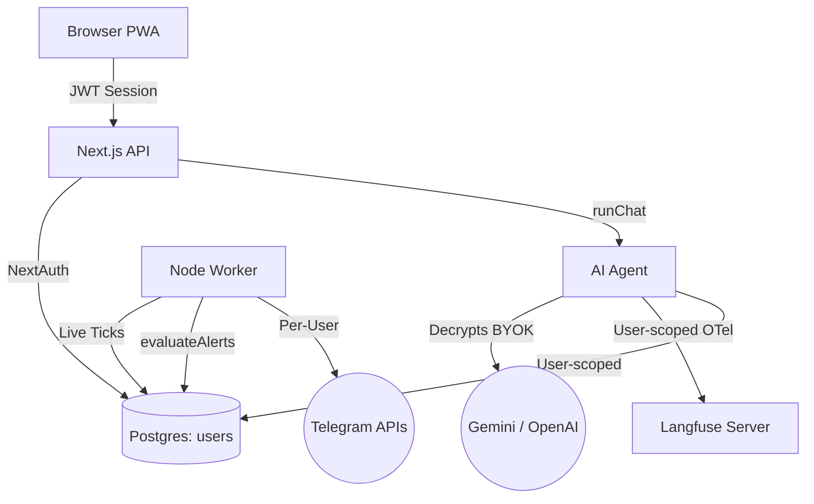

# HamaFX-Ai → Open Source Multi-User Transformation

> **Master Plan Index**
> This document is the top-level index for the complete transformation of HamaFX-Ai from a single-user personal trading copilot into a multi-user, self-hosted, open-source project.

---

## 1. Executive Summary & Decision Record

To successfully transition from a single-user personal tool to an open-source, multi-tenant platform, several core architectural decisions have been finalized:

| Architectural Area | Final Decision | Rationale |
|--------------------|----------------|-----------|
| **Authentication** | NextAuth.js (Auth.js v5) | Provides a flexible, self-hosted standard with no SaaS vendor lock-in. |
| **Open Source License**| Apache 2.0 | Permissive, encourages adoption, while offering patent protections. |
| **Deployment Model** | Self-hosted only | Each cloned instance acts as a silo for one team/org, reducing complexity. |
| **AI Keys (LLMs)** | Bring Your Own Key (BYOK) | The platform will not act as a proxy for billing. Each user inputs their own Gemini/OpenAI keys. |
| **User Roles** | Flat Hierarchy | No complex admin/user/viewer roles. Everyone has equal trading copilot access. |
| **Market Instruments** | Unlimited | Moving away from hardcoded (XAUUSD, EURUSD) to any symbol the provider supports. |
| **Telegram & Briefings**| Per-User Multiplexed | Each user configures their own bot token and receives briefings for their own watchlist. |

---

## 2. Transformation Phases (The Plan Documents)

The transformation is broken down into 10 detailed, actionable plans located in this directory. 

### Phase A: Foundation (Weeks 1-3)
These items must be executed first as they block all downstream work.
*   **[01-authentication.md](./01-authentication.md)**: Replacing the single `APP_PASSWORD` with NextAuth.js, adding credentials/OAuth, JWT edge-compatible sessions, and encrypted BYOK API key storage.
*   **[02-database-schema.md](./02-database-schema.md)**: Upgrading the Drizzle ORM schema to introduce `users`, `user_settings`, and `user_symbols`. Injecting `user_id` foreign keys into 10 existing tables (threads, journals, alerts, etc.) and implementing application-level Row Level Security.

### Phase B: Core Multi-Tenancy (Weeks 3-6)
*   **[03-api-backend.md](./03-api-backend.md)**: Refactoring all 37 API routes to extract `userId` from NextAuth JWTs. Transitioning from in-memory IP rate-limiting to Postgres-backed per-user rate limiting.
*   **[04-ai-agent.md](./04-ai-agent.md)**: Upgrading the `runChat` orchestrator. The AI agent will now dynamically resolve LLM providers based on the user's decrypted BYOK keys, track daily spending against the user's personal budget, and isolate RAG memory embeddings per user.

### Phase C & D: User Experience & Infrastructure (Weeks 5-9)
*   **[05-frontend.md](./05-frontend.md)**: Building the new auth screens (login/register), an onboarding flow (watchlist & BYOK setup), and a comprehensive settings dashboard. Removing all hardcoded "personal copilot" branding to fit an enterprise-grade dark aesthetic.
*   **[06-worker-infra.md](./06-worker-infra.md)**: Overhauling the background Node.js worker. SignalR will now dynamically subscribe to the union of all users' watchlists. Alert evaluations and scheduled briefings will be multiplexed and delivered via each user's unique Telegram/email configurations. Includes Docker Compose V2 setup.

### Phase E: Quality, Stability, and Open Source (Weeks 8-12)
*   **[07-testing.md](./07-testing.md)**: Introducing Playwright for critical E2E flows (registration, BYOK setup, trading). Migrating all 64 existing Vitest suites to inject `user_id` context and prove cross-user isolation.
*   **[08-open-source.md](./08-open-source.md)**: The OSS launch checklist. Adding `LICENSE`, `CONTRIBUTING.md`, `CODE_OF_CONDUCT.md`, GitHub issue/PR templates, and removing leaked GCP project IDs from `.env.example`.
*   **[09-cleanup-stability.md](./09-cleanup-stability.md)**: System hardening. Standardizing error boundaries, sanitizing logs to prevent PII leaks, mitigating IDOR vulnerabilities, and removing dead code.
*   **[10-migration-rollout.md](./10-migration-rollout.md)**: The zero-downtime data migration strategy, backward compatibility guide (legacy auth mode), feature flags, and detailed Gantt timeline.

### Phase F: Observability (Optional Add-on)
*   **[2026-06-18-langfuse-integration.md](./2026-06-18-langfuse-integration.md)**: Implementing Langfuse for LLM observability. Adding a self-hosted `langfuse-server` alongside Postgres in Docker Compose, and wiring up OpenTelemetry (`@langfuse/otel`) natively through the Vercel AI SDK. Traces will be explicitly tagged with `userId` for multi-tenant segmenting.

**Total estimated effort: 14–22 weeks** (with parallelization, can compress to 10–14 weeks)

---

## 3. Guiding Principles

1.  **Backward compatible where possible** — existing single-user deployments should continue to work during migration with a `AUTH_MODE=legacy` flag.
2.  **Shared data stays shared** — market data (ticks, candles, news, calendar, CoT) is inherently global. User-owned data (threads, journals, alerts, memory) is isolated.
3.  **BYOK-first** — the platform doesn't hold API keys centrally. Each user manages their own provider credentials.
4.  **Self-hosted simplicity** — `docker compose up` should result in a working, production-ready multi-user instance.
5.  **No vendor lock-in** — NextAuth.js for auth, Postgres for DB, no proprietary Vercel/Supabase-only services required.
6.  **Test-driven boundaries** — every multi-tenant boundary gets an integration test proving that User A cannot access User B's data.

---

## 4. Target Architecture

