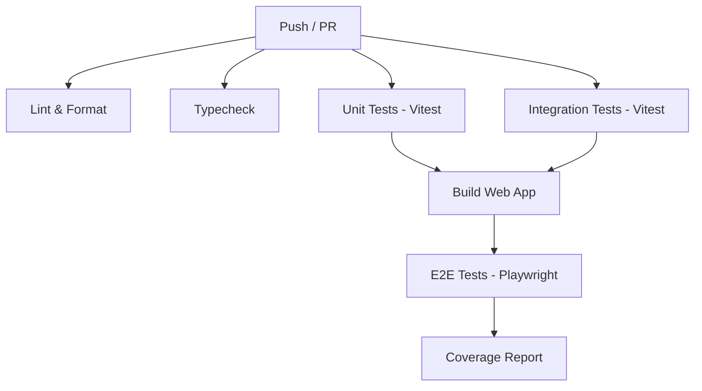

# Plan 07: Testing Overhaul

This document details the strategy for upgrading the testing infrastructure and test suites in HamaFX-Ai to support the multi-user architecture. It covers the migration of existing tests, the introduction of E2E testing with Playwright, and new multi-user isolation scenarios.

## 1. Current State

The current test suite is built entirely around single-user assumptions:
- **Scope**: 64 test files, ~350 test cases, using Vitest exclusively.
- **Distribution**: `packages/ai` (19), `packages/data` (15), `apps/worker` (16), `apps/web` (2), `packages/shared` (several), `packages/indicators` (several).
- **Web App**: Only 2 test files (API payload size, auth).
- **E2E Testing**: Non-existent (no Playwright/Cypress).
- **Multi-user Testing**: Non-existent. No Row-Level Security (RLS) or tenant isolation tests.
- **CI Pipeline**: A simple linear pipeline: `lint` → `typecheck` → `test`.
- **AI Eval Harness**: 15 acceptance prompts, CLI-only, not integrated into CI.
- **Test Patterns**: Provider mocking via DI, tool testing via direct execution.
- **Auth**: Tests assume a single user and use a single-user cookie.

## 2. Multi-User Test Requirements

Moving to a multi-user model requires rigorous testing to ensure data isolation, proper access control, and fair resource usage.

### 2.1 Unit Tests (Vitest)

Unit tests need to validate core business logic with user context:
- **Auth**: Registration, login flows, NextAuth JWT creation/validation, BYOK key encryption/decryption mechanisms.
- **User Scoping**: Every database query helper must be tested to ensure the `userId` filter is applied correctly.
- **Budget**: Per-user budget isolation tests (user A's daily spend does not increment user B's spend).
- **Memory/RAG**: Per-user memory isolation to prevent cross-contamination of user context.
- **Tool Context**: `userId` propagation through `AsyncLocalStorage` into AI tool execution.
- **Alert Delivery**: Ensure the correct user's notification configuration (e.g., Telegram chat ID) is resolved and used.

### 2.2 Integration Tests (Vitest)

Integration tests will verify the interaction between the application layers and the database:
- **API Routes**: Every Next.js API route tested with an authenticated user session.
- **Cross-User Isolation**: Explicit tests proving user A cannot read, update, or delete user B's threads, journals, or alerts.
- **Rate Limiting**: Enforce per-user rate limits (e.g., maximum chats per minute).
- **BYOK**: Model resolution using the user's specific API keys instead of global fallback keys.
- **Cron**: Per-user briefing generation, ensuring briefings are personalized per user's watchlist.

### 2.3 E2E Tests (Playwright - NEW)

End-to-End tests will simulate real user interactions in a browser environment.

- **Add Playwright**: Integrate Playwright into `apps/web`.
- **Test Flows**:
  - Registration → Email Verification → Login
  - Onboarding wizard completion
  - Create thread → Send message → Receive AI response
  - Journal CRUD operations
  - Alert CRUD operations
  - Symbol management and watchlist curation
  - Settings / BYOK key configuration
  - Logout
- **Multi-User Scenarios**: Two users interacting in parallel to verify UI data isolation.
- **Mobile Viewport Tests**: Ensure the responsive design works correctly on mobile devices.

### 2.4 Security Tests

- **CSRF**: Token validation on state-changing requests.
- **Auth Bypass**: Attempts to access protected routes without a valid session.
- **IDOR (Insecure Direct Object Reference)**: Attempts to access cross-user data by guessing IDs.
- **Rate Limiting**: Verification of correct enforcement under load.
- **SQL Injection**: Validation that Drizzle ORM parameterization prevents injection.
- **XSS Prevention**: Ensuring user input is sanitized before rendering in React.

### 2.5 Performance Tests

- **Query Performance**: Verify index usage on `user_id` columns for large datasets.
- **Concurrent User Simulation**: Load testing basic API routes.
- **Budget Atomicity**: Test budget increments under concurrent chat turns for the same user.

---

## 3. Test Infrastructure

### 3.1 Test Database

We will transition to using PGlite for fast, isolated, in-memory test databases in Node.js.

```typescript
// packages/db/src/test-utils.ts
import { PGlite } from '@electric-sql/pglite';
import { drizzle } from 'drizzle-orm/pglite';
import * as schema from './schema';

export async function createIsolatedDb() {
  const client = new PGlite();
  const db = drizzle(client, { schema });
  // Run migrations programmatically
  await migrate(db, { migrationsFolder: './migrations' });
  return { db, client };
}
```

**Seed Data Helpers:**
```typescript
export async function createTestUser(db: DbClient, overrides = {}) {
  const [user] = await db.insert(schema.users).values({
    email: `test-${Date.now()}@example.com`,
    passwordHash: 'hashed_password',
    ...overrides
  }).returning();
  return user;
}
```

### 3.2 Auth Test Helpers

Helper utilities to mock user sessions for Next.js App Router and API routes.

```typescript
// apps/web/test/auth-helpers.ts
export function mockNextAuthSession(userId: string) {
  vi.mock('next-auth/react', () => ({
    useSession: () => ({
      data: { user: { id: userId, email: 'test@example.com' } },
      status: 'authenticated',
    }),
  }));
}
```

### 3.3 CI/CD Pipeline Upgrade

The GitHub Actions pipeline will be expanded to run tasks in parallel and support Playwright.



**Pipeline enhancements:**
- Separate jobs for Unit, Integration, and E2E for speed.
- Playwright caching of browser binaries.
- Test coverage reporting with PR comments.
- Require passing tests and coverage thresholds for PR merges.
- Nightly full test run including the AI eval harness.

---

## 4. Test Coverage Targets

| Domain | Target Coverage | Current Status | Focus Areas |
|--------|----------------|----------------|-------------|
| `packages/ai` | 80%+ | ~65% | Tool execution isolation, multi-user memory |
| `packages/data` | 80%+ | ~70% | BYOK integration, rate limits |
| `packages/db` | 85%+ | ~50% | RLS, user_id scoping, budget atomicity |
| `apps/web` (API) | 90%+ | ~5% | Auth routes, CRUD routes |
| `apps/web` (E2E) | Critical Flows | 0% | Registration, Onboarding, Chat |
| `apps/worker` | 75%+ | ~60% | SignalR per-user streams, Cron briefings |

---

## 5. Existing Test Migration

The existing 64 test files must be migrated to include user context.

1. **Update Test Fixtures**: Add `userId` to all database inserts in tests.
2. **Update Auth Tests**: Replace single-user cookie logic with JWT/NextAuth session logic.
3. **Update AI Tests**: Pass mock `AsyncLocalStorage` context containing `userId` to `runChat()`.

---

## 6. Files to Create/Modify

| File Path | Action | Description |
|-----------|--------|-------------|
| `package.json` | Modify | Add Playwright dependencies, coverage scripts |
| `apps/web/playwright.config.ts` | Create | Playwright configuration |
| `apps/web/tests/e2e/auth.spec.ts` | Create | E2E registration/login flows |
| `apps/web/tests/e2e/chat.spec.ts` | Create | E2E chat flows |
| `apps/web/tests/e2e/isolation.spec.ts` | Create | Cross-user data isolation scenarios |
| `packages/db/src/test-utils.ts` | Create | PGlite setup and entity factories |
| `packages/db/src/queries/*.test.ts` | Modify | Add `userId` to all query tests |
| `packages/ai/src/tools/*.test.ts` | Modify | Pass `userId` via ALC to tools |
| `.github/workflows/ci.yml` | Modify | Expand pipeline for Playwright, split jobs |
| `apps/worker/src/cron/*.test.ts` | Modify | Test multi-user briefing generation |

---

## 7. Effort Estimate & Dependencies

| Task | Estimated Effort |
|------|------------------|
| Test DB Infrastructure (PGlite + Factories) | 1 day |
| Migrate existing unit/integration tests | 3 days |
| Add Playwright and initial E2E setup | 1 day |
| Implement E2E Core Flows | 3 days |
| Security & Isolation Tests | 2 days |
| CI/CD Pipeline Upgrade | 1 day |
| **Total** | **11 days** |

**Dependencies on other plans:**
- Depends on **01-database.md** (for schema with `user_id` columns).
- Depends on **02-auth.md** (for NextAuth session structure).
- Depends on **05-ai-and-byok.md** (for ALC context testing).
