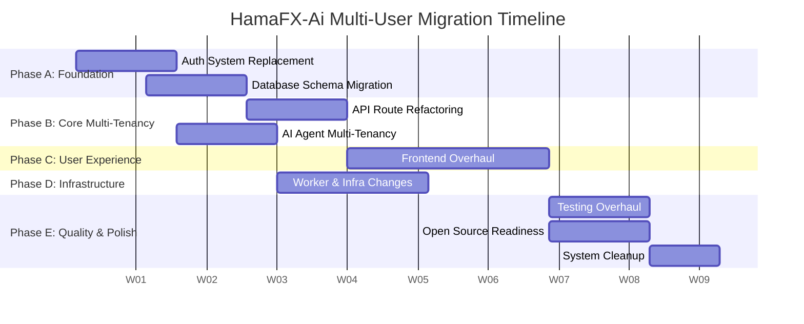

# 10. Migration & Rollout Strategy

This document outlines the phased execution plan, data migration strategy, and rollout process for transforming HamaFX-Ai from a single-user system to a multi-tenant open-source project. 

## 1. Execution Phases

The transformation spans 12 weeks, divided into five distinct phases across all 9 implementation plans.

### Phase A: Foundation (Weeks 1-3)
*What must be done first before anything else. These are blocking for everything else.*

| Plan Ref | Task | Description | Effort | Status |
|---|---|---|---|---|
| **02** | Database Schema | Add `user_id` to all tables, create `users`/`accounts` tables. | 1.5 wks | ⏳ Pending |
| **01** | Auth System | Implement NextAuth.js v5, basic user models, BYOK storage. | 1.5 wks | ⏳ Pending |

### Phase B: Core Multi-Tenancy (Weeks 3-6)
*Depends on Phase A. Focuses on making backend services multi-tenant aware.*

| Plan Ref | Task | Description | Effort | Status |
|---|---|---|---|---|
| **03** | API Routes | Refactor TRPC/REST APIs to scope all operations by `user_id`. | 1.5 wks | ⏳ Pending |
| **04** | AI Agent | Update `runChat`, inject user context, handle per-user memory/RAG. | 1.5 wks | ⏳ Pending |

### Phase C: User Experience (Weeks 5-8)
*Can partially overlap with Phase B. Focuses on the frontend.*

| Plan Ref | Task | Description | Effort | Status |
|---|---|---|---|---|
| **05** | Frontend Overhaul | Auth flows, settings pages (BYOK, Telegram), multi-tenant UI. | 3.0 wks | ⏳ Pending |

### Phase D: Infrastructure (Weeks 6-9)
*Can partially overlap with Phase C.*

| Plan Ref | Task | Description | Effort | Status |
|---|---|---|---|---|
| **06** | Worker & Infra | Multi-tenant Cron jobs, SignalR connection mapping, per-user briefings. | 2.5 wks | ⏳ Pending |

### Phase E: Quality & Polish (Weeks 8-12)
*Can run in parallel with the final stages of Phase D.*

| Plan Ref | Task | Description | Effort | Status |
|---|---|---|---|---|
| **07** | Testing Overhaul | E2E tests, multi-user isolation tests, mocking NextAuth. | 1.5 wks | ⏳ Pending |
| **09** | System Cleanup | Remove legacy single-user code, dead routes, global state. | 1.0 wks | ⏳ Pending |
| **08** | Open Source Readiness | Docs, Docker Compose multi-user setup, Apache 2.0 headers. | 1.5 wks | ⏳ Pending |

---

## 2. Data Migration Strategy

### 2.1 Existing Data (User Zero)
- All existing data belongs to 'user zero' (the original single user).
- The migration script creates a default user from the existing `APP_PASSWORD` or an env-provided admin email.
- Backfills the new `user_id` on all existing rows.
- Preserves all existing threads, journals, alerts, and memories without data loss.

### 2.2 Migration Script
The script runs within the Drizzle migration framework and must be idempotent.

**Execution Steps:**
1. Create `users`, `accounts`, `sessions` tables.
2. Create default user (email from env e.g., `ADMIN_EMAIL` or fallback to `admin@localhost`).
3. Add `user_id` columns to all existing tables (nullable initially).
4. Backfill `user_id = default_user_id` on all rows.
5. Alter columns to make `user_id` NOT NULL.
6. Add indexes on `user_id` across all tables.
7. Add foreign key constraints referencing `users(id)`.

**Example Drizzle Migration Concept:**
```sql
-- Step 3: Add nullable columns
ALTER TABLE "threads" ADD COLUMN "user_id" text;

-- Step 4: Backfill (handled in TS runner or pure SQL)
UPDATE "threads" SET "user_id" = (SELECT id FROM "users" WHERE email = 'admin@localhost');

-- Step 5: Enforce NOT NULL
ALTER TABLE "threads" ALTER COLUMN "user_id" SET NOT NULL;
```

### 2.3 Zero-Downtime Approach
To ensure safety for self-hosted instances updating their Docker containers:
- **Phase 1:** Schema updates: Add nullable `user_id` columns + backfill script execution.
- **Phase 2:** App deployment: Deploy code that writes `user_id` on all *new* rows while handling reads properly.
- **Phase 3:** Schema updates: Make columns NOT NULL and add foreign keys.
- **Phase 4:** Code cleanup: Remove old single-user code paths.

---

## 3. Backward Compatibility

### 3.1 Legacy Mode
To prevent immediate breakage for users updating without reading release notes:
- **Env Flag:** `AUTH_MODE=legacy` (keeps old single-password auth).
- **Behavior:** When `AUTH_MODE=legacy`, the system behaves exactly as before. `NextAuth` is bypassed, and requests default to "User Zero".
- **Default:** `AUTH_MODE=nextauth` for all new installations.
- **Deprecation Timeline:** Warn users in UI, remove legacy mode entirely after 6 months.

### 3.2 PGlite Compatibility
- All migration steps and queries must remain compatible with PGlite for local development and testing.
- PGlite lacks robust `pgvector` support out of the box in some environments → maintain the `real[]` fallback for vector embeddings.
- Ensure Drizzle queries don't rely on Postgres-only extensions unless conditionally wrapped.

---

## 4. Feature Flags

Introduce feature flags to allow gradual rollout and testing of the new architecture.

| Flag | Description | Default |
|---|---|---|
| `MULTI_USER_ENABLED` | Toggles UI routes for user management and registration. | `false` |
| `BYOK_ENABLED` | Toggles the Bring-Your-Own-Key settings panel. | `false` |
| `UNLIMITED_SYMBOLS` | Enables the new instrument provider system bypassing hardcoded lists. | `false` |
| `PER_USER_BRIEFINGS` | Enables the worker to send scheduled briefings per user. | `false` |

---

## 5. Breaking Changes

Self-hosters will experience the following breaking changes:

1. **.env Changes:**
   - New required variables for NextAuth: `AUTH_SECRET`, `AUTH_URL`.
   - Legacy `APP_PASSWORD` becomes deprecated.
   - `OPENAI_API_KEY` becomes optional (if relying fully on BYOK).

2. **Database Schema:**
   - Massive schema change. Drizzle `push` should not be used in production; strict `migrate` scripts are required.

3. **API Changes:**
   - All TRPC and REST endpoints now require valid NextAuth session cookies or Bearer tokens.

4. **Docker Compose:**
   - Updated `docker-compose.yml` defining the new auth secrets and potentially new container labels for reverse proxies.

---

## 6. Rollback Plan

### Database Rollback Strategy
- Provide down-migrations for all Drizzle schemas.
- If down-migrations fail, instruct users to restore from the automated `pg_dump` taken *before* the container starts the update.

### Code Rollback
- Maintain a stable `v1.x` branch (single-user).
- Rollback is achieved by reverting the Docker image tag from `latest`/`v2.0` back to `v1.5.x`.
- Ensure the `v1.x` codebase can tolerate the presence of `user_id` columns (even if it ignores them).

---

## 7. Communication Plan

1. **Changelog:** Detailed notes for each phase released as a beta tag (`v2.0.0-beta.1`).
2. **Migration Guide:** A step-by-step markdown file (`MIGRATION_V2.md`) explaining how to transition `.env` files and run the backfill.
3. **Open-Source Launch Announcement:** A comprehensive README update, blog post, and social media announcement detailing the multi-user and BYOK capabilities.

---

## 8. Success Criteria

- **Phase A/B (Foundation/Core):** All API tests pass with `user_id` scoped queries. Zero data leakage between two test accounts.
- **Phase C (UX):** Lighthouse score remains >90. Auth flow completes in <2 seconds.
- **Phase D (Infra):** Worker successfully executes 10 parallel user briefings without OOM or rate limits.
- **Phase E (Quality):** Test coverage >80% for `packages/ai` and `apps/web/app/api`.
- **General:** Migration script runs successfully on a 1GB dummy database in < 5 minutes.

---

## 9. Risk Register

| Risk | Impact | Likelihood | Mitigation |
|---|---|---|---|
| **Data Loss during Migration** | High | Low | Force a pg_dump backup script to run before Drizzle migrations execute in the Docker entrypoint. |
| **Performance Regression** | Medium | Medium | Add database indexes on all `user_id` columns. Test with 10k users locally. |
| **Auth Migration Failures** | High | Low | Implement `AUTH_MODE=legacy` to allow an instant escape hatch. |
| **Self-Hoster Breaking Changes** | High | High | Provide a clear, heavily bolded MIGRATION_V2.md. Automate `.env` conversion where possible. |

---

## 10. Timeline Summary


